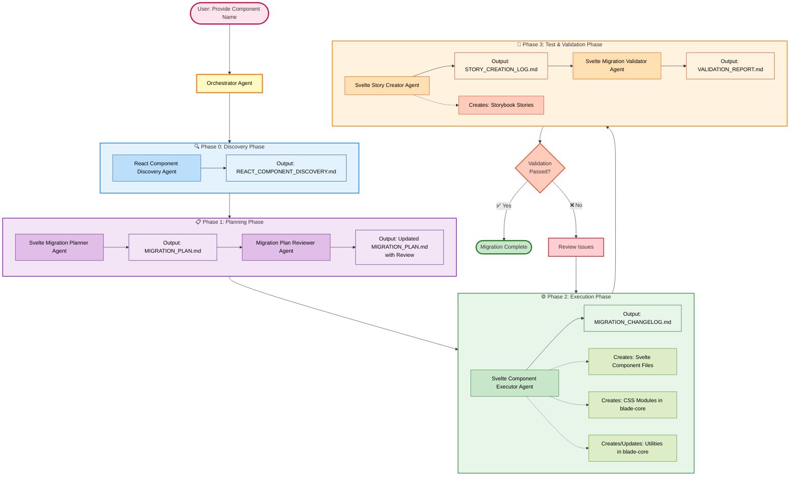

# React to Svelte Migration - Agentic Flow Architecture

This diagram shows the complete agentic flow for migrating React components to Svelte in the Blade Design System.



## Flow Overview

### Phase 0: Discovery 🔍
**Purpose**: Understand the React component structure before migration

1. **React Component Discovery Agent**
   - Analyzes React component in `packages/blade/src/components`
   - Extracts props, dependencies, styling approach
   - Identifies compound components and special features
   - **Output**: `REACT_COMPONENT_DISCOVERY.md`

### Phase 1: Planning 📋
**Purpose**: Create and review a detailed migration plan

2. **Svelte Migration Planner Agent**
   - Creates migration plan based on discovery
   - Maps React props to Svelte props
   - Plans CSS module and CVA structure
   - Identifies utilities needed in blade-core
   - **Output**: `MIGRATION_PLAN.md`

3. **Migration Plan Reviewer Agent**
   - Reviews plan for guideline compliance
   - Validates directory structure, CSS approach, CVA usage
   - Ensures no inline styles planned
   - Checks prop consistency
   - **Output**: Updated `MIGRATION_PLAN.md` with review

### Phase 2: Execution ⚙️
**Purpose**: Implement the Svelte component

4. **Svelte Component Executor Agent**
   - Creates Svelte component files in `packages/blade-svelte/src/components`
   - Creates CSS modules in `packages/blade-core/src/styles`
   - Adds/updates utilities in `packages/blade-core/src/utils`
   - Implements component following guidelines
   - Uses CVA for conditional styling
   - **Output**: `MIGRATION_CHANGELOG.md`

### Phase 3: Testing & Validation 🧪
**Purpose**: Create stories and validate the migration

5. **Svelte Story Creator Agent**
   - Creates comprehensive Storybook stories
   - Tests all props and variants
   - Includes accessibility scenarios
   - **Output**: `STORY_CREATION_LOG.md` + Story files

6. **Svelte Migration Validator Agent**
   - Compares React and Svelte implementations
   - Validates props completeness
   - Checks guidelines compliance
   - Verifies CSS modules, CVA, and utilities
   - Generates quality score
   - **Output**: `VALIDATION_REPORT.md`

### Iteration Loop
If validation fails, issues are reviewed and execution phase is repeated until validation passes.

## Key Guidelines Enforced

- ✅ Props consistency between React and Svelte
- ✅ CSS classes only (no inline styles)
- ✅ CVA for conditional styling
- ✅ Utilities in blade-core (platform-agnostic)
- ✅ Prop-based event handlers
- ✅ PascalCase naming conventions
- ✅ Compound components structure
- ✅ TypeScript strict checks

## File Outputs

All log files are created in:
```
.cursor/agents/.logs/{component_name}/
├── REACT_COMPONENT_DISCOVERY.md
├── MIGRATION_PLAN.md
├── MIGRATION_CHANGELOG.md
├── STORY_CREATION_LOG.md
└── VALIDATION_REPORT.md
```

## Usage

To start the migration flow:

```bash
/react-to-svelte-migration-orchestrator component_name: "ComponentName"
```

Example:
```bash
/react-to-svelte-migration-orchestrator component_name: "Badge"
```


