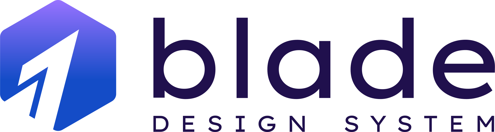

 

<picture>
  <source media="(prefers-color-scheme: dark)" srcset="./branding/blade-original-dark-mode.min.svg">
  <source media="(prefers-color-scheme: light)" srcset="./branding/blade-original.min.svg">
  
</picture>

 

   &nbsp; &nbsp;

<h1 aria-hidden="true"></h1>

 

Blade is the Design System that powers [Razorpay](https://razorpay.com/).

## 🔗 Links

- [Docs](https://blade.razorpay.com)
- [Installation](https://blade.razorpay.com/?path=/docs/guides-installation--docs)
- [@razorpay/blade-old](https://github.com/razorpay/blade-old) (Deprecated, Private)

## ✨ Features

- Cross-Platform (Works Natively on [React Web and React Native](https://blade.razorpay.com/?path=/docs/guides-installation--docs))
- [White Labelling](https://blade.razorpay.com/?path=/docs/guides-theming-theme-playground--docs)
- [Accessible](https://github.com/razorpay/blade/blob/master/rfcs/2022-04-09-accessibility.md#manual-testing)
- Documented [RFCs](https://github.com/razorpay/blade/tree/master/rfcs) and [API Decisions](https://github.com/razorpay/blade/blob/master/packages/blade/src/components/Alert/_decisions/decisions.md)

## 📦 Monorepo Structure

This repository is organized as a monorepo containing several packages that work together to provide a complete design system ecosystem.

### Packages

| Package                                                                              | Description                                                                                                            |
| ------------------------------------------------------------------------------------ | ---------------------------------------------------------------------------------------------------------------------- |
| [blade](./packages/blade/)                                                           | The core Blade Design System package with cross-platform UI components for React Web and React Native                  |
| [blade-mcp](./packages/blade-mcp/)                                                   | Model Context Protocol (MCP) server for AI-assisted development using Blade components                                 |
| [plugin-figma-blade-coverage](./packages/plugin-figma-blade-coverage/)               | Figma plugin that measures Blade component usage and coverage in design files. It acts like a linter for design files. |
| [plugin-figma-token-publisher](./packages/plugin-figma-token-publisher/)             | Figma plugin for publishing design tokens                                                                              |
| [blade-coverage-extension](./packages/blade-coverage-extension/)                     | Browser extension for measuring Blade component usage                                                                  |
| [eslint-plugin-blade](./packages/eslint-plugin-blade/)                               | ESLint plugin for enforcing Blade coding standards                                                                     |
| [widget-figma-dev-handoff-checklist](./packages/widget-figma-dev-handoff-checklist/) | Figma widget for design-to-development handoff checklists                                                              |

## 📝 License

Licensed under the [MIT License](https://github.com/razorpay/blade/blob/master/LICENSE.md).

<h1 aria-hidden="true"></h1>

Interested in working with us? Checkout our <a href="https://razorpay.com/jobs">Jobs Page</a> for open roles 🤗

