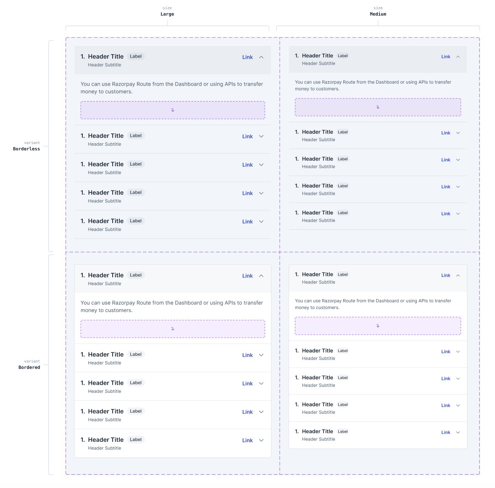

# Accordion

An accordion is used to allow users to toggle between different content sections in a compact vertical stack.

This document outlines the API of `Accordion` component.

<div align="center">
  
</div>

## Design

- [Figma - Accordion](https://www.figma.com/file/LSG77hEeVYDk7j7WV7OMJE/Blade-DSL---Components-Guideline?type=design&node-id=79-619941&t=Rcrabprdzrz7JdId-0)

## Interactions

### Accordion open

https://github.com/razorpay/blade/assets/6682655/1a02d680-1832-4a70-a0a3-1a1f56f2b8b9

### Accordion close

https://github.com/razorpay/blade/assets/6682655/b54eaeb9-7257-4da4-bf3b-89e10785e4f9

## API

Annotated component with props:


Sample usage, composes `Accordion` and `AccordionItem`:

```jsx
import { Accordion, AccordionItem } from '@razorpay/blade';

<Accordion showNumberPrefix defaultExpandedIndex={0}>
  <AccordionItem
    title="Can I create linked accounts using Route?"
    description="You can use Razorpay Route from the Dashboard or using APIs to transfer money to customers."
  >
    <div>Slot</div>
  </AccordionItem>
  <AccordionItem title="How can I transfer money to customers?" description="Just use Razorpay" />
</Accordion>;
```

### Accordion

| Prop                 | Type       | Default     | Description                                                    | Required |
| -------------------- | ---------- | ----------- | -------------------------------------------------------------- | -------- |
| defaultExpandedIndex | `number`   | `undefined` | Makes the passed item index expanded by default (uncontrolled) |          |
| expandedIndex        | `number`   | `undefined` | Expands the passed index (controlled)                          |          |
| onChange             | `function` | `undefined` | Callback for change in any item's expanded state               |          |
| showNumberPrefix     | `boolean`  | `false`     | Adds numeric index at the beginning of items                   |          |

> **Note**
>
> - Also includes layout based styling props
> - By default the accordion renders in all items collapsed state, at max only one item can be expanded at a time (design restriction)
> - `defaultExpandedIndex` can accept an accordion item index to render the accordion in an uncontrolled state
> - For using accordion in controlled state, use `expandedIndex` coupled with `onChange`
> - `onChange` callback signature `({ expandedIndex }) => {}`, `expandedIndex` represents the expanded item's index, if there are no expanded items it'll be `undefined`

### AccordionItem

| Key         | Type            | Default     | Description                                                                | Required |
| ----------- | --------------- | ----------- | -------------------------------------------------------------------------- | -------- |
| title       | `string`        | `undefined` | Title text content                                                         | ✅       |
| description | `string`        | `undefined` | Body text content                                                          | ✅       |
| icon        | `IconComponent` | `undefined` | Renders a Blade icon as title prefix (requires `showNumberPrefix={false}`) |          |
| children    | `JSX`           | `undefined` | Slot, renders any custom content                                           |          |

## a11y

Web:

Follows the standard practices (aria expanded, controls, etc.) [ARIA guide](https://www.w3.org/WAI/ARIA/apg/patterns/accordion/), [example](https://www.w3.org/WAI/ARIA/apg/patterns/accordion/examples/accordion/#rps_label):

- <kbd>Enter</kbd> or <kbd>Space</kbd> can toggle accordion
- <kbd>Tab</kbd> key to cycle focus
- `aria-expanded` and `aria-controls` in the button trigger
- `aria-labelledby` and `role: region` in the content

Native:

- Some related properties from web will be applicable to native as well ([a11y guide](https://reactnative.dev/docs/accessibility))

## Usage

### With icons

<div align="center">
  
</div>

```tsx
<Accordion defaultExpandedIndex={0}>
  <AccordionItem
    title="How can I setup Route?"
    description="You can use Razorpay Route from the Dashboard or using APIs to transfer money to customers."
    icon={SomeIcon}
  />
  <AccordionItem
    title="How can I setup QR Codes?"
    description="Just use Razorpay"
    icon={QRCodeIcon}
  />
</Accordion>
```

### Controlled state

```tsx
const App = () => {
  const [index, setIndex] = useState(0);
  const onChange = ({ expandedIndex }) => setIndex(expandedIndex);

  return (
    <Accordion expandedIndex={index} onChange={onChange}>
      <AccordionItem title="Can I use a payment gateway?" description="Just use Razorpay" />
      <AccordionItem
        title="How can I transfer money to customers?"
        description="Just use Razorpay"
      />
    </Accordion>
  );
};
```

## Alternatives

- Instead of `expandedIndex`, `defaultExpandedIndex` considered `value`, `defaultValue`, however it doesn't co-relate well with how these APIs work in other components where they're mostly being used for user inputs (eg. in forms) and therefore termed values. On the other hand, accordion is mostly a presentational component and shouldn't be used for user inputs _(what do we treat as value in accordion)_.
- Instead of `expandedIndex`, `defaultExpandedIndex` on the root `Accordion` component, considered an approach to instead put relatable props such as `isExpanded`, `isDefaultExpanded` on the child `AccordionItem` component. However, with this, controlled usecase becomes tricky since we would still ideally want a single callback listener for `onChange`:
  - if we put this `onChange` at the root `Accordion`, we would still need some sort of `index` or value in the callback
  - if we put this `onChange` on individual `AccordionItem` components, either a user would need to pass different callback handlers to each or we would need to pass an `index` or some value (same dilemma)
  - it's slightly inconvenient to have callback handlers and the expanded index value at different places (one at root and one at child)

## Implementation notes

For SEO purposes the collapsed content can be hidden with CSS.

Behavior wise Accordion's interaction is similar to Radio / Checkbox _with slight differences_

Accordion shares the toggle interaction with Collapsible. We can create abstractions that work for both plus other components such as tabs, switch, etc. (different from this public API spec):

- Build accordion interaction on top of a base collapsible component
- A disclosure based hook (references - [Chakra](https://chakra-ui.com/docs/hooks/use-disclosure), [Mantine](https://mantine.dev/hooks/use-disclosure/), [Paste](https://paste.twilio.design/components/disclosure))

Find in page (automatically expanding the accordion if someone does <kbd>Cmd</kbd> + <kbd>F</kbd>) is a tricky feat, need to check feasibility and should be taken up as an enhancement (references - [blog by Anurag](https://dev.to/anuraghazra/thoughts-on-find-in-page-with-custom-accordion-elements-5573), [`hidden="until-found"`](https://github.com/WICG/display-locking/blob/main/explainers/hidden-content-explainer.md)).

## Open questions

**Q1.** Is the deviation in props and using index for controlled state a fine tradeoff? Please post alternatives with usecase and rationale otherwise.

**A1.** Yes.

## References

Prior art:

- [Chakra](https://chakra-ui.com/docs/components/accordion/usage)
- [Mantine](https://mantine.dev/core/accordion/)
- [Reshaped](https://reshaped.so/content/docs/utilities/accordion)
- [Polaris](https://polaris.shopify.com/components/utilities/collapsible)
- [MUI](https://mui.com/material-ui/react-accordion)
- [Paste](https://paste.twilio.design/components/disclosure#api)
- [`react-native-collapsible`](https://github.com/oblador/react-native-collapsible)
