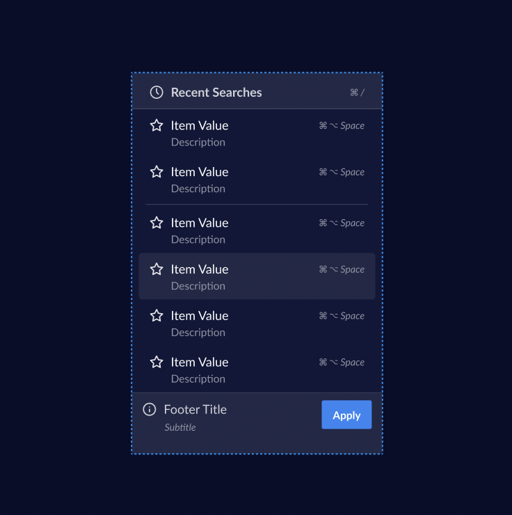

# Select & ~~Dropdown~~ Overlay?

> **Warning**
>
> This document is in progress. Come back later 🏗 🚧 👷🏽

## Terminologies

Before we get into API decisions of Dropdown, lets understand terminology related to dropdown first

- ### ActionList

  The plain list that contains all the action items (Without the overlay styling, select input, etc)

  

- ### Dropdown or Overlay

  An overlay that positions the items in the correct place (think of this as a `div` with `position="fixed"` that places item correctly).

  > **Note**
  >
  > We are thinking about going with name `Overlay` instead of `Dropdown`. Discussed in details in [Overlay API Decisions Section]()

- ## Select

  The button that shows dropdown based on click / hover.

---

Excalidraw Brainstorm: https://excalidraw.com/#json=wNtX7qdgxp5DFQYH0MqFV,RqiMTaQLoW0esjXBWm_1jg

```

## Rough

so that the component can be more genericly used in Tooltips, Select, Autocomplete, etc. We might go with `Dropdown` as a wrapper on top of `Overlay`


```
