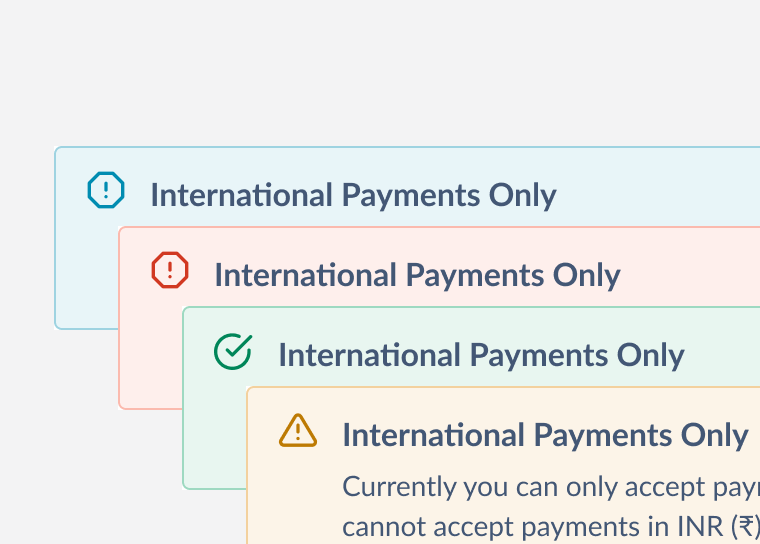
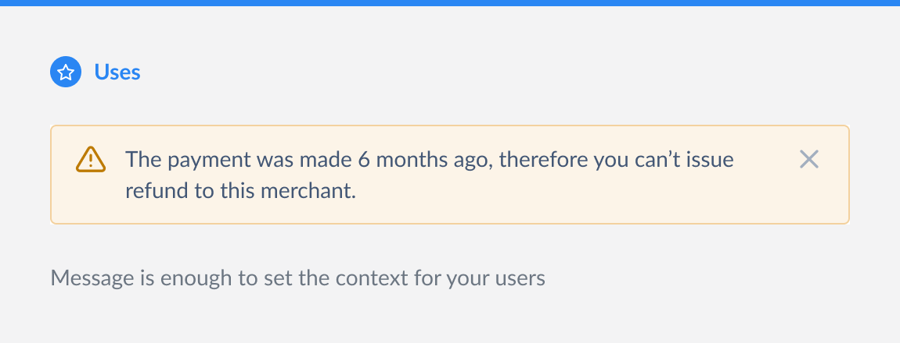
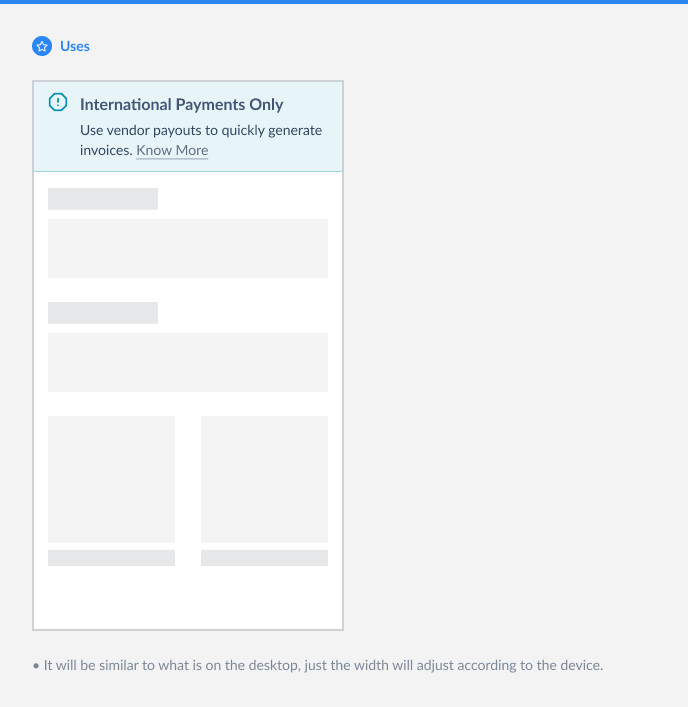
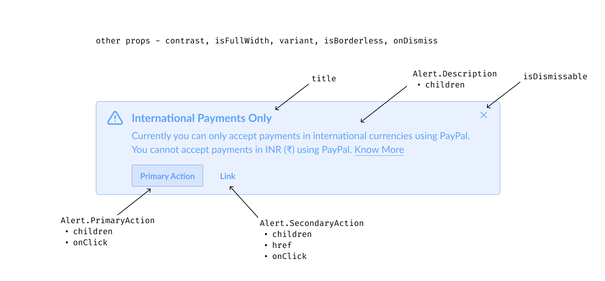

# Alert

Alerts are messages that communicate information to users about any significant changes or explanations inside the system in a **prominent way**.

This document outlines the API of `Alert` component.



## Design

- [Figma - Alerts](https://www.figma.com/file/jubmQL9Z8V7881ayUD95ps/Blade---Payment-Light?node-id=6824%3A0)

## API

Annotated component with props:


Sample usage:

```jsx
import { Alert, Link } from '@razorpay/blade';

<Alert
  title="International Payments Only"
  description={
    <>
      Currently you can only accept payments in international currencies using PayPal. You cannot
      accept payments in INR (₹) using PayPal. <Link href="https://razorpay.com">Know More</Link>
    </>
  }
  actions={{
    primary: { text: 'Primary Action', onClick: {() => { /* do something */ }} },
    secondary: { text: 'Link', onClick: {() => { /* do something */ }}, href: 'https://razorpay.com'},
  }}
/>;
```

### Alert

We'll expose an `Alert` component with the following API:

| Prop          | Type                                                        | Default       | Description                                                                                                           | Required |
| ------------- | ----------------------------------------------------------- | ------------- | --------------------------------------------------------------------------------------------------------------------- | -------- |
| description   | `string`, `JSX`                                             | `undefined`   | Body content                                                                                                          | ✅       |
| title         | `string`                                                    | `undefined`   | A brief heading                                                                                                       |          |
| isDismissible | `boolean`                                                   | `true`        | Shows a dismiss button                                                                                                |          |
| onDismiss     | `function`                                                  | `undefined`   | Callback when the dismiss button is pressed                                                                           |          |
| contrast      | `high`, `low`                                               | `low`         | Can be set to `high` for more prominent look _(not related to a11y)_                                                  |          |
| isFullWidth   | `boolean`                                                   | `false`       | Spans the entire width of container and makes alert borderless, otherwise max width is restricted to 584px by default |          |
| intent        | `information`, `positive`, `notice`, `negative`             | `information` | Sets the color tone of entire alert. Icon is set automatically based on intent                                        |          |
| actions       | `{ primary: PrimaryAction, secondary: SecondaryAction }` \* | `{}`          | Renders a primary action button and a secondary action link button                                                    |          |

`PrimaryAction` and `SecondaryAction` will accept objects with the following keys:

### PrimaryAction

Renders and accepts a subset of `Button` props as keys:

| Key       | Type       | Default     | Description | Required |
| --------- | ---------- | ----------- | ----------- | -------- |
| `text`    | `string`   | `undefined` | Content     | ✅       |
| `onClick` | `function` | `undefined` | Callback    | ✅       |

### SecondaryAction

Renders and accepts a subset of `Link` (button) props as keys:

| Key       | Type       | Default     | Description | Required |
| --------- | ---------- | ----------- | ----------- | -------- |
| `text`    | `string`   | `undefined` | Content     | ✅       |
| `href` \* | `string`   | `undefined` | Hyperlink   |          |
| `onClick` | `function` | `undefined` | Callback    |          |

> **Note**
>
> On web, a couple of additional keys are available when `href` is provided, similar to `Link` component:

| Key      | Type       | Default     | Description                                                                                                                                                                | Required |
| -------- | ---------- | ----------- | -------------------------------------------------------------------------------------------------------------------------------------------------------------------------- | -------- |
| `target` | `string`   | `undefined` | [`target`](https://developer.mozilla.org/en-US/docs/Web/HTML/Element/a#attr-target) attribute                                                                              |          |
| `rel`    | `function` | `undefined` | [`rel`](https://developer.mozilla.org/en-US/docs/Web/HTML/Element/a#attr-rel) attribute, when target is set to `_blank` this is automatically set to `noopener noreferrer` |          |

## a11y

Web:

- `notice` and `negative` intents will have an [`alert` role](https://developer.mozilla.org/en-US/docs/Web/Accessibility/ARIA/Roles/alert_role), this is to communicate important and time sensitive message. Additionally for `notice` intent we'll set [`aria-live="polite"`](https://developer.mozilla.org/en-US/docs/Web/Accessibility/ARIA/ARIA_Live_Regions) to not interrupt the user
- Other intents will have a [`status` role](https://developer.mozilla.org/en-US/docs/Web/Accessibility/ARIA/Roles/status_role) which is for non critical changes
- The dismiss button will have [`aria-label`](https://developer.mozilla.org/en-US/docs/Web/Accessibility/ARIA/Attributes/aria-label) as "Dismiss alert"

Native:

- Will set [`accessibilityRole`](https://reactnative.dev/docs/accessibility#accessibilityrole) as `alert`
- The dismiss button will have `accessibilityLabel` as "Dismiss alert"

## Usage

Some example usage patterns of `Alert`.

### Without title



```jsx
<Alert
  intent="notice"
  description="The payment was made 6 months ago, therefore you can’t issue refund to this merchant."
/>
```

### Full bleed

> **Note**
>
> Design update pending to remove all borders and border radii

This full bleed layout works for all desktop, mobile and native when the `isFullWidth` prop is passed. It also gets rid of all borders.



```jsx
<Alert
  title="International Payments Only"
  isFullWidth
  description={
    <>
      Use vendor payouts to quickly generate invoices.{' '}
      <Link href="https://razorpay.com">Know More</Link>
    </>
  }
/>
```

## Open questions

**Q1.** Should we use a different intent naming convention in code like `success`, `warn`, `info`, `error`? Currently this is same as design

**A1.** It makes more sense to keep the terminologies similar in both design and code (because designs are what gets translated into code). [Related discussion](https://github.com/razorpay/blade/pull/573#discussion_r929998203).

**Q2.** It's possible to pass any JSX as content but ideally we want to restrict it to few components (like `Link`, `string`, `List`). Doing these on code side would mean lot of checks. Similarly, restriction on `SecondaryAction` which should always be used with `PrimaryAction`. How do we do these - TS / runtime checks, etc.? One simpler alternative is to rely on design side restrictions for these but it makes the API more flexible should someone want to try things different from design.

**A2.** We can do some static checks with TypeScript where feasible, for example enforcing `SecondaryAction` to be used only with `PrimaryAction` but some checks are outside scope of TypeScript and in the realm of runtime checks which at the moment seems like an overkill, for example restricting the content type for `description` prop.

**Q3.** Should we make alerts focussable so they're discoverable by tabbing? It would mean also showing a visible keyboard focus indicator. Not doing this currently because I can't think of possible usecases right now, maybe we can revisit this later if / when needed.

**A3.** TBD

**Q4.** Whether to use `intent` or `variant`?

**A4.** The rationale to use `intent` is because it signifies what the alert is meant for (success, error et al.). Also, we might need to extend alerts later to have different _variants_ like outline, ghost, etc. for which having a `variants` prop reserved for later would make more sense. There are some alternate terminology instead of `intent` that could be considered for example `colorScheme`.

**Q5.** How would `Link` look in high contrast alerts? The existing ones in blue will not look quite good.

**A5.** To be taken up separately as an enhancement.

**Q6.** Should `isFullWidth`, `isBorderless` be decoupled or not? Should borderless be a variant instead? _(Outdated)_

**A6.** We would need both `isFullWidth` and `isBorderless` to exist, because there are usecases of alerts to span the full width of the container (which might be more than the default max-width of 584px). However, since `isBorderless` alert is only supposed to be used in full bleed layouts, it would automatically set `isFullWidth` to `true`. Also, since we can't think of future variants right now I'm leaning towards not making borderless as sole variant. Another alternative is to instead have a `variant` prop that can be `default` | `fullwidth` | `fullwidth-borderless` but so far we haven’t used variant in this sense.

## Alternatives

An alternate API with compound components pattern was considered:



Sample usage:

```jsx
<Alert title="International Payments Only">
  <Alert.Description>
    Currently you can only accept payments in international currencies using PayPal. You cannot
    accept payments in INR (₹) using PayPal. <Link href="https://razorpay.com">Know More</Link>
  </Alert.Description>
  <Alert.PrimaryAction
    onClick={() => {
      // do something
    }}
  >
    Primary Action
  </Alert.PrimaryAction>
  <Alert.SecondaryAction
    onClick={() => {
      // do something
    }}
    href="https://razorpay.com"
  >
    Link
  </Alert.SecondaryAction>
</Alert>
```

However there are certain issues with this API:

- Discoverability is low (in order to discover what can be passed user needs to type `Alert.`)
- The order of passing compound components doesn't has any impact on final rendering order
- More error prone, users can pass unexpected wrappers in children or in between compound components
- It's harder to define constraints for example - secondary action should only exist in the presence of a primary action

## Changelog

- Removed `isBorderless`. Now all borderless specific properties will be controlled by `isFullWidth`

## References

Further reading:

- [React Native a11y guide](https://reactnative.dev/docs/accessibility)
- [ARIA authoring guide for alerts](https://www.w3.org/WAI/ARIA/apg/example-index/alert/alert.html)

Prior art:

- [Reshaped](https://reshaped.so/content/docs/components/alert)
- [Polaris](https://polaris.shopify.com/components/banner)
- [ChakraUI](https://chakra-ui.com/docs/components/alert/usage)
- [MaterialUI](https://mui.com/material-ui/react-alert/#main-content)
- [Mantine](https://mantine.dev/core/alert/)
- [Nativebase](https://docs.nativebase.io/next/alert)
