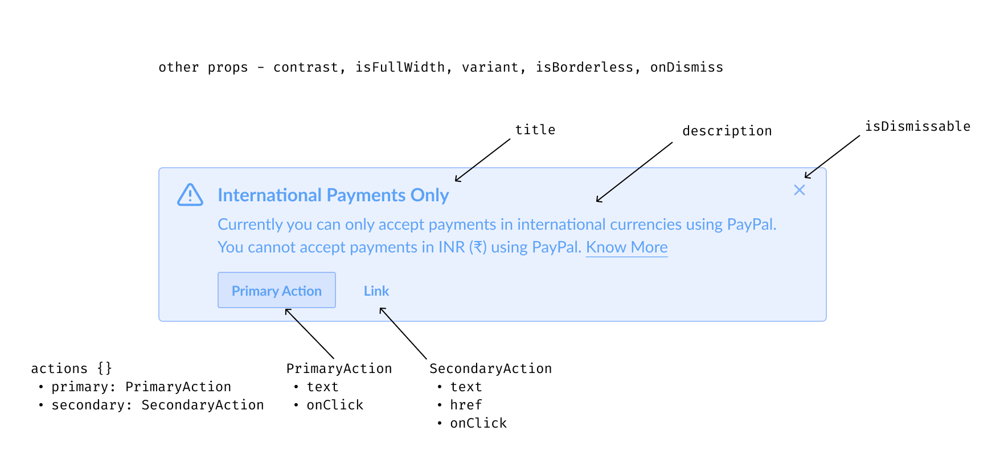

# Alert

Alerts are messages that communicate information to users about any significant changes or explanations inside the system in a **prominent way**.

This document outlines the API of `Alert` component.


## Design

- [Figma - Alerts](https://www.figma.com/file/jubmQL9Z8V7881ayUD95ps/Blade---Payment-Light?node-id=6824%3A0)

> **Note**
>
> The following needs work:
>
> 1. color on banking theme in high contrast
> 2. a11y contrast ratio for notice alerts in high contrast
> 3. the borderless variant mentioned in full bleed layout shouldn't have any borders and border radii

## API

Annotated component with props:



Sample usage:

```jsx
import { Alert, Link } from '@razorpay/blade';

<Alert title="International Payments Only">
  <Alert.Description>
    Currently you can only accept payments in international currencies using PayPal. You cannot
    accept payments in INR (₹) using PayPal. <Link href="https://razorpay.com">Know More</Link>
  </Alert.Description>
  <Alert.PrimaryAction
    onClick={() => {
      // do something
    }}
  >
    Primary Action
  </Alert.PrimaryAction>
  <Alert.SecondaryAction
    onClick={() => {
      // do something
    }}
    href="https://razorpay.com"
  >
    Link
  </Alert.SecondaryAction>
</Alert>;
```

### Alert

We'll expose an `Alert` component with the following API:

| Prop          | Type                                     | Default     | Description                                                                                | Required |
| ------------- | ---------------------------------------- | ----------- | ------------------------------------------------------------------------------------------ | -------- |
| `children`    | `string`, Alert sub components           | `undefined` | Body content                                                                               | ✅       |
| title         | `string`                                 | `undefined` | A brief heading                                                                            |          |
| isDismissable | `boolean`                                | `true`      | Shows a dismiss button                                                                     |          |
| contrast      | `high`, `low`                            | `low`       | Can be set to `high` for more prominent look _(not related to a11y)_                       |          |
| isFullWidth   | `boolean`                                | `false`     | Spans the entire width of container, otherwise max width is restricted to 584px by default |          |
| variant       | `info`, `positive`, `notice`, `negative` | `info`      | Sets the color tone of entire alert. Icon is set automatically based on variant \*         |          |
| isBorderless  | `boolean`                                | `false`     | Removes borders and border radii, useful for creating a full bleed layout                  |          |

We'll also expose the following sub components on `Alert` which can be passed as children to `Alert`. The order of passing these as children doesn't matter:

| Sub component           | Description                                                          | Required |
| ----------------------- | -------------------------------------------------------------------- | -------- |
| `Alert.Description`     | For setting body content                                             | ✅       |
| `Alert.PrimaryAction`   | Renders a primary `Button`                                           |          |
| `Alert.SecondaryAction` | Renders a button `Link`, requires `Alert.PrimaryAction` alongside \* |          |

### Alert.Description

| Prop       | Type          | Default     | Description | Required |
| ---------- | ------------- | ----------- | ----------- | -------- |
| `children` | `string`, JSX | `undefined` | Content \*  | ✅       |

### Alert.PrimaryAction

`Alert.PrimaryAction` renders and accepts a subset of `Button` (primary) props:

| Prop       | Type       | Default     | Description                            | Required |
| ---------- | ---------- | ----------- | -------------------------------------- | -------- |
| `children` | `string`   | `undefined` | Content, required here unlike `Button` | ✅       |
| `onClick`  | `function` | `undefined` | Callback                               | ✅       |

### Alert.SecondaryAction

`Alert.SecondaryAction` renders and accepts a subset of `Link` (button) props:

| Prop       | Type          | Default     | Description | Required |
| ---------- | ------------- | ----------- | ----------- | -------- |
| `children` | `string`, JSX | `undefined` | Content     | ✅       |
| `href`     | `string`      | `undefined` | Hyperlink   |          |
| `onClick`  | `function`    | `undefined` | Callback    |          |

There'll also be an internal `BaseAlert` component that handles rendering web or native version similar to other Blade components. API would be similar to `Alert`.

## Usage

Some example usage patterns of `Alert`.

### Without title


```jsx
<Alert variant="notice">
  <Alert.Description>
    The payment was made 6 months ago, therefore you can’t issue refund to this merchant.
  </Alert.Description>
</Alert>
```

### Full bleed

> **Note**
>
> Design update pending to remove all borders and border radii

This full bleed layout works for all desktop, mobile and native when the `isBorderless` prop is passed


```jsx
<Alert title="International Payments Only" isBorderless>
  <Alert.Description>
    Use vendor payouts to quickly generate invoices.{' '}
    <Link href="https://razorpay.com">Know More</Link>
  </Alert.Description>
</Alert>
```

## Open questions

**Q1.** Should we use a different variant naming convention in code like `success`, `warn`, `info`, `error`? Currently this is same as design

**A1.** TBD

**Q2.** It's possible to pass any JSX as content but ideally we want to restrict it to few components (like `Link`, `string`, `List`). Doing these on code side would mean lot of checks. Similarly, restriction on `Alert.SecondaryAction` which should always be used with `Alert.PrimaryAction`. How do we do these - TS / runtime checks, etc.? One simpler alternative is to rely on design side restrictions for these but it makes the API more flexible should someone want to try things different from design.

**A2.** TBD

## Pending

- Document a11y related things above

## References

Prior art:

- [Reshaped](https://reshaped.so/content/docs/components/alert)
- [Polaris](https://polaris.shopify.com/components/banner)
- [ChakraUI](https://chakra-ui.com/docs/components/alert/usage)
- [MaterialUI](https://mui.com/material-ui/react-alert/#main-content)
- [Mantine](https://mantine.dev/core/alert/)
- [Nativebase](https://docs.nativebase.io/next/alert)
