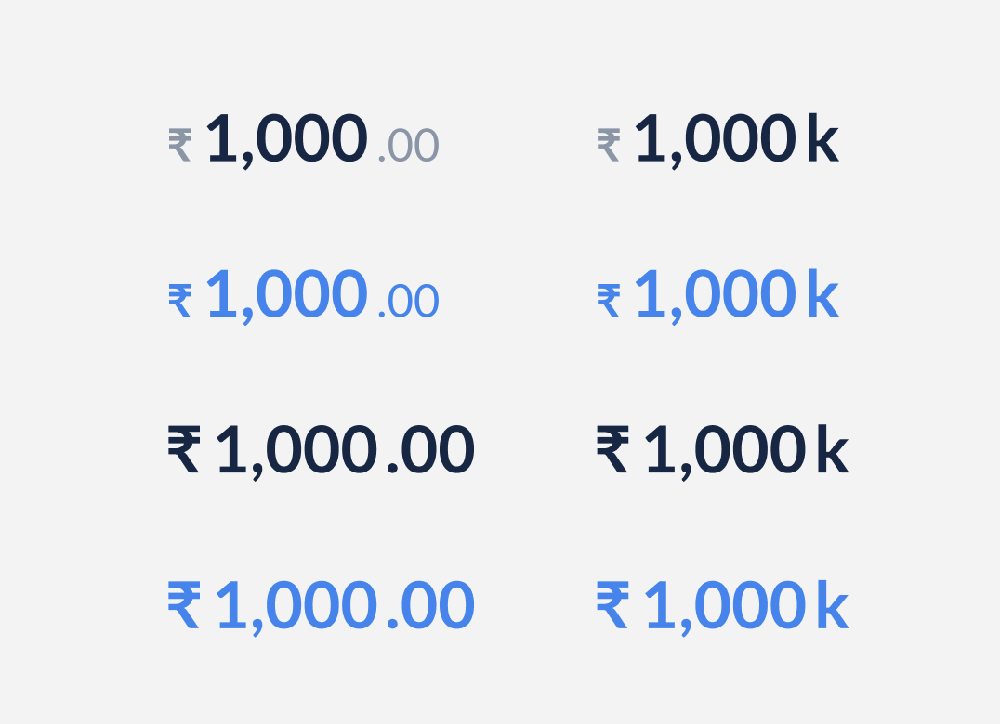

# Amount <!-- omit in toc -->

Amount component is a UI element that displays and formats various currency values in a specified format.



## Design

- [Figma - Amount](https://www.figma.com/file/jubmQL9Z8V7881ayUD95ps/Blade---Payment-Light?node-id=28012%3A580578&t=3peAz8A2n2Gw4WMl-1)

## API

| Prop          | Type                                                       | Default     | Description                                                | Required |
| ------------- | ---------------------------------------------------------- | ----------- | ---------------------------------------------------------- | -------- |
| value         | `number`                                                   | `undefined` | The value to be rendered within the component              | ✅       |
| variant       | `positive`, `negative`, `notice`, `information`            | `undefined` | The variant of the amount to be rendered                   |          |
| weight        | `bold`, `regular`                                          | `bold`      | The weight of the amount to be rendered                    |          |
| hasDecimals   | `true`, `false`                                            | `true`      | Indicates whether a given value has decimal places or not. |          |
| humanize      | `true`, `false`                                            | `false`     | This will humanize the value based on the currency system  |          |
| size          | `3xlarge`, `2xlarge`, `xlarge`, `large`, `medium`, `small` | `3xlarge`   | The size of the amount to be rendered                      |          |
| isAffixSubtle | `true`, `false`                                            | `true`      | Makes the prefix symbol and decimal digits small and faded |          |

### Sample Usage

```jsx
import { Amount } from '@razorpay/components';

<Amount
  hasDecimals={true}
  humanize={false}
  size="2xlarge"
  isAffixSubtle={true}
  weight="regular"
  variant="information"
  value={1000}
/>;
```

## Open Questions

#### Dev

- ~~Should we call it `variant` or `intent`, `isStyled` or something more apt?~~
- ~~Should we separate the amount with commas based on the Indian currency format?~~
- ~~What should be the default `intent`? Kept it as `default` for now, but `neutral` seems more apt.~~
- ~~We currently use amount value in paise in backend, so how should we convert it to rupee here?~~
- ~~Should we have two seperate props for decimals and humanize?~~
- ~~Scope of A11y?~~

#### Design

- ~~Do we need to support more currency types?~~

## Discussions

### Should we have two seperate props for decimals and humanize?

- We opted to use two distinct props, namely `humanize` and `hasDecimals`, because they serve distinct purposes and humanize can include decimals. Keeping them separate is therefore preferable.

### Should we call `isSuffixPrefixHighlighted` or `isHighlighted` or `isAffixSubtle`, considering when this value is true the value will be highligted and not the affix.

- We decided to name this property `isAffixSubtle`. This decision was reached based on the fact that the property controls the behavior of the affix, which in turn affects the visual appearance of the prefix and decimal digits. By setting this property to 'true', the affix will appear smaller and more faded.

### Should we have a seperate prop for decimals and another for affix symbols?

- We initially considered using two different props, but then realized that only one of them would be shown at a time. So in that case, we decided to use a single prop called 'suffix'. We ultimately settled on using a prop with three possible values: 'none', 'decimals', and 'humanize'.

### Should we call `weight` or `fontWeight`?

- We decided to call it `weight` as this represents the weight of the amount component with the affix changing accordingly. This also follows the same convention as other components.

### Should we separate the amount with commas based on the Indian currency format?

- For now, we will be supporting only INR. Going forward we will add more currencies. One of the major problems right now is we use ₹ and INR interchangeably. But in Malaysia we only have RM and there is no symbol associated with it. Hence we are staying away from this. Will solve this once the use-case arrives.

### Scope of A11y?

- Accessibility considerations for a currency component would include assigning it the role of text, and using an aria-label attribute with a value such as 'Total value in INR: ₹1,23,456' to provide a label for the component.

## References

- [Ant](https://ant.design/components/input)
- [Primeng](https://primeng.org/inputnumber)
- [Backbase](https://designsystem.backbase.com/v1/components/amount/web)
- [Mdn](https://developer.mozilla.org/en-US/docs/Web/JavaScript/Reference/Global_Objects/Intl/NumberFormat)
- [Salesforce](https://developer.salesforce.com/docs/component-library/bundle/ui:inputCurrency)
- [Dribbble](https://dribbble.com/tags/money_components)
- [Pega](https://design.pega.com/design/currency/)
