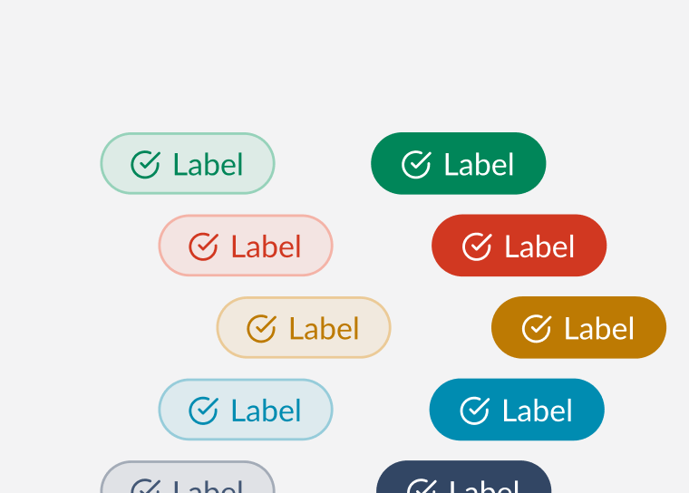
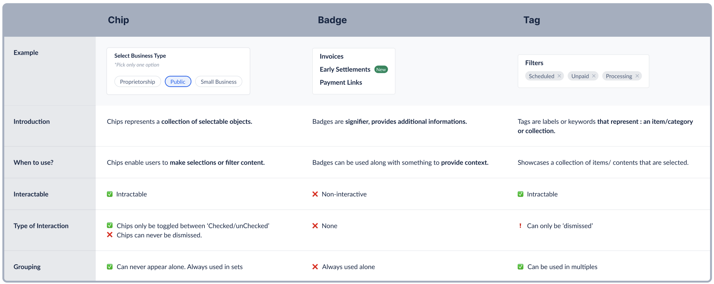

# Badge <!-- omit in toc -->

Badges are used to show small amount of color coded metadata, which are ideal for getting users attention.



## Design

- [Figma - Badge](https://www.figma.com/file/jubmQL9Z8V7881ayUD95ps/Blade---Payment-Light?node-id=8110%3A417)

## API

| Prop       | Type                                                      | Default     | Description                                              | Required |
| ---------- | --------------------------------------------------------- | ----------- | -------------------------------------------------------- | -------- |
| children   | `string`                                                  | `undefined` | The label to be rendered within the badge.               | ✅       |
| variant    | `positive`,`negative`, `notice`, `information`, `neutral` | `neutral`   | The variant of the badge to be rendered.                 |          |
| contrast   | `low`, `high`                                             | `low`       | The contrast of the badge to be rendered.                |          |
| size       | `medium`, `small`                                         | `medium`    | The size of the badge to be rendered.                    |          |
| icon       | `Icon`                                                    | `undefined` | The Blade `Icon` component to be rendered for the badge. |          |
| fontWeight | `bold`, `regular`                                         | `regular`   | The font weight of the badge's font.                     |          |

### Sample Usage

```jsx
import { Badge, InfoIcon } from '@razorpay/components';

<Badge variant="positive" contrast="high" icon={InfoIcon} size="large" fontWeight="bold">
  New
</Badge>
```

## Badge Differentiation



## Open Questions

#### Dev

- ~Should we call it `labelWeight`, `labelStyle` or `fontWeight`, `fontStyle` or `textWeight`, `textStyle`?~ `fontStyle` & `fontWeight` to keep it closer to css properties.
- ~Should we call it `variant` or `intent`?~ Answered in a [section below](#variant-prop)
- What should be the default `variant`? Kept it as `neutral` for now since it seems more _neutral_ and appropriate
- Scope of A11y?
  - NA

#### Design

- ~Do we need badges where the text can overflow? Ref: [Mantine Badge](https://mantine.dev/core/badge/#full-width-and-overflow)~ Yes. We will have a max-width. Design will get back to us with a value.
- ~Do we need to support icon only badges?~ No, we will not have icon only badges
- ~Should we auto-capitalize label when `labelWeight` is bold?~ No, we should leave it to the consumer to capitalize it if needed.

## Discussions

### `variant` prop

> Note: This conversation was a rollercoaster. Read at your own risk.

- The team had a long discussion on how we want to control the _colors_ of the badge.
- Badge offers 5 colors as of today - positive(green), negative(red), notice(yellow), information(blue), neutral(navy-blue)
- Since these colors map well with our feedback tokens and are similar to how `BaseButton`, `BaseLink` & `Alert` handle _colors_ our first instinct was to call this prop `intent` which accepts `positive`, `negative`, `notice`, `information`, & `neutral`
- On further discussion we realized that we would have use-cases in the near future where we would need to add support for more colors than the 5 mentioned above. At such a time, we would not be able to add another _intent_ as that would break the semantics of our feedback tokens since they are limited to `positive`, `negative`, `notice`, `information`, & `neutral`
- Considering this, we concluded that we cannot use `intent` as a prop to control the _color_ of the badge as it cannot scale to accommodate more colors.
- Another option we explored was to have a prop like `color` or `colorScheme` which could accept `red`, `green`, `yellow`, etc. This makes the prop scalable to accommodate more colors in the future.
- We then concluded that `variant` is a free-form prop and our consumers would be more accustomed to using `variant` to change certain aspects of the component, we realized that we could control the _color_ of Badge using the `variant` prop which would accept values from a list of design approved colors like `red`, `green`, `yellow`, `blue`, `navy-blue`, etc.
- This logic broke when we realized that the `neutral` (navy-blue) badge would need to be of the color navy-blue on Payment theme but would need to be white on Banking theme. This meant that we would need to use some form of semantic aliases to name these _variants_ of badge.
- Which brought us back to conclusion that the prop `intent` makes the most sense.
- We noticed Spectrum had done something similar where they accept [Semantic](https://opensource.adobe.com/spectrum-web-components/storybook/?path=/story/badge--semantic) and [Non-Semantic](https://opensource.adobe.com/spectrum-web-components/storybook/?path=/story/badge--non-semantic) variants for their badge.
- But having `intent` accept semantic only(`positive`, `negative`, `notice`, `information`, & `neutral`) values on BaseButton, BaseLink & Alert and accepting semantic + non-semantic(`purple`, `indigo` or whatever new requirement comes in) values on Badge did not make sense. For such free form values, `variant` prop would make more sense.
- Now we concluded to use the `variant` prop that accepts semantic + non-semantic values. We would follow this rule: If the prop accepts semantic only values then we would `intent` but if the prop accepts semantic as well as non-semantic values, we would use `variant`
- The tradeoff right now is that until we get more requirements for non-semantic values, we would have a `variant` prop on Badge that accepts `positive`, `negative`, `notice`, `information`, & `neutral` but we are future-proofing the component by leaving room to accept more non-semantic values.

### `fontStyle` prop

- Removed support for `fontStyle` prop as a design decision

## References

- [Reshaped](https://reshaped.so/content/docs/components/badge)
- [Polaris](https://polaris.shopify.com/components/badge)
- [Chakra](https://chakra-ui.com/docs/components/badge/)
- [MUI](https://mui.com/material-ui/react-badge/)
- [Mantine](https://mantine.dev/core/badge/)
- [Primer](https://primer.style/react/Label)
- [Carbon](https://carbondesignsystem.com/components/tag/usage/)
- [Atlassian](https://atlassian.design/components/badge/examples)
- [PluralSight](https://design-system.pluralsight.com/components/badge)
