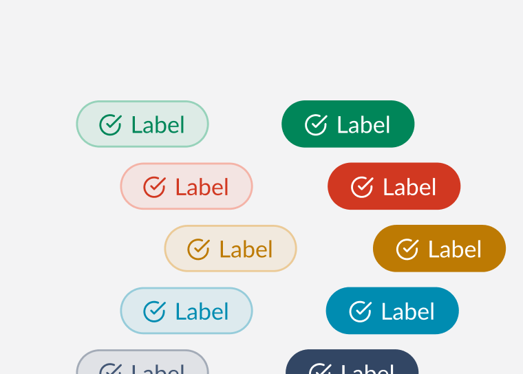

# Badge <!-- omit in toc -->
Badges are used to show small amount of color coded metadata, which are ideal for getting users attention.



## Design
- [Figma - Badge](https://www.figma.com/file/jubmQL9Z8V7881ayUD95ps/Blade---Payment-Light?node-id=8110%3A417)


## API

| Prop | Type | Default | Description | Required |
|---|---|---|---|---|
| children | `string` | `undefined` | The label to be rendered within the badge. | ✅ |
| variant | `positive`,`negative`, `notice`, `information`, `neutral` | `neutral` | The variant of the badge to be rendered. |  |
| contrast | `low`, `high` | `low` | The contrast of the badge to be rendered. |  |
| size | `medium`, `small` | `medium` | The size of the badge to be rendered. |  |
| icon | `Icon` | `undefined` | The Blade `Icon` component to be rendered for the badge. |  |
| labelStyle | `italic`, `normal` | `normal` | The font style of the badge's label. |  |
| labelWeight | `bold`, `regular` | `regular` | The font weight of the badge's label. |  |

### Sample Usage
```jsx
import { Badge } from '@razorpay/components';

<Badge 
  variant='positive'
  contrast='high'
  icon={InfoIcon} 
  size='large' 
  labelStyle='italic' 
  labelWeight='bold'
>
  New
</Badge>
```

## Open Questions
#### Dev
- Should we call it `labelWeight`, `labelStyle` or `fontWeight`, `fontStyle` or `textWeight`, `textStyle`?
- Should we call it `variant` or `intent`?
- What should be the default `variant`? Kept it as `neutral` for now since it seems more _neutral_ and appropriate
- Scope of A11y?
  - NA

#### Design
- Do we need badges where the text can overflow? Ref: [Mantine Badge](https://mantine.dev/core/badge/#full-width-and-overflow)
- Do we need to support icon only badges?
- Should we auto-capitalize label when `labelWeight` is bold?

## References
- [Reshaped](https://reshaped.so/content/docs/components/badge)
- [Polaris](https://polaris.shopify.com/components/badge)
- [Chakra](https://chakra-ui.com/docs/components/badge/)
- [MUI](https://mui.com/material-ui/react-badge/)
- [Maltine](https://mantine.dev/core/badge/)
- [Primer](https://primer.style/react/Label)
- [Carbon](https://carbondesignsystem.com/components/tag/usage/)
- [Atlassian](https://atlassian.design/components/badge/examples)
- [PluralSight](https://design-system.pluralsight.com/components/badge)