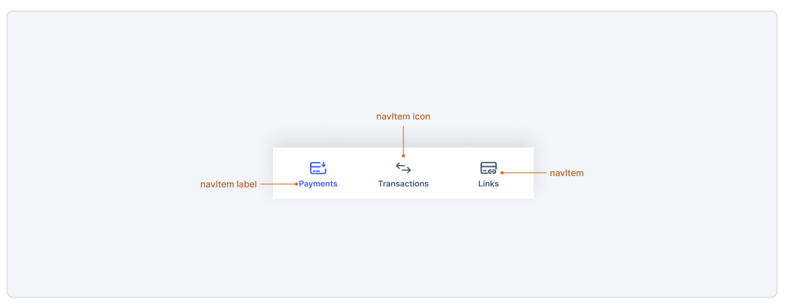

# BottomNav



## Links

- [Figma - Bottom Navigation](https://www.figma.com/design/jubmQL9Z8V7881ayUD95ps/Blade-DSL?node-id=96521-157514&node-type=instance&m=dev)

## API

<!-- prettier-ignore -->
```jsx
import { NavLink } from 'react-router-dom';

<BottomNav>
  <BottomNavItem 
    as={NavLink} 
    isActive={true}
    title="Payments"
    icon={WalletIcon}
    href="/payments"
  />
  <BottomNavItem 
    as={NavLink} 
    title="Transactions"
    icon={TransactionsIcon}
    href="/transactions"
  />
  <BottomNavItem 
    as={NavLink} 
    title="Links"
    icon={PaymentLinksIcon}
    href="/links"
  />
  <BottomNavItem 
    title="More"
    icon={MoreIcons}
    onClick={() => {
      // This can be used to open SideNav drawer
      setIsSideNavOpen(true)
    }}
  />
</BottomNav>
```

## Alternate APIs

- No alternate APIs were considered since this BottomNav API is consistent with our SideNav and TopNav API

## Props

### BottomNav

| **Props** | **Description**                                   | **Type** | **Default Value** |
| --------- | ------------------------------------------------- | -------- | ----------------- |
| children  | children slot of BottomNav, accepts BottomNavItem | JSX      |                   |

```jsx
<BottomNav>{/* children */}</BottomNav>
```

### BottomNavItem

| **Props** | **Description**                                                                                                              | **Type**                      | **Default Value**                                            |
| --------- | ---------------------------------------------------------------------------------------------------------------------------- | ----------------------------- | ------------------------------------------------------------ |
| title     | title of BottomNavItem                                                                                                       | string                        |                                                              |
| as        | as prop for passing React Router's NavLink                                                                                   | NavLinkComponentType          |                                                              |
| href      | URL to navigate to. Internally links to `to` attribute of router (Also turns item into anchor tag when passed)               | string                        |                                                              |
| isActive  | Sets the link as selected / active                                                                                           | boolean                       | undefined                                                    |
| target    | anchor tag target attribute [target - MDN Documentation](https://developer.mozilla.org/en-US/docs/Web/HTML/Element/a#target) | AnchorTargetType              | \_self                                                       |
| rel       | anchor tag rel attribute [rel - MDN Documentation](https://developer.mozilla.org/en-US/docs/Web/HTML/Element/a#rel)          | AnchorRelType                 | target === ' \_blank ' ? ' noreferrer noopener ' : undefined |
| onClick   | Click handler on item                                                                                                        | (e: React.MouseEvent) => void |                                                              |
| icon      | Blade's Icon Component                                                                                                       | IconComponent                 |                                                              |

## Accessibility

1. All items should be accessible by `TAB`
2. It should have role navigation
3. Should have `aria-current="page"` on active item

## References

- [BottomNavigation - Base Web](https://baseweb.design/components/bottom-navigation/)
