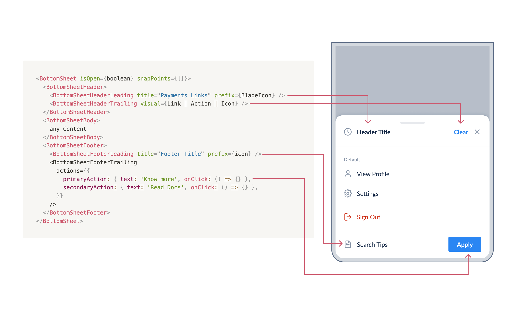
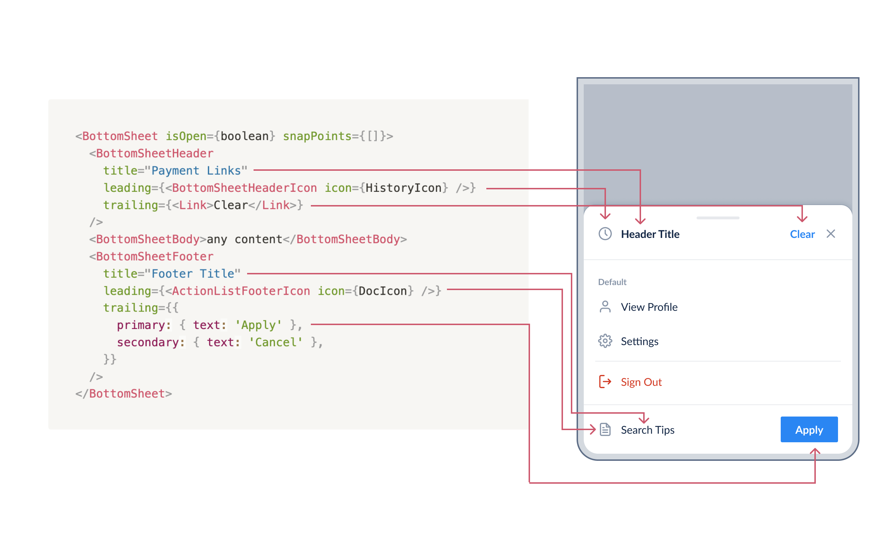

# BottomSheet API Discussion

## Section 1:

**Design Constraints**

- BottomSheetHeader:
    - Leading:
        - title
        - prefix icon
    - Trailing:
        - empty
        - icon
        - link
        - action
- BottomSheetFooter:
    - Leading
        - title
        - prefix icon
    - Trailing
        - Primary action button
        - Secondary action button
- The BottomSheetFooter will behave similar to Card's footer.
- The Header, Footer can be individually omitted

### API 1 (initial):

1:1 similar API to Card 

```jsx
<BottomSheet isOpen={boolean} snapPoints={[]}>
  <BottomSheetHeader>
    <BottomSheetHeaderLeading title="Payments Links" prefix={BladeIcon} />
    <BottomSheetHeaderTrailing visual={Link | Action | Icon} />
  </BottomSheetHeader>
  <BottomSheetBody>
    any thing
  </BottomSheetBody>
  <BottomSheetFooter>
    <BottomSheetFooterLeading title="Footer Title" prefix={icon} />
    <BottomSheetFooterTrailing
      actions={{
        primaryAction: { text: 'Know more', onClick: () => {} },
        secondaryAction: { text: 'Read Docs', onClick: () => {} },
      }}
    />
  </BottomSheetFooter>
</BottomSheet>
```

Anatomy: 



Saurabh proposed to keep the API similar to ActionList
But there are still discrepancies between the BottomSheet & ActionList’s anatomy & API. 

Differences between BottomSheetHeader and ActionListHeader

| BottomSheetHeader | ActionListHeader |
| --- | --- |
| leading has title | leading has title |
| leading as icon | leading has icon |
| trailing always have close button  | no trailing |
| trailing has action button | no trailing |
| header styling is different | header styling is different |

Differences between BottomSheetFooter and ActionListFooter

| BottomSheetFooter | ActionListFooter |
| --- | --- |
| leading has title | leading has title |
| leading as icon | leading has icon |
| trailing accepts an object & is constrained to 2 buttons (primary, secondary) | trailing accepts any JSX elements |

Considering these discrepancies we can’t map it 1:1 to the ActionList API but it comes close to this: 

### API 2 (similar to action list):

All header/footer same API

```jsx
<BaseHeader /></BaseFooter />

<BottomSheet isOpen={boolean} snapPoints={[]}>
  <BottomSheetHeader 
		title="Payment Links"
		leading={<BottomSheetHeaderIcon icon={HistoryIcon} />}
		trailing={<Link>Clear</Link>}
	/>
	<BottomSheetBody>any content</BottomSheetBody>
  <BottomSheetFooter
    title="Footer Title"
    leading={<ActionListFooterIcon icon={DocIcon} />}
    trailing={{ //<- confirm if this BottomSheet Footer should be 2 buttons or anything else?
      primary: { text: 'Apply' },
      secondary: { text: 'Cancel' },
    }}
  />
</BottomSheet>
```

Anatomy: 



```jsx
<ActionListHeader
 title="Recent Searches"
 leading={<ActionListHeaderIcon icon={HistoryIcon} />}
/>

<ActionListHeader variant="body" weight="regular"/>
```

```jsx
<BottomSheet isOpen={boolean} snapPoints={[]}>
  <BottomSheetBody> <-- draggable
    <ActionList>
			<ActionListHeader />
  </BottomSheetBody>
</BottomSheet>
```

## Section 2:

### Composition with Select Dropdown

Next, the BottomSheet also need to be composable with SelectInput dropdown. 

Previously in the API decisions we approached with this API: 

```jsx
import { Spinner, useTheme, useBreakpoint } from "@razorpay/blade";

const BottomSheet = React.lazy();
const DropdownOverlay = React.lazy();

const App = () => {
  const { theme } = useTheme();
  const { matchedDeviceType } = useBreakpoint({ breakpoints: theme.breakpoints });
  const isMobile = matchedDeviceType === 'mobile';

  return (
    <Dropdown selectionType={selectionType}>
      <SelectInput label="Select Action" />
      {/* We can either put a fallback spinner or show skeleton loaders */}
      <React.Suspense fallback={<Spinner />}>
        {isMobile ? (
          <BottomSheet>
            <BottomSheetHeader>
              <BottomSheetHeaderLeading title="Payments Links" prefix={PayIcon} />
            </BottomSheetHeader>
            <BottomSheetBody>
              <SelectContent />
            </BottomSheetBody>
            <BottomSheetFooter>
              <BottomSheetFooterLeading title="Footer Title" prefix={icon} />
              <BottomSheetFooterTrailing
                actions={{
                  primaryAction: { text: 'Confirm' },
                  secondaryAction: { text: 'Close' },
                }}
              />
            </BottomSheetFooter>
          </BottomSheet>
        ) : (
          <DropdownOverlay>
            <SelectContent />
          </DropdownOverlay>
        )}
      </React.Suspense>
    </Dropdown>
  );
};

const SelectContent = () => {
  return (
    <ActionList>
      <ActionListItem
        leading={<ActionListItemIcon icon={SettingsIcon} />}
        title="Settings"
        value="settings"
      />
      <ActionListItem leading={<ActionListItemIcon icon={InfoIcon} />} title="Info" value="info" />
    </ActionList>
  );
};
```

**Problems with this Approach:**

- This approach is very tricky & the [DX not very good](https://github.com/razorpay/blade/pull/1002#discussion_r1116748930) for end consumers.
- It also has [UX issues](https://razorpay.slack.com/archives/G01B3LQ9H0W/p1677657222929859?thread_ts=1677652630.309849&cid=G01B3LQ9H0W) because the lazy loaded component needs a suspense boundary with a fallback, which users will need to handle.
    - Users will either need to use a <Spinner /> or <Skeleton />

Seeing the cons of this approach we need to reconsider if it’s worth saving few kilobytes of bundle to improve the overall experience. 

**Notable thing to consider (Bundle Size Note):** 

As Saurabh mentioned in [this comment](https://github.com/razorpay/blade/pull/1002#discussion_r1122601498), 

In this API, we're using <Dropdown /> so it will anyways add the Dropdown's bundle + the BottomSheet’s bundle. 

Since all the critical Dropdown logic is in <Dropdown /> component inside `useDropdown` hook and utilities, in mweb there will be no bundle saving either way. 

The only burden will be on the Desktop side, In desktop the BottomSheet won’t render but desktop users will still get the bundle of the BottomSheet. 

> Note-1: *This is a strong point  to consider when discussing if it’s even worth saving the bundle size.*
> 

> Note-2: *Although looking at the code I think a restructure of the useDropdown can reduce the bundle size, like splitting useDropdown into two hooks, useDropdownContext & useDropdownLogic, right now inside <SelectInput /> we are calling useDropdown so anyways the bundle will be there but SelectInput doesn’t necessarily need all the logic, it just needs the context’s value*
> 

### Changes to API due to composition with Select Dropdown

Let’s for a moment forget about the bundle size issue. 

Me, Saurabh & Chaitanya was discussing about the potential DX improvements & API simplification we can do if we don’t care about the bundle size issue. 

**Saurabh’s proposed API**

Saurabh suggested an API similar to Dropdown: 

In this API the idea is that you don’t even import anything from Dropdown. Everything is handled by the BottomSheet only. 

```jsx
<BottomSheet> - loop and get ActionList useBottomSheetState()
  <SelectInput label="Select Action" />
  <BottomSheetContainer>
     <BottomSheetBody>
				<ActionList /> // useBottomSheetContext() isOpen, states
		 </BottomSheetBody>
     <BottomSheetFooter />
  </BottomSheetContainer>
</BottomSheet>
```

**Pros**

- Easy to approach API
- Similar API to Dropdown
- Better DX than the manual composition with SelectInput

**Cons**

- BottomSheet’s trigger state will be [tied to the SelectInput](https://github.com/razorpay/blade/blob/c994b0e7e827d8734d2e1d6b62c708bb1121e22b/packages/blade/src/components/Input/SelectInput/SelectInput.tsx#L107), but since the BottomSheet can also be used as an independent component (can be used without SelectInput or ActionList) users will loose the ability to just open the BottomSheet with any other means, eg: clicking on a button.
- This approach also doesn’t solve the bundle size issue because SelectInput itself imports all the utilities related to `useDropdown`
- Will need to copy-paste/rewrite most of the state management logic into BottomSheet since SelectInput relies on that logic to render “3 items select” label, trigger the `onChange` handler, open/close the dropdown & the ActionList also relies on that state to render & update:
    - Need to handle [single-select / multi-select state](https://github.com/razorpay/blade/blob/c994b0e7e827d8734d2e1d6b62c708bb1121e22b/packages/blade/src/components/Dropdown/useDropdown.ts#L182-L214) inside BottomSheet
    - The ActionList also [needs to be aware](https://github.com/razorpay/blade/blob/c994b0e7e827d8734d2e1d6b62c708bb1121e22b/packages/blade/src/components/ActionList/ActionListItem.tsx#L210) that BottomSheet is now the state manager
    - BottomSheet will now also need the props of Dropdown (eg: selectionType)

This interdependency & relation between Dropdown/BottomSheet/Select/ActionList is growing, The BottomSheet will become tied to SelectInput & Dropdown. 

IMO the BottomSheet should be as loose as possible, it should not depend on other component’s internal state & internally manage the SelectDropdown’s state. It should behave just like a modal users should be able to open/close it as they like. 

```jsx
<BottomSheet isOpen={} snapPoints={[]}>
	<BottomSheetTrigger>
	  <SelectInput label="Select Action" />
	</BottomSheetTrigger>
  <BottomSheetContainer>
     <BottomSheetHeader />
     <BottomSheetBody>
				<ActionList />
		 </BottomSheetBody>
     <BottomSheetFooter />
  </BottomSheetContainer>
</BottomSheet>
```

**Chaitanya & I also discussed the “Ideal” API: 

Ideal** API would probably be just this: 

```jsx
<Dropdown>
  <SelectInput label="Item Selection" />
  <DropdownOverlay>
    <ActionList>
      <ActionListItem title="Item Value" value="item-one" />
      <ActionListItem title="Item Value" value="item-two" />
    </ActionList>
  </DropdownOverlay>
</Dropdown>
```

In desktop it works as is, but in mweb it becomes a BottomSheet & render appropriately. 

But I’m concerned about the feasibility of this because: 

- Where will the BottomSheetHeader/Footer be rendered?
    - because there is no JSX in this code which will map 1:1 with the BottomSheet’s API (see the [comparison table of two APIs](https://www.notion.so/BottomSheet-API-Discussion-e2aa79cd45274ef280fdb998efa6b98f))
- The same [interdependency problem](https://www.notion.so/BottomSheet-API-Discussion-e2aa79cd45274ef280fdb998efa6b98f) will happen internally with BottomSheet

We were discussing that we can go for a hybrid approach to tackle the bundle size issue: 

- Ship a component with nice DX/UX without worrying about bundle size, it should just work out of the box
- But since we will also expose the BottomSheet and other primitive components we can add a story/example in storybook for “composition with BottomSheet” which the consumers can use if they think the bundle size is impacting them

**My personal thoughts:** 

- The BottomSheet should be independent of other components, and users should have control over when to open/close it via isOpen prop or other means.
- The BottomSheet should not be tied to the ActionList or SelectDropdown.
- We should treat the BottomSheet as just a “sheet/modal” and not a state managed wrapper which was creating this [interdependency](https://www.notion.so/BottomSheet-API-Discussion-e2aa79cd45274ef280fdb998efa6b98f).

Let me clarify the 3rd point: 

In the initial API of “Composed with Dropdown” if we remove the lazy loading and the Suspense boundaries 

```jsx
const App = () => {
  const { theme } = useTheme();
  const { matchedDeviceType } = useBreakpoint({ breakpoints: theme.breakpoints });
  const isMobile = matchedDeviceType === 'mobile';

  return (
    <Dropdown selectionType={selectionType}>
      <SelectInput label="Select Action" />
      {isMobile ? (
        <BottomSheet>
          <BottomSheetHeader />
          <BottomSheetBody>
						<ActionList />
          </BottomSheetBody>
          <BottomSheetFooter />
        </BottomSheet>
      ) : (
        <DropdownOverlay>
          <SelectContent />
        </DropdownOverlay>
      )}
    </Dropdown>
  );
};
```

You’ll see here, 

That in mweb ternary check the BottomSheet is replacing the <DropdownOverlay />, it’s working just as a modal since the BottomSheet will be portal to the `body` .

The BottomSheet only handles open/closing, dragging gestures state. 
The ActionList “Just works™️” because it’s already rendered inside of Dropdown and can access the `useDropdown`’s context. 

Only thing we do inside BottomSheet other than that is [sync the state of the](https://github.com/razorpay/blade/blob/a457f466027e351a945ca5cfa3857d0c97f00b40/packages/blade/src/components/BottomSheet/BottomSheet.tsx#L151) `isOpen` from Dropdown component to the BottomSheet that’s all. 
This way the BottomSheet becomes independent from the state of the Dropdown and can also be used in otherplaces without the bundle burden of the `useDropdown`

---

**MoM BottomSheet Discussion**

**Date:** 7th March 2023

**Participants:** @Anurag Hazra @kamlesh @chaitanya @rastogi_saurav @Saurabh

**For the Section 1:** 

- We first discussed which API to go ahead with, Card like API or ActionList like API.
- Discussed the design differences between BottomSheet header/footer & ActionList header/footer
- Discussed with @rastogi_saurav about the "clear" button in the header, rastogi will need to revisit this section and change it accordingly (Action Item)
- Discussed if it's possible to remove the BottomSheetHeader/Footer and reuse the ActionListHeader/Footer
- We decided it's best to keep these ActionListHeader & BottomSheetHeader separate because:
    - There are design differences between BottomSheet & ActionList Header/Footer
    - Reusing the component will cause lot of interdependency of the internal logic, where the ActionListHeader will now need the draggable props and state of the BottomSheet
    - It will also make the implementation very complex on the BottomSheet's side, since we will need to add a lot of branching logic
    - It will also make the API a bit awkward since [not all the time](https://razorpay.slack.com/archives/C01CS8YBEQZ/p1677825334856589?thread_ts=1677825092.305089&cid=C01CS8YBEQZ) we will render the ActionList inside BottomSheet nor could it be same all the time for mweb or dweb, for example:
        
        ```jsx
        <BottomSheet>
        	<BottomSheetHeader />
        	<BottomSheetBody>
        		<ActionListHeader /> <--- ActionListHeader should be here?
        		<ActionList></ActionList> <--- or inside here? 
        		<div> <--- don't even need ActionList, it only uses Input, Button
        			<Input />
        			<Button />
        		</div>
        	</BottomSheetBody>
        	<BottomSheetFooter />
        </BottomSheet>
        ```
        
- Finally we decided to keep the API of all the header/footer (in future components too) similar to the ActionList header/footer and create <BaseHeader> <BaseFooter> common components for internal use.

**For Section 2:** 

- Discussed about various ways we can mitigate the bundle size issues by alternative APIs (children looping, passing state via context etc)
- Inside the BottomSheet’s body users can add any content including the <ActionList /> and it should work out of the box
    
    ```jsx
    <BottomSheet>
    	<BottomSheetHeader />
    	<BottomSheetBody>
    		<ActionList /> <---- works out of the box
    	</BottomSheetBody>
    	<BottomSheetFooter />
    </BottomSheet>
    ```
    
- For composition with BottomSheet with Dropdown, we decided to keep the **BottomSheet an independent component** to [ensure these usecases](https://razorpay.slack.com/archives/C01CS8YBEQZ/p1677825334856589?thread_ts=1677825092.305089&cid=C01CS8YBEQZ) are also solved without adding any bundle size of Dropdown or ActionList.
- Discussed that because it’s not feasible to map the API of ActionList & BottomSheet 1:1 & other [various concerns](https://www.notion.so/BottomSheet-API-Discussion-e2aa79cd45274ef280fdb998efa6b98f) users can compose the Dropdown & BottomSheet like so (without any lazy loading because either way in mobile Dropdown’s bundle will be there):
    
    ```jsx
    <Dropdown selectionType={selectionType}>
      <SelectInput label="Select Action" />
      {isMobile ? (
        <BottomSheet>
          <BottomSheetHeader  />
          <BottomSheetBody>
            <ActionList /> <-- works as expected
          </BottomSheetBody>
          <BottomSheetFooter />
        </BottomSheet>
      ) : (
        <DropdownOverlay>
          <ActionList />
        </DropdownOverlay>
      )}
    </Dropdown>
    ```
    

**Action Items**

- **Design:** @rastogi_saurav to relook at the BottomSheet Header/Footer components and see if the "clear" button in the header is required or not.
- **Dev:** Update API Doc for BottomSheet & Change the implementation of the Header/Footer

**Open Questions**

- We decided to keep the Header/Footer API similar across all the components but there are still few constraints which [mismatch](https://www.notion.so/BottomSheet-API-Discussion-e2aa79cd45274ef280fdb998efa6b98f) between ActionList and BottomSheet’s footer, from the design side we need to standardise these constraints

// NEW ITEMS: 

- Check Action/Icon have an usecase in BottomSheetHeader trailing, if not we can remove them.
- Standardise the close button with “isDismissible=true|false” prop and decouple it from the BottomSheetHeader (position it absolutely on top of bottomsheet surface)
