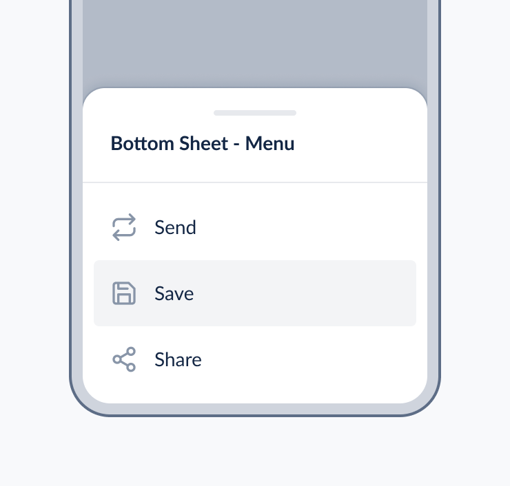
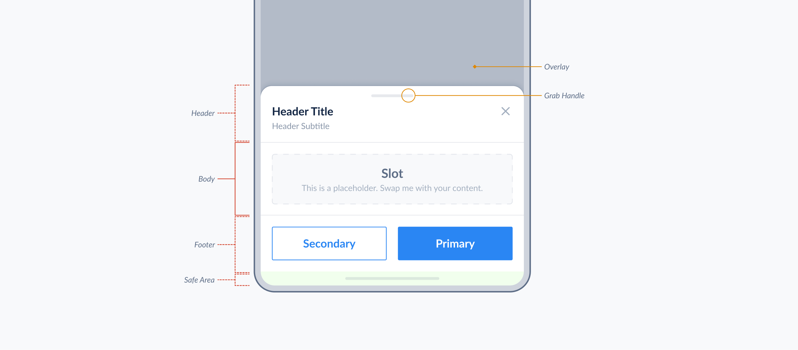
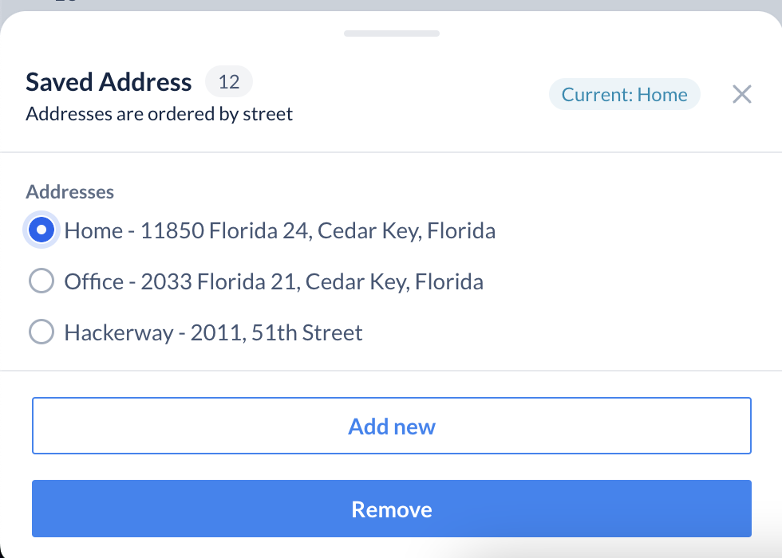

# Bottom Sheet

Bottom sheet is a container that presents additional information to a user in an overlay.

This document outlines the API of `BottomSheet` component.



- [Bottom Sheet](#bottom-sheet)
  - [Design](#design)
  - [Anatomy](#anatomy)
  - [API](#api)
    - [`BottomSheet`](#bottomsheet)
    - [`BottomSheetBody` API](#bottomsheetbody-api)
    - [`BottomSheetHeader` API](#bottomsheetheader-api)
    - [`BottomSheetFooter` API](#bottomsheetfooter-api)
    - [Composition Example](#composition-example)
  - [Accessibility](#accessibility)
  - [Open questions](#open-questions)
  - [Alternative APIs](#alternative-apis)
  - [References](#references)

## Design

- [Figma - BottomSheet](https://www.figma.com/file/jubmQL9Z8V7881ayUD95ps/Blade---Payment-Light?node-id=26477%3A578228&t=1RMqjs99P33Udj0C-0)

## Anatomy



Components:

- BottomSheet
  - BottomSheetHeader
  - BottomSheetBody
  - BottomSheetFooter

## API

Sample usage:

```jsx
import { BottomSheet } from '@razorpay/blade';

const [isOpen, setIsOpen] = React.useState(false);

<BottomSheetComponent
  isOpen={isOpen}
  onDismiss={() => {
    setFirstOpen(false);
  }}
>
  <BottomSheetHeader
    title="Saved Address"
    subtitle="Addresses are ordered by street"
    titleSuffix={<Counter value={12} />}
    trailing={<Badge variant="information">Current: Home</Badge>}
  />
  <BottomSheetBody>
    <RadioGroup label="Addresses">
      <Radio value="home">Home - 11850 Florida 24, Cedar Key, Florida</Radio>
      <Radio value="office">Office - 2033 Florida 21, Cedar Key, Florida</Radio>
      <Radio value="office2">Hackerway - 2011, 51th Street</Radio>
    </RadioGroup>
  </BottomSheetBody>
  <BottomSheetFooter>
    <Button isFullWidth variant="secondary">
      Add new
    </Button>
    <Button isFullWidth marginTop="spacing.5">
      Remove
    </Button>
  </BottomSheetFooter>
</BottomSheetComponent>;
```

Rendered output:




### `BottomSheet`

We'll expose a `BottomSheet` component with the following API:

| Prop            | Type                       | Default             | Description                                                                                                                                                                | Required |
| --------------- | -------------------------- | ------------------- | -------------------------------------------------------------------------------------------------------------------------------------------------------------------------- | -------- |
| isOpen          | `boolean`                  | `false`             | Toggles bottom sheet state                                                                                                                                                 |          |
| snapPoints      | `[number, number, number]` | `[0.35, 0.5, 0.85]` | Snappoints in which the bottom sheeet will rest on, this accepts a number between 0 & 1 which maps to the total view height of the screen. 0.5 means 50% of screen height. |          |
| onDismiss       | `Callback`                 | `undefined`         | called when the bottom sheet is closed, either by user state, hitting `esc` or tapping backdrop                                                                            |          |
| initialFocusRef | `React.Ref`                | `undefined`         | ref element you want to get keyboard focus when opening the sheet                                                                                                          |          |
| children | `React.ReactNode`                | `undefined`         | Accepts other BottomSheet sub components like BottomSheetHeader,BottomSheetBody,BottomSheetFooter                                                                                                          |          |

### `BottomSheetBody` API

| Prop       | Type              | Default     | Description                 | Required |
| ---------- | ----------------- | ----------- | --------------------------- | -------- |
| `children` | `React.ReactNode` | `undefined` | Contents of the BottomSheet | ✅       |

### `BottomSheetHeader` API

| Prop      | Type            | Default     | Description                           | Required |
| --------- | --------------- | ----------- | ------------------------------------- | -------- |
| `title`   | `string`        | `undefined` | Title of the Header                   |       |
| `subtitle`   | `string`        | `undefined` | Subtitle of the Header                   |       |
| `leading` | `React.ReactNode` | `undefined` | leading asset or icon to be placed at the left most side of the BottomSheetHeader |          |
| `trailing` | `Badge, Link, Text, IconButton`, `undefined` | trailing component to be placed at the right most side of the BottomSheetHeader |          |
| `titleSuffix` | `Counter` | `undefined` | A component to be placed adjacent to the title text |          |
| `hideDivider` | `boolean` | `false` | Show or hide the divider |          |
| `showBackButton` | `boolean` | `false` | Show or hide back button |          |
| `onBackButtonClick` | `boolean` | `false` | Event handler for the back button |          |

### `BottomSheetFooter` API


| Prop       | Type              | Default     | Description                 | Required |
| ---------- | ----------------- | ----------- | --------------------------- | -------- |
| `children` | `React.ReactNode` | `undefined` | Contents of the BottomFooter | ✅       |

## Composition with Dropdown

We will export `BottomSheet` component separately as an independant component but generally the pattern will be to use it with SelectInput, where in mobile devices the Select's dropdown will be replaced by the BottomSheet.

There are two approaches to doing it:

#### 1. We couple the BottomSheet & SelectInput tightly and internally conditionally switch the components

Pros:

- Easy implementation for user's end
- User's don't have to think about breakpoints, conditional rendering etc
- From blade side, we will have greater control over the pattern

Cons:

- Bundle size will be impacted. Products where users are desktop only or majority are on desktop they will get the bundle of BottomSheet (vice versa)
- BottomSheet's state will get coupled with SelectDropdown
- There will be a lot of interdependency of state management
- These [usecases](https://razorpay.slack.com/archives/C01CS8YBEQZ/p1677825334856589?thread_ts=1677825092.305089&cid=C01CS8YBEQZ) will be harder to solve for without the BottomSheet being an independent component.

#### 2. We expose BottomSheet as an independently component and let user do the composition

Pros:

- No uneccesary bundle size impact for any of the platforms
- BottomSheet is decoupled from the state and internal logic of SelectDropdown & can also be used independently
- Reduced implementation complexity & [interdependency](https://www.notion.so/BottomSheet-API-Discussion-e2aa79cd45274ef280fdb998efa6b98f?pvs=4#630d5e93897b4ca0bf54f475f0cd7d6e) of state

Cons:

- Not trivial to implement from user's end, they will have to compose the BottomSheet & Dropdown as per their needs.

Considering the bundle size downside to approach 1, we decided to go ahead with approach 2.

> **API Rabbit Hole**  
> If you want to go deep into the API Rabbit Hole, We also had explored various other APIs and discussed internally about the pros and cons of each which we **[documented in this Notion doc](https://www.notion.so/BottomSheet-API-Discussion-e2aa79cd45274ef280fdb998efa6b98f?pvs=4#db6bd9826bc048bd97d24a50269fc45d)**

### Composition Example

```jsx
import { useTheme, useBreakpoint, BottomSheet, Dropdown } from '@razorpay/blade';

const App = () => {
  const { theme } = useTheme();
  const { matchedDeviceType } = useBreakpoint({ breakpoints: theme.breakpoints });
  const isMobile = matchedDeviceType === 'mobile';

  return (
    <Dropdown selectionType={selectionType}>
      <SelectInput label="Select Action" />
      {isMobile ? (
        <BottomSheet>
          <BottomSheetHeader />
          <BottomSheetBody>
            <SelectContent />
          </BottomSheetBody>
          <BottomSheetFooter />
        </BottomSheet>
      ) : (
        <DropdownOverlay>
          <SelectContent />
        </DropdownOverlay>
      )}
    </Dropdown>
  );
};

const SelectContent = () => {
  return (
    <ActionList>
      <ActionListItem
        leading={<ActionListItemIcon icon={SettingsIcon} />}
        title="Settings"
        value="settings"
      />
      <ActionListItem leading={<ActionListItemIcon icon={InfoIcon} />} title="Info" value="info" />
    </ActionList>
  );
};
```

**Q.** Why can't we lazy load from blade side?

There are two major reasons:

1. It's generally not feasible to lazy load components from library side, We can't possibly know where & how a blade component can be used or imported in the user's codebase. Even if we know that it will also require changes in how we bundle blade, since right now blade distributes the bundle in single index.js chunks, introducing lazy loading will create more fragmented chunks.

2. There are multiple ways to lazy load react components and it depends on the app's architecture. For example, React.lazy only does client side lazy loading while loadable support SSR too, thus the descision needs to be handed over to the consumers to import & integrate the components as they fit on their stack.

<details>

<summary>Consumer side bottomsheet lazy loading example</summary>

```jsx
import { Spinner, useTheme, useBreakpoint } from '@razorpay/blade';

const BottomSheet = React.lazy(() => import('@razorpay/blade/components/bottomsheet'));
const DropdownOverlay = React.lazy(() => import('@razorpay/blade/components/dropdown-overlay'));

const App = () => {
  const { theme } = useTheme();
  const { matchedDeviceType } = useBreakpoint({ breakpoints: theme.breakpoints });
  const isMobile = matchedDeviceType === 'mobile';

  return (
    <Dropdown selectionType={selectionType}>
      <SelectInput label="Select Action" />
      {/* We can either put a fallback spinner or show skeleton loaders */}
      <React.Suspense fallback={<Spinner />}>
        {isMobile ? (
          <BottomSheet>
            <BottomSheetHeader />
            <BottomSheetBody>
              <SelectContent />
            </BottomSheetBody>
            <BottomSheetFooter />
          </BottomSheet>
        ) : (
          <DropdownOverlay>
            <SelectContent />
          </DropdownOverlay>
        )}
      </React.Suspense>
    </Dropdown>
  );
};

const SelectContent = () => {
  return (
    <ActionList>
      <ActionListItem
        leading={<ActionListItemIcon icon={SettingsIcon} />}
        title="Settings"
        value="settings"
      />
      <ActionListItem leading={<ActionListItemIcon icon={InfoIcon} />} title="Info" value="info" />
    </ActionList>
  );
};
```

</details>

## Accessibility

The bottom sheet will follow the accessibility characteristics of a Modal.

[APG Guidelines for Modal](https://www.w3.org/WAI/ARIA/apg/patterns/dialog-modal/)

Behaviours:

- Tab, Shift+Tab should cycle the focused elements
- The focus should be trapped inside the bottom sheet
- Escape closes the bottom sheet, after closing the focus will go to the triggered element
- When opening the bottom sheet it should either focus on the first focusable element on the sheet or element provided by the user via `initialFocusRef` prop

## Open questions

- ~~What is `action` in the header trailing visual?~~
- ~~In BottomSheetHeaderLeaing & BottomSheetFooterLeading will the `prefix` only support Icon component?~~

- Consideration for using custom solution rather than third party libraries like [react-spring-bottomsheet](https://github.com/stipsan/react-spring-bottom-shee) in web.
   - **ANS**: We did a initial research for various third-party libraries documented in [here](https://docs.google.com/document/d/1lRIBo5nkp1R9_DC9nRiFFwBEH3oVhMZjLbV7jxFrYBA/edit), most of them did not fit out use case, react-spring-bottomsheet had lot of features covered but comes with a bit of bundle size baggage like usegesture/xstate/xstate-react/react-spring libraries which in mobile users will have to carry.
   - Plus we had few requirements like stacked bottomsheets, special logic for where the bottomsheet will open initially which either way had to be implemented.

## Alternative APIs

- If you want to go deep into the API Rabbit Hole, We also had explored various other APIs and discussed internally about the pros and cons of each which we **[documented in this Notion doc.](https://www.notion.so/BottomSheet-API-Discussion-e2aa79cd45274ef280fdb998efa6b98f?pvs=4#db6bd9826bc048bd97d24a50269fc45d)**

- Header/Footer [Unified APIs Discussion Doc](https://docs.google.com/document/d/1gzWRv5RyTgwJiJkzxyvCwV1XVo8QMmoevoakbDD5qsQ/edit)

## References

- https://github.com/stipsan/react-spring-bottom-sheet
- https://github.com/gorhom/react-native-bottom-sheet
- https://m2.material.io/components/sheets-bottom
