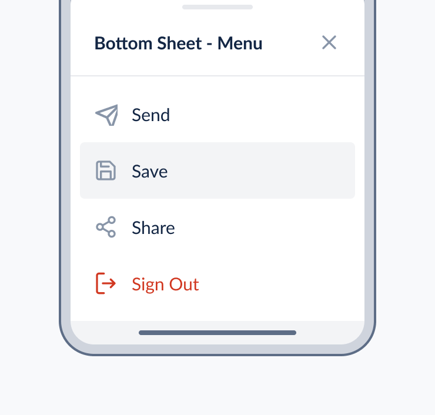

# Bottom Sheet

Bottom sheet is a container that presents additional information to a user in an overlay.

This document outlines the API of `BottomSheet` component.



## Design

- [Figma - BottomSheet](https://www.figma.com/file/jubmQL9Z8V7881ayUD95ps/Blade---Payment-Light?node-id=26477%3A578228&t=1RMqjs99P33Udj0C-0)

## API

Sample usage:

```jsx
import { BottomSheet } from '@razorpay/blade';

<BottomSheet open={boolean} snapPoints={[]}>
  <BottomSheetHeader>
    <BottomSheetHeaderLeading title="Payments Links" prefix={BladeIcon} />
    <BottomSheetHeaderTrailing visual={Link|Action|Icon} />
  </BottomSheetHeader>
  <BottomSheetBody>Body Content</BottomSheetBody>
  <BottomSheet>
    <BottomSheetLeading title="Footer Title" prefix={icon} />
    <BottomSheetTrailing
      actions={{
        primaryAction: { text: 'Know more', onClick: () => {} },
        secondaryAction: { text: 'Read Docs', onClick: () => {} },
      }}
    />
  </BottomSheet>
</BottomSheet>;
```

**Design Constraints** 

- BottomSheetHeader:
  - Leading: 
    - Title
    - Prefix
  - Trailing:  
    - empty
    - icon
    - link
    - action

- BottomSheetFooter:
  - Leading
    - title
    - prefix
  - Trailing
    - Primary action button
    - Secondary action button

- The BottomSheetFooter will behave similar to Card's footer.
- The Header, Footer can be individually omitted

### `BottomSheet`

We'll expose an `BottomSheeet` component with the following API:

| Prop       | Type       | Default                 | Description                                        | Required |
| ---------- | ---------- | ----------------------- | -------------------------------------------------- | -------- |
| open       | `boolean`  | `false`                 | toggles bottom sheet state content                 |       |
| snapPoints | `string[]` | `['25%', '50%', '85%']` | snappoints in which the bottom sheeet will rest on |        |
| onDismiss | `Callback` | `undefined` | called when the bottom sheet is closed, either by user state, hitting `esc` or tapping backdrop |        |
| initialFocusRef | `React.Ref` | `undefined` | ref element you want to get keyboard focus when opening the sheet |   |

### `BottomSheetBody`

| Prop       | Type              | Default     | Description                                                               | Required |
| ---------- | ----------------- | ----------- | ------------------------------------------------------------------------- | -------- |
| `children`    | `React.ReactNode` | `undefined` | Contents of the BottomSheet    | ✅        |


### `BottomSheetHeaderLeading` API


| Prop       | Type              | Default     | Description                                                               | Required |
| ---------- | ----------------- | ----------- | ------------------------------------------------------------------------- | -------- |
| `title`    | `string`          | `undefined` | Title of the Card                                                         | ✅        |
| `prefix`   | `IconComponent` | `undefined` | Prefix icon placed before title text   |          |

### `BottomSheetHeaderTrailing` API

| Prop     | Type              | Default     | Description                                                                                                                                     | Required |
| -------- | ----------------- | ----------- | ----------------------------------------------------------------------------------------------------------------------------------------------- | -------- |
| `visual` | `Link, Action, Icon` | `undefined` | Trailing visual element placed on right side of the header |          |

### `BottomSheetFooterLeading` API

| Prop       | Type     | Default     | Description          | Required |
| ---------- | -------- | ----------- | -------------------- | -------- |
| `title`    | `string` | `undefined` | Title of the BottomSheet footer    | ✅        |
| `prefix`   | `IconComponent` | `undefined` | Prefix icon placed before title text   |          |

### `BottomSheetFooterTrailing` API

| Prop      | Type                                     | Default     | Description                                | Required |
| --------- | ---------------------------------------- | ----------- | ------------------------------------------ | -------- |
| `actions` | `{ primary: Action, secondary: Action }` | `undefined` | Renders a primary/secondary action buttons |          |

```ts
type Action = {
  onClick: () => void;
  text: string;
  type?: 'button' | 'reset' | 'submit';
  accessibilityLabel: string;
  isLoading: boolean;
  isDisabled: boolean;
  icon: React.ReactNode;
  iconPosition: "left" | "right"
}
```

## Composition with DropDown 

We will export `BottomSheet` component separately as an independant component but generally the pattern will be to use it with SelectInput, where in mobile devices the Select's dropdown will be replaced by the BottomSheet. 

There are two approaches to doing it: 

1. We coupled the BottomSheet & SelectInput tightly and internally conditionally switch the components

Pros: 

- Easy implementation for user's end
- User's don't have to think about breakpoints, conditional rendering etc
- From blade side, we will have greater control over the pattern

Cons: 

- Bundle size will be impacted, even if users are desktop they will get the bundle of BottomSheet (vice versa)


2. We expose BottomSheet indepandantly and let users lazy load the component as needed

Pros: 

- No uneccesary bundle size impact for any of the platforms

Cons: 

- Not trivial to implement from user's end, they will have to compose the BottomSheet & Select as per their needs.

### Composition Example 


## Accessibility

The bottom sheet will follow the accessibility charechtaristics of a Modal. 

[APG Guidelines for Modal](https://www.w3.org/WAI/ARIA/apg/patterns/dialog-modal/)

Behaviours: 

- Tab, Shift+Tab should cycle the focused elements
- The focus should be trapped inside the bottom sheet
- Escape closes the bottom sheet, after closing the focus will go to the triggered element
- When opening the bottom sheet it should either focus on the first focusable element on the sheet or element provided by the user via `initialFocusRef` prop

## Open questions

1. What is `action` in the header trailing visual?
2. In BottomSheetHeaderLeaing & BottomSheetFooterLeading will the `prefix` only support Icon component? 


## References

- https://github.com/stipsan/react-spring-bottom-sheet
- https://github.com/gorhom/react-native-bottom-sheet
- https://m2.material.io/components/sheets-bottom
