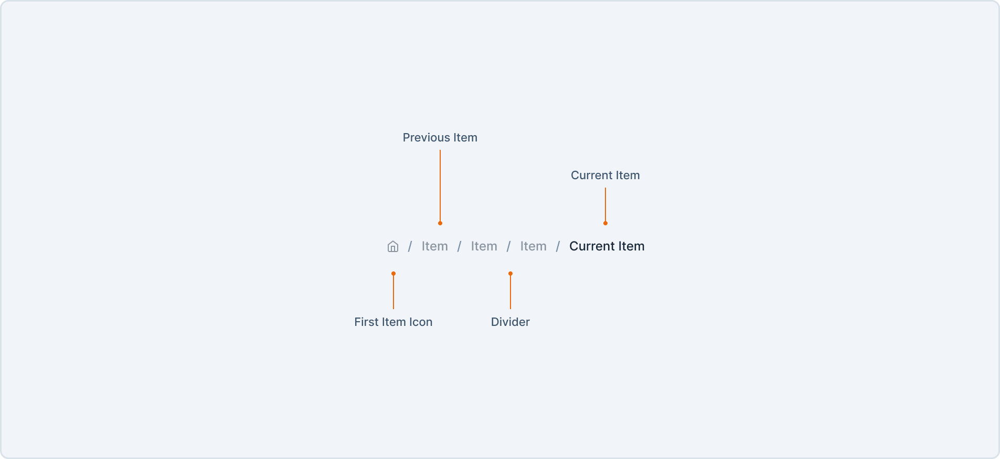

# Breadcrumb Decisions <!-- omit in toc -->

Breadcrumbs are used for navigating through or to show user’s location in an application.

- [Design](#design)
- [Anatomy](#anatomy)
- [Basic Usage](#basic-usage)
- [API](#api)
  - [Breadcrumb](#breadcrumb)
  - [BreadcrumbItem](#breadcrumbitem)
  - [Examples](#examples)
    - [Show Last Separator](#show-last-separator)
  - [Usage with Routing Libraries](#usage-with-routing-libraries)
- [Accessibility](#accessibility)
- [Open Questions](#open-questions)

## Design

[Figma Link](https://www.figma.com/file/jubmQL9Z8V7881ayUD95ps/Blade-DSL?type=design&node-id=81170-57117&mode=design&t=qeUPSKFBYZfBCFBT-0) to all variants of the Breadcrumb component

## Anatomy



## Basic Usage

```jsx
<Breadcrumb size="small" color="primary">
  <BreadcrumbItem href="/">Home</BreadcrumbItem>
  <BreadcrumbItem href="/dashboard">Dashboard</BreadcrumbItem>
  <BreadcrumbItem href="/settlements" isCurrentPage>Settlements</BreadcrumbItem>
</Breadcrumb>
```

## API

### Breadcrumb

```ts
type BreadcrumbProps = StyledPropsBlade & {
  /**
   * Size of the Breadcrumb
   * 
   * @default medium
   */
  size?: 'small' | 'medium' | 'large';
  /**
   * Color of the Breadcrumb
   * 
   * @default neutral
   */
  color?: 'neutral' | 'primary' | 'white';
  /**
   * Content of the Breadcrumb, accepts BreadcrumbItem
   */
  children: React.ReactNode;
  /**
   * Whether to show the last separator
   */
  showLastSeparator?: boolean;
};
```

### BreadcrumbItem

```ts
type BreadcrumbItemProps = {
  /**
   * Href of the BreadcrumbItem
   */
  href: string;
  /**
   * Function to be called on click of the BreadcrumbItem,
   * 
   * This can be used to integrate with routing libraries like `react-router-dom`
   */
  onClick?: (event: React.MouseEvent<HTMLAnchorElement>) => void;
  /**
   * Whether the BreadcrumbItem is the current page,
   * Sets the aria-current attribute to `page`
   * 
   * @default false
   */
  isCurrentPage?: boolean;
  /**
   * Content of the BreadcrumbItem
   */
  children: string;
  /**
   * Icon to be shown before the BreadcrumbItem
   */
  icon?: IconComponent;
};
```

### Examples

#### Show Last Separator

The show last separator prop can be used to show or hide the last separator in the Breadcrumb component, this can be useful when the Breadcrumb is used in a page title.

```jsx
const App = () => {
  return (
    <Box>
      <Breadcrumb showLastSeparator marginBottom="spacing.3">
        <BreadcrumbItem href="/">Home</BreadcrumbItem>
        <BreadcrumbItem href="/dashboard">Dashboard</BreadcrumbItem>
      </Breadcrumb>
      <Heading>Settlements</Heading>
    </Box>
  )
}
```


### Usage with Routing Libraries

The `onClick` prop can be used to integrate with routing libraries like `react-router-dom`.

```jsx
import { Link } from 'react-router-dom';
import { Breadcrumb, BreadcrumbItem } from "@razorpay/blade/components";
import {
  useHref,
  useLinkClickHandler,
} from "react-router-dom";

const RouterBreadcrumbItem = React.forwardRef(
  (
    {
      onClick,
      replace = false,
      state,
      target,
      to,
      ...rest
    },
    ref
  ) => {
    const href = useHref(to);
    const handleClick = useLinkClickHandler(to, {
      replace,
      state,
      target,
    });

    return (
      <BreadcrumbItem
        {...rest}
        href={href}
        onClick={(event) => {
          onClick?.(event);
          if (!event.defaultPrevented) {
            handleClick(event);
          }
        }}
        ref={ref}
        target={target}
      />
    );
  }
);

const App = () => {
  return (
    <Breadcrumb>
      <RouterBreadcrumbItem to="/">
        Home
      </RouterBreadcrumbItem>
      <RouterBreadcrumbItem to="/dashboard">
        Dashboard
      </RouterBreadcrumbItem>
      <RouterBreadcrumbItem to="/settlements" isCurrentPage>
        Settlements
      </RouterBreadcrumbItem>
    </Breadcrumb>
  )
}
```

## Accessibility

Breadcrumb follows the WAI-ARIA Pattern for [Breadcrumbs Navigation](https://www.w3.org/WAI/ARIA/apg/patterns/breadcrumb/examples/breadcrumb/).

- The Breadcrumb component uses the `nav` element to denote a navigation landmark.
- The BreadcrumbItem component uses the `a` element to denote a link.
- The BreadcrumbItem component sets the `aria-current` attribute to `page` when the `isCurrentPage` prop is set to `true`.

## Open Questions

