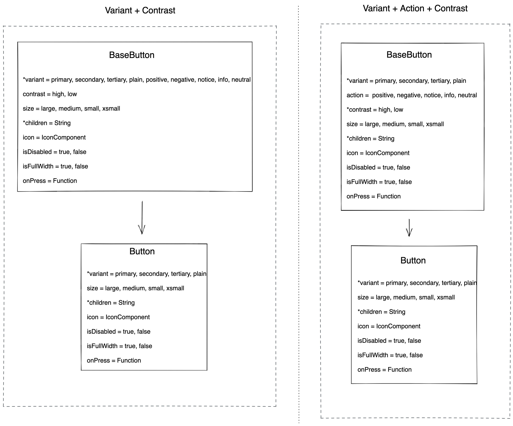

# Button Decisions <!-- omit in toc -->

- [Design](#design)
- [Internal BaseButton Component](#internal-basebutton-component)
  - [BaseButton API](#basebutton-api)
- [Button Component](#button-component)
  - [Button API](#button-api)
- [Component Breakdown](#component-breakdown)
- [Open Questions](#open-questions)

## Design

[Figma Link](https://www.figma.com/file/jubmQL9Z8V7881ayUD95ps/Blade---Payment-Light?node-id=5200%3A0) to all variants of the Button component

## Internal BaseButton Component

Internal component that exposes certain extra props to enable creation of Component Level Action Buttons like `positive`, `negative`, `neutral`

### BaseButton API

| Prop         | Type                                               | Required | Default   | Description                                                                                                                                                                                                                                                                                                                                      |
| ------------ | -------------------------------------------------- | -------- | --------- | ------------------------------------------------------------------------------------------------------------------------------------------------------------------------------------------------------------------------------------------------------------------------------------------------------------------------------------------------ |
| variant      | `primary`, `secondary`, `tertiary`, `link`         | No       | `primary` | - The variant of the button to be rendered.  Note: `link` will look like an inline Link component but will be rendered as a `button` element                                                                                                                                                                                               |
| intent       | `positive`,`negative`, `notice`, `info`, `neutral` | No       | undefined | The intent of the button to be rendered.   Note:   - We will use this to set the intent for internal Blade components that have positive, negative, notice, info, or neutral buttons like an Alert component  - All the variants of the button will not be using any intent since it would only be required for internal components. |
| contrast     | `low`, `high`                                      | No       | `low`     | The contrast of the button to be rendered.   Note: We need this for internal Blade components since a `positive` intent could have a `high` as well as a `low` contrast button                                                                                                                                                             |
| size         | `large`, `medium`, `small`, `xsmall`               | No       | `medium`  | The size of the button to be rendered.                                                                                                                                                                                                                                                                                                           |
| children     | `string`                                           | No       | undefined | The text to be rendered within the button.                                                                                                                                                                                                                                                                                                       |
| icon         | `Icon`                                             | No       | undefined | The Blade `Icon` component to be rendered within the button.                                                                                                                                                                                                                                                                                     |
| iconPosition | `left`, `right`                                    | No       | `right`   | The position of the rendered icon.                                                                                                                                                                                                                                                                                                               |
| isDisabled   | `boolean`                                          | No       | `false`   | Control whether the button is disabled or not.                                                                                                                                                                                                                                                                                                   |
| isFullWidth  | `boolean`                                          | No       | `false`   | Allows the button to take up the full width of its parent.                                                                                                                                                                                                                                                                                       |
| onClick      | `Function`                                         | No       | undefined | The function to be called when the button is clicked.                                                                                                                                                                                                                                                                                            |
| type         | `button`, `submit`, `reset`                        | No       | `button`  | Specifies the type of button to be rendered.   Note: This prop will be ignored for React Native                                                                                                                                                                                                                                            |

## Button Component

This will be the Button component that is exposed to our consumers and will be a wrapper on top of `BaseButton` component

### Button API

| Prop         | Type                                       | Required | Default   | Description                                                                                                                                        |
| ------------ | ------------------------------------------ | -------- | --------- | -------------------------------------------------------------------------------------------------------------------------------------------------- |
| variant      | `primary`, `secondary`, `tertiary`, `link` | No       | `primary` | - The variant of the button to be rendered.  Note: `link` will look like an inline Link component but will be rendered as a `button` element |
| size         | `large`, `medium`, `small`, `xsmall`       | No       | `medium`  | The size of the button to be rendered.                                                                                                             |
| children     | `string`                                   | No       | undefined | The text to be rendered within the button.                                                                                                         |
| icon         | `Icon`                                     | No       | undefined | The Blade `Icon` component to be rendered within the button.                                                                                       |
| iconPosition | `left`, `right`                            | No       | `right`   | The position of the rendered icon.                                                                                                                 |
| isDisabled   | `boolean`                                  | No       | `false`   | Control whether the button is disabled or not.                                                                                                     |
| isFullWidth  | `boolean`                                  | No       | `false`   | Allows the button to take up the full width of its parent.                                                                                         |
| onClick      | `Function`                                 | No       | undefined | The function to be called when the button is clicked.                                                                                              |
| type         | `button`, `submit`, `reset`                | No       | `button`  | Specifies the type of button to be rendered.   Note: This prop will be ignored for React Native                                              |

- **Why are we not exposing `contrast` prop for the `Button` Component?**
  The Button component will only have a `variant` prop that would allow you to choose the kind of button you want. `contrast` is only required when we are using it along with `intent` for _internal_ Blade components like an `Alert` that could have a `low` as well as `high` contrast positive-intent button. Our assumption is that our products will not require a standalone low-contrast-positive-button (except a couple edge cases where we would encourage using custom buttons). We're doing this to ensure these different combinations of buttons don't get over-used within our products leading to breakage in the design language. But the fact that we have these capabilities built in the `BaseButton` itself would ensure that _we can_ expose these to our consumers when we see a massive demand for it.

## Component Breakdown

## Open Questions

- ~Should we have `variant+contrast` props or `variant+action+contrast` props?~ We will go ahead with `variant+intent+contrast` props for now.
- ~What about small/large screen?~ This would be handled internally
- ~Component-level Actions look mostly like primary except Focus, what do we do?~ This was a Figma issue, it is intended to look exactly like the `primary` variant
- ~Should Plain/Link behave as `<a>` tag?~ We will have a `Link` variant but that would also be a `button`. We would have another `Link` component that will be an `<a>` tag. We do this to maintain the correct roles for button & link components.
- ~Should we expose a `type` prop for `button`, `reset`, `submit`?~ Yes, we should.
- ~Do we need `leadingIcon`/`leftIcon` `trailingIcon`/`rightIcon` props?~ Yes, we do. We'll control this with an `icon` & `iconPosition` prop.
- ~Should we call it onClick or onPress?~ We will call it onClick for more developer familiarity.
- Scope of A11y?
  - [WAI-ARI Button](https://www.w3.org/TR/wai-aria-practices-1.2/#button)
  - [WAI-ARI Link](https://www.w3.org/TR/wai-aria-practices-1.2/#link)
  - To be discussed further depending on [A11y RFC](https://github.com/razorpay/blade/pull/463) which is in progress
