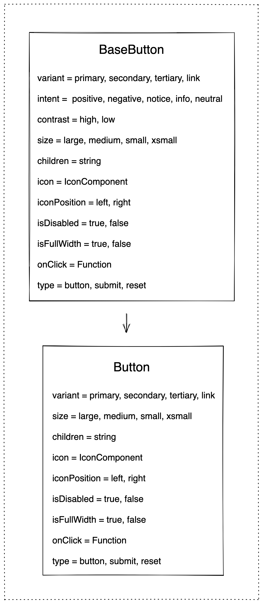

# Button Decisions <!-- omit in toc -->
- [Internal BaseButton Component](#internal-basebutton-component)
- [Button Component](#button-component)
- [Open Questions](#open-questions)

## Internal BaseButton Component
-  Internal component that exposes certain extra props to enable creation of Component Level Action Buttons like `positive`, `negative`, `neutral`
-  **BaseButton API**:
   -  **`variant`**: `primary` | `secondary` | `tertiary` | `link`
      -  **default**: `primary`
      -  Link will look like an inline Link component but will have the role of a `button`
   -  **`intent`**: `positive` | `negative` | `notice` | `info` | `neutral`
      -  **default**: `undefined`
      -  We will use this to set the `intent` for internal Blade components that have positive, negative, notice, info, or neutral buttons like an `Alert` component
   -  **`contrast`**: `high` | `low`
      -  **default**: `low`
      -  We need this for internal Blade components since a `positive` intent could have a `high` as well as a `low` contrast button
   -  **`size`**: `large` | `medium` | `small` | `xsmall`
      - **default**: `medium`
   -  **`children`**: `string`
   -  **`icon`**: `IconComponent`
      -  **default**: `undefined`
   -  **`iconPosition`**: `left` | `right`
      -  **default**: `right`
   -  **`isDisabled`**: `true` | `false`
      -  **default**: `false`
      -  Should we call this `disabled` instead?
   -  **`isFullWidth`**: `true` | `false`
      -  **default**: `false`
      -  Should we call this `fullWidth` instead?
   -  **`onClick`**: `Function`
      -  **default**: `undefined`

## Button Component
- This will be the Button component that is exposed to our consumers and will be a wrapper on top of `BaseButton` component
-  **Button API**:
   -  **`variant`**: `primary` | `secondary` | `tertiary`
      - **default**: `primary`
   -  **`size`**: `large` | `medium` | `small` | `xsmall`
      -  **default**: `medium`
   -  **`children`**: `string`
   -  **`icon`**: `IconComponent`
      -  **default**: `undefined`
   -  **`iconPosition`**: `left` | `right`
      -  **default**: `right`
   -  **`isDisabled`**: `true` | `false`
      -  **default**: `false`
      -  Should we call this `disabled` instead?
   -  **`isFullWidth`**: `true` | `false`
      -  **default**: `false`
      -  Should we call this `fullWidth` instead?
   -  **`onClick`**: `Function`
      -  **default**: `undefined`

## Open Questions
- ~Should we have `variant+contrast` props or `variant+action+contrast` props?~ We will go ahead with `variant+intent+contrast` props for now.
- ~What about small/large screen?~ This would be handled internally
- ~Component-level Actions look mostly like primary except Focus, what do we do?~ This was a Figma issue, it is intended to look exactly like the `primary` variant
- ~Should Plain/Link behave as `<a>` tag?~ We will have a `Link` variant but that would also be a `button`. We would have another `Link` component that will be an `<a>` tag. We do this to maintain the correct roles for button & link components.
- ~Should we expose a `type` prop for `button`, `reset`, `submit`?~ Yes, we should.
- ~Do we need `leadingIcon`/`leftIcon` `trailingIcon`/`rightIcon` props?~ Yes, we do. We'll control this with an `icon` & `iconPosition` prop.
- ~Should we call it onClick or onPress?~ We will call it onClick for more developer familiarity.
- Scope of A11y?
  - [WAI-ARI Button](https://www.w3.org/TR/wai-aria-practices-1.2/#button)
  - [WAI-ARI Link](https://www.w3.org/TR/wai-aria-practices-1.2/#link)