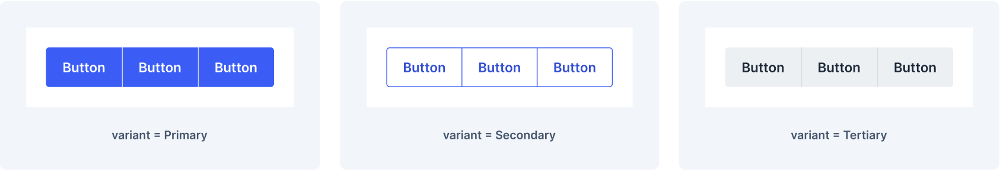
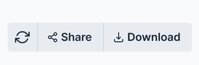
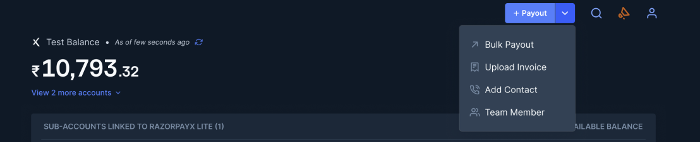

# ButtonGroup Decisions <!-- omit in toc -->

The `ButtonGroup` component is used to group related buttons together. This component allows to organize and visually associate multiple buttons that share a common purpose or functionality.

This document outlines the API details of the `ButtonGroup` component, encompassing their structural composition, functional attributes, and visual representation.



- [Design](#design)
- [`ButtonGroup` API](#buttongroup-api)
- [Usage](#usage)
- [Accessibility](#accessibility)

## Design

[Figma Link](https://www.figma.com/file/jubmQL9Z8V7881ayUD95ps/Blade-DSL?type=design&node-id=80700%3A197616&mode=design&t=7DAMvXAfVzPVN7Kl-1) to all variants of the `ButtonGroup` component.

## `ButtonGroup` API

```ts
type ButtonGroupProps = {
  /**
   * Accepts multiple Button components as children
   */
  children: React.ReactNode;
  /**
   * Specifies the visual style variant of the ButtonGroup.
   *
   * @default 'primary'
   */
  variant?: ButtonProps['variant'];
  /**
   * Specifies the size of the ButtonGroup.
   *
   * @default 'medium'
   */
  size?: ButtonProps['size'];
  /**
   * Specifies the color of the ButtonGroup.
   *
   * @default 'primary'
   */
  color?: ButtonProps['color'];
  /**
   * Specifies whether the ButtonGroup should take up the full width of its container.
   */
  isFullWidth?: boolean;
  /**
   * Disables or enables the ButtonGroup component
   *
   * @default false
   */
  isDisabled?: boolean;
  /**
   * Test ID for automation
   */
  testID?: string;
};
```

## Usage

- Use button groups to visually associate multiple buttons that share a common purpose or functionality.

  

  ```tsx
  import {
    ButtonGroup,
    Button,
    RefreshIcon,
    ShareIcon,
    DownloadIcon,
  } from '@razorpay/blade/components';

  const App = () => {
    return (
      <ButtonGroup>
        <Button icon={RefreshIcon} />
        <Button icon={ShareIcon}>Share</Button>
        <Button icon={DownloadIcon}>Download</Button>
      </ButtonGroup>
    );
  };
  ```

- Buttons inside a `ButtonGroup` can be used to trigger a dropdown.

  > [!IMPORTANT]
  >
  > We will introduce a new `placement?:| "bottom-end" | "bottom-start" | "left-end" | "left-start" | "right-end" | "right-start" | "top-end" | "top-start"` prop in the `DropdownOverlay` component to control the placement of the dropdown.

  

  ```tsx
  import {
    ButtonGroup,
    Button,
    Dropdown,
    DropdownOverlay,
    DropdownButton,
    ActionList,
    ActionListItem,
    ChevronDownIcon,
  } from '@razorpay/blade/components';

  const App = () => {
    return (
      <ButtonGroup>
        <Button icon={PlusIcon}>Payout</Button>
        <Dropdown>
          <DropdownButton icon={ChevronDownIcon} />
          <DropdownOverlay placement="bottom-end">
            <ActionList>
              <ActionListItem title="Bulk Payout" value="bulk-payout" />
              <ActionListItem title="Upload Invoice" value="upload-invoice" />
              <ActionListItem title="Add Contact" value="add-contact" />
              <ActionListItem title="Team Member" value="team-member" />
            </ActionList>
          </DropdownOverlay>
        </Dropdown>
      </ButtonGroup>
    );
  };
  ```

## Accessibility

### Role

- In order for assistive technologies (such as screen readers) to convey that a series of buttons is grouped, an appropriate ` role` attribute needs to be provided. For ButtonGroup, this would be [ `role="group"`](https://developer.mozilla.org/en-US/docs/Web/Accessibility/ARIA/Roles/group_role).
- The `ButtonGroup` does not behave like a [toolbar](https://developer.mozilla.org/en-US/docs/Web/Accessibility/ARIA/Roles/toolbar_role).

### Keyboard Interaction

- When focus moves into the button group, focus is on the first button. Pressing `Tab` moves focus to the next button in the group, and so on, until the last button is reached. At that point, the next tab moves focus to the next focusable element after the button group.
- Pressing `Shift + Tab` moves focus to the previous button in the group, and so on, until the first button is reached. At that point, the next `Shift + Tab` moves focus to the previous focusable element before the button group.
- When a button has focus, pressing `Space` or `Enter` triggers the button's action.
