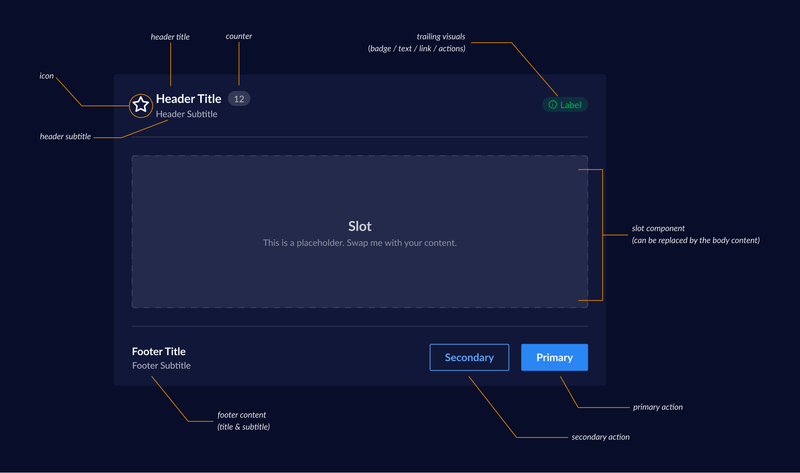

# Card Decisions <!-- omit in toc -->

Cards are used to group similar concepts and tasks together to make easier for merchants to scan, read, and get things done. In simpler words Cards help seprates content into sections. They are the surfaces that display content and actions on a single topic. They should be easy to scan for relevant and actionable information.

- [Design](#design)
- [Anatomy](#anatomy)
- [Card Requirements](#card-requirements)
- [Card API Constraints](#card-api-constraints)
- [API](#api)
  - [`Card` API](#card-api)
  - [`Card.Header` API](#cardheader-api)
  - [`Card.Footer` API](#cardfooter-api)
- [Open Questions](#open-questions)

## Design

[Figma Link](https://www.figma.com/file/jubmQL9Z8V7881ayUD95ps/Blade---Payment-Light?node-id=5200%3A0) to all variants of the Card component

## Anatomy



Components: 

- `Card`
- `Card.Header`
  - `Card.HeaderLeading` 
  - `Card.HeaderTraling` 
- `Card.Body`
- `Card.Footer`
  - `Card.FooterLeading` 
  - `Card.FooterTraling` 

## Card Requirements

- 2 Levels (color levels)
- Slot for user's content
- Have Header/Footer
- **Header**
  - Header have leading and trailing sections
  - Leading section can have: 
    - Icon
    - Title
    - Subtitle
    - Counter
  - Trailing section can have:
    - Badge
    - Text
    - Link
    - Icon Button
- **Footer**
  - Footer have leading and trailing sections:
  - Leading section can have: 
    - Title
    - Subtitle
  - Trailing section can have:
    - Primary action button
    - Secondary action button


## Card API Constraints 

**Header Leading Section**

- `Title` & `Subtitle`
  - Size & text variant cannot be changed
- `Icon`
  - Size & color cannot be changed
- `Counter`
  - Size can be changed but not recommended
  - Variant can be changed

**Header Trailing Section**

Anything can be changed in these components, but whats given out of the box are the recommended: 

Only one of the component can be used at a time: 
- Badge
- Text
- Link
- IconButton - only tertiary variant

Other recommendations from design side: 

- Never use a primary/secondary action in the header, footer are meant for such actions.
  - This means it's not recommended to change variant of IconButton

**Footer Leading Section**

- `Title` & `Subtitle`
  - Size & text variant cannot be changed

**Footer Trailing Sections**

- Only two action buttons can be present `primary` or `secondary`
- Users can totally omit action buttons
- They can also use either variants of buttons `primary` or `secondary`

## API

With the above constraints we can propose the Card API as follows: 

Sample usage:

```jsx
<Card backgroundLevel={1}>
  <Card.Header>
    <Card.HeaderLeading  
      title="Payments Links" 
      subtitle="Share payment link via an email, SMS, messenger, chatbot etc." 
      prefix={<CardHeaderIcon icon={DollarIcon} />}
      suffix={<CardHeaderCounter amount={20} />}
    />
    <Card.HeaderTrailing 
      visual={<CardHeaderBadge variant="positive">NEW</CardHeaderBadge>} 
    />
  </Card.Header>
  <Card.Body>
    Card Body Content
  </Card.Body>
  <Card.Footer>
    <Card.FooterLeading 
      title="Card Footer Title" 
      subtitle="Card footer subtitle" 
    />
    <Card.FooterTrailing 
      actions={{
        primaryAction: { text: 'Know more', onClick: () => {} },
        secondaryAction: { text: 'Read Docs', onClick: () => {} },
      }}
    />
  </Card.Footer>
</Card>
```


### `Card` API


| Prop              | Type   | Default | Description                                                                            | Required |
| ----------------- | ------ | ------- | -------------------------------------------------------------------------------------- | -------- |
| `surfaceLevel` | `2, 3` | `2`     | Surface level of the card background color, use this based on where the card is placed |          |


### `Card.HeaderLeading` API


| Prop             | Type              | Default     | Description                                              | Required |
| ---------------- | ----------------- | ----------- | -------------------------------------------------------- | -------- |
| `title`          | `string`          | `undefined` | Title of the Card                                        | ✅        |
| `subtitle`       | `string`          | `undefined` | Subtitle of the Card                                     |          |
| `prefix`    | `React.ReactNode` | `undefined` | Prefix element placed before title text (restricted to: Icon)       |          |
| `suffix`    | `React.ReactNode` | `undefined` | Suffix element placed after title text (restricted to: Counter)     |          |

### `Card.HeaderTrailing` API

| Prop             | Type              | Default     | Description                                              | Required |
| ---------------- | ----------------- | ----------- | -------------------------------------------------------- | -------- |
| `visual` | `React.ReactNode` | `undefined` | Trailing visual element placed on right side of the card (restricted to: Badge, Text, Link, IconButton) |          |

### `Card.FooterLeading` API

| Prop       | Type                                     | Default     | Description                                | Required |
| ---------- | ---------------------------------------- | ----------- | ------------------------------------------ | -------- |
| `title`    | `string`                                 | `undefined` | Title of the Card                          | ✅        |
| `subtitle` | `string`                                 | `undefined` | Subtitle of the Card                       |          |

### `Card.FooterTrailing` API

| Prop       | Type                                     | Default     | Description                                | Required |
| ---------- | ---------------------------------------- | ----------- | ------------------------------------------ | -------- |
| `actions`  | `{ primary: Action, secondary: Action }` | `undefined` | Renders a primary/secondary action buttons |          |

```ts
type Action = {
  onClick: () => void;
  text: string;
  type?: 'button' | 'reset' | 'submit';
  accessibilityLabel: stirng;
  isLoading: boolean;
  isDisabled: boolean;
  icon: React.ReactNode;
  iconPosition: "left" | "right"
}
```

## Accessibility 

For Cards there won't be any aria related logic needed to make it accessible. Though important things to consider while building cards are: 

- Ensure the markup is sementic
- Mantaining proper reading/tab order while placing multiple cards in a group

Since our Cards are not wrapped in a link or is clickable by design we don't have to worry about nested actions. 


## Flexiblity vs Constraints Rabbit hole 

Before you procced, just a caution that we discussed a lot on the APIs and there were many iterations of the API before we finalized the approach above. If you don't want to get overwhelemed you can skip this part. 

### Alternative APIs

> **Internal Meeting: Nov 28th 2022**
>
> **Agenda:** Discussing pros and cons of various APIs
> 
> Participants: Anurag Hazra, Saurabh Daware.

We also evaluated few alternative approaches before finalizing the API, Here are few pros and cons of each: 

**API 1:**

*Pros:*

- More customisable than prop based api

*Cons:*

- Hard to enforce via Types
- Runtime enforcement is complex to do
- The JSX nesting isn't very simple and doesn't match with the visual design (notice how HeaderCounter is inside HeaderTitle with the title's text)

```jsx
<Card.Header>
  <Card.HeaderTitle icon={Clock} subtitle="Card subtitle">
    Card Header Title
    <Card.HeaderCounter value={12} />
  </Card.HeaderTitle>
  <Card.HeaderTrailingVisual>
    <Badge />
  </Card.HeaderTrailingVisual>
</Card.Header>
```

**API 2:**

*Pros:*

- Satisfies all the needs for customisability in Header
- The JSX structure matches well with design
- Same Leading & Trailing API can be used in the footer

*Cons:*

- Runtime enforcement is very hard to do.
- API is verbose, and the learning curve is too large
- The consumer would need to learn where and how to put the JSX structure to build the card
- The API is too flexible, we want some control over the API to reduce the footguns.
- We need a few runtime hacks and checks on the `Card.headerLeading` part to make sure we are putting everything on the right place.

```jsx
<Card.Header>
  <Card.HeaderLeading>
    <Clock />
    <Card.HeaderTitle title="" subtitle=""  />
    <Counter />
  </Card.HeaderLeading>
  <Card.HeaderTrailing>
    <Badge />
  </Card.HeaderTrailing>
</Card.Header>
```

**API 3:**

Pros: 

- Total control of the API

Cons: 

- API is too restrictive, consumers won't even be able to change the counter's variant
- Introduces [Apropcalypse](https://twitter.com/dan_abramov/status/1124249242720194560)
- No scope of future extension, if we change any APIs to add anything we need to introduce a lot of breaking changes

```jsx
<Card 
  level={1 | 2} 
  header={{
    title: '',
    subtitle: '',
    prefixIcon: '',
    counter: 12,
    trailingVisual: <Badge />
  }}
  footer={{
    title: '',
    subtitle: '',
    actions: {
      primaryAction:{ text: 'Save', onClick: () => {} },
      secondaryAction:{ text: 'Delete', onClick: () => {} },
    }
  }}
>
  User content
</Card>
```


> **Internal Meeting: Nov 29th 2022**
>
> **Agenda:** Finalizing the API based on the above alternatives.
> 
> Participants: Anurag, Kamlesh, Divyanshu, Abinash, Chaitanya, Saurabh, Saurav


After careful considerations & discussing with the team we decided the go ahead with a hybrid approach of Compound component API + Props API which leads to more consistent & easy to use API which also provides certain levels of flexibility as needed in the Card.Header.

**API 4:**

```jsx
<Card backgroundLevel={1}>
  <Card.Header 
    title="Payments Links" 
    subtitle="Share payment link via an email, SMS, messenger, chatbot etc." 
    titlePrefix={<DollarIcon size="xl" />}
    titleSuffix={<Counter amount={20} />}
    trailingVisual={<Badge variant="positive">NEW</Badge>}
  />
  <Card.Body>
    Card Body Content
  </Card.Body>
  <Card.Footer
    title="Card Footer Title" 
    subtitle="Card footer subtitle" 
    actions={{
      primaryAction: { text: 'Know more', onClick: () => {} },
      secondaryAction: { text: 'Read Docs', onClick: () => {} },
    }} 
  />
</Card>
```


> **Internal Meeting: Dec 2nd 2022**
> 
> **Agenda:** Discussing few concerns with the previously finalized API, which kamlesh raised. 
> 
> Participants: Anurag, Kamlesh, Chaitanya, Abinash, Saurav

With the above `API-4` there were few concerns which are raised: 

- This API is too constraints in some cases & too flexible in other cases
- Why keep the `titlePrefix` flexible? When from the design side we have constraints that the size & color of the Icon cannot be changed? 
- With `titlePrefix` users will need to pass the `color` & `size` prop to the Icon since color prop is mandatory & size is needed to be `xlarge`

We discussed on why we approached this API like:  

<details>
<summary><b>Q:</b> This API is too constraints in some cases & too flexible in other cases</summary>

----
**Ans:** 
There are few sections in the Card which doesn’t need to be changed like header/footer title, subtitle, footer’s actions, and other sections which we decided to keep a bit more flexible to accommodate future usecases like: What if in future instead of counter we need to add a badge? Or there could be cases were we need to add an Avatar in the titlePrefix thus we decided to keep those parts more flexible. 

</details>

<details>
<summary><b>Q:</b> Why keep the titlePrefix flexible? When from the design side we have constraints that the Size & color of the Icon cannot be changed?</summary>

----
**Ans:** 
For now we only have usecase of an icon there but neither development side nor design side knows for sure what other usecases there might arise, so we decided to keep it flexible. 

</details>

<details>
<summary><b>Q:</b> With titlePrefix users will need to pass the color & size prop to the Icon since color prop is mandatory & size is needed to be “xlarge”</summary>

----
**Ans:** 
This was a valid concern with the API which we all agreed that needs to be fixed, since not only does it have a footgun, the consumer also needs to know the exact size & color token to be used in there which is not ideal. 

</details>


**API 5:** Semi-Flexible Compound API:  


**Pros:** 
- Addresses the issue with users needing to pass size & color to icon

**Cons:** 
- There will be a lot of complex runtime checks we need to do.
We also need to ensure the ordering of the JSX elements if users change the order, which will lead to more runtime hacks. 

```jsx
<Card.Header>
  <Card.HeaderLeading>
    <CardHeader.Icon icon={Clock} />
    <Card.HeaderTitle title="" subtitle=""  />
    <CardHeader.Counter />
  </Card.HeaderLeading>
  <Card.HeaderTrailing>
    <Badge />
  </Card.HeaderTrailing>
</Card.Header>
```

**API 6:** Constrained Prop Based: 

**Pros:** 
- Gives us total control of how we want to structure the Card
No footguns as such

**Cons:** 
- Prop based API seems a bit too restrictive
- Hard to extend later on for future usecases, imagine if we want to add Avatar we need to add `prefixAvatar` prop for it
- Passing props to counter needs another prop `counterIntent`

```jsx
<Card>
  <Card.Header
    title=""
    subtitle=""
    prefixIcon={CloseIcon}
    prefixAvatar={}
    counter={12}
    counterIntent=""
    trailingVisual={<Badge />}
  />
</Card>
```

**API 7: Final API**

After discussing about the various pros & cons, footguns & advantages of the APIs we proposed a hybrid approach: 


**Pros:**
- Gives us control over which props to expose in components like `Card.Header.Icon`
- Breaking change resistent, The API is open for extension, if we want we can expose `Card.Header.Avatar` without introducing a breaking change
- Retains all the advantages of the previous hybrid approach.
- No runtime hacks to ensure the order of components unlike in the compound component approach
- We can constrain the titlePrefix, titleSuffix to only accept `Card.Header.{component}`

**Cons:**
- Treeshaking will be a minor issue, if we have 10 `Card.Header.{component}`s then all 10 will be included in the bundle even if users don't use them


```jsx
<Card>
  <Card.Header 
    titlePrefix={<Card.Header.Icon />}
    titleSuffix={<Card.Header.Counter />}
    title="Title"
    subTitle="Subtitle" 
  />
</Card>
```

> **Internal Meeting: Dec 5th 2022**
> 
> **Agenda:** Discussing TreeShaking issue with the Final API
> 
> Participants: Anurag, Kamlesh, Chaitanya, Abinash, Saurabh, Saurav

In this meeting we discussed about the 1 issue with the final API which was Treeshaking. 


After discussing about the criticality of the treeshaking we decided to go with the approach where we treeshaking is possible.

- Reason being in future there can be more components like `Card.Header.Avatar` which will further increase the bundle
  - If someone just uses the Card even if they are not using any of the other components like Button, IconButton, Badge their app will bloat with the components
- We also discussed few approaches on how we can validate the components and throw a runtime error if an unallowed component is passed to the Card. 
  - We cannot use displayName of React components since it will be stripped of on production
  - We also cannot do `comp.type === CardHeaderCounter` because that way we anyway have to import the component, resulting in bloated bundle


**Action Items:** 

- Try adding a static method to the Card components to determine if it’s an allowed component or not. We can’t use displayName since it will be stripped off.
- Check the bundle size of the app to ensure no duplicated components are present
- Also explore the pattern which we used in CheckboxGroup to use `useCardContext` to validate the components being passed (Though this might not work since useCardContext can only check if it’s an allowed component, It can’t throw error if it’s not.)


## Open Questions

- In footer action buttons should `secondary` action button only exist if `primary` action button is present? - 
  - **ANS:** Secondary, Primary can independently work