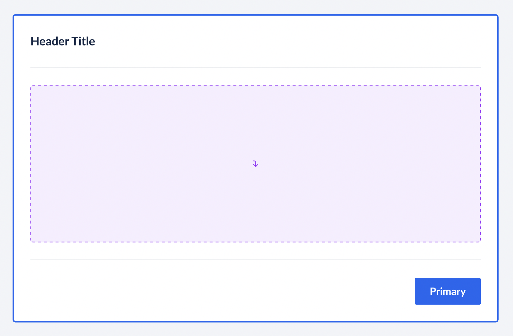

# Interactive Card API

We have new usecases and requirements to make cards interactive.
Functionality wise the Card needs to cover these cases:

- Click-able
- Hover-able
- Select-able - Radio like usecases
- Link-able - Whole card can be a link

## Clickable Card

We can add `onClick` handler in the Card component to make it clickable.

```jsx
<Card onClick={() => console.log('card click')}>...</Card>
```

Thing to note here is that if inside the Card we put an interactive element say `Button` clicking that button will also trigger the Card's onClick, because the event will bubble up.

To prevent this consumers can use `e.stopPropagation()` on the child buttons.

```jsx
<Card onClick={() => console.log('card click')}>
  <CardBody>
    <Button
      onClick={(e) => {
        e.stopPropagation();
        console.log('child click');
      }}
    >
      Click me
    </Button>
  </CardBody>
</Card>
```

## Hoverable Card

For hoverable card there are 3 things we need to solve:

1. Actual visual hover indication, eg scalling up the card.
2. Giving users control when the card is hovered.
3. Mobile interaction

No.1 point can be solved by providing an `isScaled` prop

No.2 needs discussion because previously we discussed that we want to give consumers the ability to know when the card is hovered so they can create their own interactions if needed.

Here are few ways:

**Method 1:** onHover event

```jsx
const [isHovered, setIsHovered] = React.useState(false);
<Card
  onHover={() => {
    setHovered(true);
  }}
  isScaled={isHovered}
/>;
```

**Pros:**

- Users have full control of hover state

**Cons:**

- Way too much wiring just to provide an hover interaction
- Plus state management is also needs to be handled by consumers
- Uses JS events for hover

**Method 2:** shouldshouldScaleOnHover prop

In this method we don't provide isScaled prop.

```jsx
<Card
  // we can still have onHover event for flexibility
  onHover={() => {
    // users can do stuff here
  }}
  // automatic hover, we can internally pass :hover to styled components
  shouldshouldScaleOnHover
/>
```

**Pros:**

- No state management involved
- Less overhead for consumers, they can just pass shouldshouldScaleOnHover
- The scale animation can be driven via plain CSS :hover

**Cons:**

- Users can still know when the `onHover` is triggered but users won't be able to manually set the state of the Card to be `scaled` (eg isScaled={true}), imagine if user wants a card to be `scaled` when user selects it, they won't be able to achive that. (now if we say this is not a valid pattern then fine or else we need further discussion on this)

**Mobile Interaction:** 

In mobile devices there can't be any hover interaction, thus we will have to change the interaction to be on `tap-and-hold` instead, if consumer taps the card or presses the card it will scale and provide feedback to the user. 

And instead of scaling up, we will scale down the card so that the interaction feels more natural as it's getting `pressed-in`

**Conclusion:** 
We will go ahead with Method 2 because of the reason mentioned above and we will also be able to keep the behaviour consistent + control how the behaviour would work in mobile devices (eg we can say instead of hover we can do pressed state changes the scale)

## Selectable Card



The selectable card will have additional functionality and accessibility requirements since it can have

- single selection
- multi selection

We can do this two ways:

1. Flexible as="label" prop
2. Predefined CardGroup/CardGroupItem components (similar to Chip)

**Method 1: Flexible as="label" prop**

We will keep the Card more generic and won't bake in the single select & multi select logic inside the Card itself unlike how we did in Chip component, instead we will have `isSelected` prop along with `as="label"` so that the Card itself can be used as a radio/checkbox label.

Example usage:

Radio:

```jsx
const HiddenInput = ({ name, value }) => {
  return (
    <VisuallyHidden>
      <input onChange={(e) => setSelected(e.target.value)} type="radio" name={name} value={value} />
    </VisuallyHidden>
  );
};

const RadioExample = () => {
  const [selected, setSelected] = React.useState('monthly');
  return (
    <Box>
      <Card as="label" isSelected={selected === 'monthly'}>
        <CardBody>
          <Text>Monthly</Text>
          <HiddenInput name="pricing-radio-card" value="monthly" />
        </CardBody>
      </Card>
      <Card as="label" isSelected={selected === 'quarterly'}>
        <CardBody>
          <Text>Quarterly</Text>
          <HiddenInput name="pricing-radio-card" value="quarterly" />
        </CardBody>
      </Card>
      <Card as="label" isSelected={selected === 'annually'}>
        <CardBody>
          <Text>Annually</Text>
          <HiddenInput name="pricing-radio-card" value="annually" />
        </CardBody>
      </Card>
    </Box>
  );
};
```

**Pros:**

- More generic and flexible for users to extend
- Doesn't introduce new additional components or complexity for us, since consumers can handle it on their end

**Cons:**

- Bit of an effort on consumer end
- While the web implementation works great, for react-native consumers they will have to write a very different state management code, since react-native won't support out of the box native `input=radio` like behaviour. (accessibility they will also have to handle themselves)


**Method 2: Predefined CardGroup/CardGroupItem components:**

With this method, we will expose CardGroup & CardGroupItem components, the API will be similar to Chip component.
And these components will handle all the things internally:

```jsx
const [selected, setSelected] = React.useState('orange');

<CardGroup selectionType="single" value={selected} onChange={(e) => console.log(e)}>
  <CardGroupItem value="monthly">
    <Card isSelected={selected === 'monthly'}>
      <CardBody>
        <Text>Monthly</Text>
      </CardBody>
    </Card>
  </CardGroupItem>
  <CardGroupItem value="quarterly">
    <Card isSelected={selected === 'quarterly'}>
      <CardBody>
        <Text>Quarterly</Text>
      </CardBody>
    </Card>
  </CardGroupItem>
  <CardGroupItem value="annually">
    <Card isSelected={selected === 'annually'}>
      <CardBody>
        <Text>Annually</Text>
      </CardBody>
    </Card>
  </CardGroupItem>
</CardGroup>;
```

**Pros:**

- No overhead on consumer end, and the API will be intuitive to exisiting radio/checkbox components
- Will work on both web & native seamlessly, and we can ensure a11y too

**Cons:**

- Bit of effort on our end, we will basically have to create subset of Radio/Checkbox components for Card's usecase
- Introduces new components, CardGroup, CardGroupItem.

**Conclusion:** 
After discussing with the team, we decided to go with Method 1, because as the Card is a more flexible component in general we want to keep the behaviour generic and let consumers handle the interaction as per their usecase, plus prodiving CardGroup,CardGroupItem could cause flexibility issues and might not work for all the usecases.  

## Linkable Card

With linkable card, the whole card itself can be clicked or linked to any URL. 

With linkable card the main issue is accessibility & interaction, because simply wrapping the whole card in an `a` tag won't be valid, because inside the card there can also be interactive elements.

Three problems with naive approach of just wrapping the card in a link: 

- The wrapped Link component's styling will be leaked into the internal interactive components, see how accordion items and the normal Text component is underlined
- If we have any interactive component say, Accordion or Button clicking on those will also trigger the Link navigation.
- If we open screen reader and try to focus on the card, it will announce the whole card's content as the text of the link, ideally it should only announce the action or label text of the link.

> Check this [Codesandbox for reproduction](https://codesandbox.io/s/card-nested-links-issue-j6wtyn?file=/App.tsx)


**Solution:**

We need to overlay the Link to cover the card instead of nesting it.
- ChakraUI uses [LinkOverlay](https://chakra-ui.com/docs/components/link-overlay/usage#nested-links) component to solve this
- MUI uses a `overlay` prop on the [link](https://mui.com/joy-ui/react-card/#multiple-actions) itself

Previously [discussed](https://razorpay.slack.com/archives/G01B3LQ9H0W/p1689580390134439) this with chaitanya:

Can explore a solution where we don't need to expose `overlay` prop or `LinkOverlay` component to consumer by accepting `<Card href="" />` but internally we will anyway have a `LinkOverlay` component for reasons mentioned above.

Example usage: 

```jsx
// we might also need to expose other link props like target=blank etc
<Card href="/payment-pages" />
```


## Open Questions

- What about client-side nagivation with linkable cards?
  - Client side navigation will be prioritised when we solve it for Link component
