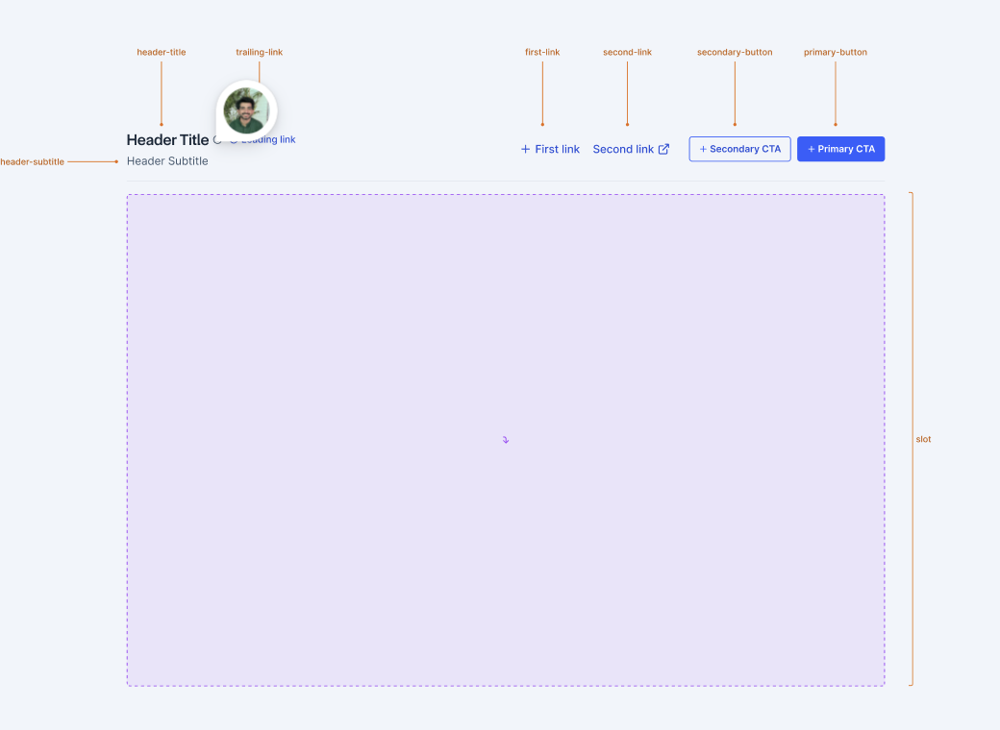

# Card Variants

We are introducing 2 new variants of cards - Layout, Metric and default (currently exists as `Card`)

- Layout Card - Layout cards serve as comprehensive content containers that guide users through multi-step processes, feature highlights, or detailed information sections. They're particularly effective in scenarios where users need to consume information and take specific actions, such as dashboards, detailed information sections or settings pages.



- Metric Card - Metric card is designed to prominently display key performance indicators, statistics, and measurable data points. They provide merchants with at-a-glance visibility into important business metrics through a structured, scannable format. This card should be used wherever we need to show metrics/data points


- Default Card - A card component with a header and content area. (currently exists as `Card`)


## API

```jsx
import { Card, CardHeader } from '@razorpay/blade/components';

<Card variant="layout">//content</Card>;
```

## Metric Card

```jsx
import { Card, CardHeader } from '@razorpay/blade/components';

<Card variant="metric">//content</Card>;
```

## Default Card

```jsx
import { Card } from '@razorpay/blade/components';

<Card>//content</Card>;
```

## Typescript Types

```typescript
type CardProps = {
  variant: 'layout' | 'metric' | 'default';
  // other props
}
```


## Alternative API 
```jsx
import { Card  , LayoutCard , MetricCard} from '@razorpay/blade/components';
 
<LayoutCard>//content</LayoutCard>;
<MetricCard>//content</MetricCard>;
<Card>//content</Card>;
```


## Layout Card

Layout cards serve as comprehensive content containers that guide users through multi-step processes, feature highlights, or detailed information sections. They're particularly effective in scenarios where users need to consume information and take specific actions, such as dashboards, detailed information sections or settings pages.

### Design

- [Figma - Layout Card](https://www.figma.com/design/yKBlpifyZvi28APkmlY5Td/-Research--Cards--v2-?node-id=1429-61697&p=f&m=dev)

### API

```jsx
import { Card, CardHeader } from '@razorpay/blade/components';

<Card variant="layout">
  <CardHeader>
    <CardHeaderLeading
      title="Header Title"
      subtitle="Header Subtitle"
      suffix={<Link />}
      prefix={<Icon />}
    />
    <CardHeaderTrailing>
      <Box>
        // first link
        <Link  href="https://github.com" />
        // second link
        <Link  href="https://github.com" />
        // primary action
        <Button variant="secondary" />
        // secondary action
        <Button variant="primary" />
      </Box>
    </CardHeaderTrailing>
  </CardHeader>
  <CardBody>//content</CardBody>
  <CardFooter>//footer</CardFooter>
</Card>;
```

## Typescript Types


```typescript
type CardHeaderTrailingProps = {
  children?: React.ReactNode;
  visual?: React.ReactNode;
}
```
- we can add internal check to verify if the children prop is a valid component.


### Alternative APIs

```jsx
import { Card, CardHeader } from '@razorpay/blade/components';

<Card variant="layout">
  <CardHeader>
    <CardHeaderLeading
      title="Header Title"
      subtitle="Header Subtitle"
      suffix={<Link />}
      prefix={<Icon />}
    />
    <CardHeaderTrailing
      visual={<Box>
        // first link
        <Link  href="https://github.com" />
        // second link
        <Link  href="https://github.com" />
        //secondary action
        <Button variant="secondary" />
        // primary action
        <Button variant="primary" />
      </Box>}
    ></CardHeaderTrailing>
  </CardHeader>
  <CardBody>//content</CardBody>
  <CardFooter>//footer</CardFooter>
</Card>;
```


```typescript
type CardHeaderTrailingProps = {
  children?: React.ReactNode;
  visual?: React.ReactNode;
}
```

- we can add internal check to verify if the children prop is a valid component ( Link , Button) or add check in eslint plugin.


- we might need to modify the visual prop to accept more components. maybe move checks to the component itself ? or eslint plugin

- might need to do JSX parsing in case of mobile and render action list.


## Metric Card

Metric card is designed to prominently display key performance indicators, statistics, and measurable data points. They provide merchants with at-a-glance visibility into important business metrics through a structured, scannable format. This card should be used wherever we need to show metrics/data points

### Design

- [Figma - Metric Card](https://www.figma.com/design/yKBlpifyZvi28APkmlY5Td/-Research--Cards--v2-?node-id=1448-6614&m=dev)

### API

```jsx
import { Card , CardHeader } from '@razorpay/blade/components';

<Card variant="metric">
  <CardHeader>
    <CardHeaderLeading
      title="Header Title"
      subtitle="Header Subtitle"
      value={<Amount/>}
      valueSuffix={<Text/>}
      valueDescription={<Text/>}
      />
    <CardHeaderTrailing
     visual={isMobile ? <CardHeaderBadge/> :  <CardHeaderLink>} />
   </CardHeader>
   <CardBody>
   //content
   </CardBody>
   <CardFooter>
   //footer
   </CardFooter>
</Card>
```


## Typescript Types


```typescript
type CardHeaderLeading = {
  value?: React.ReactNode;
  valueSuffix?: React.ReactNode;
  valueDescription?: React.ReactNode;
}
```
- we can add internal check to verify if the children prop is a valid component (Amount, Text, Description)


### Open Questions

- Behavior of card on mobile ?
