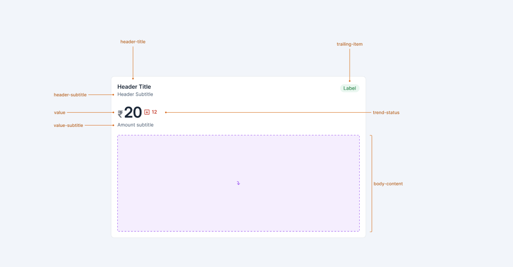

# Card Variants

## Table of Contents
- [Card Variants](#card-variants)
  - [Metric Card](#metric-card)
    - [Design](#design-1)
  - [Enhancements](#enhancements)
    - [API](#API-1)
    - [API](#API-1)

    

We are introducing a new variant of card -  Metric and default (currently exists as `Card`)

- Metric Card - Metric card is designed to prominently display key performance indicators, statistics, and measurable data points. They provide merchants with at-a-glance visibility into important business metrics through a structured, scannable format. This card should be used wherever we need to show metrics/data points



- Default Card - A card component with a header and content area. (currently exists as `Card`)


*Notes*


- After initial discussion we decided that we would be treating these card variants as enhancements to the existing `Card` component. 
- We also had a layout card variant (which have changes in header) but during discussion we got to know that would be part of the `Layout` pattern
- Earlier we had a plan to move Metric slot to `cardHeader` but during discussion we decided to move it to `cardBody`.  (so not much api changes , enhancement only)

## Metric Card

Metric card is designed to prominently display key performance indicators, statistics, and measurable data points. They provide merchants with at-a-glance visibility into important business metrics through a structured, scannable format. This card should be used wherever we need to show metrics/data points

### Design

- [Figma - Metric Card](https://www.figma.com/design/yKBlpifyZvi28APkmlY5Td/-Research--Cards--v2-?node-id=1448-6614&m=dev)

### API

```jsx
import { Card ,CardHeader , CardHeaderLeading , CardHeaderTrailing, CardHeaderBadge , CardHeaderLink ,CardHeaderButton } from '@razorpay/blade/components';

<Card>
  <CardHeader>
    <CardHeaderLeading
      title="Header Title"
      subtitle="Header Subtitle"
      />
    <CardHeaderTrailing
     visual={isMobile ? <CardHeaderBadge/> :  <CardHeaderLink>} />
   </CardHeader>
   <CardBody>
   <MetricSlot/>
   //content
   </CardBody>
   <CardFooter>
   //footer
   </CardFooter>
</Card>
```

### Other Changes


We also have a layout card variant (which have changes in header) but during discussion we got to know that would be part of the `Layout` pattern
but still we need to enhancement to support these changes.. 

- [Figma - Layout Card ](https://www.figma.com/design/yKBlpifyZvi28APkmlY5Td/-Research--Cards--v2-?node-id=1429-61697&p=f&m=dev)


- Changes: 
  - Add Support for ToolTip in Title 
  - Add Support for passing headerLayout in CardHeaderTrailing (will pick this up with layout pattern)
  


## API-1
* Support passing multiple components in Suffix of CardHeaderTrailing. (this way we can pass tooltip and other components in suffix)
```tsx
<CardHeaderLeading
  suffix={
    <CardHeaderBox>
      <Tooltip />
      <Button />
    </CardHeaderBox>
  }
/>


```typescript
type CardHeaderLeading = {
  suffix?: React.ReactNode;
};
```
* Here we are also adding a new component `CardHeaderBox` which is a wrapper on top of `Box` component. it can be only used in `CardHeaderLeading`.
## API-2
* Maybe support passing tooltip  in CardHeaderLeading


<CardHeaderLeading
  suffix={<CardHeaderBadge />}
  toolTipTitle="Tooltip Title"
  toolTipContent="Tooltip Content"
/>

```typescript

type CardHeaderLeadingProps = {
   // rest of the props
   toolTipTitle?: string;
   toolTipContent?: string;
  }

```
