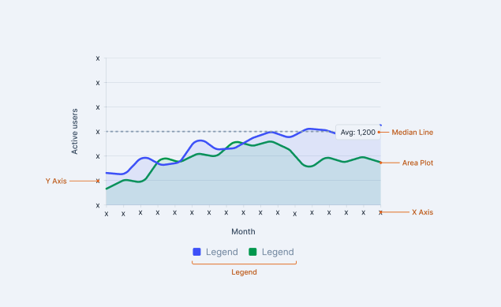
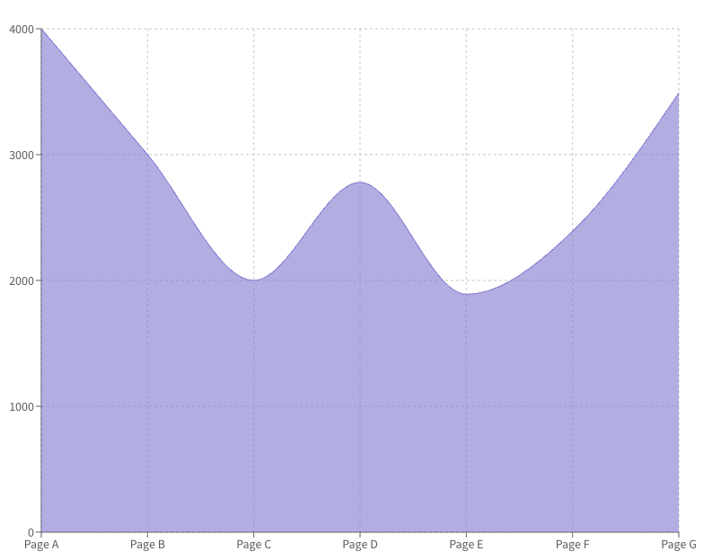
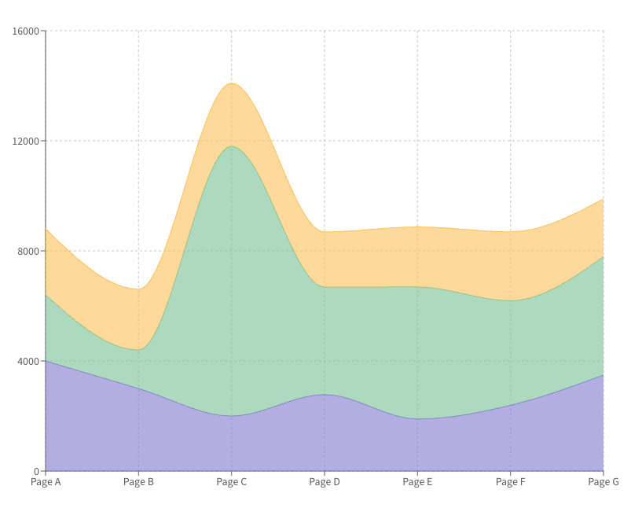
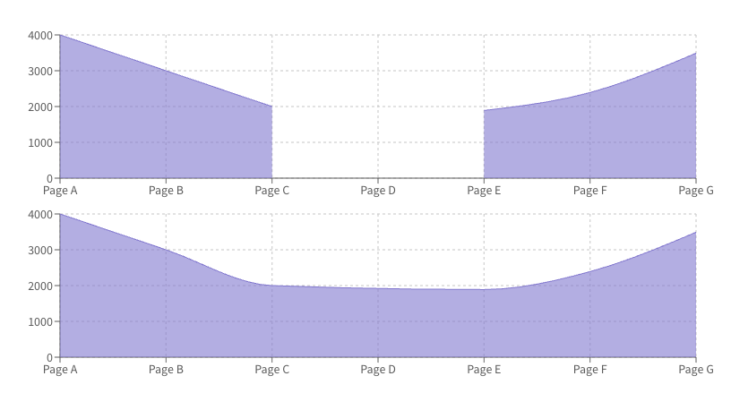
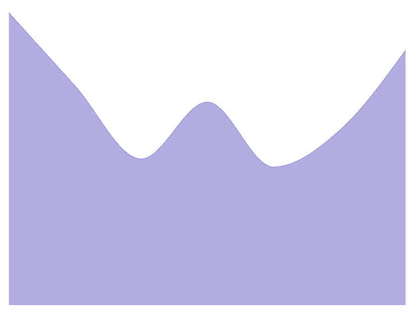

# Area Chart API

**Author(s):** [Gaurav Tewari](mailto:gaurav.tewari@razorpay.com)  
**Team/Pod:** Blade  
**BU:** Platform  
**Published Date:** Aug 7, 2025

-----

### Table of Contents

1. [Design Breakdown](#1-design-breakdown)
2. [Requirements to Handle](#2-requirements-to-handle)
3. [API Specifications](#3-api-specifications)
4. [Alternative APIs](#4-alternative-apis-)
5. [Open Questions](#5-open-questions)


-----

## 1\. Design Breakdown

  * **[Figma Design Link](https://www.figma.com/design/jubmQL9Z8V7881ayUD95ps/Blade-DSL?node-id=92678-188716&p=f&m=dev)**




-----

## 2\. Requirements to Handle

  * **[Data Viz Phase -1 - Requirements Doc](https://docs.google.com/document/d/1u7zkzpsQwwYsdtjSDlPgalArT7XkzAC400KqNI7Ibus/edit?tab=t.l3y0g5difjs4)**

<!-- end list -->

1.  **[Simple Area Chart](https://recharts.org/en-US/examples/SimpleAreaChart)** An area chart with a grid, X-axis, Y-axis, Tooltip, Legend, and the area fill.


2.  **[Stacked Area Chart](https://recharts.org/en-US/examples/StackedAreaChart)** The chart should support stacking multiple areas. This is handled by adding a `stackId` prop to the `Area` component in Recharts. Also if we have more then 2 area, user need to pass stackId. otherwise we will consider 
all areas part of a single stack.





3.  **[Area Chart that Connects Nulls](https://recharts.org/en-US/examples/AreaChartConnectNulls)** Similar to line charts, the chart should be able to handle `null` data points by connecting the area over the gap. This is supported in Recharts via the `connectNulls` prop.




4.  **[Tiny Area Chart](https://recharts.org/en-US/examples/TinyAreaChart)** A minimal area chart with only the filled area, with no grid or axes. Also known as a sparkline.




-----

## 3\. API Specifications

### 3.1.0 Composition API (Re-exporting Styled Components) (Recommended 🥇)

This approach involves re-exporting styled versions of the underlying `recharts` components, giving developers full compositional control.

**Note:**  AreaChart have this `margin` prop which allows user to set margin from  ResponsiveContainer. We won't we exposing that. we would have predefined values. 


#### Area Props

| Prop | Type | Required | Default | Description |
|------|------|----------|---------|-------------|
| `dataKey` | `string` | ✅ | - | The key used to identify the data value for this area in the dataset |
| `name` | `string` | ✅ | - | Display name for the area, shown in legend and tooltips |
| `type` | `'step' \| 'stepAfter' \| 'stepBefore' \| 'linear' \| 'monotone'` | ✅ | - | The interpolation type for connecting data points in the area |
| `stackId` | `string \| number` | ❌ | `undefined` | Identifier used to group areas into a stack. Areas with the same stackId will be stacked. Required when using multiple areas |
| `connectNulls` | `boolean` | ❌ | `false` | Whether to connect the area over null data points |
| `color` | `BladeColorToken` | ❌ | Auto-assigned | Color token for the area fill (automatically assigned from palette if not provided) |


#### ReferenceLine Props

| Prop | Type | Required | Default | Description |
|------|------|----------|---------|-------------|
| `y` | `number` | ✅ | - | Y-axis value where the reference line should be drawn |
| `label` | `string` | ✅ | - | Text label to display for the reference line |
| `color` | `BladeColorToken` | ❌ | - | Color token for the reference line |

#### Additional Notes

> **AreaChart Margin:** The `margin` prop from AreaChart will not be exposed to developers. We will use predefined values that align with our design system.

> **Stacking Behavior:** If you have more than 2 areas, you need to pass `stackId` to each area. Otherwise, all areas will be considered part of a single stack.

> **Color Handling:** Area Charts will not support sequential colors. A limited, curated palette of theme colors will be available. Colors are automatically assigned from the predefined palette if not specified.

> **Responsive Container :** The `ResponsiveContainer` may have other options like actions, onResize, onResizeEnd, etc. will write a separate API doc after discussion with design. 

> **Restrict passing <Defs/> in Recharts :** We will not allow developers to pass <Defs/> in Recharts. Since We would be controlling colors , gradient in our own way.  (Design will define if area color would be solid or gradient.)

> **Restrict max Area :**  We will add a check for max. area In Chart Container.(design will tell the number of max area). 
if more than decided number of max area, we will show an error message. 

> **Animation :**  We will handle Animations like Entry , Exit or Hover internally in area chart (if any).


```ts
import {
  ChartContainer,
  AreaChart as RechartsAreaChart,
  CartesianGrid,
  XAxis,
  YAxis,
  Tooltip,
  Legend,
  Area,
  ReferenceLine,
  ResponsiveContainer,
} from '@razorpay/blade/charts';


// Simple Area Chart
  <ResponsiveContainer width="100%" height="100%">
    <AreaChart data={chartData}>
       <CartesianGrid />
       <XAxis dataKey="month" />
       <YAxis />
       <Tooltip />
       <Area
         dataKey="teamA"
         name="Team A"
       />
    </AreaChart>
  </ResponsiveContainer>

// Stacked Area Chart
  <ResponsiveContainer width="100%" height="100%">
     <AreaChart data={chartData}>
       <CartesianGrid />
       <XAxis dataKey="month" />
       <YAxis />
       <Tooltip />
       <Legend />
       <Area
         dataKey="teamA"
         name="Team A"
         stackId="1"
       />
       <Area
         dataKey="teamB"
         name="Team B"
         stackId="1"
       />
     </AreaChart>
   </ResponsiveContainer>

 // Tiny Area Chart
  <ResponsiveContainer width="100%" height="100%">
      <AreaChart data={chartData}>
          <Area
            dataKey="pv"
            type="monotone"
          />
      </AreaChart>
    </ResponsiveContainer>
```

  * **Pros**
      * Maximum flexibility and control over chart composition and behavior.
      * Familiar developer experience with direct mapping to recharts API.
      * Strong TypeScript support with excellent autocompletion.
      * Extensible and future-proof - easy to add new chart types.
      * Composable and reusable components for building higher-level abstractions.
  * **Cons**
      * Steeper learning curve for developers new to recharts.
      * Verbose usage requiring multiple component imports for simple charts.
      * Documentation and guidelines overhead to ensure proper usage.
      * Potential for misuse bypassing Blade theming standards.

## 4\. Alternative APIs -

### 4.1 Hybrid API (Prop & Config Driven) (Not Recommended)

This approach combines component props for high-level control with configuration objects for detailed specifications.

```ts
// Import statement
import { AreaChart } from '@razorpay/blade/charts';

const chartData = [
  { month: 'Jan', teamA: 2450, teamB: 2600 },
  { month: 'Feb', teamA: 2300, teamB: 2500 },
  { month: 'Mar', teamA: 2300, teamB: 2700 },
  { month: 'Apr', teamA: 2300, teamB: 3000 },
  { month: 'Jun', teamA: 2300, teamB: 3300 },
  { month: 'Jul', teamA: 2300, teamB: 3400 },
  { month: 'Aug', teamA: 2300, teamB: 3500 },
  { month: 'Sep', teamA: 2300, teamB: 3500 },
  { month: 'Oct', teamA: 2300, teamB: 3600 },
  // more data...
];

const areaConfig = [
  {
    dataKey: 'teamA',
    name: 'Team A Users', // name in legend
    color: 'theme.charts.dummy.red',
  },
  {
    dataKey: 'teamB',
    name: 'Team B Users',
    color: 'theme.charts.dummy.blue',
  },
];

const referenceLineDefinitions = [
  { y: 2200, label: 'Avg: 2,200' }
];

const yAxisConfig = [
  { value: 0, label: '0' },
  { value: 500, label: '500' },
  // more data
];

<AreaChart
  data={chartData}
  areaConfig={areaConfig}
  xAxisDataKey="month"
  yAxisConfig={yAxisConfig}
  yAxisLabel="Active users" // Controls the axis title
  xAxisLabel="Month" // Controls the axis title
  referenceLineDefinitions={referenceLineDefinitions}
  showLegend={true}
  showTooltip={true}
  connectNulls={true}
  isStacked={true}
  tinyAreaChart={false}
/>
```

#### TypeScript Interface

```ts
// ============================================================================
// TypeScript Interfaces for the CustomAreaChart Component
// ============================================================================

/**
 * Defines the shape for a single data point in the chart's data array.
 * Uses a generic index signature to allow for flexible data keys.
 */
interface ChartData {
  [key: string]: any;
}

/**
 * Configuration for a single area on the chart.
 */
interface AreaDefinition {
  dataKey: string;
  name: string;
  stroke: string;
  fill: string;
  stackId?: string | number;
}

/**
 * Configuration for a single reference line.
 */
interface ReferenceLineDefinition {
  y: number;
  label: string;
  stroke: string;
}

/**
 * Configuration for a single item in the Y-axis tick array.
 */
interface YAxisConfigItem {
  value: number;
  label: string;
}

/**
 * The main interface for all props accepted by the AreaChart component.
 */
interface CustomAreaChartProps {
  data: ChartData[];
  areas: AreaDefinition[];
  xAxisDataKey: string;
  yAxisLabel?: string;
  xAxisLabel?: string;
  yAxisConfig?: YAxisConfigItem[];
  referenceLines?: ReferenceLineDefinition[];
  showGrid?: boolean;
  showTooltip?: boolean;
  showLegend?: boolean;
  tinyAreaChart?: boolean;
  connectNulls?: boolean;
}
```

  * **Pros**
      * All configuration options are available at the component level.
      * Strong TypeScript autocompletion for all props.
      * Easy to understand what each prop does.
      * Custom components (like tooltips) are easily passed as props.
  * **Cons**
      * Can become verbose with many configuration options.
      * The props list can get long for complex charts.

### 4.2 Config-Driven API (Not Recommended)

This approach consolidates all chart settings into a single `config` object.

```ts
const chartConfig = {
  data: chartData,
  xAxis: {
    dataKey: 'month',
    label: 'Month',
  },
  yAxis: {
    label: 'Active users',
    config: [
      { value: 0, label: '0' },
      { value: 1000, label: '1K' },
    ],
  },
  areas: [
    { dataKey: 'teamA', name: 'Team A Users', stackId: '1' },
    { dataKey: 'teamB', name: 'Team B Users', stackId: '1' },
  ],
  referenceLines: [{ y: 2200, label: 'Target: 2,200' }],
  options: {
    showGrid: true,
    showTooltip: true,
    showLegend: true,
    tinyChart: false,
    connectNulls: false,
    isStacked: true,
  },
};

<AreaChart config={chartConfig} />;
```

  * **Pros**
      * Provides a single source of truth for chart configuration.
      * Easy to serialize/deserialize for storage or dynamic generation.
      * Keeps the JSX clean with minimal props.
  * **Cons**
      * Less discoverable API, developers need to inspect the config object to know what options are available.
      * Nested objects can become complex and hard to manage.
      * Passing custom React components (like a tooltip) is more difficult.
      * TypeScript autocompletion is less effective within a deeply nested object.

-----

## 5\. Open Questions

- Color Handling

We will not support sequential colors for area charts. A limited, curated palette of theme colors will be available. A `color` prop will be available in the area configuration. If it is not provided, we will automatically assign a color from the predefined palette. [Rama Krushna Behera](mailto:rama.behera@razorpay.com) will confirm the final color palette.

- Tooltip

We might need to make custom tooltip. Like ChartsToolTip. Since the tooltip would be different then our blade's tooltip. we still need to check this.
 
- We might have ForeCast in Area Chart 
 