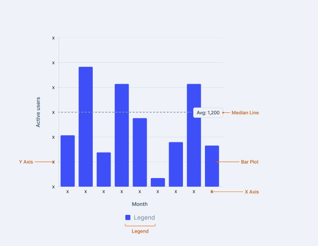
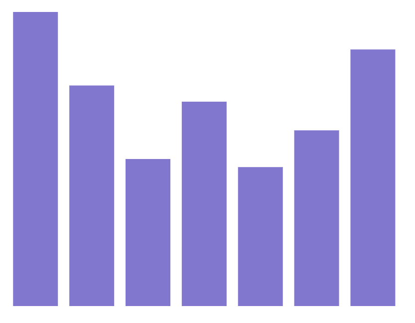
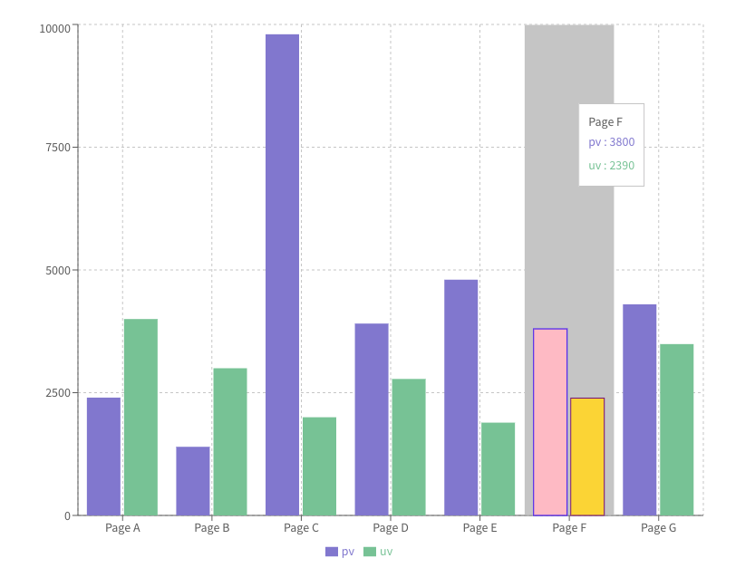
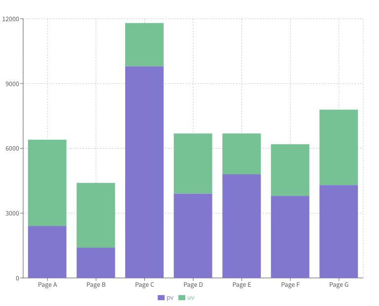
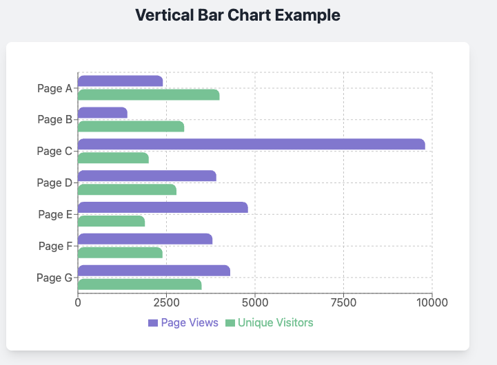

# Bar Chart API \[1st Draft\]

Author(s): [Gaurav Tewari](mailto:gaurav.tewari@razorpay.com)  
Team/Pod: Blade  
BU: Platform  
Published Date: Aug 7, 2025  
  

1. [Design Breakdown](#1-design-breakdown)
2. [Requirements to Handle](#2-requirements-to-handle)
3. [API Specifications](#3-api-specifications)
4. [Alternative APIs](#4-alternative-apis-)
5. [Open Questions](#5-open-questions)


#  1\. Design Breakdown
  

   [Design Link](https://www.figma.com/design/jubmQL9Z8V7881ayUD95ps/Blade-DSL?node-id=92678-188719&p=f&m=dev) 


   

#  2\. Requirements to Handle

[Data Viz Phase \-1 \- Requirements](https://docs.google.com/document/d/1u7zkzpsQwwYsdtjSDlPgalArT7XkzAC400KqNI7Ibus/edit?tab=t.l3y0g5difjs4)

1. ### [TinyBarChart](https://recharts.org/en-US/examples/TinyBarChart)

   
   Simple bar graph with responsive container and BarChart.  
2. [SimpleBarChart](https://recharts.org/en-US/examples/SimpleBarChart)

   
   Bar Chart with other chart components. Need to discuss ActiveBar here..  With [Rama Krushna Behera](mailto:rama.behera@razorpay.com) . should users be able to change it or not. 

3. [StackedBarChart](https://recharts.org/en-US/examples/StackedBarChart)  
   
   It would be simple. Just need to use `stackId`  
     
     
     
     
     
     
     
     
     
4. [Vertical Bar Chart](https://ui.shadcn.com/charts/bar#charts)  
   
   We just need to use layout=”vertical” prop  
5. [NegativeBarChart](https://ui.shadcn.com/charts/bar#charts)  
   We just need to pass \-ve values recharts will handle it for us.   
6. [CustomLabelBarChart](https://ui.shadcn.com/charts/bar#charts)  
   We need to use labelList. But we need to style it.


## 3\. API Specifications

### 3.1 Composition API (Re-exporting Styled Components)

This approach follows the precedent set by the Line Chart API. We will re-export styled versions of the underlying `recharts` components. 


**Colors** : In case of Bar Charts We would be handling both Categorical and Sequencial color . Also their will be a limit on Sequencial Colors. 
For that best would to have an internal check how many colors are already used. 

**Note:**  BarChart have this `margin` prop which allows user to set margin from  ResponsiveContainer. We won't we exposing that. we would have predefined values. 


#### **Component Interfaces**

```ts
// The interface for the main <Bar /> component.
interface Bar {
  dataKey: string;
  name?: string; // Name to display in the legend
  color?: BladeColorToken; // Will map to `fill` prop
  stackId?: string; // Used to group bars into a stack
  activeBar?: React.ReactElement | boolean; // Custom component or boolean for active state
  label?: React.ReactElement | boolean; // Custom component or boolean for labels
}

// Note: Interfaces for other components like XAxis, YAxis, Tooltip, etc.,
// will be the underlying Recharts prop types, as we are primarily
// applying styles and not changing their core functionality.
// We will enforce Blade's theme for properties like stroke, fill, etc.
```

#### **Usage Examples**

```tsx
import {
  BarChart,
  Bar,
  CartesianGrid,
  XAxis,
  YAxis,
  Tooltip,
  Legend,
  ResponsiveContainer,
  LabelList,
} from '@razorpay/blade/charts';

// 1. Simple Bar Chart
<ResponsiveContainer width="100%" height={300}>
  <BarChart data={chartData}>
    <CartesianGrid vertical={false} />
    <XAxis dataKey="name" />
    <YAxis />
    <Tooltip />
    <Legend />
    <Bar dataKey="seriesA" name="Series A" color="surface.action.primary.default" />
    <Bar dataKey="seriesB" name="Series B" color="surface.action.secondary.default" />
  </BarChart>
</ResponsiveContainer>

// 2. Stacked Bar Chart
<ResponsiveContainer width="100%" height={300}>
  <BarChart data={chartData}>
    <CartesianGrid vertical={false} />
    <XAxis dataKey="name" />
    <YAxis />
    <Tooltip />
    <Legend />
    {/* Both bars share the same stackId */}
    <Bar dataKey="seriesA" stackId="a" name="Series A" color="surface.action.primary.default" />
    <Bar dataKey="seriesB" stackId="a" name="Series B" color="surface.action.secondary.default" />
  </BarChart>
</ResponsiveContainer>

// 3.  Bar Chart with different Layout.
<ResponsiveContainer width="100%" height={300}>
  {/* The key is layout="vertical" */}
  <BarChart data={chartData} layout="vertical" margin={{ left: 30 }}>
    <CartesianGrid horizontal={false} />
    {/* Axes are swapped: XAxis is numeric, YAxis is categorical */}
    <XAxis type="number" />
    <YAxis dataKey="name" type="category" />
    <Tooltip />
    <Legend />
    <Bar dataKey="seriesA" name="Series A" color="surface.action.primary.default" />
  </BarChart>
</ResponsiveContainer>

// 4. Custom Label Bar Chart (note: high chance we might not need this.)
<ResponsiveContainer width="100%" height={300}>
    <BarChart data={chartData}>
        <XAxis dataKey="name" />
        <YAxis />
        <Bar dataKey="seriesA" name="Series A" color="surface.action.primary.default">
            {/* Blade will provide a styled LabelList component */}
            <LabelList dataKey="seriesA" position="top" />
        </Bar>
    </BarChart>
</ResponsiveContainer>
```

  * **Pros**
      * **Maximum Flexibility:** Developers can compose charts exactly as needed, adding or removing components like `Legend` or `CartesianGrid` freely.
      * **Familiar API:** Follows the well-documented `recharts` pattern, reducing the learning curve for those familiar with the library.
      * **Extensible:** Easy to incorporate new `recharts` features or build new chart abstractions in the future.
      * **Type-Safe:** Provides strong TypeScript support and autocompletion.
  * **Cons**
      * **Verbose:** Simple charts can require a significant amount of boilerplate code.
      * **Higher Learning Curve:** Developers unfamiliar with `recharts` will need to learn its compositional concepts.

-----

## 4\. Alternative APIs

### 4.1 Hybrid API (Prop & Config Driven)

This approach uses a single `<BarChart />` component, controlling its features via a mix of direct props and configuration objects.

```tsx
import { BarChart } from '@razorpay/blade/charts';

const chartData = [
  { month: 'Jan', desktop: 400, mobile: 240 },
  { month: 'Feb', desktop: 300, mobile: 139 },
  // ... more data
];

const barConfig = [
  {
    dataKey: 'desktop',
    name: 'Desktop Users',
    color: 'theme.charts.blue',
  },
  {
    dataKey: 'mobile',
    name: 'Mobile Users',
    color: 'theme.charts.green',
    // stackId can be added here for stacked charts
    // stackId: 'users'
  },
];

<BarChart
  data={chartData}
  barConfig={barConfig}
  xAxisDataKey="month"
  yAxisLabel="Active Users"
  layout="vertical" // 'vertical' or 'horizontal'
  stacked={false} // A boolean prop to control stacking
  showLegend={true}
  showTooltip={true}
  showGrid={true}
/>
```

#### **TypeScript Interface**

```ts
interface BarDefinition {
  dataKey: string;
  name: string;
  color: BladeColorToken;
  stackId?: string;
}

interface CustomBarChartProps {
  data: Record<string, any>[];
  barConfig: BarDefinition[];
  xAxisDataKey: string;
  layout?: 'vertical' | 'horizontal';
  stacked?: boolean;
  yAxisLabel?: string;
  xAxisLabel?: string;
  showGrid?: boolean;
  showTooltip?: boolean;
  showLegend?: boolean;
  // ... other high-level props
}
```

  * **Pros**
      * Simpler to use for standard chart types.
      * Configuration is centralized at the top-level component.
      * Less boilerplate required.
  * **Cons**
      * Less flexible; difficult to handle edge cases without adding more props.
      * The props list can become very long and complex.
      * Abstracts away the underlying `recharts` API, which could be limiting.

### 4.2 Config-Driven API

This approach consolidates all chart settings into a single `config` object passed to the component.

```tsx
const chartConfig = {
  data: chartData,
  layout: 'vertical', // 'vertical' | 'horizontal'
  xAxis: {
    dataKey: 'month',
    label: 'Month',
  },
  yAxis: {
    label: 'Active Users',
  },
  bars: [
    { dataKey: 'desktop', name: 'Desktop Users', color: 'theme.charts.blue' },
    { dataKey: 'mobile', name: 'Mobile Users', color: 'theme.charts.green' },
  ],
  options: {
    stacked: false,
    showGrid: true,
    showTooltip: true,
    showLegend: true,
  },
};

<BarChart config={chartConfig} />;
```

  * **Pros**
      * Extremely clean and declarative component usage.
      * The `config` object is portable and can be easily stored or generated.
  * **Cons**
      * Least flexible approach; all functionality must be explicitly supported in the config structure.
      * Can be difficult to discover options without excellent documentation and TypeScript support.
      * Passing custom React components (like for tooltips or labels) can feel unnatural within a JSON-like config object.

-----

## 5\. Open Questions

-  **Label Customization:** How much control should users have over the `LabelList` component? Should we provide pre-styled variants (e.g., `position="top"`, `position="center"`) or allow developers to pass in their own custom label components? (We migh not be doing Label in v1).
