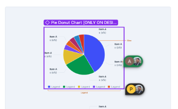
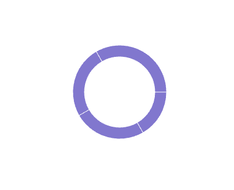
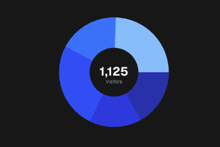

# Donut Chart API 

Author(s): [Gaurav Tewari](mailto:gaurav.tewari@razorpay.com)  
Team/Pod: Blade  
BU: Platform  
Published Date: Aug 7, 2025  
  


1. [Design Breakdown](#1-design-breakdown)
2. [Requirements to Handle](#2-requirements-to-handle)
3. [API Specifications](#3-api-specifications)
4. [Alternative APIs](#4-alternative-apis-)
5. [Open Questions](#5-open-questions)


1. # Design Breakdown [Will update with new design]

   [Design Link](https://www.figma.com/design/jubmQL9Z8V7881ayUD95ps/Blade-DSL?node-id=92678-188718&p=f&m=dev) 

   

   

   

## 2. Requirements to Handle

[Data Viz Phase \-1 \- Requirements](https://docs.google.com/document/d/1u7zkzpsQwwYsdtjSDlPgalArT7XkzAC400KqNI7Ibus/edit?tab=t.l3y0g5difjs4)


> **Note:** In design doc you can see we have Pie chart, but during initial discussion with design we have decided to have Donut chart only.


* [CustomActiveShapeDonutChart](https://recharts.org/en-US/examples/CustomActiveShapePieChart)  
     
  We will provide custom active shapes for donut charts  

* [DonutWithText](https://ui.shadcn.com/charts/pie#charts)

      


      Need to display Text in the center of the donut chart. We should have a standard style of this. 


## 3. API Specifications

### 3.1.0 Composition API (Re-exporting Styled Components)

This approach involves re-exporting styled versions of the underlying `recharts` components, giving developers full compositional control over the chart's structure and appearance. This is our recommended approach for maximum flexibility.

#### Pie Props

| Prop | Type | Required | Default | Description |
|------|------|----------|---------|-------------|
| `dataKey` | `string` | ✅ | - | The key used to identify the data value for each slice |
| `nameKey` | `string` | ✅ | - | The key used to identify the name/label for each slice |
| `data` | `{ [key: string]: string \| number }[]` | ✅ | - | Array of data objects containing the pie chart data |
| `cx` | `string \| number` | ✅ | - | The x-coordinate of the center of the pie chart |
| `cy` | `string \| number` | ✅ | - | The y-coordinate of the center of the pie chart |
| `donutRadius` | `'small' \| 'medium' \| 'large' \| 'extraLarge' \| 'none'` | ❌ | `'none'` | Controls the inner and outer radius values internally to create donut charts |
| `activeShape` | `React.ReactElement \| ((props: any) => React.ReactNode)` | ✅ | - | Custom component or render function for the active (hovered) pie slice |
| `centerText` | `string` | ❌ | - | Text to display in the center of the donut chart |
| `size` | `'small' \| 'medium' \| 'large' \| 'extraLarge'` | ❌ | `'medium'` | Controls the size of the donut chart |

> **Note:** Colors for individual slices are passed via `<Cell />` components. For components like ResponsiveContainer, Legend, Tooltip etc. we would be just styling them and re-exporting them as they don't need much changes.

```ts
import {
  ChartContainer,
  PieChart as RechartsPieChart,
  Pie,
  Cell,
  Tooltip,
  Legend,
  ResponsiveContainer,
} from '@razorpay/blade/charts';


// 1. Donut Chart
<ResponsiveContainer width="100%" height="100%">
  <PieChart>
    <Pie
      data={data}
      dataKey="value"
      nameKey="name"
      cx="50%"
      cy="50%"
      donutRadius="small"
    >
       {/* ... <Cell /> components ... */}
    </Pie>
  </PieChart>
</ResponsiveContainer>

// 2. Donut with Text in Center
// This pattern can be achieved by adding a custom <text> element.
<ResponsiveContainer width="100%" height={300}>
  <PieChart>
    <Pie
      data={data}
      dataKey="value"
      donutRadius="large"
      paddingAngle="small"
      centerText="₹1.05L"
    >
       {/* ... <Cell /> components ... */}
    </Pie>
  </PieChart>
</ResponsiveContainer>
```

  * **Pros**
      * Familiar developer experience with direct mapping to recharts API.
      * Strong TypeScript support with excellent autocompletion.
      * Extensible and future-proof - easy to add new features or chart types.
  * **Cons**
      * Steeper learning curve for developers new to `recharts`.
      * Verbose usage requiring multiple component imports for simple charts.
-----

## 4. Alternative APIs

### 4.1 Hybrid API (Prop & Config Driven)

This approach combines component props for high-level control with configuration objects for detailed specifications.

```ts
import { PieChart } from '@razorpay/blade/charts';

const chartData = [
  { category: 'Electronics', amount: 45000 },
  { category: 'Apparel', amount: 28000 },
  { category: 'Groceries', amount: 32000 },
];

const seriesConfig = [
  {
    dataKey: 'amount',
    nameKey: 'category',
    innerRadius: '60%',
    outerRadius: '80%',
  },
];

<PieChart
  data={chartData}
  seriesConfig={seriesConfig}
  showLegend={true}
  showTooltip={true}
  chartType="donut" // 'pie' | 'donut' (in future if we want to support donut chart)
  centerText="₹1.05L" // Text to display in the center of a donut
  customToolTip={<CustomTooltip />}
/>
```

#### TypeScript Interface

```ts
interface ChartData {
  [key: string]: any;
}

interface SeriesDefinition {
  dataKey: string;
  nameKey: string;
  innerRadius?: string | number;
  outerRadius?: string | number;
  // Colors could be defined here or assigned automatically
  colors?: string[];
}

interface CustomPieChartProps {
  data: ChartData[];
  seriesConfig: SeriesDefinition[];
  showTooltip?: boolean;
  showLegend?: boolean;
  chartType?: 'pie' | 'donut';
  centerText?: string;
  customToolTip?: React.ReactNode;
}
```

  * **Pros**
      * All configuration options are available at the component level.
      * Strong TypeScript autocompletion for all props.
      * Easy to understand what each prop does.
  * **Cons**
      * Can become verbose with many configuration options.
      * Less flexible for complex compositions like multi-series charts.

### 4.2 Config-Driven API

This approach consolidates all chart settings into a single `config` object.

```ts
const chartConfig = {
  data: chartData,
  series: [
    {
      dataKey: 'amount',
      nameKey: 'category',
      type: 'donut', // 'pie' or 'donut'
      innerRadius: '60%',
      outerRadius: '80%',
    },
  ],
  options: {
    showTooltip: true,
    showLegend: true,
    centerText: 'Total: ₹1.05L'
  },
};

<PieChart config={chartConfig} />;
```

  * **Pros**
      * Provides a single source of truth for chart configuration.
      * Easy to serialize/deserialize for storage or dynamic generation.
      * Keeps the JSX clean with minimal props.
  * **Cons**
      * Less discoverable API; developers must inspect the config object.
      * Nested objects can become complex.
      * Passing custom React components (like a tooltip) is more difficult.
      * TypeScript autocompletion is less effective within a deeply nested object.

-----

## 5. Open Questions


### 5.1. Active Shape & Customized Label

The design for the default "active" (hovered) donut slice and the standard customized label needs to be finalized. 

