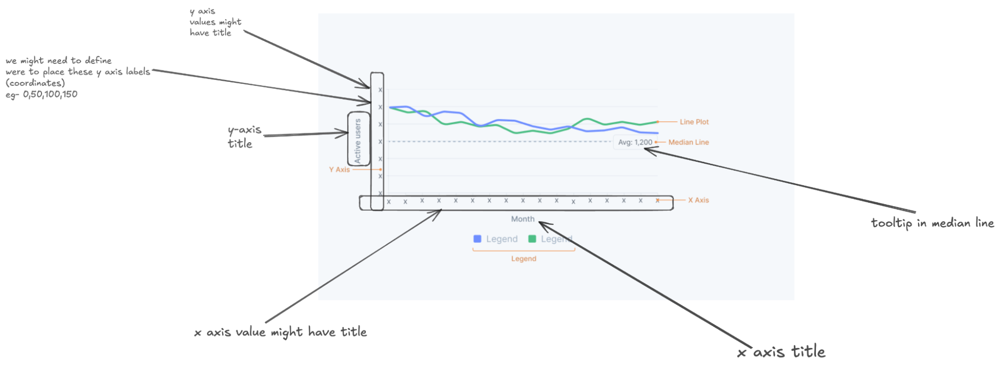
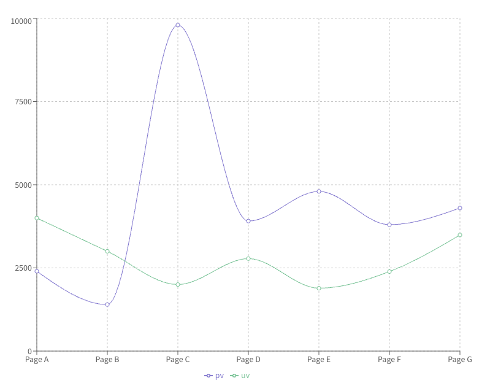
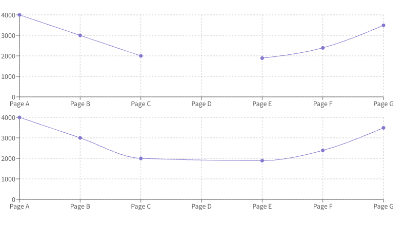
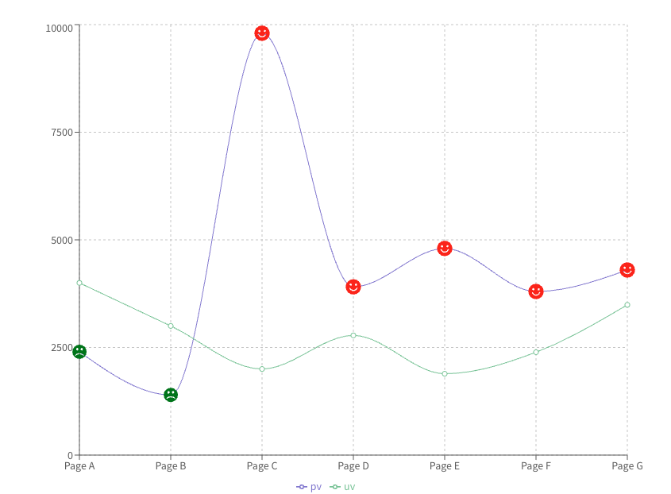
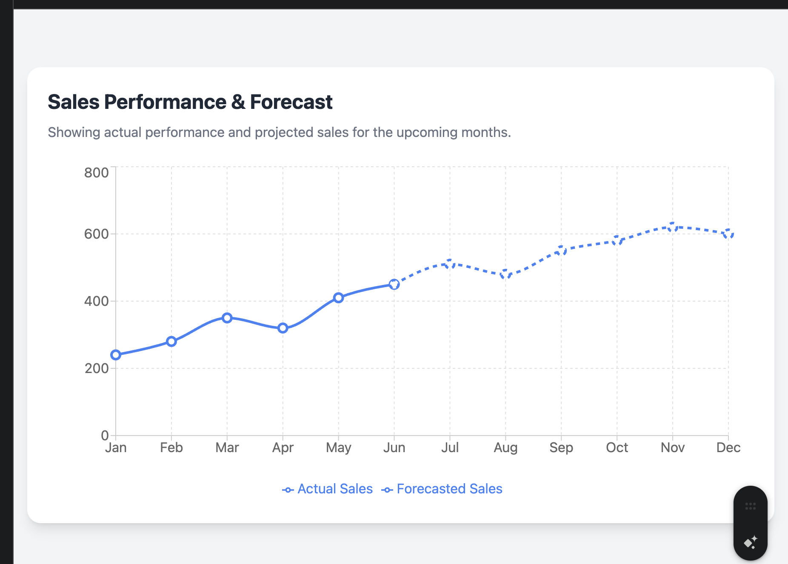
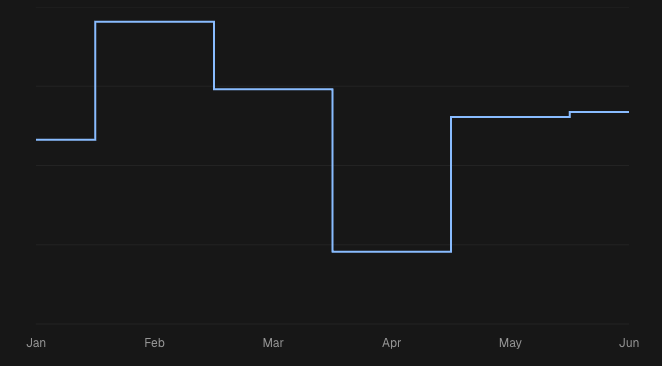

# Line Chart API

**Author(s):** [Gaurav Tewari](mailto:gaurav.tewari@razorpay.com)  
**Team/Pod:** Blade  
**BU:** Platform  
**Published Date:** Aug 7, 2025

-----

### Table of Contents

1. [Design Breakdown](#1-design-breakdown)
2. [Requirements to Handle](#2-requirements-to-handle)
3. [API Specifications](#3-api-specifications)
4. [Alternative APIs](#4-alternative-apis-)
5. [Open Questions](#5-open-questions)

-----

## 1\. Design Breakdown

  * **[Figma Design Link](https://www.figma.com/design/jubmQL9Z8V7881ayUD95ps/Blade-DSL?node-id=92678-188716&p=f&m=dev)**



-----

## 2\. Requirements to Handle

  * **[Data Viz Phase -1 - Requirements Doc](https://docs.google.com/document/d/1u7zkzpsQwwYsdtjSDlPgalArT7XkzAC400KqNI7Ibus/edit?tab=t.l3y0g5difjs4)**

<!-- end list -->

1.  **[Basic Line Chart](https://recharts.org/en-US/examples/SimpleLineChart)** A standard line chart with a grid, X-axis, Y-axis, Tooltip, Legend, and line.




2.  **[Tiny Line Chart](https://recharts.org/en-US/examples/TinyLineChart)** A minimal line chart with only the line, with no grid or axes.


3.  **[Line Chart that Connects Nulls](https://recharts.org/en-US/examples/LineChartConnectNulls)** The chart should be able to handle `null` data points by connecting the line over the gap. This is supported in Recharts via the `connectNulls` prop.




4.  **[Custom Dot Charts](https://recharts.org/en-US/examples/CustomizedDotLineChart)** We will support a limited set of options for customizing the dots on the line chart. Recharts allows passing a `Dot` component as a prop.




5.  **Forecast Line Chart** This requires showing a portion of the line as a dotted or dashed line to represent forecasted data. This can be implemented by rendering two separate lines and hiding the forecast line from the legend. The API design needs to consider how to accept forecast data.




6.  **[Stepped Line Chart](https://ui.shadcn.com/charts/line#charts)** The chart should support different interpolation types, like 'step'. This can be controlled via a `lineType` prop, which maps to the Recharts `type` prop on the `<Line />` component. We will likely support a limited number of line types initially.




-----

## 3\. API Specifications


3.1.0 Composition API (Re-exporting Styled Components)

This approach involves re-exporting styled versions of the underlying `recharts` components, giving developers full compositional control.


```ts

interface Line {
  type?: 'step' | 'stepAfter' | 'stepBefore' | 'linear' | 'monotone';
  // Will show default dot on line 
  dot?: React.ReactNode;
  activeDot?: React.ReactNode; 
  connectNulls?: boolean;
  legendType?: 'none' | 'line' | 'square' | 'diamond' | 'circle' | 'cross' | 'triangle' | 'triangleDown' | 'triangleUp' | 'star' | 'wye' | 'none';
  dataKey: string;
  name: string;
  color?: BladeColorToken;
  strokeStyle?: 'dotted' | 'dashed';
}

interface ReferenceLine {
    y?: number;
    label: string;
    color?: BladeColorToken;
}


// for components like ResponsiveContainer, Legend, CartesianGrid, XAxis, YAxis etc. we would be just styling them and re-exporting them . they don't need much changes.  
// since in case of  CartesianGrid, XAxis, YAxis ... you won't be able to change the color of the grid, x-axis, y-axis. 


```
**Note:** LineChart have this `margin` prop which allows user to set margin from  ResponsiveContainer. We won't we exposing that. we would have predefined values. 


```ts
import {
  ChartContainer,
  LineChart as RechartsLineChart,
  CartesianGrid,
  XAxis,
  YAxis,
  Tooltip,
  Legend,
  Line,
  ReferenceLine,
  ResponsiveContainer,
} from '@razorpay/blade/charts';


// Simple Line Chart 
  <ResponsiveContainer width="100%" height="100%">
  // Line 
    <LineChat data={chartData}>
       <CartesianGrid />
       <XAxis dataKey="month" />
       <YAxis />
       <Tooltip content={<CustomTooltip />} />
       <Legend />
       <Line
         dataKey="teamA"
         name="Team A"
         type="solid"
       />
       <Line
         dataKey="teamB"
         name="Team B"
         type="solid"
       />
       <ReferenceLine y={2200} label="Minimum" color="theme.charts.grey" />
    </LineChart>
  </ResponsiveContainer>

// Tiny Line Chart 
  <ResponsiveContainer width="100%" height="100%">
     <LineChart data={chartData}>
       <Line
         dataKey="teamA"
         type="solid"
         color="theme.charts.grey"
       />
     </LineChart>
   </ResponsiveContainer>

 // ForeCast line chart 
  <ResponsiveContainer width="100%" height="100%">
      <LineChart data={forecastData}>
          <CartesianGrid/>
            <XAxis dataKey="date" />
              <YAxis />
              // This would be a custom tooltip from blade
              <ChartToolTip />
              <Legend />
              <Line
                dataKey="historical"
                name="Historical Data"
                connectNulls={true}
              />
              <Line
                dataKey="forecast"
                name="Forecast"
                type="solid"
                connectNulls={true}
                legendType="none"
              />
      </LineChart>
    </ResponsiveContainer>
```


We will allow users to modify active dot, not custom 

```ts
<Line type="monotone" dataKey="pv" activeDot={<BladeChartDots />} />
```


  * **Pros**
      * Maximum flexibility and control over chart composition and behavior.
      * Familiar developer experience with direct mapping to recharts API.
      * Strong TypeScript support with excellent autocompletion.
      * Extensible and future-proof - easy to add new chart types.
      * Composable and reusable components for building higher-level abstractions.
  * **Cons**
      * Steeper learning curve for developers new to recharts.
      * Verbose usage requiring multiple component imports for simple charts.
      * Documentation and guidelines overhead to ensure proper usage.
      * Potential for misuse bypassing Blade theming standards.


## 4. Alternative APIs - 

### 4.1 Hybrid API (Prop & Config Driven)

This approach combines component props for high-level control with configuration objects for detailed specifications.

```ts
// Import statement
import { LineChart } from '@razorpay/blade/charts';

const chartData = [
  { month: 'Jan', teamA: 2450, teamB: 2600 },
  { month: 'Feb', teamA: 2300, teamB: 2500 },
  { month: 'Mar', teamA: 2300, teamB: 2700 },
  { month: 'Apr', teamA: 2300, teamB: 3000 },
  { month: 'Jun', teamA: 2300, teamB: 3300 },
  { month: 'Jul', teamA: 2300, teamB: 3400,  forecast: true },
  { month: 'Aug', teamA: 2300, teamB: 3500, forecast: true },
  { month: 'Sep', teamA: 2300, teamB: 3500, forecast: true },
  { month: 'Oct', teamA: 2300, teamB: { data: 3600, foreCastData: true } },
  // more data...
];

const lineConfig = [
  {
    dataKey: 'teamA',
    name: 'Team A Users', // name in legend
    color: 'theme.charts.dummy.red',
  },
  {
    dataKey: 'teamB',
    name: 'Team B Users',
    color: 'theme.charts.dummy.blue',
  },
];

const referenceLineDefinitions = [
  { y: 2200, label: 'Avg: 2,200' }
];

const yAxisConfig = [
  { value: 0, label: '0' },
  { value: 500, label: '500' },
  // more data
];


//This is just an example of custom tooltip. we might change it later. according to design.
const CustomToolTip = ({ active, payload, label }) => {
  // We can handle isVisible logic internally as well.
  const isVisible = active && payload && payload.length;
  if (!isVisible) return null;

  return (
    <Box>
      <Text>{`${label} : ${payload[0].value}`}</Text>
      <Text>{getIntroOfPage(label)}</Text>
      <Text>Anything you want can be displayed here.</Text>
    </Box>
  );
};

<LineChart
  data={chartData}
  lineConfig={lineConfig}
  xAxisDataKey="month"
  yAxisConfig={yAxisConfig}
  yAxisLabel="Active users" // Controls the axis title
  xAxisLabel="Month" // Controls the axis title
  referenceLineDefinitions={referenceLineDefinitions}
  showLegend={true}
  showTooltip={true}
  lineType="linear"
  tinyLineChart={false}
  customToolTip={CustomToolTip}
  connectNulls={true}
  dotType="circle" // TBD with design team
/>
```

#### TypeScript Interface

```ts
// ============================================================================
// TypeScript Interfaces for the CustomLineChart Component
// ============================================================================

/**
 * Defines the possible styles for the line in the chart.
 */
type LineType = 'monotone' | 'linear' | 'step' | 'stepBefore' | 'stepAfter';

/**
 * Defines the shape for a single data point in the chart's data array.
 * Uses a generic index signature to allow for flexible data keys.
 */
interface ChartData {
  [key: string]: any;
}

/**
 * Configuration for a single line on the chart.
 */
interface LineDefinition {
  dataKey: string;
  name: string;
  stroke: string;
  type?: LineType;
}

/**
 * Configuration for a single reference line.
 */
interface ReferenceLineDefinition {
  y: number;
  label: string;
  stroke: string;
}

/**
 * Configuration for a single item in the Y-axis tick array.
 */
interface YAxisConfigItem {
  value: number;
  label: string;
}

/**
 * The main interface for all props accepted by the LineChart component.
 */
interface CustomLineChartProps {
  data: ChartData[];
  lines: LineDefinition[];
  xAxisDataKey: string;
  yAxisLabel?: string;
  xAxisLabel?: string;
  yAxisConfig?: YAxisConfigItem[];
  referenceLines?: ReferenceLineDefinition[];
  showGrid?: boolean;
  showTooltip?: boolean;
  showLegend?: boolean;
  tinyLineChart?: boolean;
  customToolTip?: React.ReactNode;
  connectNulls?: boolean;
  dotType?: 'circle' | 'square' | 'star' | 'line';
}
```

  * **Pros**
      * All configuration options are available at the component level.
      * Strong TypeScript autocompletion for all props.
      * Easy to understand what each prop does.
      * Custom components (like tooltips) are easily passed as props.
  * **Cons**
      * Can become verbose with many configuration options.
      * The props list can get long for complex charts.

### 4.2 Config-Driven API

This approach consolidates all chart settings into a single `config` object.

```ts
const chartConfig = {
  data: chartData,
  xAxis: {
    dataKey: 'month',
    label: 'Month',
  },
  yAxis: {
    label: 'Active users',
    config: [
      { value: 0, label: '0' },
      { value: 1000, label: '1K' },
    ],
  },
  lines: [
    { dataKey: 'teamA', name: 'Team A Users', type: 'monotone' },
    { dataKey: 'teamB', name: 'Team B Users', type: 'linear' },
  ],
  referenceLines: [{ y: 2200, label: 'Target: 2,200' }],
  options: {
    showGrid: true,
    showTooltip: true,
    showLegend: true,
    tinyChart: false,
    connectNulls: false,
    dotType: 'circle',
  },
};

<LineChart config={chartConfig} />;
```

  * **Pros**
      * Provides a single source of truth for chart configuration.
      * Easy to serialize/deserialize for storage or dynamic generation.
      * Keeps the JSX clean with minimal props.
  * **Cons**
      * Less discoverable API; developers need to inspect the config object to know what options are available.
      * Nested objects can become complex and hard to manage.
      * Passing custom React components (like a tooltip) is more difficult.
      * TypeScript autocompletion is less effective within a deeply nested object.


-----

## 5\. Open Questions

- Color Handling

We will not support sequential colors for line charts. A limited, curated palette of theme colors will be available. A `color` prop will be available in the line configuration. If it is not provided, we will automatically assign a color from the predefined palette. [Rama Krushna Behera](mailto:rama.behera@razorpay.com) will confirm the final color palette.

-  ToolTip 

We might need to make custom tooltip. Like ChartsToolTip. Since the tooltip would be different then our blade's tooltip. We are awaiting Designs on this. 

- BladeChartDots 

Awaiting Designs on this. 

