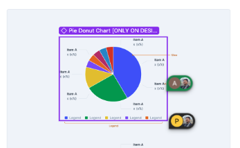
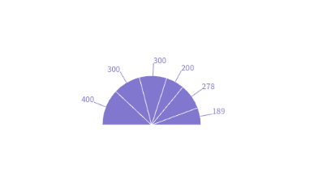
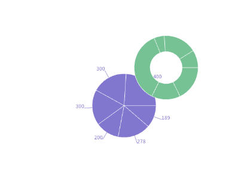
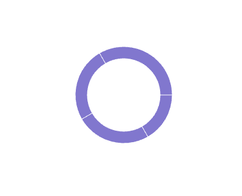
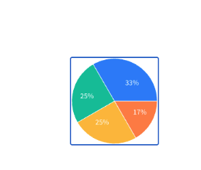

# Pie Chart API 

Author(s): [Gaurav Tewari](mailto:gaurav.tewari@razorpay.com)  
Team/Pod: Blade  
BU: Platform  
Published Date: Aug 4, 2025  
  


1. [Design Breakdown](#1-design-breakdown)
2. [Requirements to Handle](#2-requirements-to-handle)
3. [API Specifications](#3-api-specifications)
4. [Alternative APIs](#4-alternative-apis-)
5. [Open Questions](#5-open-questions)


1. # Design Breakdown

   [Design Link](https://www.figma.com/design/jubmQL9Z8V7881ayUD95ps/Blade-DSL?node-id=92678-188718&p=f&m=dev) 

   

   

   

#  2\. Requirements to Handle

[Data Viz Phase \-1 \- Requirements](https://docs.google.com/document/d/1u7zkzpsQwwYsdtjSDlPgalArT7XkzAC400KqNI7Ibus/edit?tab=t.l3y0g5difjs4)

* ### [StraightAngleChart](https://recharts.org/en-US/examples/StraightAnglePieChart)

     

  We just need pie and other grid and x axis components.   
* [TwoSimplePieChart](https://recharts.org/en-US/examples/TwoSimplePieChart)  
     

  Already supported in Recharts api  
* [CustomActiveShapePieChart](https://recharts.org/en-US/examples/CustomActiveShapePieChart)  
     
  It has a very custom shape. There is a high chance we would be providing this in blade.  Will confirm with [Rama Krushna Behera](mailto:rama.behera@razorpay.com)  
* [PieChartWithCustomizedLabel](https://recharts.org/en-US/examples/PieChartWithCustomizedLabel)  
    
  Same with might have a unified label here. In Blade. Will confirm with [Rama Krushna Behera](mailto:rama.behera@razorpay.com)  
* [DonutWithText](https://ui.shadcn.com/charts/pie#charts)

      


      Need to display Text in the center of the donut chart. We should have a standard style of this. 


## 3\. API Specifications

### 3.1.0 Composition API (Re-exporting Styled Components)

This approach involves re-exporting styled versions of the underlying `recharts` components, giving developers full compositional control over the chart's structure and appearance. This is our recommended approach for maximum flexibility.

```ts
// Interface for Pie props
interface Pie {
  dataKey: string;
  nameKey: string;
  data: { [key: string]: string | number }[];
  cx: string | number;
  cy: string | number;
  // it is used to control inner and outer radius values internally. 
  donutRadius: 'small' | 'medium' | 'large' |'extraLarge' | 'none' ;
  // it is used to control start and end angle
  circleType: 'full' | 'half' | 'quater';
  paddingAngle: 'none' | 'small' | 'medium' | 'large' | 'extraLarge';
  // We would provide an active shape
   activeShape: React.ReactElement | ((props: any) => React.ReactNode);
  // Colors for individual slices are passed via <Cell /> components
}

// for components like ResponsiveContainer, Legend, Tooltip etc. we would be just styling them and re-exporting them . they don't need much changes.
```

```ts
import {
  ChartContainer,
  PieChart as RechartsPieChart,
  Pie,
  Cell,
  Tooltip,
  Legend,
  ResponsiveContainer,
} from '@razorpay/blade/charts';


// 1. Simple Pie Chart
const data = [
  { name: 'Group A', value: 400 },
  { name: 'Group B', value: 300 },
  { name: 'Group C', value: 300 },
  { name: 'Group D', value: 200 },
];
const COLORS = ['token.chart.primary', 'token.chart.secondary', 'token.chart.tertiary', 'token.chart.quaternary'];

<ResponsiveContainer width="100%" height="100%">
  <PieChart>
    <Pie
      data={data}
      dataKey="value"
      nameKey="name"
      cx="50%"
      cy="50%"
      circleType="half"
      label
    >
      {data.map((entry, index) => (
        <Cell key={`cell-${index}`} fill={COLORS[index % COLORS.length]} />
      ))}
    </Pie>
    <Tooltip content={<CustomTooltip />} />
    <Legend />
  </PieChart>
</ResponsiveContainer>

// 2. Donut Chart
<ResponsiveContainer width="100%" height="100%">
  <PieChart>
    <Pie
      data={data}
      dataKey="value"
      nameKey="name"
      cx="50%"
      cy="50%"
      donutRadius="small"
    >
       {/* ... <Cell /> components ... */}
    </Pie>
  </PieChart>
</ResponsiveContainer>

// 3. Donut with Text in Center
// This pattern can be achieved by adding a custom <text> element.
<ResponsiveContainer width="100%" height={300}>
  <PieChart>
    <Pie
      data={data}
      dataKey="value"
      donutRadius="large"
      paddingAngle="small"
    >
       {/* ... <Cell /> components ... */}
    </Pie>
    {/* Custom Center Text */}
    <text
      x="50%"
      y="50%"
      textAnchor="middle"
      dominantBaseline="central"
      fontSize="24"
      fontWeight="bold"
      color=""
    >
      Total: 900
    </text>
  </PieChart>
</ResponsiveContainer>
// Other way would be to use <Label /> component and pass the text. 
// Something like this:

 <Label
   content={({ viewBox }) => {
     if (viewBox && "cx" in viewBox && "cy" in viewBox) {
       return (
         <text
           x={viewBox.cx}
           y={viewBox.cy}
           textAnchor="middle"
           dominantBaseline="middle"
         >
           <tspan
             x={viewBox.cx}
             y={viewBox.cy}
            
           >
             {totalVisitors.toLocaleString()}
           </tspan>
           <tspan
             x={viewBox.cx}
             y={(viewBox.cy || 0) + 24}
           >
             Visitors
           </tspan>
         </text>
       )
     }
   }}
 />
```

Best would be to have a custom component for the label and pass the text to it. 

  * **Pros**
      * Familiar developer experience with direct mapping to recharts API.
      * Strong TypeScript support with excellent autocompletion.
      * Extensible and future-proof - easy to add new features or chart types.
  * **Cons**
      * Steeper learning curve for developers new to `recharts`.
      * Verbose usage requiring multiple component imports for simple charts.
-----

## 4\. Alternative APIs

### 4.1 Hybrid API (Prop & Config Driven)

This approach combines component props for high-level control with configuration objects for detailed specifications.

```ts
import { PieChart } from '@razorpay/blade/charts';

const chartData = [
  { category: 'Electronics', amount: 45000 },
  { category: 'Apparel', amount: 28000 },
  { category: 'Groceries', amount: 32000 },
];

const seriesConfig = [
  {
    dataKey: 'amount',
    nameKey: 'category',
    innerRadius: '60%',
    outerRadius: '80%',
  },
];

<PieChart
  data={chartData}
  seriesConfig={seriesConfig}
  showLegend={true}
  showTooltip={true}
  chartType="donut" // 'pie' | 'donut'
  centerText="₹1.05L" // Text to display in the center of a donut
  customToolTip={<CustomTooltip />}
/>
```

#### TypeScript Interface

```ts
interface ChartData {
  [key: string]: any;
}

interface SeriesDefinition {
  dataKey: string;
  nameKey: string;
  innerRadius?: string | number;
  outerRadius?: string | number;
  // Colors could be defined here or assigned automatically
  colors?: string[];
}

interface CustomPieChartProps {
  data: ChartData[];
  seriesConfig: SeriesDefinition[];
  showTooltip?: boolean;
  showLegend?: boolean;
  chartType?: 'pie' | 'donut';
  centerText?: string;
  customToolTip?: React.ReactNode;
}
```

  * **Pros**
      * All configuration options are available at the component level.
      * Strong TypeScript autocompletion for all props.
      * Easy to understand what each prop does.
  * **Cons**
      * Can become verbose with many configuration options.
      * Less flexible for complex compositions like multi-series charts.

### 4.2 Config-Driven API

This approach consolidates all chart settings into a single `config` object.

```ts
const chartConfig = {
  data: chartData,
  series: [
    {
      dataKey: 'amount',
      nameKey: 'category',
      type: 'donut', // 'pie' or 'donut'
      innerRadius: '60%',
      outerRadius: '80%',
    },
  ],
  options: {
    showTooltip: true,
    showLegend: true,
    centerText: 'Total: ₹1.05L'
  },
};

<PieChart config={chartConfig} />;
```

  * **Pros**
      * Provides a single source of truth for chart configuration.
      * Easy to serialize/deserialize for storage or dynamic generation.
      * Keeps the JSX clean with minimal props.
  * **Cons**
      * Less discoverable API; developers must inspect the config object.
      * Nested objects can become complex.
      * Passing custom React components (like a tooltip) is more difficult.
      * TypeScript autocompletion is less effective within a deeply nested object.

-----

## 5\. Open Questions


### 5.1. Active Shape & Customized Label

The design for the default "active" (hovered) pie slice and the standard customized label needs to be finalized. Will Blade provide a default `ActiveShape` or `CustomLabel` component that developers can use or override? This needs confirmation from [Rama Krushna Behera](mailto:rama.behera@razorpay.com).

### 5.2. Donut Chart Center Content

For Donut charts, displaying text or a value in the center is a common requirement. We need to decide on the best API for this. Should we provide a dedicated `<DonutCenterLabel>` component. 

- Pie charts might have a size variants. 
