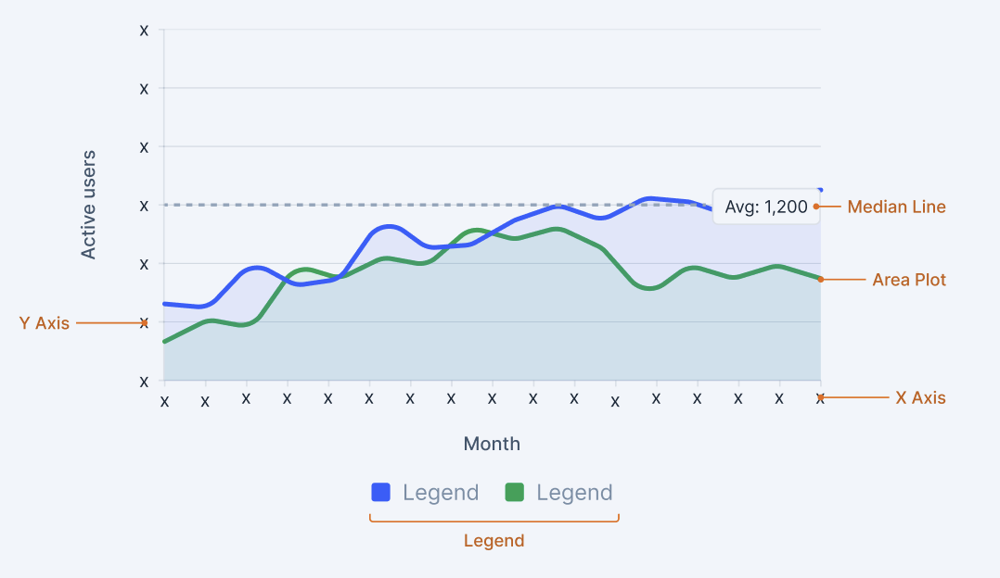

# Charts API

Chart is a container that represent data in a graphical format in a container. 

This document outlines the API of Charts component.


-----


- [Charts](#charts)
  - [Design](#design-1)
  - [Anatomy](#anatomy-1)
  - [API](#api)
    - [`LineChart`](#linechart-1)
    - [`AreaChart`](#areachart-1)
    - [`BarChart`](#barchart-1)
    - [`PieChart`](#piechart-1)
  - [Open questions](#open-questions-1)

-----

## 1\. Design 

  - Figma Design[ Line](https://www.figma.com/design/jubmQL9Z8V7881ayUD95ps/Blade-DSL?node-id=92678-188716&p=f&m=dev), [Area](https://www.figma.com/design/jubmQL9Z8V7881ayUD95ps/Blade-DSL?node-id=92678-188716&p=f&m=dev), [Bar](https://www.figma.com/design/jubmQL9Z8V7881ayUD95ps/Blade-DSL?node-id=92678-188719&p=f&m=dev), [Donut](https://www.figma.com/design/jubmQL9Z8V7881ayUD95ps/Blade-DSL?node-id=92678-188718&p=f&m=dev)  Charts.

   [More on design and requirements](./requirement.md)
   

## 2\. Anatomy
 
 
 


All charts are built by composing smaller components within a `ChartContainer`. The specific components that are used depend on the type of chart we are creating.

**Components:**
* `ChartContainer` (The main responsive wrapper for all charts)
    * **Chart Type Wrapper** (for `LineChart`, `AreaChart`, `BarChart`, `DonutChart`)
        * **Data Mark Components** (The visual representation of your data)
            * `Line` (For Line Charts)
            * `Area` (For Area Charts)
            * `Bar` (For Bar Charts)
            * `Pie` (For Pie/Donut Charts)
        * **Axis & Grid Components** (For Cartesian charts like Line, Area, and Bar)
            * `XAxis`
            * `YAxis`
            * `CartesianGrid`
            * `ReferenceLine`
        * **Accessory Components** (For context and interactivity, used in most charts)
            * `Tooltip`
 
## API Specifications

### Composition API (Recommended 🥇)

* **Maximum flexibility and control** over chart composition and behavior.
    * Familiar developer experience with direct mapping to `recharts` API.
    * Strong TypeScript support with excellent autocompletion.
    * Extensible and future-proof - easy to add new chart types.
    * Composable and reusable components for building higher-level abstractions.


```tsx
import {
  ChartContainer,
  AreaChart,
  CartesianGrid,
  XAxis,
  YAxis,
  Tooltip,
  Legend,
  Area,
} from '@razorpay/blade/charts';

// A simple stacked Area Chart example
<ChartContainer>
  <AreaChart data={chartData}>
    <CartesianGrid />
    <XAxis dataKey="month" />
    <YAxis />
    <Tooltip />
    <Legend />
    <Area dataKey="teamA" name="Team A" stackId="1" />
    <Area dataKey="teamB" name="Team B" stackId="1" />
  </AreaChart>
</ChartContainer>

```

### Alternative API Structures
<details>
<summary>View Alternative (Not Recommended) APIs</summary>


#### Hybrid API (Prop & Config Driven)
This approach combines component props for high-level control with configuration objects for detailed specifications.


#### Example - 


```ts
// Import statement
import { AreaChart } from '@razorpay/blade/charts';
const areaConfig = [
  {
    dataKey: 'teamA',
    name: 'Team A Users', // name in legend
    color: 'theme.charts.dummy.red',
  },
  {
    dataKey: 'teamB',
    name: 'Team B Users',
    color: 'theme.charts.dummy.blue',
  },
];

const referenceLineDefinitions = [
  { y: 2200, label: 'Avg: 2,200' }
];

const yAxisConfig = [
  { value: 0, label: '0' },
  { value: 500, label: '500' },
  // more data
];

<AreaChart
  data={chartData}
  areaConfig={areaConfig}
  xAxisDataKey="month"
  yAxisConfig={yAxisConfig}
  yAxisLabel="Active users" // Controls the axis title
  xAxisLabel="Month" // Controls the axis title
  referenceLineDefinitions={referenceLineDefinitions}
  showLegend={true}
  showTooltip={true}
  connectNulls={true}
  isStacked={true}
  tinyAreaChart={false}
/>
```


  * **Pros**
      * All configuration options are available at the component level.
      * Strong TypeScript autocompletion for all props.
      * Easy to understand what each prop does.
      * Custom components (like tooltips) are easily passed as props.
  * **Cons**
      * Can become verbose with many configuration options.
      * The props list can get long for complex charts.


#### Config-Driven API
This approach consolidates all chart settings into a single config object. It keeps JSX clean but can make the API less discoverable and harder to type-check effectively.


This approach consolidates all chart settings into a single `config` object.


#### For Area Chart -  


```ts
const chartConfig = {
  data: chartData,
  xAxis: {
    dataKey: 'month',
    label: 'Month',
  },
  yAxis: {
    label: 'Active users',
    config: [
      { value: 0, label: '0' },
      { value: 1000, label: '1K' },
    ],
  },
  areas: [
    { dataKey: 'teamA', name: 'Team A Users', stackId: '1' },
    { dataKey: 'teamB', name: 'Team B Users', stackId: '1' },
  ],
  referenceLines: [{ y: 2200, label: 'Target: 2,200' }],
  options: {
    showGrid: true,
    showTooltip: true,
    showLegend: true,
    tinyChart: false,
    connectNulls: false,
    isStacked: true,
  },
};

<AreaChart config={chartConfig} />;
```

  * **Pros**
      * Provides a single source of truth for chart configuration.
      * Easy to serialize/deserialize for storage or dynamic generation.
      * Keeps the JSX clean with minimal props.
  * **Cons**
      * Less discoverable API. Developers need to inspect the config object to know what options are available.
      * Nested objects can become complex and hard to manage.
      * Passing custom React components (like a tooltip) is more difficult.
      * TypeScript autocompletion is less effective within a deeply nested object.

</details>


## Line Chart


[Use Cases](./requirement.md#11-line-chart)


| Prop | Type | Required | Default | Description |
|------|------|----------|---------|-------------|
| `dataKey` | `string` | ✅ | - | The key used to identify the data value for this line in the dataset |
| `name` | `string` | ✅ | - | The display name for the line, shown in legend and tooltips |
| `type` | `'step' \| 'stepAfter' \| 'stepBefore' \| 'linear' \| 'monotone'` | ❌ | `'linear'` | The interpolation type for connecting data points |
| `dot` | `React.ReactNode` | ❌ | `undefined` | Custom component for rendering dots on the line |
| `activeDot` | `React.ReactNode` | ❌ | `undefined` | Custom component for rendering the active (hovered) dot |
| `connectNulls` | `boolean` | ❌ | `false` | Whether to connect the line over null data points |
| `legendType` | `'none' \| 'line' \| 'square' \| 'diamond' \| 'circle' \| 'cross' \| 'triangle' \| 'triangleDown' \| 'triangleUp' \| 'star' \| 'wye'` | ❌ | `'line'` | The symbol type to display in the legend for this line |
| `color` | `BladeColorToken` | ❌ | Auto-assigned | Color token for the line (automatically assigned from palette if not provided) |
| `strokeStyle` | `'solid' \| 'dotted' \| 'dashed'` | ❌ | `'solid'` | Line stroke style for forecast or emphasis |

* Apart from this we would be exposing all the event handlers provided by recharts like `onCopy`, `onCopyCapture`, `onCut`, `onDrag` , `onMouseUp` , `onMouseDown` etc. 

> **LineChart Margin:** The `margin` prop from LineChart will not be exposed to developers. We will use predefined values that align with our design system. 

> **Restrict max Lines :**  We will add a check for max. lines In Chart Container.(design will tell the number of max lines). 
if more than decided number of max lines, we will show an error message. 

> **Color Handling:** Line Charts will not support sequential colors. A limited, curated palette of theme colors will be available. Colors are automatically assigned from the predefined palette if not specified.


Example - 

```ts
import {
  ChartContainer,
  LineChart as RechartsLineChart,
  CartesianGrid,
  XAxis,
  YAxis,
  Tooltip,
  Legend,
  Line,
  ReferenceLine,
  ResponsiveContainer,
} from '@razorpay/blade/charts';


// Simple Line Chart 
  <ResponsiveContainer width="100%" height="100%">
  // Line 
    <LineChart data={chartData}>
       <CartesianGrid />
       <XAxis dataKey="month" />
       <YAxis />
       <Tooltip content={<CustomTooltip />} />
       <Legend />
       <Line
         dataKey="teamA"
         name="Team A"
         type="solid"
       />
       <Line
         dataKey="teamB"
         name="Team B"
         type="solid"
       />
       <ReferenceLine y={2200} label="Minimum" color="theme.charts.grey" />
    </LineChart>
  </ResponsiveContainer>
```
<details>
<summary>More examples</summary>

```ts 

import {
  ChartContainer,
  LineChart as RechartsLineChart,
  CartesianGrid,
  XAxis,
  YAxis,
  Tooltip,
  Legend,
  Line,
  ReferenceLine,
  ResponsiveContainer,
} from '@razorpay/blade/charts';


// Tiny Line Chart 
  <ResponsiveContainer width="100%" height="100%">
     <LineChart data={chartData}>
       <Line
         dataKey="teamA"
         type="solid"
         color="theme.charts.grey"
       />
     </LineChart>
   </ResponsiveContainer>

 // ForeCast line chart 
  <ResponsiveContainer width="100%" height="100%">
      <LineChart data={forecastData}>
          <CartesianGrid/>
            <XAxis dataKey="date" />
              <YAxis />
              // This would be a custom tooltip from blade
              <ChartToolTip />
              <Legend />
              <Line
                dataKey="historical"
                name="Historical Data"
                connectNulls={true}
              />
              <Line
                dataKey="forecast"
                name="Forecast"
                type="solid"
                connectNulls={true}
                legendType="none"
              />
      </LineChart>
    </ResponsiveContainer>
```

</details>


## Area Chart


[Use Cases](./requirement.md#12-area-chart)


#### Area Props

| Prop | Type | Required | Default | Description |
|------|------|----------|---------|-------------|
| `dataKey` | `string` | ✅ | - | The key used to identify the data value for this area in the dataset |
| `name` | `string` | ✅ | - | Display name for the area, shown in legend and tooltips |
| `type` | `'step' \| 'stepAfter' \| 'stepBefore' \| 'linear' \| 'monotone'` | ❌ | `'linear'` | The interpolation type for connecting data points in the area |
| `stackId` | `string \| number` | ❌ | `undefined` | Identifier used to group areas into a stack. Areas with the same stackId will be stacked. Required when using multiple areas |
| `connectNulls` | `boolean` | ❌ | `false` | Whether to connect the area over null data points |
| `color` | `BladeColorToken` | ❌ | Auto-assigned | Color token for the area fill (automatically assigned from palette if not provided) |

* Apart from this we would be exposing all the event handlers provided by recharts like `onCopy`, `onCopyCapture`, `onCut`, `onDrag` , `onMouseUp` , `onMouseDown` etc. 


> **AreaChart Margin:** The `margin` prop from AreaChart will not be exposed to developers. We will use predefined values that align with our design system.

> **Restrict max Area :**  We will add a check for max. area In Chart Container.(design will tell the number of max area). 
if more than decided number of max area, we will show an error message.

> **Stacking Behavior:** If you have more than 2 areas, you need to pass `stackId` to each area. Otherwise, all areas will be considered part of a single stack.

> **Color Handling:** Area Charts will not support sequential colors. A limited, curated palette of theme colors will be available. Colors are automatically assigned from the predefined palette if not specified.

Example - 


```ts
import {
  ChartContainer,
  AreaChart as RechartsAreaChart,
  CartesianGrid,
  XAxis,
  YAxis,
  Tooltip,
  Legend,
  Area,
  ReferenceLine,
  ResponsiveContainer,
} from '@razorpay/blade/charts';


// Simple Area Chart
  <ResponsiveContainer width="100%" height="100%">
    <AreaChart data={chartData}>
       <CartesianGrid />
       <XAxis dataKey="month" />
       <YAxis />
       <Tooltip />
       <Area
         dataKey="teamA"
         name="Team A"
       />
    </AreaChart>
  </ResponsiveContainer>
```
<details>
<summary> More Examples </summary>


```ts 

import {
  ChartContainer,
  AreaChart as RechartsAreaChart,
  CartesianGrid,
  XAxis,
  YAxis,
  Tooltip,
  Legend,
  Area,
  ReferenceLine,
  ResponsiveContainer,
} from '@razorpay/blade/charts';


// Stacked Area Chart
  <ResponsiveContainer width="100%" height="100%">
     <AreaChart data={chartData}>
       <CartesianGrid />
       <XAxis dataKey="month" />
       <YAxis />
       <Tooltip />
       <Legend />
       <Area
         dataKey="teamA"
         name="Team A"
         stackId="1"
       />
       <Area
         dataKey="teamB"
         name="Team B"
         stackId="1"
       />
     </AreaChart>
   </ResponsiveContainer>

 // Tiny Area Chart
  <ResponsiveContainer width="100%" height="100%">
      <AreaChart data={chartData}>
          <Area
            dataKey="pv"
            type="monotone"
          />
      </AreaChart>
 </ResponsiveContainer>

```


</details>


## Bar Charts


[Use Cases](./requirement.md#13-bar-chart)


#### Bar Props

| Prop | Type | Required | Default | Description |
|------|------|----------|---------|-------------|
| `dataKey` | `string` | ✅ | - | The key used to identify the data value for this bar in the dataset |
| `name` | `string` | ❌ | `dataKey` value | Display name for the bar, shown in legend and tooltips |
| `color` | `BladeColorToken` | ❌ | Auto-assigned | Color token for the bar (maps to `fill` prop internally) |
| `stackId` | `string` | ❌ | `undefined` | Identifier used to group bars into a stack. Bars with the same stackId will be stacked |
| `activeBar` | `React.ReactElement \| boolean` | ❌ | `false` | Custom component or boolean to enable active state styling when bar is hovered |
| `label` | `React.ReactElement \| boolean` | ❌ | `false` | Custom component or boolean to display labels on bars |

* Apart from this we would be exposing all the event handlers provided by recharts like `onCopy`, `onCopyCapture`, `onCut`, `onDrag` , `onMouseUp` , `onMouseDown` etc. 


> **Colors** : In case of Bar Charts We would be handling both Categorical and Sequential color. Also there will be a limit on Sequential Colors. 
For that, best would be to have an internal check how many colors are already used. 

> **Note:**  BarChart has this `margin` prop which allows user to set margin from ResponsiveContainer. We won't be exposing that. We would have predefined values.

> **Restrict max Bar :**  We will add a check for max. bars In Chart Container.(design will tell the number of max bars). 
if more than decided number of max bars, we will show an error message. 


Example - 
```tsx
import {
  BarChart,
  Bar,
  CartesianGrid,
  XAxis,
  YAxis,
  Tooltip,
  Legend,
  ResponsiveContainer,
  LabelList,
} from '@razorpay/blade/charts';

// Simple Bar Chart
<ResponsiveContainer width="100%" height={300}>
  <BarChart data={chartData}>
    <CartesianGrid vertical={false} />
    <XAxis dataKey="name" />
    <YAxis />
    <Tooltip />
    <Legend />
    <Bar dataKey="seriesA" name="Series A" color="surface.action.primary.default" />
    <Bar dataKey="seriesB" name="Series B" color="surface.action.secondary.default" />
  </BarChart>
</ResponsiveContainer>
```

#### Additional Notes

> **Responsive Container :** The `ResponsiveContainer` may have other options like actions, onResize, onResizeEnd, etc. will write a separate API doc after discussion with design. 

> **Restrict passing <Defs/> in Recharts :** We will not allow developers to pass <Defs/> in Recharts. Since We would be controlling colors , gradient in our own way.


> **Animation :**  We will handle Animations like Entry , Exit or Hover internally in line , area , bar and donut charts  (if any).
<details>
<summary> More Examples </summary>

```ts 

import {
  BarChart,
  Bar,
  CartesianGrid,
  XAxis,
  YAxis,
  Tooltip,
  Legend,
  ResponsiveContainer,
  LabelList,
} from '@razorpay/blade/charts';


// Stacked Bar Chart
<ResponsiveContainer width="100%" height={300}>
  <BarChart data={chartData}>
    <CartesianGrid vertical={false} />
    <XAxis dataKey="name" />
    <YAxis />
    <Tooltip />
    <Legend />
    {/* Both bars share the same stackId */}
    <Bar dataKey="seriesA" stackId="a" name="Series A" color="surface.action.primary.default" />
    <Bar dataKey="seriesB" stackId="a" name="Series B" color="surface.action.secondary.default" />
  </BarChart>
</ResponsiveContainer>

// Bar Chart with different Layout.
<ResponsiveContainer width="100%" height={300}>
  {/* The key is layout="vertical" */}
  <BarChart data={chartData} layout="vertical" margin={{ left: 30 }}>
    <CartesianGrid horizontal={false} />
    {/* Axes are swapped: XAxis is numeric, YAxis is categorical */}
    <XAxis type="number" />
    <YAxis dataKey="name" type="category" />
    <Tooltip />
    <Legend />
    <Bar dataKey="seriesA" name="Series A" color="surface.action.primary.default" />
  </BarChart>
</ResponsiveContainer>

// Custom Label Bar Chart (note: high chance we might not need this.)
<ResponsiveContainer width="100%" height={300}>
    <BarChart data={chartData}>
        <XAxis dataKey="name" />
        <YAxis />
        <Bar dataKey="seriesA" name="Series A" color="surface.action.primary.default">
            {/* Blade will provide a styled LabelList component */}
            <LabelList dataKey="seriesA" position="top" />
        </Bar>
    </BarChart>
</ResponsiveContainer>
```

</details>


## Donut Chart


[Use Cases](./requirement.md#14-donut-chart)


| Prop | Type | Required | Default | Description |
|------|------|----------|---------|-------------|
| `dataKey` | `string` | ✅ | - | The key used to identify the data value for each slice |
| `nameKey` | `string` | ✅ | - | The key used to identify the name/label for each slice |
| `data` | `{ [key: string]: string \| number }[]` | ✅ | - | Array of data objects containing the pie chart data |
| `cx` | `string \| number` | ✅ | - | The x-coordinate of the center of the pie chart |
| `cy` | `string \| number` | ✅ | - | The y-coordinate of the center of the pie chart |
| `radius` | `'small' \| 'medium' \| 'large' \| 'extraLarge' \| 'none'` | ❌ | `'medium'` | Controls the inner and outer radius values internally to create donut charts |
| `activeShape` | `React.ReactElement \| ((props: any) => React.ReactNode)` | ❌ | - | Custom component or render function for the active (hovered) pie slice |
| `centerText` | `string` | ❌ | - | Text to display in the center of the donut chart |
| `type` | `donut \| pie` | ❌ | `donut` | Type of chart to render. (Pie Chart will be supported in future)|

Example - 

```ts
import {
  ChartContainer,
  PieChart as RechartsPieChart,
  Pie,
  Cell,
  Tooltip,
  Legend,
  ResponsiveContainer,
} from '@razorpay/blade/charts';


// 1. Donut Chart
<ResponsiveContainer width="100%" height="100%">
  <PieChart>
    <Pie
      data={data}
      dataKey="value"
      nameKey="name"
      cx="50%"
      cy="50%"
      radius="small"
    >
       {/* ... <Cell /> components ... */}
    </Pie>
  </PieChart>
</ResponsiveContainer>

// 2. Donut with Text in Center
// This pattern can be achieved by adding a custom <text> element.
<ResponsiveContainer width="100%" height={300}>
  <PieChart>
    <Pie
      data={data}
      dataKey="value"
      radius="large"
      centerText="₹1.05L"
    >
       {/* ... <Cell /> components ... */}
    </Pie>
  </PieChart>
</ResponsiveContainer>
```
>**Note** - You might think why we have named  it pie chart if it's donut chart ? So we have decided to have Donut variant of pie chart only. (Pie Chart will be supported in future). We just want to keep this api future proof. In When we enable it you can use it as pie chart.


## Axis and Grid Components

### ReferenceLine Component

| Prop | Type | Required | Default | Description |
|------|------|----------|---------|-------------|
| `label` | `string` | ✅ | - | Text label to display for the reference line |
| `y` | `number` | ✅ | `undefined` | Y-axis value where the reference line should be drawn |
| `color` | `BladeColorToken` | ❌ | none | Color token for the reference line |


> **Component Re-exports:** Components like ResponsiveContainer, CartesianGrid, XAxis, YAxis etc. will be styled and re-exported with minimal changes. For CartesianGrid , XAxis, YAxis we won't allow styling (i.e we won't be exposing props like stroke , strokeWidth , strokeDasharray, tick, tickLine and axisLine).


## 4\. Open Questions

- Color Handling

We will not support sequential colors for line charts. A limited, curated palette of theme colors will be available. A `color` prop will be available in the line configuration. If it is not provided, we will automatically assign a color from the predefined palette. [Rama Krushna Behera](mailto:rama.behera@razorpay.com) will confirm the final color palette.

- Tooltip 

We might need to make custom tooltip. Like ChartsToolTip. Since the tooltip would be different then our blade's tooltip. (We are awaiting Designs on this.)

- BladeChartDots  - Awaiting Designs on this. 

-  **Label Customization in case of Bar Chart:** How much control should users have over the `LabelList` component? Should we provide pre-styled variants (e.g., `position="top"`, `position="center"`) or allow developers to pass in their own custom label components? (We might not be doing Label in v1 -  Awaiting Designs on this).

-  **Donut Charts:** 
The design for the default "active" (hovered) donut slice and the standard customized label needs to be finalized. 


