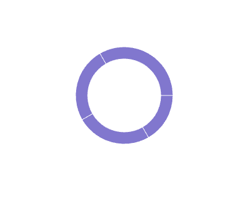

## 1\. Requirements to Handle

In Phase 1. We need to ensure that charts supports following things in Phase 1. 

 

 1.1 - Line Chart 

#### 1.1.a - **[Basic Line Chart](https://recharts.org/en-US/examples/SimpleLineChart)** 

A standard line chart with a grid, X-axis, Y-axis, Tooltip, Legend, and line.

#### 1.1.b - **[Tiny Line Chart](https://recharts.org/en-US/examples/TinyLineChart)** 

A minimal line chart with only the line, with no grid or axes.

#### 1.1.c  **[Line Chart that Connects Nulls](https://recharts.org/en-US/examples/LineChartConnectNulls)** 

The chart should be able to handle `null` data points by connecting the line over the gap. This is supported in Recharts via the `connectNulls` prop.

#### 1.1.d - **[Custom Dot Charts](https://recharts.org/en-US/examples/CustomizedDotLineChart)**

 We will support a limited set of options for customizing the dots on the line chart. Recharts allows passing a `Dot` component as a prop.

#### 1.1.e - **Forecast Line Chart**

 This requires showing a portion of the line as a dotted or dashed line to represent forecasted data. This can be implemented by rendering two separate lines and hiding the forecast line from the legend. The API design needs to consider how to accept forecast data.

#### 1.1.f - **[Stepped Line Chart](https://ui.shadcn.com/charts/line#charts)**

 The chart should support different interpolation types, like 'step'. This can be controlled via a `lineType` prop, which maps to the Recharts `type` prop on the `<Line />` component. We will likely support a limited number of line types initially.

-----

  2.2 - Area Chart 

#### 2.2.a - **[Simple Area Chart](https://recharts.org/en-US/examples/SimpleAreaChart)**

An area chart with a grid, X-axis, Y-axis, Tooltip, Legend, and the area fill.

#### 2.2.b - **[Stacked Area Chart](https://recharts.org/en-US/examples/StackedAreaChart)** 

The chart should support stacking multiple areas. This is handled by adding a `stackId` prop to the `Area` component in Recharts. Also if we have more then 2 area, user need to pass stackId. otherwise we will consider 
All areas part of a single stack.

#### 2.2.c - **[Area Chart that Connects Nulls](https://recharts.org/en-US/examples/AreaChartConnectNulls)** 

Similar to line charts, the chart should be able to handle `null` data points by connecting the area over the gap. This is supported in Recharts via the `connectNulls` prop.

#### 2.2.d - **[Tiny Area Chart](https://recharts.org/en-US/examples/TinyAreaChart)** 

A minimal area chart with only the filled area, with no grid or axes. Also known as a sparkline.

 2.3 - Bar Chart 

#### 2.3.a - [TinyBarChart](https://recharts.org/en-US/examples/TinyBarChart)

   

   Simple bar graph with responsive container and BarChart.  

#### 2.3.b - [SimpleBarChart](https://recharts.org/en-US/examples/SimpleBarChart)

   

   Bar Chart with other chart components.

#### 2.3.c - [StackedBarChart](https://recharts.org/en-US/examples/StackedBarChart)  

  

   It would be simple. Just need to use `stackId`  
         
#### 2.4.d - [Vertical Bar Chart](https://ui.shadcn.com/charts/bar#charts)  
   

   We just need to use `layout=”vertical”` prop  

#### 2.5.e - [NegativeBarChart](https://ui.shadcn.com/charts/bar#charts)  
   We just need to pass \-ve values recharts will handle it for us.   

#### 2.5.f - [CustomLabelBarChart](https://ui.shadcn.com/charts/bar#charts)  
   We need to use labelList. But we need to style it.

2.4 - Pie Chart

> **Note:** In design doc you can see we have Pie chart, but during initial discussion with design we have decided to have Donut variant of pie chart only. (Pie Chart will be supported in future)

* [CustomActiveShapeDonutChart](https://recharts.org/en-US/examples/CustomActiveShapePieChart)  
     

  We will provide custom active shapes for donut charts  

* [DonutWithText](https://ui.shadcn.com/charts/pie#charts)

    

      Need to display Text in the center of the donut chart. We should have a standard style of this. 

**[Design Requirement Doc (for razorpay  employees)](https://docs.google.com/document/d/1u7zkzpsQwwYsdtjSDlPgalArT7XkzAC400KqNI7Ibus/edit?tab=t.l3y0g5difjs4)**