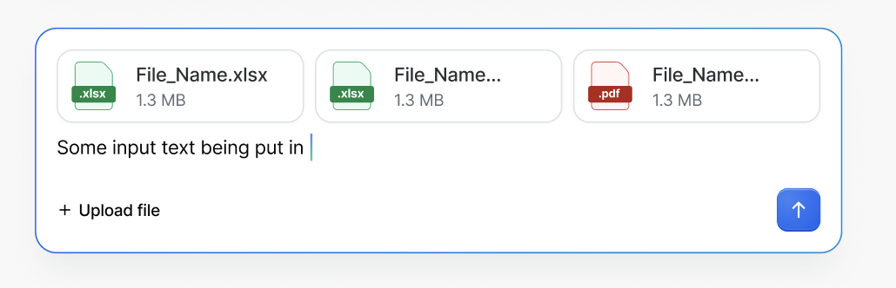
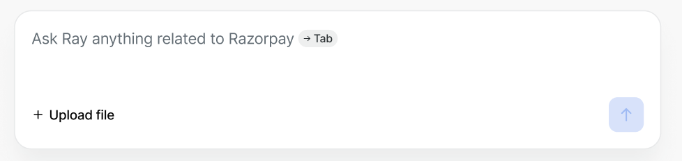
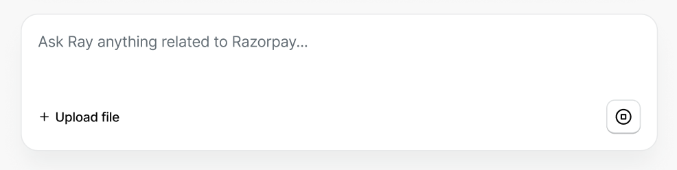

# ChatInput

ChatInput is an input component designed for AI chat interfaces. It combines a textarea, file upload, ghost suggestion autocomplete, and a submit action into a single composable input. Think of it as a "prompt input" -- the primary way users compose and send messages in conversational AI experiences.


## Design

- [Figma - ChatInput](https://www.figma.com/design/QjSexUED296OBCwWwhYKQE/agenticSpark?node-id=116756-67218&m=dev)

## API

Overall structure showing the main usage pattern with a realistic example:

```jsx
import { ChatInput } from '@razorpay/blade/components';

<ChatInput
  value={text}
  onChange={({ value }) => setText(value)}
  onSubmit={({ value, fileList }) => handleSend(value, fileList)}
  placeholder="Ask a question..."
  isGenerating={isWaiting}
  onStop={() => abortGeneration()}
  fileList={files}
  onFileChange={({ fileList }) => setFiles(fileList)}
  onFileRemove={({ file }) => removeFile(file)}
  accept=".jpg,.png,.pdf,.xlsx"
  maxFileSize={5242880}
  maxFileCount={5}
  suggestions={[
    'How do I integrate payment gateway?',
    'Show me recent transactions',
    'Help me set up webhooks',
  ]}
  onSuggestionAccept={({ suggestion }) => acceptSuggestion(suggestion)}
  validationState="error"
  errorText="Something went wrong. Please try again."
/>;
```

<details>
  <summary>Alternate API: JSX-based for files and quote</summary>

### Alternate API

In this alternate approach, `files` and `quote` accept `ReactNode` instead of data props. The upload button and file picker remain built-in to ChatInput; only the preview rendering and quote content are fully consumer-controlled.

```jsx
import { ChatInput, ChatInputFilePreview, ChatInputQuote } from '@razorpay/blade/components';

<ChatInput
  value={text}
  onChange={({ value }) => setText(value)}
  onSubmit={({ value }) => handleSubmit(value)}
  placeholder="Ask a question..."
  onFileChange={({ fileList }) => setFiles(fileList)}
  accept=".jpg,.png,.pdf,.xlsx"
  files={
    <>
      <ChatInputFilePreview name="File_Name.xlsx" size="1.3 MB" onRemove={() => removeFile(0)} />
      <ChatInputFilePreview name="File_Name.pdf" size="1.3 MB" onRemove={() => removeFile(1)} />
    </>
  }
  validationState="error"
  onErrorDismiss={() => {
    setValidationState('error');
  }}
  errorText="Something went wrong"
/>;
```

- Pros
  - Full rendering control over file previews and quote content
  - Consumer can use custom components or Blade components for previews
  - Flexible for edge cases (custom file preview states, different quote layouts, any ReactNode as quote content)
- Cons
  - More boilerplate for common cases
  - Less consistency across consumers since each team renders their own previews
  - Consumer needs to manually map files from `onFileChange` to `ChatInputFilePreview` components
  - `onSubmit` cannot easily include the file list since files are consumer-managed JSX (consumer tracks files in their own state)

#### Alternate API Props

#### ChatInputFilePreview

```typescript
type ChatInputFilePreviewProps = {
  /**
   * Name of the file to display
   */
  name: string;

  /**
   * Human-readable file size string (e.g. "1.3 MB")
   */
  size: string;

  /**
   * Callback fired when the remove button on the file preview is clicked
   */
  onRemove?: () => void;

  /**
   * Test ID for automation testing
   */
  testID?: string;
};
```

</details>

### Props

#### ChatInput

```typescript
type ChatInputProps = {
  /**
   * Controlled value of the text input
   */
  value?: string;

  /**
   * Default value of the text input for uncontrolled usage
   */
  defaultValue?: string;

  /**
   * Callback fired when the text input value changes
   */
  onChange?: ({ value }: { value: string }) => void;

  /**
   * Callback fired when the user submits the input (via submit button or Enter key).
   * Receives the current text value and the list of attached files.
   */
  onSubmit?: ({ value, fileList }: { value: string; fileList: BladeFileList }) => void;

  /**
   * Placeholder text shown when the input is empty
   */
  placeholder?: string;

  /**
   * Disables the text input, file upload button, and submit button
   * @default false
   */
  isDisabled?: boolean;

  /**
   * Whether the AI is currently generating a response.
   * When true, the submit button changes to a stop button.
   * @default false
   */
  isGenerating?: boolean;

  /**
   * Callback fired when the user clicks the stop button (visible when isGenerating is true).
   * Use this to cancel an in-flight AI generation.
   */
  onStop?: () => void;

  /**
   * List of attached files. Used for controlled file management.
   * Reuses the BladeFile/BladeFileList types from the FileUpload component.
   */
  fileList?: BladeFileList;

  /**
   * Callback fired when files are selected via the upload button.
   * The upload button ("+ Upload file") is always visible in the action bar.
   */
  onFileChange?: ({ fileList }: { fileList: BladeFileList }) => void;

  /**
   * Callback fired when a file is removed from the attachment previews
   */
  onFileRemove?: ({ file }: { file: BladeFile }) => void;

  /**
   * File types that can be accepted. Follows the HTML input accept attribute format.
   * @example ".jpg,.png,.pdf" or "image/*"
   * @see https://developer.mozilla.org/en-US/docs/Web/HTML/Element/input/file#accept
   */
  accept?: string;

  /**
   * Maximum file size in bytes per file
   */
  maxFileSize?: number;

  /**
   * Maximum number of files that can be attached
   */
  maxFileCount?: number;

  /**
   * List of ghost suggestions displayed as faded text in the input.
   * When multiple suggestions are provided, they cycle automatically with a crossfade animation.
   * The user can press TAB to accept the currently visible suggestion.
   */
  suggestions?: string[];

  /**
   * Callback fired when the user accepts the currently visible ghost suggestion (via TAB key).
   * Receives the specific suggestion that was active at the time of acceptance.
   */
  onSuggestionAccept?: ({ suggestion }: { suggestion: string }) => void;

  /**
   * Indicates the validation state of the input.
   * When set to 'error', the input border turns red and errorText is displayed below.
   * @default 'none'
   */
  validationState?: 'error' | 'none';

  /**
   * Error message displayed below the input when validationState is 'error'.
   */
  errorText?: string;

  /**
   * Callback fired when the user dismisses the error popup by clicking the close button.
   */
  onErrorDismiss?: () => void;

  /**
   * Accessibility label for the input. Required when no visible label is present.
   */
  accessibilityLabel?: string;

  /**
   * Test ID for automation testing
   */
  testID?: string;
} & StyledPropsBlade;
```

> **Note:** `BladeFile` and `BladeFileList` are reused from the existing [FileUpload component](../../FileUpload/types.ts). `BladeFile` extends the native `File` interface with `id`, `status`, `uploadPercent`, and `errorText` fields.

## Examples

### Basic Usage

File previews appear above the text area when files are attached. The "Upload file" button is always visible in the action bar.



```jsx
import { ChatInput } from '@razorpay/blade/components';

const ChatWithFiles = () => {
  const [files, setFiles] = useState([]);

  return (
    <ChatInput
      placeholder="Ask a question..."
      onSubmit={({ value, fileList }) => sendMessage(value, fileList)}
      fileList={files}
      onFileChange={({ fileList }) => setFiles(fileList)}
      onFileRemove={({ file }) => setFiles((prev) => prev.filter((f) => f.id !== file.id))}
      accept=".jpg,.png,.pdf,.xlsx"
      maxFileSize={5 * 1024 * 1024}
      maxFileCount={5}
    />
  );
};
```

### With Validation Error

When `validationState` is set to `'error'`, the input border turns red and `errorText` is displayed below the input. This is useful for surfacing submission errors or invalid input states.

```jsx
import { ChatInput } from '@razorpay/blade/components';

const ChatWithError = () => {
  const [validationState, setValidationState] = useState('none');

  return (
    <ChatInput
      placeholder="Ask a question..."
      validationState={validationState}
      errorText="Something went wrong. Please try again."
      onErrorDismiss={() => setValidationState('none')}
      onSubmit={({ value }) => {
        const result = sendMessage(value);
        if (!result.ok) setValidationState('error');
      }}
    />
  );
};
```

### With Ghost Suggestions

Ghost suggestions appear as faded text after the cursor. When multiple suggestions are provided, they cycle automatically with a crossfade animation. The user presses TAB to accept the currently visible suggestion.



```jsx
import { ChatInput } from '@razorpay/blade/components';

const ChatWithSuggestions = () => {
  const [suggestions, setSuggestions] = useState([
    'Ask Ray anything related to Razorpay',
    'Show me recent transactions',
    'Help me set up webhooks',
  ]);

  return (
    <ChatInput
      placeholder="Ask a question..."
      onSubmit={({ value }) => sendMessage(value)}
      suggestions={suggestions}
      onSuggestionAccept={({ suggestion }) => {
        console.log('Accepted:', suggestion);
        setSuggestions([]);
      }}
    />
  );
};
```

### Stop Generation

When `isGenerating` is true, the submit button changes to a stop button. Clicking it fires `onStop`, allowing the user to cancel an in-flight AI generation.



```jsx
import { ChatInput } from '@razorpay/blade/components';

const ChatWithStop = () => {
  const [isGenerating, setIsGenerating] = useState(false);
  const abortRef = useRef(null);

  return (
    <ChatInput
      placeholder="Ask a question..."
      isGenerating={isGenerating}
      onSubmit={async ({ value }) => {
        const controller = new AbortController();
        abortRef.current = controller;
        setIsGenerating(true);
        await streamResponse(value, { signal: controller.signal });
        setIsGenerating(false);
      }}
      onStop={() => {
        abortRef.current?.abort();
        setIsGenerating(false);
      }}
    />
  );
};
```

### Full Featured

Combining all features -- file upload, ghost suggestion, stop generation, and validation error.

```jsx
import { ChatInput } from '@razorpay/blade/components';

const FullFeaturedChat = () => {
  const [text, setText] = useState('');
  const [files, setFiles] = useState([]);
  const [isGenerating, setIsGenerating] = useState(false);
  const [validationState, setValidationState] = useState('none');
  const abortRef = useRef(null);
  const [suggestions, setSuggestions] = useState([
    'How do I integrate payment gateway?',
    'Show me recent transactions',
    'Help me set up webhooks',
  ]);

  const handleSubmit = async ({ value, fileList }) => {
    setValidationState('none');
    const controller = new AbortController();
    abortRef.current = controller;
    setIsGenerating(true);
    const result = await sendMessage({
      text: value,
      files: fileList,
      signal: controller.signal,
    });
    if (!result.ok) setValidationState('error');
    setText('');
    setFiles([]);
    setSuggestions([]);
    setIsGenerating(false);
  };

  return (
    <ChatInput
      value={text}
      onChange={({ value }) => setText(value)}
      onSubmit={handleSubmit}
      placeholder="Ask a question..."
      isGenerating={isGenerating}
      onStop={() => {
        abortRef.current?.abort();
        setIsGenerating(false);
      }}
      fileList={files}
      onFileChange={({ fileList }) => setFiles(fileList)}
      onFileRemove={({ file }) => setFiles((prev) => prev.filter((f) => f.id !== file.id))}
      accept=".jpg,.png,.pdf,.xlsx"
      maxFileSize={5 * 1024 * 1024}
      maxFileCount={5}
      suggestions={suggestions}
      onSuggestionAccept={({ suggestion }) => {
        setText(suggestion);
        setSuggestions([]);
      }}
      validationState={validationState}
      errorText="Something went wrong. Please try again."
    />
  );
};
```

## Accessibility

- **Keyboard Navigation:**
  - `Enter` submits the message (fires `onSubmit`)
  - `Shift + Enter` inserts a new line in the textarea
  - `TAB` accepts the ghost suggestion when `suggestions` is present
  - `Escape` clears the current ghost suggestion
  - Upload button and submit button are focusable and activatable via `Space`/`Enter`
- **ARIA Attributes:**
  - The textarea uses `role="textbox"` with `aria-multiline="true"`
  - The submit button uses `aria-label="Submit"` (or equivalent)
  - The upload button uses `aria-label="Upload file"`
  - File preview cards include `aria-label` with the file name and a remove button with `aria-label="Remove {filename}"`
  - When `validationState` is `'error'`, the textarea gets `aria-invalid="true"` and `aria-describedby` points to the error text element
  - When `isGenerating` is true, the submit button's label changes to `aria-label="Stop generation"` to indicate the stop action
- **Screen Reader:**
  - The `accessibilityLabel` prop is used as `aria-label` on the main input when no visible label is present
  - Ghost suggestion text is announced via `aria-describedby` so screen readers can read the suggestion
  - File attachment count is announced when files are added or removed

## Open Questions

- Should the textarea auto-resize as the user types (grow vertically up to a max height)? Or should it have a fixed height with scroll?
- What should happen when the user presses `TAB` and there is no suggestion? Should it behave as normal tab (move focus) or be a no-op?
- ~~Should `isLoading` turn the submit button into a "stop" button that fires an `onStop` callback?~~ **Resolved:** Renamed to `isGenerating` + `onStop`. When `isGenerating` is true, the submit button becomes a stop button that fires `onStop`.

## References

- [Vercel AI SDK - useChat](https://sdk.vercel.ai/docs/reference/ai-sdk-ui/use-chat)
- [Ant Design X - Sender](https://x.ant.design/components/sender)
- [Assistant UI - Thread](https://www.assistant-ui.com/docs/ui/Thread)
- [ChatBot UI](https://github.com/mckaywrigley/chatbot-ui)
- Blade FileUpload -- [`packages/blade/src/components/FileUpload`](../../FileUpload/) for `BladeFile`/`BladeFileList` types and file upload patterns
- Blade TextArea -- [`packages/blade/src/components/Input/TextArea`](../../Input/TextArea/) for textarea input patterns
- Blade ChatMessage -- [`packages/blade/src/components/ChatMessage`](../../ChatMessage/) for existing chat component patterns
