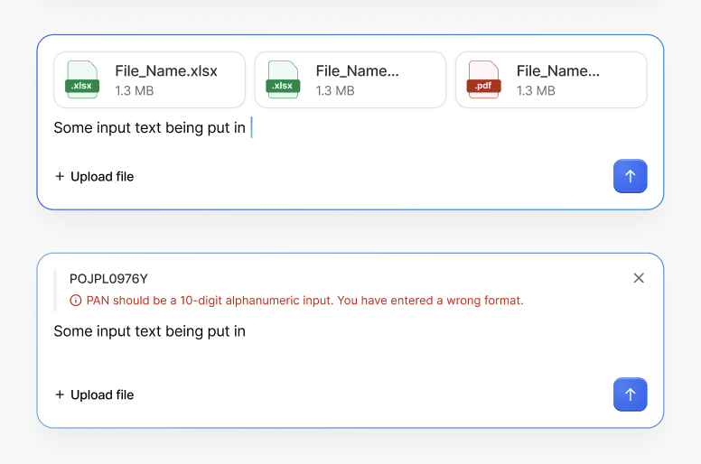

# ChatInput

ChatInput is an input component designed for AI chat interfaces. It combines a textarea, file upload, quoted message reference, ghost suggestion autocomplete, and a submit action into a single composable input. Think of it as a "prompt input" -- the primary way users compose and send messages in conversational AI experiences.



## Design

- [Figma - ChatInput](#) <!-- TODO: Add Figma link -->

## API

Overall structure showing the main usage pattern with a realistic example:

```jsx
import { ChatInput } from '@razorpay/blade/components';

<ChatInput
  value={text}
  onChange={({ value }) => setText(value)}
  onSubmit={({ value, fileList }) => handleSend(value, fileList)}
  placeholder="Ask a question..."
  isLoading={isWaiting}
  fileList={files}
  onFileChange={({ fileList }) => setFiles(fileList)}
  onFileRemove={({ file }) => removeFile(file)}
  accept=".jpg,.png,.pdf,.xlsx"
  maxFileSize={5242880}
  maxFileCount={5}
  suggestionText="How do I integrate payment gateway?"
  onSuggestionAccept={({ suggestion }) => acceptSuggestion(suggestion)}
  quote={{
    title: 'POJPL0976Y',
    description: 'PAN should be a 10-digit alphanumeric input. You have entered a wrong format.',
    onDismiss: () => setQuote(null),
  }}
/>
```

<details>
  <summary>Alternate API: JSX-based for files and quote</summary>

  ### Alternate API

  In this alternate approach, `files` and `quote` accept `ReactNode` instead of data props. The upload button and file picker remain built-in to ChatInput; only the preview rendering and quote content are fully consumer-controlled.

  ```jsx
  import { ChatInput, ChatInputFilePreview, ChatInputQuote } from '@razorpay/blade/components';

  <ChatInput
    value={text}
    onChange={({ value }) => setText(value)}
    onSubmit={({ value }) => handleSubmit(value)}
    placeholder="Ask a question..."
    onFileChange={({ fileList }) => setFiles(fileList)}
    accept=".jpg,.png,.pdf,.xlsx"
    files={
      <>
        <ChatInputFilePreview
          name="File_Name.xlsx"
          size="1.3 MB"
          onRemove={() => removeFile(0)}
        />
        <ChatInputFilePreview
          name="File_Name.pdf"
          size="1.3 MB"
          onRemove={() => removeFile(1)}
        />
      </>
    }
    quote={
      <ChatInputQuote onDismiss={() => setQuote(null)}>
        <Text>POJPL0976Y</Text>
        <Text color="feedback.text.negative.intense">
          PAN should be a 10-digit alphanumeric input. You have entered a wrong format.
        </Text>
      </ChatInputQuote>
    }
  />
  ```

  - Pros
    - Full rendering control over file previews and quote content
    - Consumer can use custom components or Blade components for previews
    - Flexible for edge cases (custom file preview states, different quote layouts, any ReactNode as quote content)
  - Cons
    - More boilerplate for common cases
    - Less consistency across consumers since each team renders their own previews
    - Consumer needs to manually map files from `onFileChange` to `ChatInputFilePreview` components
    - `onSubmit` cannot easily include the file list since files are consumer-managed JSX (consumer tracks files in their own state)

</details>

### Props

#### ChatInput

```typescript
type ChatInputQuoteConfig = {
  /**
   * Title text displayed in the quote section
   */
  title: string;

  /**
   * Optional description text displayed below the title in the quote
   */
  description?: string;

  /**
   * Callback fired when the dismiss button on the quote is clicked
   */
  onDismiss: () => void;
};

type ChatInputProps = {
  /**
   * Controlled value of the text input
   */
  value?: string;

  /**
   * Default value of the text input for uncontrolled usage
   */
  defaultValue?: string;

  /**
   * Callback fired when the text input value changes
   */
  onChange?: ({ value }: { value: string }) => void;

  /**
   * Callback fired when the user submits the input (via submit button or Enter key).
   * Receives the current text value and the list of attached files.
   */
  onSubmit?: ({ value, fileList }: { value: string; fileList: BladeFileList }) => void;

  /**
   * Placeholder text shown when the input is empty
   */
  placeholder?: string;

  /**
   * Disables the text input, file upload button, and submit button
   * @default false
   */
  isDisabled?: boolean;

  /**
   * Shows a loading state on the submit button (e.g. while waiting for AI response).
   * The submit button can act as a "stop" button in this state.
   * @default false
   */
  isLoading?: boolean;

  /**
   * List of attached files. Used for controlled file management.
   * Reuses the BladeFile/BladeFileList types from the FileUpload component.
   */
  fileList?: BladeFileList;

  /**
   * Callback fired when files are selected via the upload button.
   * The upload button ("+ Upload file") is always visible in the action bar.
   */
  onFileChange?: ({ fileList }: { fileList: BladeFileList }) => void;

  /**
   * Callback fired when a file is removed from the attachment previews
   */
  onFileRemove?: ({ file }: { file: BladeFile }) => void;

  /**
   * File types that can be accepted. Follows the HTML input accept attribute format.
   * @example ".jpg,.png,.pdf" or "image/*"
   * @see https://developer.mozilla.org/en-US/docs/Web/HTML/Element/input/file#accept
   */
  accept?: string;

  /**
   * Maximum file size in bytes per file
   */
  maxFileSize?: number;

  /**
   * Maximum number of files that can be attached
   */
  maxFileCount?: number;

  /**
   * Ghost text displayed behind the user's input as an autocomplete suggestion.
   * The user can press TAB to accept the suggestion.
   */
  suggestionText?: string;

  /**
   * Callback fired when the user accepts the ghost suggestion (via TAB key)
   */
  onSuggestionAccept?: ({ suggestion }: { suggestion: string }) => void;

  /**
   * Configuration for displaying a quoted message above the input.
   * Renders a quote card with title, optional description, and a dismiss button.
   */
  quote?: ChatInputQuoteConfig;

  /**
   * Accessibility label for the input. Required when no visible label is present.
   */
  accessibilityLabel?: string;

  /**
   * Test ID for automation testing
   */
  testID?: string;
} & StyledPropsBlade;
```

> **Note:** `BladeFile` and `BladeFileList` are reused from the existing [FileUpload component](../../FileUpload/types.ts). `BladeFile` extends the native `File` interface with `id`, `status`, `uploadPercent`, and `errorText` fields.

#### ChatInputFilePreview (Alternate API only)

```typescript
type ChatInputFilePreviewProps = {
  /**
   * Name of the file to display
   */
  name: string;

  /**
   * Human-readable file size string (e.g. "1.3 MB")
   */
  size: string;

  /**
   * Callback fired when the remove button on the file preview is clicked
   */
  onRemove?: () => void;

  /**
   * Test ID for automation testing
   */
  testID?: string;
};
```

#### ChatInputQuote (Alternate API only)

```typescript
type ChatInputQuoteProps = {
  /**
   * Content to render inside the quote card. Can be any React node.
   */
  children: React.ReactNode;

  /**
   * Callback fired when the dismiss (X) button on the quote is clicked
   */
  onDismiss?: () => void;

  /**
   * Test ID for automation testing
   */
  testID?: string;
};
```

## Examples

### Basic Usage

A minimal ChatInput with just a text area and submit button. Enter key submits, Shift+Enter adds a new line.

```jsx
import { ChatInput } from '@razorpay/blade/components';

const BasicChat = () => {
  return (
    <ChatInput
      placeholder="Ask a question..."
      onSubmit={({ value }) => console.log('Sent:', value)}
    />
  );
};
```

### With File Upload

File previews appear above the text area when files are attached. The "Upload file" button is always visible in the action bar.

```jsx
import { ChatInput } from '@razorpay/blade/components';

const ChatWithFiles = () => {
  const [files, setFiles] = useState([]);

  return (
    <ChatInput
      placeholder="Ask a question..."
      onSubmit={({ value, fileList }) => sendMessage(value, fileList)}
      fileList={files}
      onFileChange={({ fileList }) => setFiles(fileList)}
      onFileRemove={({ file }) => setFiles((prev) => prev.filter((f) => f.id !== file.id))}
      accept=".jpg,.png,.pdf,.xlsx"
      maxFileSize={5 * 1024 * 1024}
      maxFileCount={5}
    />
  );
};
```

### With Quoted Message

A quoted message renders above the text area with a dismiss button. Useful for replying to or referencing a specific message from the chat.

```jsx
import { ChatInput } from '@razorpay/blade/components';

const ChatWithQuote = () => {
  const [quote, setQuote] = useState({
    title: 'POJPL0976Y',
    description:
      'PAN should be a 10-digit alphanumeric input. You have entered a wrong format.',
    onDismiss: () => setQuote(null),
  });

  return (
    <ChatInput
      placeholder="Ask a question..."
      onSubmit={({ value }) => sendReply(value)}
      quote={quote}
    />
  );
};
```

### With Ghost Suggestion

A ghost suggestion appears as faded text after the cursor, similar to Copilot-style inline completions. The user presses TAB to accept the suggestion.

```jsx
import { ChatInput } from '@razorpay/blade/components';

const ChatWithSuggestion = () => {
  const [suggestion, setSuggestion] = useState('How do I integrate payment gateway?');

  return (
    <ChatInput
      placeholder="Ask a question..."
      onSubmit={({ value }) => sendMessage(value)}
      suggestionText={suggestion}
      onSuggestionAccept={({ suggestion }) => {
        console.log('Accepted:', suggestion);
        setSuggestion(null);
      }}
    />
  );
};
```

### Loading State

When `isLoading` is true, the submit button shows a loading/stop state. This is useful while waiting for an AI response, allowing the user to cancel the generation.

```jsx
import { ChatInput } from '@razorpay/blade/components';

const ChatWithLoading = () => {
  const [isLoading, setIsLoading] = useState(false);

  return (
    <ChatInput
      placeholder="Ask a question..."
      isLoading={isLoading}
      onSubmit={async ({ value }) => {
        setIsLoading(true);
        await sendMessage(value);
        setIsLoading(false);
      }}
    />
  );
};
```

### Full Featured

Combining all features -- file upload, quoted message, ghost suggestion, and loading state.

```jsx
import { ChatInput } from '@razorpay/blade/components';

const FullFeaturedChat = () => {
  const [text, setText] = useState('');
  const [files, setFiles] = useState([]);
  const [isLoading, setIsLoading] = useState(false);
  const [quote, setQuote] = useState(null);
  const [suggestion, setSuggestion] = useState('How do I integrate payment gateway?');

  const handleSubmit = async ({ value, fileList }) => {
    setIsLoading(true);
    await sendMessage({ text: value, files: fileList, quotedRef: quote });
    setText('');
    setFiles([]);
    setQuote(null);
    setSuggestion(null);
    setIsLoading(false);
  };

  return (
    <ChatInput
      value={text}
      onChange={({ value }) => setText(value)}
      onSubmit={handleSubmit}
      placeholder="Ask a question..."
      isLoading={isLoading}
      fileList={files}
      onFileChange={({ fileList }) => setFiles(fileList)}
      onFileRemove={({ file }) => setFiles((prev) => prev.filter((f) => f.id !== file.id))}
      accept=".jpg,.png,.pdf,.xlsx"
      maxFileSize={5 * 1024 * 1024}
      maxFileCount={5}
      suggestionText={suggestion}
      onSuggestionAccept={({ suggestion }) => {
        setText(suggestion);
        setSuggestion(null);
      }}
      quote={
        quote
          ? {
              title: quote.title,
              description: quote.description,
              onDismiss: () => setQuote(null),
            }
          : undefined
      }
    />
  );
};
```

## Accessibility

- **Keyboard Navigation:**
  - `Enter` submits the message (fires `onSubmit`)
  - `Shift + Enter` inserts a new line in the textarea
  - `TAB` accepts the ghost suggestion when `suggestionText` is present
  - `Escape` dismisses the quote (if present) or clears the suggestion
  - Upload button and submit button are focusable and activatable via `Space`/`Enter`
- **ARIA Attributes:**
  - The textarea uses `role="textbox"` with `aria-multiline="true"`
  - The submit button uses `aria-label="Submit"` (or equivalent)
  - The upload button uses `aria-label="Upload file"`
  - File preview cards include `aria-label` with the file name and a remove button with `aria-label="Remove {filename}"`
  - The quote section uses `role="status"` with the dismiss button having `aria-label="Dismiss quote"`
  - When `isLoading` is true, the submit button's label changes to indicate stop/cancel action
- **Screen Reader:**
  - The `accessibilityLabel` prop is used as `aria-label` on the main input when no visible label is present
  - Ghost suggestion text is announced via `aria-describedby` so screen readers can read the suggestion
  - File attachment count is announced when files are added or removed

## Open Questions

- Should the textarea auto-resize as the user types (grow vertically up to a max height)? Or should it have a fixed height with scroll?
- Should there be a `maxCharacters` prop for the text input (similar to TextArea)?
- Should the action bar be extensible via a `toolbar` or `actions` prop for custom action buttons beyond "Upload file" and submit? (e.g. "Use template", "Attach image", etc.)
- Should the `onSubmit` callback include some kind of `quote` reference so the consumer knows which message was being quoted at the time of submission?
- What should happen when the user presses `TAB` and there is no suggestion? Should it behave as normal tab (move focus) or be a no-op?
- Should `isLoading` turn the submit button into a "stop" button that fires an `onStop` callback? Or should the consumer handle stop logic outside of ChatInput?
- Should the ghost suggestion support rich text / partial matching (only completing the rest of the current word) or is it always a full replacement of the input value?

## References

- [Vercel AI SDK - useChat](https://sdk.vercel.ai/docs/reference/ai-sdk-ui/use-chat)
- [Ant Design X - Sender](https://x.ant.design/components/sender)
- [Assistant UI - Thread](https://www.assistant-ui.com/docs/ui/Thread)
- [ChatBot UI](https://github.com/mckaywrigley/chatbot-ui)
- Blade FileUpload -- [`packages/blade/src/components/FileUpload`](../../FileUpload/) for `BladeFile`/`BladeFileList` types and file upload patterns
- Blade TextArea -- [`packages/blade/src/components/Input/TextArea`](../../Input/TextArea/) for textarea input patterns
- Blade ChatMessage -- [`packages/blade/src/components/ChatMessage`](../../ChatMessage/) for existing chat component patterns
