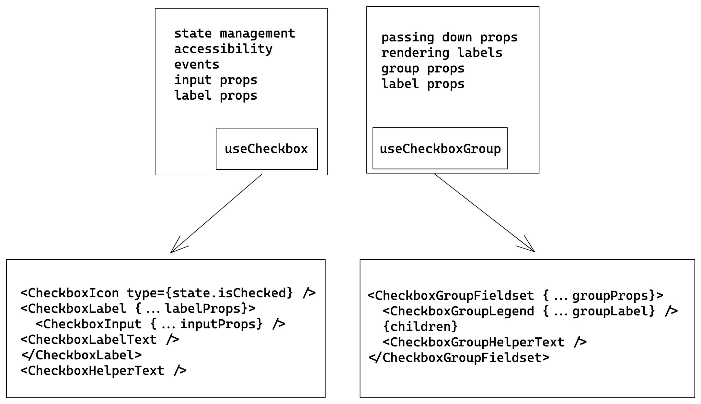

# Checkbox Decisions <!-- omit in toc -->

- [Design](#design)
- [Anatomy](#anatomy)
- [`Checkbox` API](#checkbox-api)
  - [Examples:](#examples)
    - [Basic](#basic)
    - [Validations](#validations)
- [`CheckboxGroup` API](#checkboxgroup-api)
  - [Examples:](#examples-1)
    - [Basic](#basic-1)
    - [Controlled, Uncontrolled](#controlled-uncontrolled)
  - [Note on CheckboxGroup](#note-on-checkboxgroup)
- [Component Architecture](#component-architecture)
- [Accessibility](#accessibility)
- [Open Questions](#open-questions)

## Design

[Figma Link](https://www.figma.com/file/jubmQL9Z8V7881ayUD95ps/Blade---Payment-Light?node-id=13227%3A163026) to all variants of the Checkbox component

## Blueprint of Checkbox



## `Checkbox` API

| Prop                | Type                                    | Required | Default     | Description                                                                                                                                                          |
| ------------------- | --------------------------------------- | -------- | ----------- | -------------------------------------------------------------------------------------------------------------------------------------------------------------------- |
| children            | `string`                                | No       | undefined   | The text to be rendered as CheckboxLabel                                                                                                                             |
| isChecked           | `boolean`                               | No       | false       | state of the checkbox, if explicitly set the checkbox will become [controlled component](https://reactjs.org/docs/forms.html#controlled-components)                  |
| defaultChecked      | `boolean`                               | No       | false       | default state of the checkbox, if isChecked is not provided the checkbox will become [uncontrolled component](https://reactjs.org/docs/uncontrolled-components.html) |
| onChange            | `({ event, isChecked, value }) => void` | No       | `undefined` | The function to be called when the checkbox state changes.                                                                                                           |
| isIndeterminate     | `boolean`                               | No       | `false`     | mixed state of the checkbox                                                                                                                                          |
| isDisabled          | `boolean`                               | No       | `false`     | Control whether the checkbox is disabled or not.                                                                                                                     |
| isRequired          | `boolean`                               | No       | `false`     | Control whether the checkbox is required or not.                                                                                                                     |
| helpText            | `string`                                | No       | `undefined` | The helper text to be rendered                                                                                                                                       |
| errorText           | `string`                                | No       | `undefined` | The error text to be rendered                                                                                                                                        |
| validationState     | `none' \| 'error'`                      | No       | `none`      | Control whether the checkbox is invalid or not.                                                                                                                      |
| name (html native)  | `string`                                | No       | `undefined` | The name of the input field in a checkbox, [useful in form submissions](https://developer.mozilla.org/en-US/docs/Web/HTML/Element/input#name)                        |
| value (html native) | `string`                                | No       | `undefined` | The value of the input field in a checkbox, [useful in form submissions](https://developer.mozilla.org/en-US/docs/Web/HTML/Element/input/checkbox#value)             |

### Examples:

#### Basic

```tsx
// Label text
<Checkbox>is blade awesome?</Checkbox>
// Helper text
<Checkbox helpText="Hint: yes">is blade awesome?</Checkbox>
// uncontrolled
<Checkbox defaultChecked={true}>is blade awesome?</Checkbox>
// controlled
<Checkbox isChecked={true | false} onChange={({ isChecked }) => {}}>is blade awesome?</Checkbox>
```

#### Validations

And `validationState` will pass `aria-invalid` attributes to indicate invalid state.

```tsx
<Checkbox validationState={'error' | 'none'}>is blade awesome?</Checkbox>
```

## `CheckboxGroup` API

| Prop               | Type                                    | Required | Default     | Description                                                                                                                         |
| ------------------ | --------------------------------------- | -------- | ----------- | ----------------------------------------------------------------------------------------------------------------------------------- |
| children           | `React.ReactNode`                       | Yes      | `undefined` | Accepts multiple Checkboxes                                                                                                         |
| label              | `string`                                | Yes      | `undefined` | The label of the group                                                                                                              |
| labelPosition      | `top \| left`                           | No       | `top`       | The position of the rendered label                                                                                                  |
| defaultValue       | `string[]`                              | No       | `[]`        | The initial value of the checkbox group                                                                                             |
| value              | `string[]`                              | No       | `[]`        | The value of the checkbox, if present will act as [controlled component](https://reactjs.org/docs/forms.html#controlled-components) |
| onChange           | `(value: string[]) => void`             | No       | `undefined` | The function to be called when any checkbox's state changes                                                                         |
| name               | `string`                                | No       | `undefined` | The name of the checkbox group, [useful in form submissions](https://developer.mozilla.org/en-US/docs/Web/HTML/Element/input#name)  |
| isDisabled         | `boolean`                               | No       | `false`     | Control whether the checkbox group is disabled or not.                                                                              |
| helpText           | `string`                                | No       | `undefined` | The helper text to be rendered                                                                                                      |
| errorText          | `string`                                | No       | `undefined` | The error text to be rendered                                                                                                       |
| validationState    | `'none' \| 'error'`                     | No       | `none`      | Control whether the checkbox group is invalid or not.                                                                               |
| necessityIndicator | `'optional' \| 'required' \| undefined` | No       | `undefined` | Renders `${label} (optional)` for `optional` and `${label} *` for `required`. if set to undefined renders nothing                   |

### Examples:

#### Basic

```tsx
<CheckboxGroup
  label="Developers"
  helpText="Pick blade developers"
  defaultValue={['anurag', 'kamlesh']}
>
  <Checkbox value="anurag">Anurag</Checkbox>
  <Checkbox value="kamlesh">Kamlesh</Checkbox>
  <Checkbox value="chaitanya">Chaitanya</Checkbox>
</CheckboxGroup>
```

#### Controlled, Uncontrolled

```tsx
const Controlled = () => {
  const [selected, setSelected] = React.useState(['anurag', 'kamlesh']);

  return (
    <CheckboxGroup label="Developers (controlled)" value={selected} onChange={setSelected}>
      <Checkbox value="anurag">Anurag</Checkbox>
      <Checkbox value="kamlesh">Kamlesh</Checkbox>
      <Checkbox value="chaitanya">Chaitanya</Checkbox>
    </CheckboxGroup>
  );
};

const Uncontrolled = () => {
  return (
    <CheckboxGroup label="Developers (uncontrolled)" defaultValue={['anurag', 'chaitanya']}>
      <Checkbox value="anurag">Anurag</Checkbox>
      <Checkbox value="kamlesh">Kamlesh</Checkbox>
      <Checkbox value="chaitanya">Chaitanya</Checkbox>
    </CheckboxGroup>
  );
};
```

### Note on CheckboxGroup

For properties `isDisabled`, `validationState` we want the CheckboxGroup to pass down these props to all the Checkboxes inside of it.

For showing optional/required label in `CheckboxGroup` we will introduce a prop `necessityIndicator` which will only render a `(optional)/(required)` tag in the CheckboxGroupLabel,
And the consumer will provide proper validation logic and depending on their use case and requirements they will pass `validationState` in conjunction with `necessityIndicator` and they should also use `helpText` to convey the correct intent and extra information to the user.


**Example of user managed validation**

Example of only one checkbox needs to be checked:

```tsx
function AnyOneHasToBeSelected() {
  const [selected, setSelected] = React.useState([]);

  return (
    <CheckboxGroup
      label="Do you love any of the fruits?"
      helpText="Select atleast one"
      errorText="You must select atleast one"
      value={selected}
      onChange={setSelected}
      validationState={selected.length === 0 ? 'error' : 'none'}
    >
      <Checkbox value="apple">apple</Checkbox>
      <Checkbox value="mango">mango</Checkbox>
      <Checkbox value="orange">orange</Checkbox>
      <Checkbox value="banana">banana</Checkbox>
    </CheckboxGroup>
  );
}
```

Example of every checkboxes needs to be checked:

```tsx
function AllOfThemHasToBeSelected() {
  const [selected, setSelected] = React.useState([]);

  return (
    <CheckboxGroup
      label="Do you agree to all the terms?"
      helpText="Select all"
      errorText="You must tick all of the items"
      value={selected}
      onChange={setSelected}
      validationState={selected.length < 3 ? 'error' : 'none'}
    >
      <Checkbox value="use-ts">I will use TS</Checkbox>
      <Checkbox value="no-any">I won't use any</Checkbox>
      <Checkbox value="use-js">I won't use JS</Checkbox>
    </CheckboxGroup>
  );
}
```

## Accessibility

- Checkbox - https://www.w3.org/WAI/ARIA/apg/patterns/checkbox/
- CheckboxGroup - The group's accessibility is bit tricky to get right, thus I'll implement and refine it and then document it here.

## Open Questions

1. Currently we only have `helpText` in Checkbox & CheckboxGroup and when we set `validationState=error` it becomes the `negative` variant. The problem is the content of the `helpText` should also change in certain scenarios to convey the exact error.

With this approach users will have to handle the logic

```tsx
const [validationState, setValidationState] = React.useState('none');

<Checkbox
  validationState={validationState}
  helpText={
    validationState === 'error'
      ? 'Invalid username provided, contains special chars'
      : 'Enter valid username'
  }
/>;
```

Will it be better to have a `errorText` prop instead which will automatically be switched internally when `validationState` is `error`?

```tsx
const [validationState, setValidationState] = React.useState('none');

<Checkbox
  validationState={validationState}
  helpText={'Enter valid username'}
  errorText={'Invalid username provided, contains special chars'}
/>;
```

**Conclusion:**  
Individual Checkboxes will have `errorText`, and if user sets `validationState` on the individual Checkbox when inside the CheckboxGroup we will throw at runtime error.
