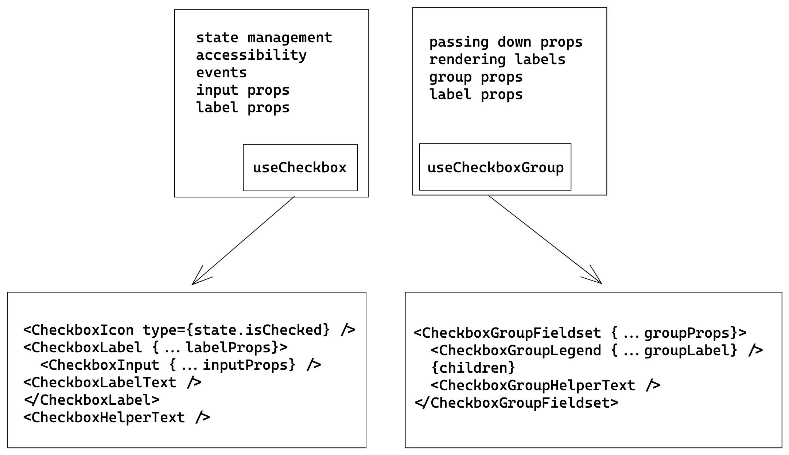

# Checkbox Decisions <!-- omit in toc -->

- [Design](#design)
- [Anatomy](#anatomy)
- [`Checkbox` API](#checkbox-api)
  - [Examples:](#examples)
    - [Basic](#basic)
    - [Validations](#validations)
- [`CheckboxGroup` API](#checkboxgroup-api)
  - [Examples:](#examples-1)
    - [Basic](#basic-1)
    - [Controlled, Uncontrolled](#controlled-uncontrolled)
  - [Note on CheckboxGroup](#note-on-checkboxgroup)
- [Component Architecture](#component-architecture)
- [Accessibility](#accessibility)
- [Open Questions](#open-questions)

## Design

[Figma Link](https://www.figma.com/file/jubmQL9Z8V7881ayUD95ps/Blade---Payment-Light?node-id=13227%3A163026) to all variants of the Checkbox component

## Anatomy

- **Checkbox**
  - **CheckboxInput** - Hidden native <input \/> element
  - **CheckboxIcon** - Checked/Unchecked & indeterminate icon
  - **CheckboxLabel** - The Checkbox's <label \/> element
  - **CheckboxLabelText** - The cross-platform Text component
  - **CheckboxHelperText** - The helper text component
- **CheckboxGroup**
  - **CheckboxGroupFieldset** - Would render a native <fieldset \/>
  - **CheckboxGroupLegend** - Would render a native <legend \/>
  - **CheckboxGroupHelperText** - The helper text component

Checkbox Component's Internal Anatomy:

```tsx
const Checkbox = () => {
  return (
    <>
      <CheckboxLabel>
        <CheckboxIcon />
        <VisuallyHidden>
          <CheckboxInput />
        </VisuallyHidden>
        <CheckboxLabelText />
      </CheckboxLabel>
      <CheckboxHelperText />
    </>
  );
};
```

CheckboxGroup Component's Internal Anatomy:

```tsx
const CheckboxGrop = () => {
  return (
    <CheckboxGroupFieldset>
      <CheckboxGroupLegend>title</CheckboxGroupLegend>
      {children}
      <CheckboxGroupHelperText type="default | negative" />
    </CheckboxGroupFieldset>
  );
};
```

## `Checkbox` API

| Prop                | Type       | Required | Default   | Description                                                                                                                                              |
| ------------------- | ---------- | -------- | --------- | -------------------------------------------------------------------------------------------------------------------------------------------------------- |
| children            | `string`   | No       | undefined | The text to be rendered as CheckboxLabel                                                                                                                 |
| helperText          | `string`   | No       | undefined | The helper text to be rendered                                                                                                                           |
| isChecked           | `boolean`  | No       | false     | state of the checkbox, if explicitly set the checkbox will be controlled                                                                                 |
| defaultChecked      | `boolean`  | No       | false     | default state of the checkbox, if isChecked is not provided the checkbox will be uncontrolled                                                            |
| onChange            | `Function` | No       | undefined | The function to be called when the checkbox state changes.                                                                                               |
| isIndeterminate     | `boolean`  | No       | false     | mixed state of the checkbox                                                                                                                              |
| name (html native)  | `string`   | No       | undefined | The name of the input field in a checkbox, [useful in form submissions](https://developer.mozilla.org/en-US/docs/Web/HTML/Element/input#name)            |
| value (html native) | `string`   | No       | undefined | The value of the input field in a checkbox, [useful in form submissions](https://developer.mozilla.org/en-US/docs/Web/HTML/Element/input/checkbox#value) |
| isDisabled          | `boolean`  | No       | `false`   | Control whether the checkbox is disabled or not.                                                                                                         |
| isReadOnly          | `boolean`  | No       | `false`   | Control whether the checkbox is readonly or not.                                                                                                         |
| isInvalid           | `boolean`  | No       | `false`   | Control whether the checkbox is invalid or not.                                                                                                          |
| isRequired          | `boolean`  | No       | `false`   | Control whether the checkbox is required or not.                                                                                                         |

### Examples:

#### Basic

```tsx
// Label text
<Checkbox>is blade awesome?</Checkbox>
// Helper text
<Checkbox helperText="Hint: yes">is blade awesome?</Checkbox>
// uncontrolled
<Checkbox defaultChecked={true}>is blade awesome?</Checkbox>
// controlled
<Checkbox isChecked={true | false} onChange={isChecked => {}}>is blade awesome?</Checkbox>
```

#### Validations

with `isInvalid` & `isRequired` will pass down `required` and `aria-invalid` attributes accordingly

```tsx
<Checkbox isRequired>is blade awesome?</Checkbox>
<Checkbox isInvalid={true | false}>is blade awesome?</Checkbox>
```

## `CheckboxGroup` API

| Prop          | Type                        | Required | Default     | Description                                                                                                                        |
| ------------- | --------------------------- | -------- | ----------- | ---------------------------------------------------------------------------------------------------------------------------------- |
| children      | `React.ReactNode`             | Yes       | `undefined` | Accepts multiple Checkboxes                                                                                                        |
| label         | `string`                    | Yes       | `undefined` | The label of the group                                                                                                             |
| labelPosition | `top, left`                 | No       | `top`       | The position of the rendered label                                                                                                 |
| helperText    | `string`                    | No       | `undefined` | The helper text to be rendered                                                                                                     |
| defaultValue  | `string[]`                  | No       | `[]`        | The initial value of the checkbox group                                                                                            |
| value         | `string[]`                  | No       | `[]`        | The value of the checkbox, if present will act as controlled component                                                             |
| onChange      | `(value: string[]) => void` | No       | `undefined` | The function to be called when any checkbox's state changes                                                                        |
| name          | `string`                    | No       | `undefined` | The name of the checkbox group, [useful in form submissions](https://developer.mozilla.org/en-US/docs/Web/HTML/Element/input#name) |
| isDisabled    | `boolean`                   | No       | `false`     | Control whether the checkbox group is disabled or not.                                                                             |
| isReadOnly    | `boolean`                   | No       | `false`     | Control whether the checkbox group is readonly or not.                                                                             |
| isInvalid     | `boolean`                   | No       | `false`     | Control whether the checkbox group is invalid or not.                                                                              |
| isRequired    | `boolean`                   | No       | `false`     | Control whether the checkbox group is required or not.                                                                             |

### Examples:

#### Basic

```tsx
<CheckboxGroup
  label="Developers"
  helperText="Pick blade developers"
  defaultValue={['anurag', 'kamlesh']}
>
  <Checkbox value="anurag">Anurag</Checkbox>
  <Checkbox value="kamlesh">Kamlesh</Checkbox>
  <Checkbox value="chaitanya">Chaitanya</Checkbox>
</CheckboxGroup>
```

#### Controlled, Uncontrolled

```tsx
const Controlled = () => {
  const [selected, setSelected] = React.useState(['anurag', 'kamlesh']);

  return (
    <CheckboxGroup 
      label="Developers (controlled)" 
      value={selected} 
      onChange={setSelected}
    >
      <Checkbox value="anurag">Anurag</Checkbox>
      <Checkbox value="kamlesh">Kamlesh</Checkbox>
      <Checkbox value="chaitanya">Chaitanya</Checkbox>
    </CheckboxGroup>
  );
};

const Uncontrolled = () => {
  return (
    <CheckboxGroup
      label="Developers (uncontrolled)"
      defaultValue={['anurag', 'chaitanya']}
    >
      <Checkbox value="anurag">Anurag</Checkbox>
      <Checkbox value="kamlesh">Kamlesh</Checkbox>
      <Checkbox value="chaitanya">Chaitanya</Checkbox>
    </CheckboxGroup>
  );
};
```

### Note on CheckboxGroup

For properties `isDisabled`, `isReadOnly`, `isInvalid`, `isRequired` we want the CheckboxGroup to pass down these props to all the Checkboxes inside of it, but there is a gotcha.

We will only be passing down `isDisabled`, `isReadOnly` props to the underlying Checkbox components.

We can't pass `isRequired` & `isInvalid`

Because we don't know that:

- Does user require that at least one checkbox is checked?
- Does user require that all checkboxes are to be checked?

When we say a checkbox group is required we generally mean that any of the checkboxes in a group has to be checked but if we pass down `isRequired` to all the checkboxes it would make the behaiour as all the checkboxes needs to be ticked. On the other hand there could be cases where we want all the checkboxes to be required not just one.

Similarly with `isInvalid` each checkbox should be independent of it's validation state. We don't know if the consumer wants `some` checkboxes or `all` checkboxes to be required.

Ultimately IMO the validation logic should be handled by the consumer side depending on their requirements, and they should provide proper `helperText` to communicate the intent.

Although we will still have the `isRequired` `isInvalid` prop to show visual changes like showing the `necessity indication` or `negative error text`

**Example of user managed validation**

Example of only one checkbox needs to be checked:

```tsx
function AnyOneHasToBeSelected() {
  const [selected, setSelected] = React.useState([]);

  return (
    <CheckboxGroup
      label="Do you love any of the fruites?"
      helperText="You can select multiple"
      value={selected}
      onChange={setSelected}
      isRequired
      isInvalid={selected.length === 0 ? true : false}
    >
      <Checkbox value="apple">apple</Checkbox>
      <Checkbox value="mango">mango</Checkbox>
      <Checkbox value="orange">orange</Checkbox>
      <Checkbox value="banana">banana</Checkbox>
    </CheckboxGroup>
  );
}
```

Example of every checkboxes needs to be checked:

```tsx
function AllOfThemHasToBeSelected() {
  const [selected, setSelected] = React.useState([]);

  return (
    <CheckboxGroup
      label="Do you agree to all the terms?"
      helperText="Select all"
      value={selected}
      onChange={setSelected}
      isRequired
      isInvalid={selected.length === 3 ? true : false}
    >
      <Checkbox value="use-ts">I will use TS</Checkbox>
      <Checkbox value="no-any">I won't use any</Checkbox>
      <Checkbox value="use-js">I won't use JS</Checkbox>
    </CheckboxGroup>
  );
}
```

And lastly users can also individually set `isRequired`, `isInvalid` props on the <Checkbbox \/> components instead of the parent CheckboxGroup for greater fine control.

```tsx
function IndividualCheckboxValidation() {
  return (
    <CheckboxGroup label="Do you agree to all the terms?" helperText="Select all">
      <Checkbox value="use-ts" isRequired>
        I will use TS
      </Checkbox>
      <Checkbox value="no-any">I won't use any (you can use it)</Checkbox>
      <Checkbox value="use-js" isRequired>
        I won't use JS
      </Checkbox>
    </CheckboxGroup>
  );
}
```

## Component Architecture

- components/Checkbox
  - useCheckbox.ts
  - Checkbox.tsx
  - CheckboxInput.tsx
  - CheckboxLabel.tsx
  - CheckboxLabelText.tsx
  - CheckboxIcon.tsx
  - useCheckboxGroup.ts
  - CheckboxGroupContext.tsx
  - CheckboxGroupFieldset.tsx
  - CheckboxGroupLegend.tsx
  - CheckboxGroupHelperText.tsx

We can use a hook based architecture to abstract out state management, accessibility & props to separate hooks like `useCheckbox` & `useCheckboxGroup` which will work cross platform.

**Benefits Of Hooks based architecture:**

- Easier to abstract out the component logic to reusable pieces.
- Flexible & Works well with our corss-platform needs.
- We can expose it to consumers which enables them build their own checkbox like component without much hassle.



**useCheckbox:**

useCheckbox will handle the checkbox's toggle state & return props; 

Here's the signature: 

```ts
const useCheckbox = (props: CheckboxProps) => {
  // this useControllable state will abstract out the logic for
  // controlled & uncontrolled state management
  const [checked, setChecked] = useControllableState()
  
  return {
    checkboxProps: {
      onMouseDown, 
      onClick
    },
    inputProps: {
      accessibilityProps: makeAcccessible(...),
      ...otherProps
    },
    labelProps: {
      ...otherLabelProps
    }
  }
}
```

**useCheckboxGroup:**

useCheckboxGroup will return label props, group props & handle all the ID generation for the accessible labels, errors & helper texts.

```ts
const useCheckboxGroup = (props: CheckboxGroupProps) => {
  return {
    labelProps: {
      ...otherProps
    },
    groupProps: {
      isDisabled, 
      isReadOnly,
      ...otherGroupProps
    }
  }
}
```

**CheckboxGroupContext:**

CheckboxGroupContext will pass down the <CheckboxGroup \/> properties like `isDisabled`, `isReadOnly` to the Checkboxes.

## Accessibility

- Checkbox - https://www.w3.org/WAI/ARIA/apg/patterns/checkbox/
- CheckboxGroup - The group's accessibility is bit tricky to get right, thus I'll implement and refine it and then document it here. 

## Open Questions

1. Currently we only have `helperText` in Checkbox & CheckboxGroup and when we set `isInvalid` it becomes the `negative` variant. The problem is the content of the `helperText` should also change in certain scenarios to convey the exact error. 

With this approach users will have to handle the logic

```tsx
const [isInvalid, setInvalid] = React.useState(false);

<Checkbox 
  isInvalid={isInvalid}
  helperText={
    isInvalid
    ? 'Invalid username provided, contains special chars' 
    : 'Enter valid username'
  }
/>
```

Will it be better to have a `errorText` prop instead which will automatically be switched internally is `isInvalid` is true? 

```tsx
const [isInvalid, setInvalid] = React.useState(false);

<Checkbox 
  isInvalid={isInvalid}
  helperText={'Enter valid username'}
  errorText={'Invalid username provided, contains special chars'}
/>
```