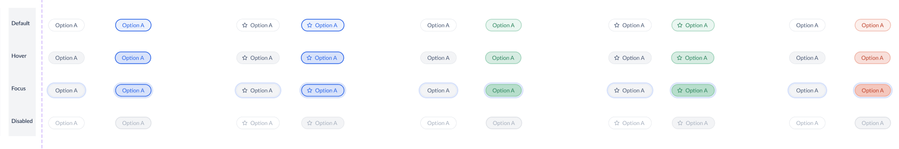

# Chip Decisions <!-- omit in toc -->

Chips embody a collection of selectable entities that empower users to engage in choices, sift through content, and invoke pertinent actions.

This document outlines the API details of the `Chip` and `ChipGroup` components, encompassing their structural composition, functional attributes, and visual representation.



- [Design](#design)
- [`Chip` API](#chip-api)
- [`ChipGroup` API](#chipgroup-api)
- [Examples](#examples)
  - [Basic/Uncontrolled Usage](#basicuncontrolled-usage)
  - [Controlled Usage](#controlled-usage)
- [Accessibility Considerations](#accessibility-considerations)
- [Open Questions](#open-questions)

## Design

[Figma Link](https://www.figma.com/file/jubmQL9Z8V7881ayUD95ps/Blade---Payment-Light?type=design&node-id=52377%3A27686&mode=design&t=pFzCay0x4a6sTcoQ-1) to all variants of the `Chip` component.

## `Chip` API

> **Note**
>
> The `Chip` component is inherently tied to the `ChipGroup` and cannot be utilized outside its context. This is because the chips are designed to be used in multiples since they represent collections of objects.

| Prop                    | Type                                   | Default     | Description                                                                                                                                        | Required |
| ----------------------- | -------------------------------------- | ----------- | -------------------------------------------------------------------------------------------------------------------------------------------------- | -------- |
| **children**            | `React.ReactText \| React.ReactText[]` | `undefined` | Renders the label text for the Chip                                                                                                                | ✅       |
| **icon**                | `Icon`                                 | `undefined` | Displays the Blade Icon component within the Chip                                                                                                  | ❌       |
| **isDisabled**          | `boolean`                              | `false`     | Disables or enables the Chip                                                                                                                       | ❌       |
| **intent**              | `'positive' \| 'negative' \| 'none'`   | `'none'`    | Sets the ChipGroups's visual variant, it will propagate down to all the Chips                                                                      | ❌       |
| **value (html native)** | `string`                               | `undefined` | The value of the input field in Chip, [useful in form submissions](https://developer.mozilla.org/en-US/docs/Web/HTML/Element/input/checkbox#value) | ❌       |

## `ChipGroup` API

> **Note**
>
> The requirement of the `accessibilityLabel` prop is intentional for ChipGroup. This setup will continue until a forthcoming introduction of a Label component of various sizes, intended for all input elements. This development is currently in the pipeline.

| Prop                   | Type                                                             | Default     | Description                                                                                                                    | Required |
| ---------------------- | ---------------------------------------------------------------- | ----------- | ------------------------------------------------------------------------------------------------------------------------------ | -------- |
| **accessibilityLabel** | `string`                                                         | `undefined` | Accessibility label for the ChipGroup                                                                                          | ✅       |
| **children**           | `React.ReactNode`                                                | `undefined` | Accepts multiple `Chip` components                                                                                             | ✅       |
| **defaultValue**       | `string \|string[]`                                              | `undefined` | Sets the initial value of the Chip group                                                                                       | ❌       |
| **isDisabled**         | `boolean`                                                        | `false`     | Disables or enables ChipGroup, it will propagate down to all the Chips                                                         | ❌       |
| **name**               | `string`                                                         | `undefined` | The name of the chip group, [useful in form submissions](https://developer.mozilla.org/en-US/docs/Web/HTML/Element/input#name) | ❌       |
| **onChange**           | `({ name, values }: { name: string; values: string[] }) => void` | `undefined` | Calls a function on any state change within the ChipGroup                                                                      | ❌       |
| **selectionType**      | `'single' \| 'multiple'`                                         | `'single'`  | Defines the selection behavior within the ChipGroup component, simulating radio/checkbox like behavior within the group        | ❌       |
| **size**               | `'xsmall' \| 'small' \| 'medium' \| 'large'`                     | `'small'`   | Specifies the size of the rendered Chips withing the ChipGroup                                                                 | ❌       |
| **value**              | `string \|string[]`                                              | `undefined` | Acts as a controlled component by specifying the ChipGroup value                                                               | ❌       |
| **intent**             | `'positive' \| 'negative' \| 'none'`                             | `'none'`    | Sets the ChipGroups's visual variant, it will propagate down to all the Chips                                                  | ❌       |

## Examples

Here are a few illustrative examples showcasing the utilization of the `Chip` and `ChipGroup` components:

### Basic/Uncontrolled Usage

Single Chip selection:

```jsx
<Box>
  <Text> Select Business type: </Text>
  <ChipGroup accessibilityLabel="select business type" defaultValue="proprietorship">
    <Chip value="proprietorship">Proprietorship</Chip>
    <Chip value="public">Public</Chip>
    <Chip value="small-business">Small Business</Chip>
  </ChipGroup>
</Box>
```

Multiple Chip selection:

```jsx
<Box>
  <Text> What other capabilities are you looking for? </Text>
  <ChipGroup
    accessibilityLabel="What other capabilities are you looking for?"
    selectionType="multiple"
    defaultValue={['payment-links', 'offers']}
  >
    <Chip value="payment-links">Automated Payment Links</Chip>
    <Chip value="wallet">Wallet on My App</Chip>
    <Chip value="offers">Offer discounts & EMI options</Chip>
  </ChipGroup>
</Box>
```

### Controlled Usage

```jsx
function Single() {
  // string value when selectionType is 'single' (default)
  const [selected, setSelected] = useState('proprietorship');

  return (
    <Box>
      <Text> Select Business type: </Text>
      <ChipGroup
        selectionType="single"
        accessibilityLabel="select business type"
        value={selected}
        onChange={({ values }) => setSelected(values[0])}
      >
        <Chip value="proprietorship">Proprietorship</Chip>
        <Chip value="public">Public</Chip>
        <Chip value="small-business">Small Business</Chip>
      </ChipGroup>
    </Box>
  );
}

function Multiple() {
  // array of strings value when selectionType is 'multiple'
  const [selected, setSelected] = useState(['in-progress', 'pending']);

  return (
    <Box>
      <Text> Quick Filters: </Text>
      <ChipGroup
        accessibilityLabel="Quick filters"
        selectionType="multiple"
        value={selected}
        onChange={({ values }) => setSelected(values)}
      >
        <Chip value="refunded">Refunded</Chip>
        <Chip value="failed">Failed</Chip>
        <Chip value="pending">Pending</Chip>
        <Chip value="in-progress">In Progress</Chip>
      </ChipGroup>
    </Box>
  );
}
```

### Multiple Intent

```jsx
<Box>
  <Text> Is the result helpful? </Text>
  <ChipGroup accessibilityLabel="Is the result helpful?" selectionType="single">
    <Chip intent="positive" value="yes">
      Yes
    </Chip>
    <Chip intent="negative" value="no">
      No
    </Chip>
  </ChipGroup>
</Box>
```

### Text Transformation (Uppercase)

```jsx
function TextTransform() {
  const values = ['proprietorship', 'public', 'small business];

  return (
    <Box>
      <Text> Select Business type: </Text>
      <ChipGroup
        selectionType="single"
        accessibilityLabel="select business type"
        value={selected}
        onChange={({ values }) => setSelected(values[0])}
      >
        {values.map(value => (
          <Chip value={value}>{value.toUpperCase()}</Chip>
        ))}
      </ChipGroup>
    </Box>
  );
}
```

## Accessibility Considerations

The `Chip` and `ChipGroup` components are inherently designed to uphold accessibility standards.
They employ native `radio` and `checkbox` inputs, ensuring consistent keyboard event functionality, similar to native controls.
This adherence to established accessibility practices is further substantiated by the following guidelines:

- **Radio Accessibility** - The `Chip` component follows the [W3C ARIA Radio Pattern](https://www.w3.org/WAI/ARIA/apg/patterns/radio/) to ensure that users utilizing assistive technologies can seamlessly interact with and understand the radio selection mechanism.
- **Checkbox Accessibility** - Similarly, the `Chip` component aligns with the [W3C ARIA Checkbox Pattern](https://www.w3.org/WAI/ARIA/apg/patterns/checkbox/) to guarantee that users with disabilities can effectively engage with the checkbox selection paradigm.

Utilizing the established `useRadio`, `useCheckbox`, `useRadioGroup`, & `useCheckboxGroup` hooks ensures that the `Chip` and `ChipGroup` components inherently maintain accessibility as a fundamental aspect.

These deliberate design choices manifest in a user experience that respects accessibility guidelines, enabling users of diverse abilities to interact with the components with equal ease.

## Open Questions

**Q1.** Should we provide a `name` prop to the `ChipGroup` component, similar to the `RadioGroup` component?

**Ans.** Indeed, including a name prop is advisable, as radios inherently necessitate its presence for proper functionality. While we can internally assign a default random ID to the name prop, exposing it empowers consumers to furnish a more human-readable identifier for the group.
This enhancement serves form submission purposes cohesively. It's noteworthy that this mechanism is already adeptly managed in the `useRadioGroup` functionality.
