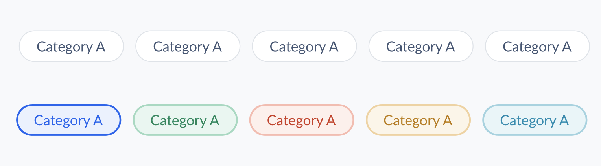

# Chip Decisions <!-- omit in toc -->

Chips embody a collection of selectable entities that empower users to engage in choices, sift through content, and invoke pertinent actions.

This document outlines the API details of the `Chip` and `ChipGroup` components, encompassing their structural composition, functional attributes, and visual representation.



- [Design](#design)
- [`Chip` API](#chip-api)
- [`CheckboxGroup` API](#chipgroup-api)
- [Examples](#examples)
  - [Basic/Uncontrolled Usage](#basicuncontrolled-usage)
  - [Controlled Usage](#controlled-usage)
- [Accessibility Considerations](#accessibility-considerations)
- [Open Questions](#open-questions)

## Design

[Figma Link](https://www.figma.com/file/jubmQL9Z8V7881ayUD95ps/Blade---Payment-Light?type=design&node-id=52377%3A27686&mode=design&t=pFzCay0x4a6sTcoQ-1) to all variants of the `Chip` component.

## `Chip` API

> **Note**
>
> The `Chip` component is inherently tied to the `ChipGroup` and cannot be utilized outside its context.

| Prop               | Type                                                                 | Default      | Description                                          | Required |
| ------------------ | -------------------------------------------------------------------- | ------------ | ---------------------------------------------------- | -------- |
| **children**       | `string`                                                             | `undefined`  | Renders the label text for the Chip                  | ✅       |
| **defaultChecked** | `boolean`                                                            | `false`      | Sets the default value for an uncontrolled component | ❌       |
| **icon**           | `Icon`                                                               | `undefined`  | Displays the Blade Icon component within the Chip    | ❌       |
| **isChecked**      | `boolean`                                                            | `false`      | Controls the Chip's checked state                    | ❌       |
| **isDisabled**     | `boolean`                                                            | `false`      | Disables or enables the Chip                         | ❌       |
| **size**           | `'xsmall' \| 'small' \| 'medium' \| 'large'`                         | `'small'`    | Specifies the size of the rendered Chip              | ❌       |
| **inputType**      | `'checkbox' \| 'radio'`                                              | `'checkbox'` | Determines the Chip's input type                     | ❌       |
| **variant**        | `'positive' \| 'negative' \| 'notice' \| 'information' \| 'neutral'` | `'neutral'`  | Sets the Chip's visual variant                       | ❌       |

## `ChipGroup` API

| Prop              | Type                                      | Default     | Description                                                      | Required |
| ----------------- | ----------------------------------------- | ----------- | ---------------------------------------------------------------- | -------- |
| **children**      | `React.ReactNode`                         | `undefined` | Accepts multiple `Chip` components                               | ✅       |
| **defaultValue**  | `string \|string[]`                       | `undefined` | Sets the initial value of the Chip group                         | ❌       |
| **value**         | `string \|string[]`                       | `undefined` | Acts as a controlled component by specifying the ChipGroup value | ❌       |
| **onChange**      | `({ value: string \| string[] }) => void` | `undefined` | Calls a function on any state change within the ChipGroup        | ❌       |
| **selectionType** | `'single' \| 'multiple'`                  | `'single'`  | Allows multiple selections within the ChipGroup                  | ❌       |

## Examples

Here are a few illustrative examples showcasing the utilization of the `Chip` and `ChipGroup` components:

### Basic/Uncontrolled Usage

Single Chip selection:

```jsx
<ChipGroup defaultValue="1">
  <Chip value="1">Single chip</Chip>
  <Chip value="2">Can be selected</Chip>
  <Chip value="3">At a time</Chip>
</ChipGroup>
```

Multiple Chip selection:

```jsx
<ChipGroup selectionType="multiple" defaultValue={['1', '2']}>
  <Chip value="1">Multiple chips</Chip>
  <Chip value="2">Can be selected</Chip>
  <Chip value="3">At a time</Chip>
</ChipGroup>
```

### Controlled Usage

```jsx
function Single() {
  // string value when selectionType is 'single' (default)
  const [selected, setSelected] = useState('react');

  return (
    <ChipGroup selectionType="single" value={value} onChange={({ value }) => setSelected(value)}>
      <Chip value="react">React</Chip>
      <Chip value="ng">Angular</Chip>
      <Chip value="svelte">Svelte</Chip>
      <Chip value="vue">Vue</Chip>
    </ChipGroup>
  );
}

function Multiple() {
  // array of strings value when selectionType is 'multiple'
  const [selected, setSelected] = useState(['react']);

  return (
    <ChipGroup selectionType="multiple" value={value} onChange={({ value }) => setSelected(value)}>
      <Chip value="react">React</Chip>
      <Chip value="ng">Angular</Chip>
      <Chip value="svelte">Svelte</Chip>
      <Chip value="vue">Vue</Chip>
    </ChipGroup>
  );
}
```

## Accessibility Considerations

The `Chip` and `ChipGroup` components are inherently designed to uphold accessibility standards.
They employ native `radio` and `checkbox` inputs, ensuring consistent keyboard event functionality, similar to native controls.
This adherence to established accessibility practices is further substantiated by the following guidelines:

- **Radio Accessibility** - The `Chip` component follows the [W3C ARIA Radio Pattern](https://www.w3.org/WAI/ARIA/apg/patterns/radio/) to ensure that users utilizing assistive technologies can seamlessly interact with and understand the radio selection mechanism.
- **Checkbox Accessibility** - Similarly, the `Chip` component aligns with the [W3C ARIA Checkbox Pattern](https://www.w3.org/WAI/ARIA/apg/patterns/checkbox/) to guarantee that users with disabilities can effectively engage with the checkbox selection paradigm.

These deliberate design choices manifest in a user experience that respects accessibility guidelines, enabling users of diverse abilities to interact with the components with equal ease.

## Open Questions

- Should we provide a `name` prop to the `ChipGroup` component, similar to the `RadioGroup` component?
