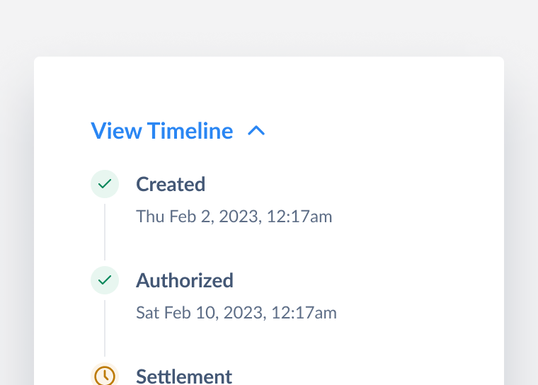
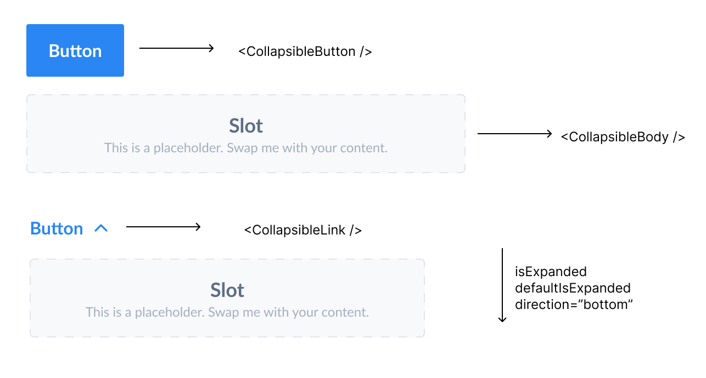

# Collapsible

Collapsible is used to allow users to toggle the visibility of hidden content within a container.

This document outlines the API of `Collapsible` component. This shares similarities with [Accordion's API](https://github.com/razorpay/blade/pull/1189).

<div align="center">
  
</div>

## Design

- [Figma - Collapsible](https://www.figma.com/file/LSG77hEeVYDk7j7WV7OMJE/Blade-DSL---Components-Guideline?type=design&node-id=79-629874&t=sVxH3DOnx3L3F9rO-0)

## Interactions

Collapsible shares the opening / closing interaction with Accordion:

### Collapsible button

https://github.com/razorpay/blade/assets/6682655/e37daea8-4cbb-42df-b33b-4d32dc0eab65

### Collapsible link

https://github.com/razorpay/blade/assets/6682655/eec42564-4a43-4449-96e1-7c81639d60e7

## API

Annotated component with props ([figma](https://www.figma.com/file/cX625jYMAX1Roq8hLifFrn/Collapsible-breakdown?type=design&node-id=0-1&t=2fpp9pyvcuMxVTjW-0)):



```jsx
import { Collapsible, CollapsibleButton, CollapsibleLink, CollapsibleBody } from '@razorpay/blade';

<Collapsible>
  <CollapsibleButton>Button</CollapsibleButton>
  <CollapsibleBody>
    <Box>Slot</Box>
  </CollapsibleBody>
</Collapsible>;

<Collapsible>
  <CollapsibleLink>Button</CollapsibleLink>
  <CollapsibleBody>
    <Box>Slot</Box>
  </CollapsibleBody>
</Collapsible>;
```

> **Note**
>
> - `Collapsible` will compose (`CollapsibleButton` or `CollapsibleLink`), `CollapsibleBody`. This ensures all interactions, a11y and animations work seamlessly at user end.
> - `CollapsibleButton` and `CollapsibleLink` will support a subset of relevant props from `Button` and `Link` respectively.

### Collapsible

| Prop              | Type            | Default     | Description                                                        | Required |
| ----------------- | --------------- | ----------- | ------------------------------------------------------------------ | -------- |
| children          | `JSX`           | `undefined` | Composes `CollapsibleButton`, `CollapsibleLink`, `CollapsibleBody` | ✅       |
| direction         | `bottom`, `top` | `bottom`    | Direction in which the content expands                             |          |
| defaultIsExpanded | `boolean`       | `false`     | Expands the collapsible content by default (uncontrolled)          |          |
| isExpanded        | `boolean`       | `undefined` | Expands the collapsible content (controlled)                       |          |
| onExpandChange    | `function`      | `undefined` | Callback for change in collapsible's expanded state                |          |

> **Note**
>
> - Also includes layout based styling props
> - For using collapsible in controlled state, use `isExpanded` coupled with `onExpandChange`
> - `onExpandChange` callback signature `({ isExpanded }) => {}`, `isExpanded` represents the collapsible's current state

### CollapsibleButton

Built-in trigger for `Collapsible`, provides a subset of `Button` [properties](../../Button/_decisions/decisions.md).

Supports ✅

- `children`
- `variant`
- `size`
- `icon`
- `iconPosition`
- `isDisabled`
- `testID`
- `accessibilityLabel`

Doesn't support ❌

- `isFullWidth` - can visually break UI
- `onClick`, `isLoading` - using `onClick` will break built-in interactions (unless we provide additional hooks), `onExpandChange` should already provide a way for users to listen-in on `Collapsible` state. This might have usage for async with `isLoading` in the future but for now not exposing the prop
- `type` - will be `button` always

### CollapsibleLink

Built-in trigger for `Collapsible`, provides a subset of `Link` [properties](../../Link/_decisions/decisions.md).

Supports ✅

- `children`
- `isDisabled`
- `size`
- `accessibilityLabel`
- `testID`

Doesn't support ❌

- `icon` - renders a chevron icon always
- `iconPosition` - will be `right` always for the chevron icon (which animates)
- `htmlTitle`
- `variant` - will always be `button`
- `onClick`
- `href`, `target`, `rel` - will always be a button

### CollapsibleBody

Slot for rendering `Collapsible` content

| Prop     | Type  | Default     | Description                      | Required |
| -------- | ----- | ----------- | -------------------------------- | -------- |
| children | `JSX` | `undefined` | Slot, renders any custom content | ✅       |

## a11y

Collapsible shares a11y concepts with accordion.

Web:

Follows the standard practices (aria expanded, controls, etc.) [ARIA guide - disclosure](https://www.w3.org/WAI/ARIA/apg/patterns/disclosure/), [ARIA guide - accordion](https://www.w3.org/WAI/ARIA/apg/patterns/accordion/) [example](https://www.w3.org/WAI/ARIA/apg/patterns/accordion/examples/accordion/#rps_label):

- <kbd>Enter</kbd> or <kbd>Space</kbd> can toggle collapsible
- Collapsible is focussable
- `aria-expanded` and `aria-controls` in the button trigger
- `aria-labelledby` and `role: region` in the content

Native:

- Some related properties from web will be applicable to native as well ([a11y guide](https://reactnative.dev/docs/accessibility))

## Usage

### Controlled state

```tsx
const App = () => {
  const [isExpanded, setIsExpanded] = useState(false);
  const onExpandChange = ({ isExpanded }) => setIsExpanded(isExpanded);

  return (
    <Collapsible isExpanded={isExpanded} onExpandChange={onExpandChange}>
      <CollapsibleLink>Answer to life, universe and everything</CollapsibleLink>
      <CollapsibleBody>
        <Text>42</Text>
      </CollapsibleBody>
    </Collapsible>
  );
};
```

## Alternatives

- Considered a more flexible API of using anything as a collapsible trigger instead of restricted wrappers over `Button` and `Link`. However, this can lead to inconsistencies and a11y issues _(because users will then have to handle all the a11y props and focus management)_.

## Implementation notes

For SEO purposes the collapsed content can be hidden with CSS.

Behavior wise Collapsible's interaction is similar to Switch (toggles between binary states) _with slight differences_

Collapsible shares the toggle interaction with Accordion. We can create abstractions that work for both plus other components such as tabs, switch, etc. (different from this public API spec):

- Build collapsible interaction on top of a base collapsible component that can be reused for accordion
- A disclosure based hook (references - [Chakra](https://chakra-ui.com/docs/hooks/use-disclosure), [Mantine](https://mantine.dev/hooks/use-disclosure/), [Paste](https://paste.twilio.design/components/disclosure))

Find in page (automatically expanding the collapsible if someone does <kbd>Cmd</kbd> + <kbd>F</kbd>) is a tricky feat, need to check feasibility and should be taken up as an enhancement (references - [blog by Anurag](https://dev.to/anuraghazra/thoughts-on-find-in-page-with-custom-accordion-elements-5573), [`hidden="until-found"`](https://github.com/WICG/display-locking/blob/main/explainers/hidden-content-explainer.md)).

## References

Prior art:

- [Mantine](https://mantine.dev/core/collapse/)
- [Reshaped](https://reshaped.so/content/docs/utilities/accordion)
- [Polaris](https://polaris.shopify.com/components/utilities/collapsible)
- [MUI](https://mui.com/material-ui/api/collapse/)
- [Paste](https://paste.twilio.design/components/disclosure#api)
- [Chakra](https://chakra-ui.com/docs/components/accordion/usage)
- [`react-native-collapsible`](https://github.com/oblador/react-native-collapsible)
