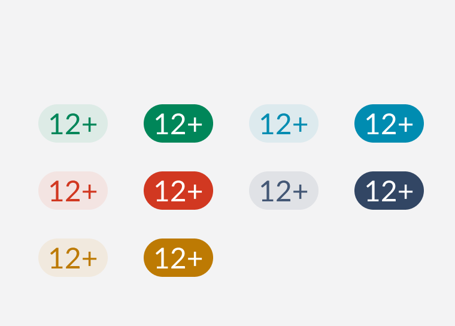

# Counter 

Counters are visual indicators that contains numerical values, tallies or counts in regards to some context.



## Design

[Figma Link](https://www.figma.com/file/jubmQL9Z8V7881ayUD95ps/Blade---Payment-Light?node-id=8222%3A70827) to all variants of the Counter component

## API

| Prop | Type | Default | Description | Required |
|---|---|---|---|---|
| value | `number` | `undefined` | The numeric value of the counter which will be shown. | ✅ |
| max | `number` | `undefined` | The max value of the counter, if the `value` exceededs `max` then the counter will show a `+` at the end. |  |
| intent | `positive`,`negative`, `notice`, `information`, `neutral` | `neutral` | The variant of the counter to be rendered. |  |
| contrast | `low`, `high` | `low` | The contrast of the counter to be rendered. |  |
| size | `medium`, `small` | `medium` | The size of the counter to be rendered. |  |

## Usage Example

```tsx
import { Counter } from '@razorpay/components';

<Counter 
  value={150}
  max={99}
  variant='positive'
  contrast='high'
/>
```

## Accessibility

- Only design accessibility needed

## Open Questions

- Similar to badge's [discussion around](https://github.com/razorpay/blade/blob/master/packages/blade/src/components/Badge/_decisions/decisions.md#variant-prop) naming the `intent` prop `variant` should we call it `variant`? 

## References

- [Primer](https://primer.style/react/CounterLabel)
- [Atlaskit](https://atlassian.design/components/badge/examples)
- [MUI](https://mui.com/material-ui/react-badge/)

