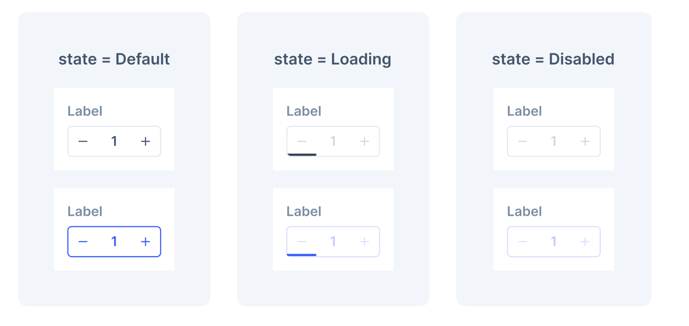

# CounterInput

CounterInput is a specialized input component that allows users to increment or decrement numerical values using built-in controls. It provides an intuitive interface for adjusting quantities, counts, or any numerical values with precise control through both manual text input and increment/decrement buttons. The component ensures accessibility and proper validation while maintaining consistency with the Blade design system.



## Design

- [Figma - CounterInput](https://www.figma.com/design/fGoYjy1l6hjqG759G6XZEF/-Research--Counter-Input?node-id=355-5352&p=f&t=qWOYF0Wfjslhe5DS-0)

## Anatomy


The CounterInput consists of:

- **Input Field**: Text input displaying the current numerical value
- **Decrement Button**: Button with minus icon to decrease the value
- **Increment Button**: Button with plus icon to increase the value

## API

Overall structure of the API showing the main usage pattern with realistic example:

```jsx
import { CounterInput } from '@razorpay/blade/components';

<CounterInput
  label="Quantity"
  value={1}
  onChange={({ value }) => setValue(value)}
  min={1}
  max={100}
  emphasis="intense"
  isLoading={false}
  isDisabled
  size="large"
/>;
```

<details>
  <summary>Alternate APIs</summary>

### Alternate API 1 - Separate increment/decrement handlers

```jsx
<CounterInput
  label="Quantity"
  value={1}
  onIncrement={(value) => setValue(value)}
  onDecrement={(value) => setValue(value)}
  onChange={({ value }) => setValue(value)}
  min={1}
  max={100}
/>
```

- Pros
  - Provides granular control over increment/decrement actions
  - Allows different logic for increment vs decrement operations
  - Can differentiate between button clicks and manual input
- Cons
  - More complex API with multiple event handlers
  - Increases API surface area unnecessarily for most use cases
  - The main `onChange` handler is sufficient for most scenarios

### Alternate API 2 - Custom step controls

```jsx
<CounterInput
  label="Quantity"
  value={1}
  onChange={({ value }) => setValue(value)}
  incrementStep={5}
  decrementStep={1}
/>
```

- Pros
  - Allows different step values for increment vs decrement
- Cons
  - Adds unnecessary complexity for most use cases
  - A single `step` prop is sufficient for typical scenarios
  - Inconsistent with standard HTML number input behavior

</details>

### Props

#### CounterInput

```typescript
type CounterInputCommonProps = Pick<
  BaseInputProps,
  | 'label'
  | 'accessibilityLabel'
  | 'labelPosition'
  | 'name'
  | 'onChange'
  | 'onFocus'
  | 'onBlur'
  | 'isDisabled'
  | 'testID'
  | 'isRequired'
  | keyof DataAnalyticsAttribute
> & {
  /**
   * The numerical value of the counter input
   */
  value?: number;

  /**
   * The default numerical value when component is uncontrolled
   */
  defaultValue?: number;

  /**
   * Minimum allowed value. When reached, the decrement button will be disabled
   * @default 0
   */
  min?: number;

  /**
   * Maximum allowed value. When reached, the increment button will be disabled
   * If not provided, the increment button will not be disabled
   */
  max?: number;

  /**
   * Visual emphasis of the counter input
   * @default 'subtle'
   */
  emphasis?: 'subtle' | 'intense';

  /**
   * Size of the counter input
   * @default 'medium'
   */
  size?: 'xsmall' | 'medium' | 'large';

  /**
   * Decides whether to show a loading spinner and disable interaction
   * @default false
   */
  isLoading?: boolean;

  /**
   * Event handler called when the value changes via increment, decrement, or manual input
   */
  onChange?: (args: { value: number }) => void;
} & StyledPropsBlade;

type CounterInputProps = {
  /**
   * Label to be shown for the counter input
   */
  label: string;
  /**
   * Accessibility label for the input (optional override)
   */
  accessibilityLabel?: string;
} & CounterInputCommonProps;
```

## Usage

### Basic Usage

```jsx
import { CounterInput } from '@razorpay/blade/components';

const App = () => {
  const [quantity, setQuantity] = useState(1);

  return (
    <CounterInput
      label="Quantity"
      value={quantity}
      onChange={({ value }) => setQuantity(value)}
      min={1}
    />
  );
};
```

### With Constraints and Emphasis

```jsx
import { CounterInput } from '@razorpay/blade/components';

const App = () => {
  const [amount, setAmount] = useState(100);

  return (
    <CounterInput
      label="Amount (₹)"
      value={amount}
      onChange={({ value }) => setAmount(value)}
      min={0}
      max={1000}
      emphasis="intense"
    />
  );
};
```

### With Loading State

```jsx
import { CounterInput } from '@razorpay/blade/components';

const App = () => {
  const [quantity, setQuantity] = useState(5);
  const [isUpdating, setIsUpdating] = useState(false);

  const handleChange = async ({ value }) => {
    setIsUpdating(true);
    await updateCart(value);
    setQuantity(value);
    setIsUpdating(false);
  };

  return (
    <CounterInput
      label="Items in Cart"
      value={quantity}
      onChange={handleChange}
      min={0}
      max={99}
      isLoading={isUpdating}
    />
  );
};
```

### Different Sizes

```jsx
import { CounterInput } from '@razorpay/blade/components';

const App = () => {
  const [quantity, setQuantity] = useState(3);

  return (
    <>
      <CounterInput
        label="Small Counter"
        value={quantity}
        onChange={({ value }) => setQuantity(value)}
        size="xsmall"
        emphasis="subtle"
      />
      <CounterInput
        label="Medium Counter"
        value={quantity}
        onChange={({ value }) => setQuantity(value)}
        size="medium"
        emphasis="intense"
      />
      <CounterInput
        label="Large Counter"
        value={quantity}
        onChange={({ value }) => setQuantity(value)}
        size="large"
        emphasis="subtle"
      />
    </>
  );
};
```

## Accessibility

- **Keyboard Navigation**: Full keyboard support with Tab navigation between increment/decrement buttons and input field
- **ARIA Labels**: Proper ARIA labels for increment/decrement buttons (`aria-label="Increment"` and `aria-label="Decrement"`)
- **ARIA Attributes**: Input field uses `role="spinbutton"`, `aria-valuemin`, `aria-valuemax`, and `aria-valuenow` attributes
- **Screen Reader Support**: Clear announcements for value changes and button states (enabled/disabled)
- **Button States**: Increment/decrement buttons are properly disabled when min/max limits are reached
- **Form Integration**: Supports standard form submission patterns
- **Focus Management**: Logical focus order from decrement button → input field → increment button

## Open Questions

- **Decimal Support**: Initial implementation focuses on integer values, decimal support can be added later if needed
- **Step Functionality**: Increment/decrement buttons change value by 1, no custom step values needed for initial implementation
