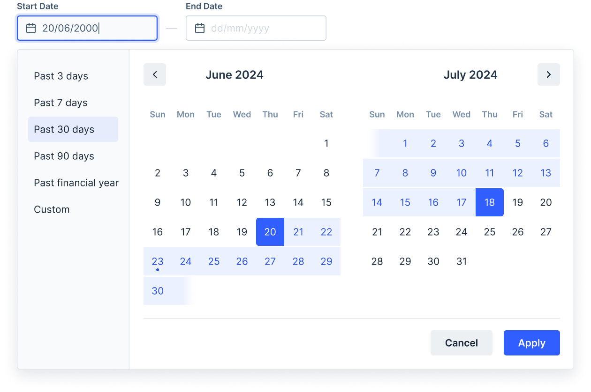
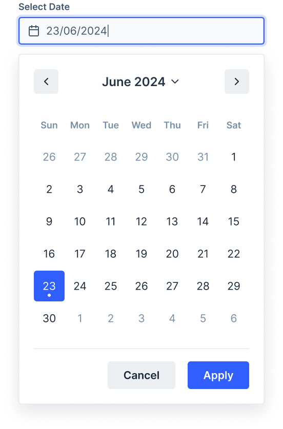
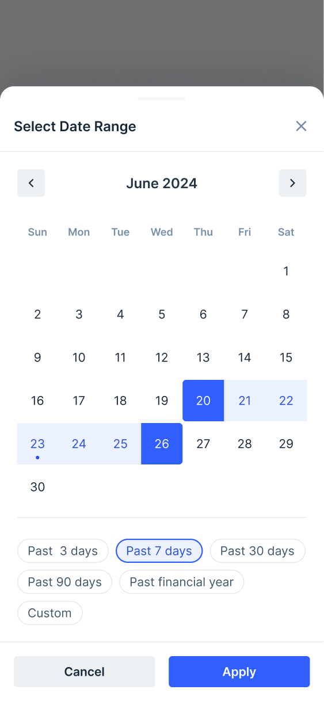

# DatePicker

The Date Picker component lets users select a date from a calendar. It is used to input a date or range of dates.


## Design

[Figma Link](https://www.figma.com/design/jubmQL9Z8V7881ayUD95ps/Blade-DSL?node-id=88832-1749327&m=dev) to all variants of the DatePicker component

## Anatomy



## Components

- Calendar (internal)
- DatePicker

## Basic Usage

```jsx
<DatePicker
  label="Pick date"
  selectionType="single"
  defaultValue={new Date()}
  onChange={(date) => {
    console.log('date selected', date);
  }}
/>
```

## API

### DatePicker API

```ts
type InputProps = Pick<
  BaseInputProps,
  | 'labelPosition'
  | 'validationState'
  | 'errorText'
  | 'successText'
  | 'helpText'
  | 'necessityIndicator'
  | 'isRequired'
  | 'isDisabled'
  | 'onFocus'
  | 'onBlur'
  | 'size'
  | 'autoFocus'
>;

type DatePickerProps = InputProps &
  CalendarProps & {
    /**
     * Label for the input
     * 
     * If labelPosition is set to "left" on range picker,
     * then we will take the `{ start }` label and render it on the left side of the input ignoring the `{ end }`
     */
    label?: string | { start: string, end?: string };
    /**
     * Sets the HTML name attribute
     */
    name?: string | { start: string, end: string };
    isOpen?: boolean;
    defaultIsOpen?: boolean;
    onOpenChange?: ({ isOpen }: { isOpen: boolean }) => void;
  };
```

### CalendarProps

```ts
type PickerType = 'date' | 'month' | 'year';
type DateRange = [Date, Date];
type Preset = {
  /**
   * Label for the preset
   *
   * @example 'Last 7 days'
   */
  label: string;
  /**
   * Value can be a range of dates
   *
   * @example with range selection
   * (date) => [dayjs().subtract(7, 'day'), dayjs()]
   */
  value: (date: Date) => DateRange;
};

type CalendarProps = {
  /**
   * Sets the selection mode of the calendar
   * @default 'single'
   */
  selectionType: 'single' | 'range';
  /**
   * Sets the picker type
   * @default 'date'
   */
  picker: PickerType;
  onPickerChange: (picker: PickerType) => void;

  // Standard controlled/uncontrolled state props
  value: Date | DateRange;
  defaultValue: Date | DateRange;
  onChange: (value: Date | DateRange) => void;

  /**
   * Defines presets for the date range picker
   *
   * @example with range selection
   * [
   *   { label: 'Last 7 days', value: (date) => [dayjs(date).subtract(7, 'day'), date] },
   *   { label: 'Last month', value: (date) => [dayjs(date).subtract(1, 'month'), date] },
   * ]
   */
  presets: Preset[];
  /**
   * Sets the first day of the week in the calendar.
   *
   * 0-6 (0=Sunday, 1=Monday, etc.)
   * @default 1
   */
  firstDayOfWeek: number;
  /**
   * Sets the minimum date that can be selected.
   */
  minDate?: Date;
  /**
   * Sets the maximum date that can be selected.
   */
  maxDate?: Date;
  /**
   * Determines whether single date can be selected as range, applicable only when type="range"
   * @default false
   */
  allowSingleDateInRange?: boolean;
  /**
   * Sets the locale for the calendar.
   *
   * @default 'en'
   */
  locale?: string;

  /**
   * Callback which is called whenever the next button is clicked.
   *
   * @param date - The updated date.
   * @param type - The level of the calendar. ("month" | "year" | "decade")
   */
  onNext?: ({ date, type }: { date: Date; type: Level }) => void;
  onPrevious?: ({ date, type }: { date: Date; type: Level }) => void;
};
```

## Examples

### Selection Type

DatePicker support two selection mode, `single` and `range`

```jsx
<DatePicker
  selectionType={"single" | "range"}
/>
```




### Controlled DatePicker

```jsx
function ControlledDatePicker() {
  const [selectedDate, setSelectedDate] = React.useState<DateValue>(new Date());

  return (
    <DatePicker
      label="Pick date"
      selectionType="single"
      value={selectedDate}
      onChange={setSelectedDate}
    />
  );
}
```

### DatePicker Presets

```jsx
function DatePickerWithPresets() {
  return (
    <DatePicker
      label="Pick date"
      selectionType="range"
      presets={[
        { label: 'Past 7 days', value: (date) => [dayjs(date).subtract(7, 'day'), date] },
        { label: 'Past month', value: (date) => [dayjs(date).subtract(1, 'month'), date] },
      ]}
    />
  );
}
```

### Mobile UX

On mobile the DatePicker will automatically be converted to a BottomSheet, consumers do not need to handle anything manually for this.




<details>

<summary>Alternative Approaches</summary>


## Calendar + Dropdown Composition

The `Calendar` component is used to select a date or range of dates. It can be used standalone or in conjunction with the `Dropdown` component to select a date/date range.

Advantage of using this composition pattern is that we can also add additional components like `TimePicker` inside the `DropdownOverlay`.

```jsx
import { Calendar, Dropdown, DropdownButton, DropdownOverlay } from '@razorpay/blade/components';
import { getFormattedDate } from '@razorpay/blade/utils';

function WithDropdown(): React.ReactElement {
  const [selectedDate, setSelectedDate] = React.useState < DateValue > new Date();
  const [isOpen, setIsOpen] = React.useState(false);

  return (
    <Dropdown isOpen={isOpen} onOpenChange={setIsOpen}>
      <DropdownButton>
        {getFormattedDate({
          date: selectedDate,
          format: 'DD/MM/YYYY',
          type: 'default',
        })}
      </DropdownButton>
      <DropdownOverlay>
        <Calendar
          value={selectedDate}
          onChange={(date) => {
            setSelectedDate(date);
            setIsOpen(false);
          }}
        />
        {/* <TimePickerComponentMaybeInFuture /> */}
      </DropdownOverlay>
    </Dropdown>
  );
}
```

While this works there are some usability issues with Dropdown:

The dropdown is not modular in a way which enables consumers/us to compose it with other components.
Eg: Dropdown+Calendar or say Dropdown+ColorPicker

issues:

- When the dropdown is opened the first item on ActionList is not automatically focused
- There is no way to set `initialFocusRef`
- When the dropdown is closed by clicking outside, the focus doesn't goes back to DropdownButton (this works if we use ActionList inside)
- `Esc` key doesn't work if there is custom content inside DropdownOverlay, in this case Calendar.

I've done a [POC comparision](https://stackblitz.com/edit/rgfjds?file=App.tsx) between Dropdown vs Popover to highlight the differences.

And we haven't even considered the mobile experience yet.

## Alternative Composition Approach

Ditch Dropdown & use a custom DatePicker API:

API Similar to Popover:

```jsx
<DatePicker
  isOpen={isOpen}
  onOpenChange={setIsOpen}
  content={
    <Box>
      <Calendar />
      <SomeOtherComponent />
    </Box>
  }
  {...calendarProps}
>
  <Button>Open DatePicker</Button> or <DatePickerInput />
</DatePicker>
```

API Similar to Dropdown:

```jsx
<DatePicker
  isOpen={isOpen}
  onOpenChange={setIsOpen}
  {...calendarProps}
>
  <Button>Open DatePicker</Button> or <DatePickerInput />
  <DatePickerOverlay>
    <Calendar />
    <SomeOtherComponent />
  </DatePickerOverlay>
</DatePicker>
```

> NOTE: One thing to mind in these two approaches is that we will have to accept all the CalendarProps in the DatePicker component so that the state/props are uplifted and we can pass it to DatePickerInput or Calendar down.

Pros:

- More control over the focus management, UX & accessibility
- We can provide out of the box mobile support (eg turning popover into bottomsheet on mobile)
- State management of the DatePickerInput can be handled by us

### Conclusion

Given the issues with the Dropdown component composition and the complexity of handling many edgecases and the scope of the DatePicker component only being used with an Input component we should go with the `<DatePicker />` component approach, where we have total control over the UX/behaviour of the component & can automatically handle the focus management, accessibility, mobile bottomsheet etc.

But still we could expose Calendar as a standalone component for advanced usecases.

</details>

## Accessibility

Accessibility will mostly be handled by mantine,
We will just need to make sure if we provide composition capabilities like Dropdown+Calendar those composed components are working correctly & are usable/accessible.

## Open Questions

- How should we approach locale?
- What should we do about the triggers? will be have buttons/inputs both?
  - We will only have inputs as triggers

## Integration with i18nify

We need to figure out how to integrate the date picker with i18nify,

Current challenges:

- The mantine date picker uses dayjs and it has it's own locale system it requires the locale to be set in the dayjs instance plus the locale file has to be imported separately.
- The dayjs locale names and the i18nify locale names are different, so we need to map them.
- We should not load all the locale files upfront, it will be around ~30kb gzip if we do so.

```js
// Consumer will have to import this file so that locale works
import 'dayjs/locale/my';

<DatePicker locale="my" />;
```

https://github.com/iamkun/dayjs/issues/1041

## References

- [DatePicker Library Exploration](https://docs.google.com/document/d/1PJ9gT-P38vHufKDzxEzPvDY5IjsI_HeBGg-9gVaC7vU/edit?usp=sharing)
  - We will be using [mantine](https://mantine.dev/dates/date-picker-input/) for the DatePicker component as it suffices all the requirements and is highly customizable.
