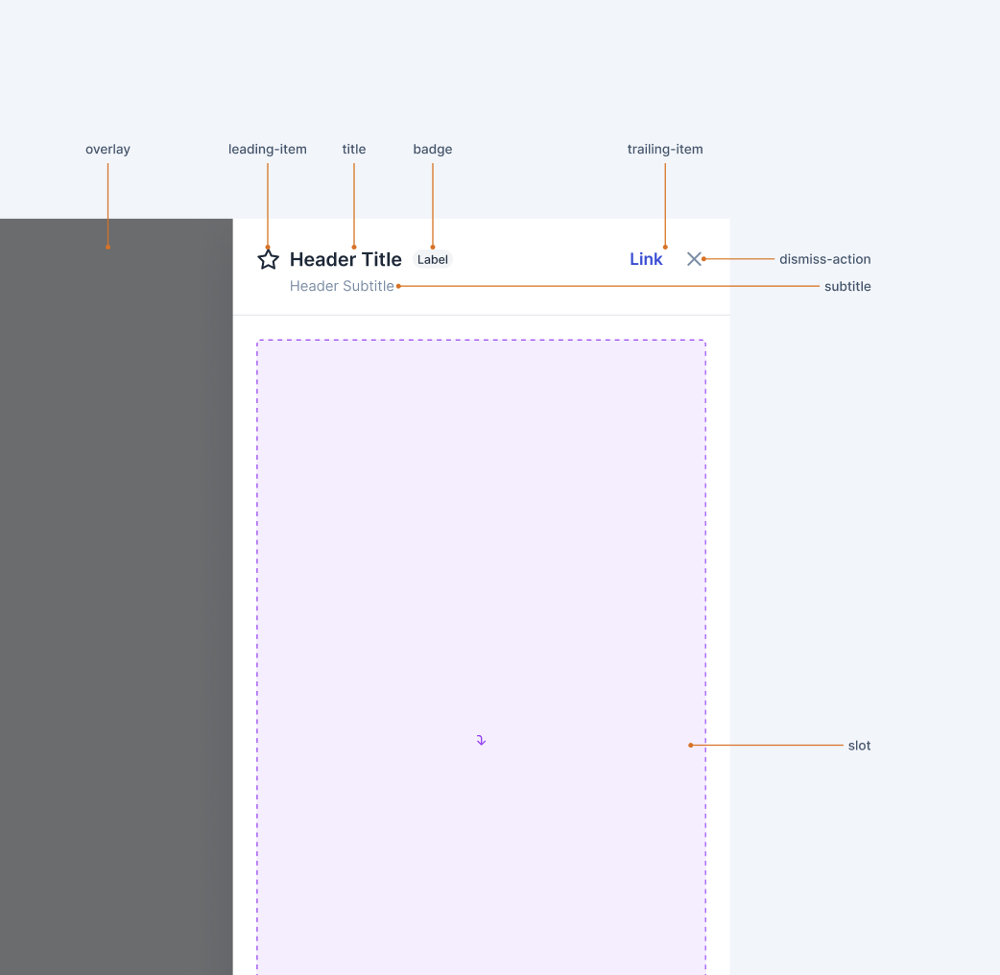
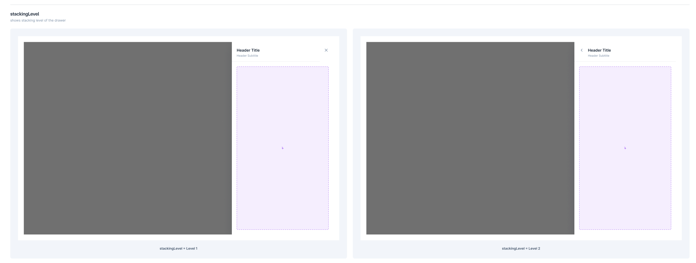

# Drawer

A drawer is a panel that slides in mostly from right side of the screen over the existing content in the viewport. It helps in providing additional details or context and can also be used to promote product features or new products.



## Design

- [Drawer - Figma Design](https://www.figma.com/file/jubmQL9Z8V7881ayUD95ps/Blade-DSL?node-id=78667%3A66663&mode=dev)

## Proposed API

```jsx
<Drawer
  isOpen={}
  onDismiss={() => {}}
  showOverlay
>
  <DrawerHeader
    title=""
    subtitle=""
    leading={<DrawerHeaderIcon />}
    titleSuffix={<DrawerHeaderBadge />}
    trailing={
      <>
        <Link />
        <Button />
      </>
    }
  />
  <DrawerBody>
    <Slot />
  </DrawerBody>
<Drawer>
```

<details>
<summary><b>Full Usage Example</b></summary>

```jsx
const MyCuteDrawer = () => {
  const [showDrawer, setShowDrawer] = React.useState(false);
  return (
    <Box>
      <Button onClick={() => setShowDrawer(true)}>Open Drawer</Button>
      <Drawer
        isOpen={showDrawer}
        onDismiss={() => {
          setShowDrawer(false);
        }}
      >
        <DrawerHeader
          title="Announcements"
        />
        <DrawerBody>
          <FTXAnnouncement />
          <RazorpayOnePromotions />
          <CatPictures />
        </DrawerBody>
      <Drawer>
    </Box>
  )
}

```

</details>

### Props

```ts
type DrawerProps = {
  /**
   * Controlled state of drawer open or not
   */
  isOpen: boolean;

  /**
   * Dismiss handler
   */
  onDismiss: () => void;

  /**
   * Show or hide overlay.
   *
   * Also decides if clicking outside on overlay closes the drawer or not
   */
  showOverlay?: boolean;

  /**
   * Initial focus reference element
   */
  initialFocusRef?: React.MutableRefObject<any>;

  /**
   * children node.
   *
   * Supports DrawerHeader and DrawerBody
   */
  children: React.ReactNode;

  /**
   * Override z-index of Drawer.
   *
   * @default 1002
   */
  zIndex?: number;

  /**
   *  Accessibility label for the drawer
   */
  accessibilityLabel?: string;
};

type DrawerHeaderProps = {
  /**
   * Title of the Drawer
   */
  title: string;

  /**
   * Subtitle of the Drawer
   */
  subtitle?: string;

  /**
   * Leading element
   *
   * DrawerHeaderIcon or DrawerHeaderAsset
   */
  leading?: ReactNode;

  /**
   * Title suffix element
   *
   * DrawerHeaderBadge
   */
  titleSuffix?: ReactNode;

  /**
   * Title trailing element
   *
   * Link, Button[]
   */
  trailing?: ReactNode;
};
```

Other supporting wrapper components for trailing and leading space-

- DrawerHeaderBadge
- DrawerHeaderIcon
- DrawerHeaderAsset

_No alternate APIs were considered because Drawer is closer to Modal on overall meaning and API perspective so made sense to go with API that is closer to Modal, also all DS Drawer components I referenced have similar API_

## Drawer Stacking

- Only 2 Drawers can be stacked on top of each other
- 2nd Drawer always has overlay independent of `showOverlay` prop
- 2nd Drawer always has back button instead of close button. Clicking on back button closes the 2nd drawer.



## Accessibility

- **Aria Attributes:** Drawer will have `aria-modal="true"` and `role="dialog"` and will be treated as modal for voiceover users.
- **Focus Handling:** Ensure Close Icon and Back Icon is focussable
- **Keyboard Handling:** Pressing `ESC` should close the drawer

Will work in a similar manner as [Ant Design - Drawer](https://ant.design/components/drawer)

## References

- https://atlassian.design/components/drawer/examples
- https://ant.design/components/drawer

## Open Questions
