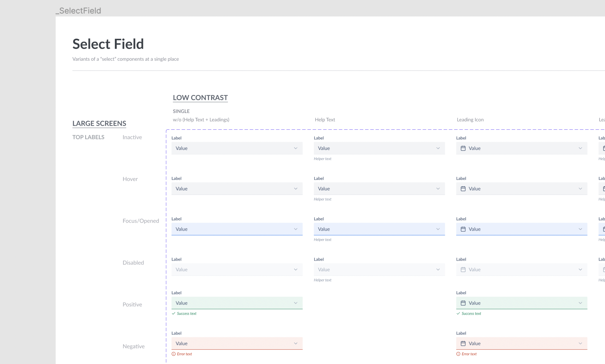

# Dropdown & ActionList

> **Warning**
>
> This document is in progress. Come back later 🏗 🚧 👷🏽

**Top-View Skeleton**

```jsx
<Dropdown variant="single">
  <Dropdown.Select />
  <Dropdown.Overlay>
    <ActionList>{/* ActionList components ... */}</ActionList>
  </Dropdown.Overlay>
</Dropdown>
```

---

- [Dropdown](#dropdown)
- [Dropdown.Select](#dropdownselect)
- [Dropdown.Overlay](#dropdownoverlay)
- [ActionList](#actionlist)

---

## Dropdown

`Dropdown` will be a wrapper component which will handle to logic of opening and closing of the dropdown. It won't separately render anything in UI apart from the first children. (E.g. `Dropdown.Select` in above example)

### API

```jsx
<Dropdown>{/* Dropdown sub-components */}</Dropdown>
```

Props

```ts
type DropdownProps = {
  /**
   * Variant of the Dropdown.
   *
   * @default single
   */
  variant: 'single' | 'multi';
};
```

## Dropdown.Select



Select is an Input Field that can open a dropdown on click. It can be extended from `BaseInput` component which covers most decisions like validations, focus, etc.

### Designs

- [Figma - Select](https://www.figma.com/file/jubmQL9Z8V7881ayUD95ps/Blade---Payment-Light?node-id=13590%3A171090&t=KTWGvEUBEuUdQh9K-0)

### API

Sample Usage

```jsx
<Dropdown.Select
  helpText="Select only one"
  label="Your favorite Design System"
  labelPosition="top"
  leadingIcon={true}
/>
```

Props

TODO: change into table

```ts
type SelectProps = {
  label: string;
  labelPosition?: 'top' | 'left';
  leadingIcon?: boolean;
  helpText?: string;
};
```

### A11y

Would be ideal if we can render it as `Button` with `aria-expanded` prop to handle state of dropdown open and close

## Dropdown.Overlay

An Overlay that positions dropdown correctly. Also a wrapper for `React Portal`.

The animations for dropdown and Aria attributes like `aria-multiselectable="true"` `role="listbox"` like things can be added on Dropdown overlay here.

### API

```jsx
<Dropdown>
  <Dropdown.Select label="Click For Greetings" />
  <Dropdown.Overlay>Hi</Dropdown.Overlay>
</Dropdown>
```

---

# Rough

## ActionList

#### Rough Skeleton

Excalidraw Brainstorm: https://excalidraw.com/#json=wNtX7qdgxp5DFQYH0MqFV,RqiMTaQLoW0esjXBWm_1jg

```jsx
<Select />
<Overlay>
  <ActionList variant="single-select">
    <ActionList.SectionHeading/>
    <ActionList.Item
      title="Something"
      description="some description"
    >
      <ActionListItem.Leading>{}</ActionListItem.Leading>
      <ActionListItem.Trailing>{}</ActionListItem.Trailing>
      <Overlay>
        <ActionList>
          <ActionList.Item />
        </ActionList>
      </Overlay>
    </ActionList.Item>
    <ActionList.Input/>
    <ActionList.Divider/>
  </ActionList>
</Overlay>
```

## Accessibility

- For single select, we should have `role=menu` on the container
- For multi select,
  - we should have `role=listbox` and `aria-multiselectable=true` on the container (because `role=menu` is expected to close on one click)
  - Input search/filter should be outside of this container
    Refer: https://primer.style/react/storybook/?path=/story/components-selectpanel--multi-select-story

## Open Questions

- Can we render `<Dropdown.Select>` as `button` element? (will help with accessibility)
- Vote: `<Dropdown variant="multi" />` vs `<Dropdown type="multi" />`

## Referrences

- https://www.radix-ui.com/docs/primitives/components/dropdown-menu
- Primer React
- Sid's talk on API designs

```jsx
<Dropdown>
  <Dropdown.Select />
  <Dropdown.Overlay>
    <ActionList>
      <ActionList.SectionHeading />
      <ActionList.Item>
        <ActionList.Leading></ActionList.Leading>
        <ActionList.Trailing></ActionList.Trailing>
      </ActionList.Item>
      <ActionList.Divider />
    </ActionList>
  </Dropdown.Overlay>
</Dropdown>
```

so that the component can be more genericly used in Tooltips, Select, Autocomplete, etc. We might go with `Dropdown` as a wrapper on top of `Overlay`

```

```
