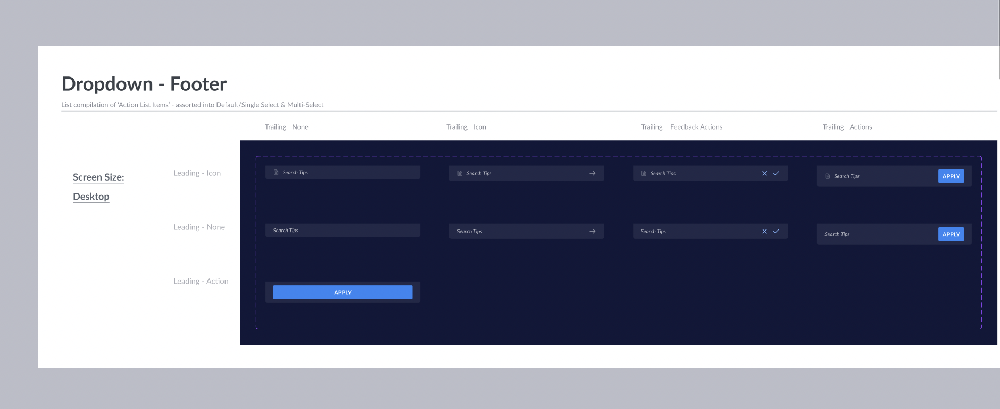

# Dropdown & ActionList

**Top-View Skeleton**

```jsx
<Dropdown>
  <Dropdown.SelectInput label="Item Selection" />
  <Dropdown.Overlay>
    <ActionList>
      <ActionList.Item title="Item Value" value="item-one" />
      <ActionList.Item title="Item Value" value="item-two" />
    </ActionList>
  </Dropdown.Overlay>
</Dropdown>
```

---

## Navigation

- [Dropdown](#dropdown)
  - [Dropdown.SelectInput](#dropdownselectinput)
  - [Dropdown.Overlay](#dropdownoverlay)
- [ActionList](#actionlist)
  - [ActionList Parent Component](#actionlist-parent-component)
  - [ActionList.Item](#actionlistitem)
  - [ActionList.Section](#actionlistsection)
  - [ActionList.Header](#actionlistheader)
  - [ActionList.Footer](#actionlistfooter)
- [Why `x` instead of `y`](#why-x-instead-of-y)
- [Accessibility](#accessibility)
- [Open Questions](#open-questions)
- [Referrences](#referrences)

---

## Dropdown

`Dropdown` will be a wrapper component which will handle to logic of opening and closing of the dropdown. It won't separately render anything in UI apart from the first children. (E.g. `Dropdown.SelectInput` in above example)

### API

Usage

```jsx
<Dropdown>{/* Dropdown sub-components */}</Dropdown>
```

Props

_No Props Needed_

### Dropdown.SelectInput


Select is an Input Field that can open a dropdown on click. It can be extended from `BaseInput` component which covers most decisions like validations, focus, etc.

#### Designs

- [Figma - Select](https://www.figma.com/file/jubmQL9Z8V7881ayUD95ps/Blade---Payment-Light?node-id=13590%3A171090&t=KTWGvEUBEuUdQh9K-0)

#### API

Sample Usage

```jsx
<Dropdown.SelectInput
  icon={CalendarIcon}
  label="Your favorite Design System"
  helpText="Select only one"
/>
```

Props

Mostly similar to other `Input` components extended from `BaseInput`

```ts
type SelectInputProps = {
  // ... FormLabelProps like `label`, `labelPosition`
  // ... FormValidationProps like `validationState`, `helpText`, `errorText`, etc.
  // ... State Props like `isRequired`, `isDisabled`,
  icon: IconComponent;
};
```

#### A11y

Would be ideal if we can render it as `button` with `aria-expanded` prop to handle state of dropdown open and close

### `Dropdown.Overlay`

An Overlay that positions dropdown correctly.

The animations for dropdown and Aria attributes like `aria-multiselectable="true"` `role="listbox"` like things can be added on Dropdown overlay here based on variant passed to `Dropdown` component.

#### API

```jsx
<Dropdown>
  <Dropdown.SelectInput label="Click For Greetings" />
  <Dropdown.Overlay>Hi</Dropdown.Overlay>
</Dropdown>
```

It won't accept any props apart from children.

<br/><br/>

## ActionList

Plain list that can be rendered inside dropdown, in navigation menu, or anywhere. It has selectable items that perform some action on click. It can also have multiple selectable items that render as checkboxes


### Design

- [Figma - ActionList]()

### API

#### Simplest Usage Possible

```jsx
<ActionList
  backgroundLevel={2}
  onChange={(e) => {
    console.log({ name: e.name, values: e.values });
  }}
>
  <ActionList.Item
    title="Accept API"
    value="accept"
    desciption="Accept this API"
    leading={<StarIcon />}
    trailing={<Text>⌘ + Space + A</Text>}
    onClick={() => {}}
  />
  <ActionList.Item
    title="Delete"
    desciption="Delete this value"
    value="delete"
    intent="negative"
    leading={<TrashIcon />}
    trailing={<Text>⌘ + Space + D</Text>}
    onClick={() => {}}
  />
</ActionList>
```

#### Most Complex Usage Possible

```jsx
<ActionList backgroundLevel={2}>
  <ActionList.Header title="Recent Searches" icon={HistoryIcon} />
  <ActionList.Section title="Section Heading">
    <ActionList.Item
      title="Accept API"
      value="accept"
      desciption="Accept this API"
      leading={<StarIcon />}
      trailing={<Text>⌘ + Space</Text>}
    />
  </ActionList.Section>
  <ActionList.Item
    title="Delete"
    desciption="Delete this value"
    value="delete"
    intent="negative"
    leading={<TrashIcon />}
    trailing={<Text>⌘ + Space + D</Text>}
  />
  <ActionList.Footer
    title="Footer Title"
    description="Footer Description"
    leading={<DocIcon />}
    trailing={
      <>
        <Button variant="secondary">Secondary Button</Button>
        <Button>Primary Button</Button>
      </>
    }
  />
</ActionList>
```

<details>
<summary>Alternate Prop-based API</summary>

**Props and constrained**

```jsx
<ActionList backgroundLevel={2}>
  <ActionList.Header title="Recent Searches" icon={HistoryIcon} />
  <ActionList.SectionHeading title="Hello" />
  <ActionList.Item
    title="Item Value"
    desciption="Item Description"
    leading={StarIcon} // Can be IconComponent type or Image URL
    trailing="⌘ + Space"
  />
  <ActionList.Divider />
  <ActionList.Footer
    title="Footer Title"
    description="Footer Description"
    leading={DocIcon}
    trailing={{
      primary: {
        onClick: () => {},
        text: 'Primary Action',
      },
    }}
    // OR
    trailing={ArrowRightIcon}
    // OR
    trailing={{
      primary: {
        onClick: () => {
          console.log('Feedback Yes Clicked');
        },
        icon: CheckIcon,
      },
      secondary: {
        onClick: () => {
          console.log('Feedback No Clicked');
        },
        icon: CrossIcon,
      },
    }}
  />
</ActionList>
```

</details>

### `ActionList` Parent Component

Wrapper for all ActionList compound components. Should handle the logic of selections.

#### API

Usage

```jsx
<ActionList>{/* Child components */}</ActionList>
```

Props

```ts
type ActionListProps = {
  children: React.ReactNode;
  /**
   * Renders simple menu or checkboxes depending on the variant
   *
   * @default single
   */
  variant?: 'single' | 'multiple';
  /** Callback that gets called when item is checked/clicked */
  onChange?: () => void;
  /**
   * Changes the background surface level color
   *
   * @default 2
   */
  backgroundLevel: 2 | 3;
};
```

### `ActionList.Item`


#### Design

- [Figma - ActionListItem / Body](https://www.figma.com/file/sAdplk2uYnI2ILnDKUxycW/Blade---Banking-Dark?node-id=13136%3A378703&t=RoEboUS3qWdStKK6-0)

#### API

Usage

```jsx
<ActionList.Item
  title="Accept API"
  value="accept"
  desciption="Accept this API"
  leading={<StarIcon />}
  intent="negative"
  trailing={<Text>⌘ + Space + A</Text>}
  onClick={() => {
    console.log('Item clicked');
  }}
/>
```

Props

```ts
type ActionListItemProps = {
  title: string;
  description: string;
  /** Value that we use in JS form. Similar to `value` in `Checkbox` */
  value: string;
  /**
   * Leading Icon or assets. Accepts JSX Component
   */
  leading?: React.ReactNode;
  /**
   * Trailing Assets. Should ideally be Text component for now
   */
  trailing?: React.ReactNode;
  /**
   * Changes item color to red
   *
   * @default neutral
   */
  intent?: 'negative' | 'neutral';
  /** Click event on item */
  onClick?: () => void;
  /** URL. Should render item as `a` when this is passed */
  href?: string;
};
```

### `ActionList.Section`

Just an API that wraps section inside ActionList. This entire component is optional.

It should also add divider after all items.

#### API

```jsx
<ActionList>
  <ActionList.Section title="Section Heading">
    <ActionList.Item
    // ...props
    />
  </ActionList.Section>
</ActionList>
```

#### Props

```ts
type ActionListSectionProps = {
  /** Section Heading. Should be optional */
  title?: string;
};
```

### `ActionList.Header`

Header of the ActionList


#### Design

- [Figma - ActionListItem / Header](https://www.figma.com/file/sAdplk2uYnI2ILnDKUxycW/Blade---Banking-Dark?node-id=13136%3A378703&t=RoEboUS3qWdStKK6-0)

#### API

Usage

```jsx
<ActionList.Header title="Recent Searches" icon={HistoryIcon} />
```

Props

```ts
type ActionListHeaderProps = {
  title: string;
  icon: IconComponent;
};
```

### `ActionList.Footer`

> **Warning**
>
> API yet to be finalized

Footer of the ActionList



#### Design

- [Figma - ActionListItem / Footer](https://www.figma.com/file/sAdplk2uYnI2ILnDKUxycW/Blade---Banking-Dark?node-id=13136%3A378703&t=RoEboUS3qWdStKK6-0)

#### API

**Usage**

Simple Usage

```jsx
<ActionList.Footer title="Footer Title" description="Footer Description" />
```

With Feedback Variant

```jsx
<ActionList.Footer
  title="Footer Title"
  description="Footer Description"
  leading={<DocIcon />}
  trailing={
    <>
      <IconButton onClick={} icon={CloseIcon} />
      <IconButton onClick={} icon={CheckIcon} />
    </>
  }
/>
```

With Only Primary Button

```jsx
<ActionList.Footer trailing={<Button onClick={}>Apply</Button>} />
```

**Props**

```ts
type ActionListFooter = {
  title?: string;
  description?: string;
  /** Leading Asset. Ideally Icon but can be any JSX component */
  leading?: React.ReactNode;
  /** Trailing Actions. Buttons, Icons, etc */
  trailing?: React.ReactNode;
};
```

<details>
<summary>Alternate Footer API</summary>

**More restrictive and prop-based**

```jsx
<ActionList.Footer
  title="Footer Title"
  description="Footer Description"
  leadingIcon={DocIcon}
  trailingActions={{
    primary: {
      onClick: () => {
        console.log('Apply clicked');
      },
      text: 'Apply',
    },
  }}
  // OR
  trailingActions={{
    feedbackYes: {
      onClick: () => {
        console.log('Feedback Yes Clicked');
      },
    },
    feedbackNo: {
      onClick: () => {
        console.log('Feedback No Clicked');
      },
    },
  }}
  // OR
  trailingIcon={ArrowForward}
/>
```

</details>

<br/><br/>

## Why `X` instead of `Y`?

### Flexible instead Constrained API

So far we've been having constrained APIs which worked well. The difference here is, Dropdown in itself is a large component so if one of those contrains don't work for a particular team, they should not have to completely opt-out of the Dropdown. There has to be a simpler escape-hatch for them.

For this reason, you would see us passing entire JSX components instead of limiting it to specific type like we do in other components.

### JSX props instead of Compound Components

Compound components add complex nesting in larger APIs (Check out previously considered API example below). To avoid complex nesting, we're going ahead with prop-based approach where we pass JSX components as props.

<details>
<summary>Previously considered compound component API</summary>

```jsx
<ActionList backgroundLevel={2}>
  <ActionList.Header title="Recent Searches" icon={HistoryIcon} />
  <ActionList.SectionHeading title="Hello" />
  <ActionList.Item title="Item Value" desciption="Item Description" variant="negative">
    <ActionList.Leading>
      <StarIcon />
    </ActionList.Leading>
    <ActionList.Trailing>
      <Text>⌘ + Space</Text>
    </ActionList.Trailing>
  </ActionList.Item>
  <ActionList.Divider />
  <ActionList.Footer title="Footer Title" description="Footer Description">
    <ActionList.Leading>
      <DocIcon />
    </ActionList.Leading>
    <ActionList.Trailing>
      <Button variant="secondary" onClick={}>
        Secondary Button
      </Button>
      <Button onClick={}>Primary Button</Button>
    </ActionList.Trailing>
  </ActionList.Footer>
</ActionList>
```

</details>

### Custom Implementation instead of Library

> **Note**
>
> Didn't get too much into implementation details during API decisions. Would recommend evaluating this once again while implementing the Dropdown.

TLDR; Felt like our Dropdown was a bit more complicated than other dropdowns we've seen so we might have to fight against existing opinions from libraries if we go with libraries.

Some libraries we evaluated

- [downshift-js](https://github.com/downshift-js/downshift)

  If we decide to go with library, this will definitely be the first thing we can explore.

  - 😄 Covers the accessibility and gives controls to consumers for styling
  - 🙁 Their API seemed a bit verbose and difficult to implement at first so unsure if it's worth adding library. (We should definitely refer to their Markup for accessibility practices though)
  - 😐 Around 20kb (~10kb for Select and ~10kb for MultiSelect)

- [@radix-ui/react-dropdown-menu](https://www.radix-ui.com/docs/primitives/components/dropdown-menu)
  - 😄 Covers the accessibility gives basic styling
  - 🙁 The items are also `Dropdown` compound components so we will have to tie our `ActionList.Item` to `DropdownMenu.Item`. Which means `ActionList` can't be used outside of `Dropdown`?
  - 🙁 Opinionated so we might face more of such ^^ blockers as we discover more usecases.

<br/><br/>

## Accessibility

- For single select, we should have `role=menu` on the container and `role=menuitem` on list items
- For multiple select,

  - we should have `role=listbox` and `aria-multiselectable=true` on the container (because `role=menu` is expected to close after one item is selected)
  - Input search/filter should be outside of this container
    Refer: https://primer.style/react/storybook/?path=/story/components-selectpanel--multi-select-story

- Dropdown is supposed to open when you focus on select and press `ENTER` or any of the arrow keys. Arrow Up and Down can be pressed to move to next and previous items in the action list.

<br/><br/>

## Open Questions

### Dev

- Vote: `variant` or `type` attribute on `Dropdown`?

  `<Dropdown variant="multiple" />` vs `<Dropdown type="multiple" />`

- Should we call description/subtitle as `subtitle` everywhere, `description` everywhere, or change based on usage (E.g. See `ActionList.Item` component above).

- `ActionList.Footer` `trailing` prop should allow all JSX components or limit to existing usecases (check Alternate API in [`ActionList.Footer` section](#actionlistfooter))

### Design

- Should we have some type of "Select All" button to select all in multiple select variant?

<br/><br/>

## Referrences

- [Primer React's ActionMenu](https://primer.style/react/storybook/?path=/story/deprecated-components-actionmenu--action-menu-with-external-anchor)
- [Primer React's Select Panel](https://primer.style/react/storybook/?path=/story/components-selectpanel--multi-select-story)
- [Code crimes for good component APIs by Siddharth Kshetrapal - React India 2022](https://youtu.be/kr6V4TN09ws)
- [Radix UI Dropdown](https://www.radix-ui.com/docs/primitives/components/dropdown-menu)
- [MDN `role="menu"` Docs](https://developer.mozilla.org/en-US/docs/Web/Accessibility/ARIA/Roles/menu_role)
- [downshift-js](https://www.downshift-js.com/use-multiple-selection)

<br/><br/>

fin 🌻
