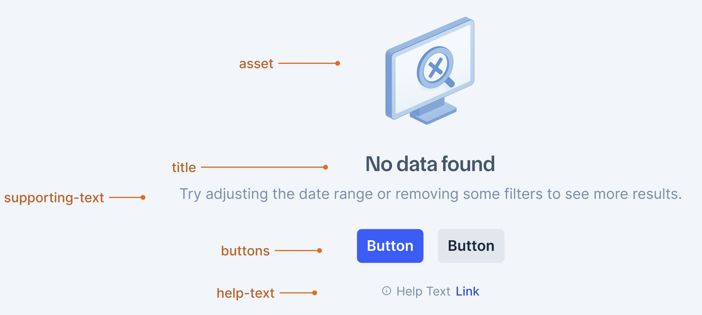

# EmptyState

EmptyState is a component that displays a visual placeholder when there is no content available in a particular view or section. It provides context, guidance, and actions to help users understand why content is missing and what they can do next.

- [Design](#design)
- [Anatomy](#anatomy)
- [API](#api)
- [Alternate APIs](#alternate-apis)
- [Props](#props)
- [Examples](#examples)
- [Accessibility](#accessibility)
- [Decisions Made](#decisions-made)

## Design

- [Figma - EmptyState](https://www.figma.com/design/UTlH5NpDte6c9L7o8z93vd/-Research--Empty-States?node-id=582-85262&m=dev)

## Anatomy



Components:

- EmptyState
  - Asset Slot (Image/Illustration)
  - Title
  - Description
  - Children (Actions/Links)

## API

**Final API** - Flexible Slot-based API with children pattern:

```jsx
import { EmptyState, Button, Link } from '@razorpay/blade/components';

<EmptyState
  asset={}
  title="No data found"
  description="Try adjusting the date range or removing some filters to see more results."
>
  <Button>Create New</Button>
  <Button variant="tertiary" marginTop="spacing.3">
    Learn More
  </Button>
  <Link href="/support" marginTop="spacing.4">
    Need help? Contact support
  </Link>
</EmptyState>;
```

## Alternate APIs

<details>
  <summary>Alternate APIs</summary>

### Alternate API 1: Predefined Asset Types

```jsx
<EmptyState
  assetType="no-data-found"
  title="No data found"
  description="Try adjusting the date range or removing some filters to see more results."
  primaryAction={<Button>Create New</Button>}
  secondaryAction={<Button variant="tertiary">Learn More</Button>}
  helpText="Need help? Contact support"
/>
```

- Pros:
  - Consistent visual experience across applications
  - Design system team maintains high-quality, brand-compliant assets
  - Centralized asset management and updates
  - Ensures brand consistency across products
- Cons:
  - Limited flexibility for custom illustrations
  - Cannot use brand-specific or whitelabel assets
  - Dependent on design system team to add new asset types

### Alternate API 2: Prescriptive API

```jsx
<EmptyState
  asset={}
  title="No data found"
  description="Try adjusting the date range or removing some filters to see more results."
  primaryAction={<Button>Create New</Button>}
  secondaryAction={<Button variant="tertiary">Learn More</Button>}
  helpText="Need help? Contact support"
/>
```

- Pros:
  - Structured approach with defined action hierarchy
  - Clear separation of primary and secondary actions
  - Built-in responsive behavior for actions
  - Consistent action patterns across applications
- Cons:
  - Bit restrictive for complex layouts in footer
  - Cannot customize spacing between actions easily
  - Limited to predefined action structure
  - Less flexibility for custom footer layouts

### Alternate API 3: Footer Slot API

```jsx
<EmptyState
  asset={}
  title="No data found"
  description="Try adjusting the date range or removing some filters to see more results."
  footer={
    <>
      <Button>Create New</Button>
      <Button variant="tertiary" marginTop="spacing.3">
        Learn More
      </Button>
      <Link href="/support" marginTop="spacing.4">
        Need help? Contact support
      </Link>
    </>
  }
/>
```

- Pros:
  - More flexibility than prescriptive API
  - Clear separation between content and actions
  - Supports complex footer layouts
  - Custom spacing control using Blade components
- Cons:
  - "Footer" naming can be confusing when people omit title/description and use slot for custom content
  - Less intuitive than standard React children pattern
  - Doesn't follow familiar React composition patterns
  - Not as flexible as children pattern

### Alternate API 4: Pure Composition (Box Component)

```jsx
// Just use Box component - documented via JSDoc and Storybook
<Box textAlign="center" padding="spacing.8">
  
  <Heading marginTop="spacing.6">No data found</Heading>
  <Text marginTop="spacing.3">Try adjusting filters to see more results.</Text>
  <Button marginTop="spacing.6">Create New</Button>
  <Link href="/support" marginTop="spacing.4">
    Need help? Contact support
  </Link>
</Box>
```

- Pros:
  - No new component to maintain
  - Complete flexibility in layout and styling
  - Uses existing primitives
  - Zero bundle size impact
  - Can create any custom layout
- Cons:
  - No standardization across empty states
  - Inconsistent spacing, typography, and layout patterns
  - Every team needs to implement their own patterns
  - Lack of accessibility consistency
  - No built-in responsive behavior

</details>

## Props

### EmptyState

````typescript
type EmptyStateProps = {
  /**
   * Asset slot for custom illustrations, images, or any visual element.
   * Supports whitelabel PNGs, custom brand illustrations, SVGs, animated gifs, lottie components etc.
   *
   * @example
   * ```jsx
   * // Custom image
   * <EmptyState asset={} />
   *
   * // Custom component
   * <EmptyState asset={<CustomIllustration />} />
   * ```
   */
  asset?: React.ReactNode;

  /**
   * Primary heading text for the empty state
   */
  title?: string;

  /**
   * Supporting description text providing context and guidance
   */
  description?: string;

  /**
   * Children content for actions, links, or any custom content.
   * Provides maximum flexibility for action layouts and content.
   */
  children?: React.ReactNode;

  /**
   * Size variant affecting the overall scale of the component
   * @default medium
   */
  size?: 'small' | 'medium' | 'large' | 'xlarge';

  /**
   * Test id for testing purposes
   */
  testID?: string;
} & StyledPropsBlade;
````

## Examples

### Basic Usage

Basic empty state with asset, title and description.

```jsx
<EmptyState
  asset={}
  title="No transactions found"
  description="You haven't made any transactions yet. Start by creating your first transaction."
/>
```

### With Actions

Empty state with actions and help text using children.

```jsx
<EmptyState
  asset={}
  size="large"
  title="No payment links found"
  description="Create your first payment link to start accepting payments from customers."
>
  <Button isFullWidth>Create Payment Link</Button>
  <Button variant="tertiary" isFullWidth marginTop="spacing.3">
    Learn More
  </Button>
  <Link href="/support" marginTop="spacing.5">
    Need help? Contact support
  </Link>
</EmptyState>
```

## Accessibility

- **Alt Text**: Asset slot allows developers to provide appropriate alternative text for their custom assets
- **Focus Management**: Children actions maintain proper focus order and keyboard accessibility
- **Screen Reader Support**: Description text is properly associated with the title using ARIA attributes
- **Responsive Design**: Component scales appropriately across different viewport sizes

## Decisions Made

### Final API Decision: Flexible Slot-based with Children

**Chosen Approach**: Asset slot with children pattern

```jsx
<EmptyState asset={} title="No data found" description="Try adjusting...">
  <Button>Create New</Button>
  <Button variant="tertiary">Learn More</Button>
  <Link href="/support">Need help? Contact support</Link>
</EmptyState>
```

### Asset Prop Name Decision

**Chosen**: `asset`

**Options Considered**:

- `asset` ✅ (Final choice - generic and clear)
- `visual` (considered but deemed vague)
- `banner` (too specific)
- `slot` (too generic)
- `illustration` (too specific)
- `image` (too restrictive - doesn't cover SVGs, animations, components)

**Rationale**:

- Generic enough to support images, SVGs, animated gifs, lottie components, custom React components
- Clear and intuitive naming
- Aligns with existing patterns in the design system

### Children vs Footer Prop Decision

**Chosen**: `children` pattern

**Rationale**:

- **Familiar Pattern**: Standard React children pattern developers expect
- **No Naming Conflicts**: Avoids confusion about what constitutes "footer" content
- **Composition-friendly**: Follows React composition patterns
- **Inspired by Ant Design**: Similar successful pattern in other design systems

**Benefits**:

- People can omit title/description and use children for custom layouts
- No restrictions on content type or layout complexity
- Natural React API that developers are familiar with
- Easier to create complex layouts with proper spacing using Blade components

## References

- **[Ant Design - Empty](https://ant.design/components/empty)**: Uses similar children pattern for actions with `image` prop for assets
- **[Chakra UI - Empty State](https://chakra-ui.com/docs/components/empty-state)**: Flexible composition-based approach
- **[Slack Thread - API Discussion](https://razorpay.slack.com/archives/C01H13RTF8V/p1750658833585239)**: Internal team discussion about API design choices, prop naming conventions, and final API decisions

## Team Discussion and Evolution of API

The team had an extensive discussion in Slack about the API design, considering multiple approaches and naming conventions. Here's a summary of the key discussion points:

### Initial API Proposals

1. **Flexible Slot-based API (Initial Proposal)**

```jsx
<EmptyState
  asset={}
  title="No data found"
  description="Try adjusting..."
  footer={
    <>
      <Button>Create New</Button>
      <Button variant="tertiary" marginTop="spacing.3">
        Learn More
      </Button>
      <Link href="/support" marginTop="spacing.4">
        Need help? Contact support
      </Link>
    </>
  }
/>
```

2. **Children vs Footer Discussion**

- Team discussed whether to use a `footer` prop vs React's children pattern
- The team noted that calling it "footer" might not make sense since users can omit title/description
- Team agreed that using children would be more flexible and follow familiar React patterns
- Ant Design's similar approach was referenced as a successful pattern

3. **Asset Prop Naming Discussion**

- Multiple options were considered:
  - `visual` (suggested but deemed vague)
  - `image` (suggested but too restrictive)
  - `asset` (final choice - generic enough for various content types)
- The team emphasized keeping it generic to support "image, svg, animated gifs, lottie components etc"
- Team consensus formed around `asset` as the most flexible and clear option

4. **Evolution to Final API**
   The discussion led to the current children-based API, which:

- Uses `asset` prop for maximum flexibility
- Follows React's natural composition patterns
- Aligns with successful patterns from other design systems
- Provides clear, intuitive naming
