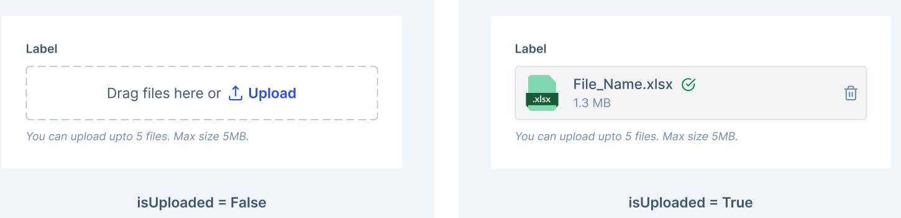

# FileUpload Decisions <!-- omit in toc -->

The `FileUpload` component is used to handle file attachments, including the drag-and-drop interaction. It can be used in both controlled and uncontrolled forms. Primarily, it is used to upload files to a server or to display a list of uploaded files.

This document outlines the API details of the `FileUpload` component, encompassing their structural composition, functional attributes, and visual representation.




- [Design](#design)
- [Anatomy](#anatomy)
- [`FileUpload` Props](#fileupload-props)
- [Usage](#usage)
  - [Submit Button File Upload (Uncontrolled)](#submit-button-file-upload-uncontrolled)
  - [Direct Upload with Progress Display (Controlled)](#direct-upload-with-progress-display-controlled)
- [Examples](#examples)
  - [Uncontrolled Usage](#uncontrolled-usage)
    - [Single File selection](#single-file-selection)
    - [Multiple File selection:](#multiple-file-selection)
  - [Controlled Usage](#controlled-usage)
    - [Direct Upload with Progress Display](#direct-upload-with-progress-display)
- [Accessibility](#accessibility)

## Design

[Figma Link](https://www.figma.com/file/jubmQL9Z8V7881ayUD95ps/Blade-DSL?type=design&node-id=78150%3A2625&mode=design&t=bKQvPInRmAoeAAFV-1) to all variants of the `FileUpload` component.

## Anatomy


## `FileUpload` Props

```ts
// Check the File type from MDN for more details: https://developer.mozilla.org/en-US/docs/Web/API/File
interface BladeFile extends File {
  /**
   * The unique identifier of the file.
   */
  id: string;
  /**
   * The file's upload status.
   */
  status?: 'uploading' | 'success' | 'error';
  /**
   * The percentage of file upload completion.
   */
  percent?: number;
  /**
   * Text indicating an error state
   */
  errorText?: string;
}

type BladeFileList = BladeFile[];

type FileUploadCommonProps = {
  /**
   * Position of the label relative to the file upload area. Desktop only prop. Default value on mobile will be 'top'
   *
   * @default 'top'
   */
  labelPosition?: 'top' | 'left';
  /**
   * Defines the selection behavior of the FileUpload component
   */
  uploadType?: 'single' | 'multiple';
  /**
   * File types that can be accepted. See [input's accept attribute](https://developer.mozilla.org/en-US/docs/Web/HTML/Element/input/file#accept)
   *
   * Usage: accept=".jpg, .png, .pdf", accept="image/*", accept="image/png, image/jpeg, application/pdf"
   */
  accept?: string;
  /**
   * Disables or enables the FileUpload component
   */
  isDisabled?: boolean;
  /**
   * Sets the required state of the file input
   *
   * @default false
   */
  isRequired?: boolean;
  /**
   * Renders a necessity indicator after the label. If `isRequired` is `true`, it defaults to `'required'`
   */
  necessityIndicator?: 'required' | 'optional' | 'none';
  /**
   * The name of the file upload input, [useful in form submissions](https://developer.mozilla.org/en-US/docs/Web/HTML/Element/input#name)
   */
  name?: string;
  /**
   * Default list of files that have been uploaded, useful when the component is uncontrolled
   */
  defaultFileList?: BladeFileList;
  /**
   * List of files that have been selected/uploaded, useful when the component is controlled
   */
  fileList?: BladeFileList;
  /**
   * Limit the number of files that can be uploaded
   */
  maxCount?: number;
  /**
   * Maximum size per file (in bytes)
   */
  maxSize?: number;
  /**
   * Callback function triggered when files are selected
   */
  onChange?: ({ name, fileList }: { name?: string; fileList: BladeFileList }) => void;
  /**
   * Callback function triggered when the preview icon is clicked
   */
  onPreview?: ({ file }: { file: File }) => void;
  /**
   * Callback function triggered when a file is removed
   */
  onRemove?: ({ file }: { file: File }) => void;
  /**
   * Callback function triggered when a file upload is cancelled
   */
  onCancel?: ({ file }: { file: File }) => void;
  /**
   * Callback function executed when files are dropped into the upload area
   */
  onDrop?: ({ name, fileList }: { name: string; fileList: BladeFileList }) => void;
  /**
   * State indicating whether there is an error in the FileUpload component
   */
  validationState?: 'none' | 'error';
  /**
   * Additional text providing assistance or guidance
   */
  helpText?: string;
  /**
   * Text indicating an error state
   */
  errorText?: string;
  /**
   * Test ID for automation
   */
  testID?: string;
};

/*
  Mandatory accessibilityLabel prop when label is not provided
*/
type FileUploadPropsWithA11yLabel = {
  /**
   * Label to be shown for the input field
   */
  label?: undefined;
  /**
   * Accessibility label for the input
   */
  accessibilityLabel: string;
};

/*
  Optional accessibilityLabel prop when label is provided
*/
type FileUploadPropsWithLabel = {
  /**
   * Label to be shown for the input field
   */
  label: string;
  /**
   * Accessibility label for the input
   */
  accessibilityLabel?: string;
};

type FileUploadProps = (FileUploadPropsWithA11yLabel | FileUploadPropsWithLabel) &
  FileUploadCommonProps;
```

## Usage

Primarily, there are two types of usage for the `FileUpload` component:

### Submit Button File Upload (Uncontrolled)

https://github.com/razorpay/blade/assets/46647141/d78ec694-f6f7-413d-a32c-58da8f2582fb

### Direct Upload with Progress Display (Controlled)

https://github.com/razorpay/blade/assets/46647141/cb690625-011b-4c20-b610-9af5f0c5e077

## Examples

Here are a few illustrative examples showcasing the utilization of the `FileUpload` component:

### Uncontrolled Usage

#### Single File selection

```jsx
import React, { useRef } from 'react';
import axios from 'axios';
import { Box, FileUpload } from '@razorpay/blade/components';

const UncontrolledSingleFileUploadForm = () => {
  const fileUploadRef = useRef();

  const handleSubmit = async (e) => {
    e.preventDefault();

    // Create a FormData object to append files
    const formData = new FormData();
    formData.append('files', fileUploadRef.current.files[0]);
    try {
      // Simulate a file upload using axios
      const response = await axios.post(
        'https://run.mocky.io/v3/bb0b32f0-fc54-4d78-9c9b-08b3a4d8f7c5',
        formData,
        {
          headers: {
            'content-type': 'multipart/form-data',
          },
        },
      );

      // Handle success, reset form, etc.
      console.log('Files uploaded successfully:', response.data);
    } catch (error) {
      // Handle errors
      console.error('File upload failed:', error.message);
    }
  };

  return (
    <Box>
      <form onSubmit={handleSubmit}>
        <FileUpload
          label="GSTIN Certificate"
          uploadType="single"
          ref={fileUploadRef}
          accept=".jpg, .png, .pdf"
          helpText="Upload .jpg, .png, or .pdf file only"
          onDrop={(e) => console.log('Files dropped!', e)}
        />

        <button type="submit">Submit</button>
      </form>
    </Box>
  );
};

export default UncontrolledSingleFileUploadForm;
```

#### Multiple File selection:

```jsx
import React, { useRef } from 'react';
import axios from 'axios';
import { Box, FileUpload } from '@razorpay/blade/components';

const UncontrolledMultiFileUploadForm = () => {
  const fileUploadRef = useRef();

  const handleSubmit = async (e) => {
    e.preventDefault();

    // Create a FormData object to append files
    const formData = new FormData();

    fileUploadRef.current.files.forEach((file, index) => {
      formData.append(`file-${index}`, file);
    });

    try {
      // Simulate a file upload using axios
      const response = await axios.post(
        'https://run.mocky.io/v3/bb0b32f0-fc54-4d78-9c9b-08b3a4d8f7c5',
        formData,
        {
          headers: {
            'content-type': 'multipart/form-data',
          },
        },
      );

      // Handle success, reset form, etc.
      console.log('Files uploaded successfully:', response.data);
    } catch (error) {
      // Handle errors
      console.error('File upload failed:', error.message);
    }
  };

  return (
    <Box>
      <form onSubmit={handleSubmit}>
        <FileUpload
          label="GSTIN Certificate"
          uploadType="multiple"
          ref={fileUploadRef}
          accept=".jpg, .png, .pdf"
          helpText="Upload .jpg, .png, or .pdf files only"
          onDrop={(e) => console.log('Files dropped!', e)}
        />

        <button type="submit">Submit</button>
      </form>
    </Box>
  );
};

export default UncontrolledMultiFileUploadForm;
```

### Controlled Usage

#### Direct Upload with Progress Display

```jsx
import React, { useState } from 'react';
import axios from 'axios';
import { Box, FileUpload } from '@razorpay/blade/components';

const ControlledCustomProgressFileUploadForm = () => {
  const [uploadedFile, setUploadedFile] = useState();

  const handleFileChange = async ({ files }) => {
    // Create a FormData object to append files
    const formData = new FormData();

    formData.append('files', files[0]);
    setUploadedFile(files[0]);

    try {
      // Simulate a file upload using axios
      const response = await axios.post(
        'https://run.mocky.io/v3/bb0b32f0-fc54-4d78-9c9b-08b3a4d8f7c5',
        formData,
        {
          headers: {
            'content-type': 'multipart/form-data',
          },
          onUploadProgress: (progressEvent) => {
            setUploadedFile((previousState) => {
              const percentCompleted = Math.round(
                (progressEvent.loaded * 100) / progressEvent.total,
              );

              return {
                ...previousState,
                percent: percentCompleted,
                status: percentCompleted === 100 ? 'success' : 'uploading',
              };
            });
          },
        },
      );

      // Handle success, reset form, etc.
      console.log('Files uploaded successfully:', response.data);
    } catch (error) {
      // Handle errors
      setUploadedFile((previousState) => {
        return {
          ...previousState,
          status: 'error',
          errorText: error.message,
        };
      });
      console.error('File upload failed:', error.message);
    }
  };

  return (
    <Box>
      <FileUpload
        label="Upload product image"
        uploadType="single"
        fileList={uploadedFile ? [uploadedFile] : []}
        onChange={handleFileChange}
        showSelectedFiles={false}
        accept=".jpg, .png"
        helpText="Upload .jpg, .png, or .pdf files only"
        onDrop={(e) => console.log('Files dropped!', e)}
      />
    </Box>
  );
};

export default ControlledCustomProgressFileUploadForm;
```

## Accessibility

- The component accepts an `accessibilityLabel` prop to let users pass an `aria-label` used by screen readers.
- When the input is in focus, the `FileUpload` component will display a focus ring around the input area to indicate the current focus state. Using `Space` and `Enter` keys can be used to open the file picker dialog.

## References

- [MDN Web Docs: File API](https://developer.mozilla.org/en-US/docs/Web/API/File_API/Using_files_from_web_applications)
- [Ant Design: Upload](https://ant.design/components/upload)
