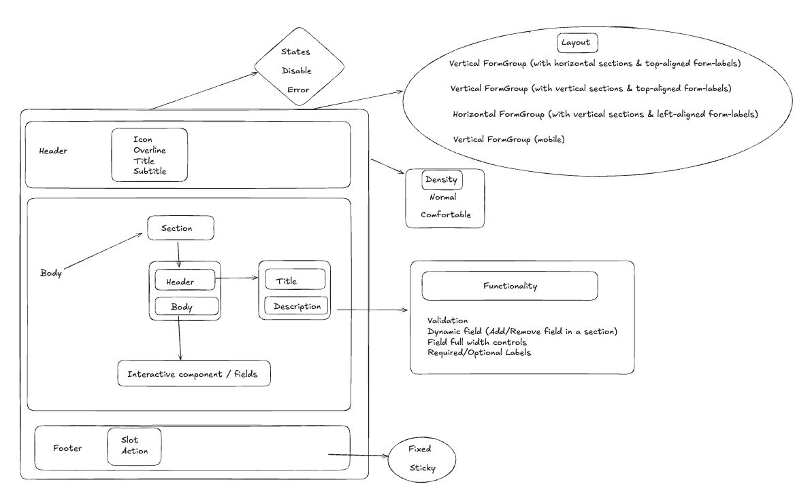

# FormGroup Pattern API Decision

> [!NOTE]
>
> Questions like what is pattern, why are we building these patterns, and scope of pattern are answered in [pattern-terminology.md](https://github.com/razorpay/blade/blob/e58edf015d2062bd51374c5a7024a85adc13f636/packages/blade/src/components/ListView/_decisions/pattern-terminology.md)

FormGroup is a high-level pattern component that provides a consistent way to build forms. This document outlines key architectural decisions regarding layout, validation, and error handling strategies.

## Index

- [Layout Strategy](#layout-strategy)
- [Validation Strategy](#validation-strategy)
- [Error Handling](#error-handling)
- [References](#references)

## Layout Strategy

> **Note**
>
> Unlike ListView, there aren't enough reasons to create Layout component for FormGroup, instead allowing users to compose forms using primitive blade components. More about this is discussed in [pattern-terminology.md](https://github.com/razorpay/blade/blob/e58edf015d2062bd51374c5a7024a85adc13f636/packages/blade/src/components/ListView/_decisions/pattern-terminology.md)

### Component Anatomy



```jsx
<Box padding="spacing.6">
  <Box gap="spacing.6">
    <Heading size="large">Welcome to Blade Example</Heading>
    <Heading variant="subheading">This is an example form built with blade</Heading>
  </Box>

  <Box gap="spacing.6">
    <TextInput
      isRequired
      label="Email"
      name="email"
      validationState={/* Custom Validation logic */}
      errorText="Invalid Email"
      onChange={/* Custom onChange logic */}
    />
    <PasswordInput
      isRequired
      label="Password"
      name="password"
      helpText="should be more than 8 characters"
      errorText="Password is less than 8 characters"
      validationState={/* Custom Validation logic */}
      onChange={/* Custom onChange logic */}
    />
    <Button isFullWidth type="submit" icon={ArrowRightIcon} iconPosition="right">
      Sign In
    </Button>
  </Box>
</Box>
```

#### Pros

- Maximum flexibility in form composition
- No additional abstraction layer
- Direct use of primitive components
- Full control over layout and spacing
- Easier integration with existing form libraries

#### Rationale

1. **Flexibility Over Standardization**

   - Forms vary significantly across applications
   - Teams need different layouts for different contexts
   - Modal forms vs full-page forms have different requirements

2. **Reduced Overhead**

   - No additional component tree
   - Simpler integration with form libraries
   - Better performance for complex forms

3. **Composition Over Configuration**

   - Teams can compose forms using primitive components
   - Easier to maintain and modify
   - Better alignment with React's composition model

## Validation Strategy

### Decision: No Built-in Validation

Blade’s FormGroup pattern will not ship with a built-in validation strategy.
Instead, teams are encouraged to use their preferred validation libraries (Yup, Zod, Joi, or custom functions) based on their specific needs.

#### Rationale

1. **Scope Management**

   - Implementing a robust validation system would essentially make Blade a form library
   - Maintaining such a system would require ongoing effort for edge cases and breaking changes
   - Outside the scope of the design system

2. **Team Autonomy**

   - Different products and domains have varied validation requirements
   - Teams should have full control over their validation logic
   - Support for multiple validation approaches
   - Reduces adoption friction

3. **Integration Flexibility**

   - Blade components are designed to be flexible and adaptable, capable of consuming validation states from different libraries.

   - By avoiding a built-in validation API, we ensure seamless integration with third-party libraries like Formik, React Hook Form, Yup, Zod, Joi, or custom implementations. Since Form libraries have their own validation systems.

Approaches Explored: We evaluated a few common validation patterns before deciding to leave validation strategy to product teams.

1. Generic Validation Adapter Pattern: Validation libraries expose varying APIs:

   Yup → schema.validate()
   Zod → schema.parse()
   Joi → schema.validate()

   An adapter provides a consistent interface (validate, getErrors) to interact with any library.
   It decouples FormGroup from specific libraries and makes adding new ones easy.

```jsx
const adapter = {
  validate: (schema, data) => {
    // Unified validation interface
  },
};
```

2. Hybrid Validation Registry: A central registry of per-field validators.
   Good for forms with dynamic rules, field dependencies, and real-time validation.

```jsx
const registry = {
  getValidator: (field) => (value) => {
    // Field-specific validation
  },
};
```

3. Simple Function-Based Validation: Pass a plain function to validate form data and return errors. Simple, flexible, and product-specific — but can lead to inconsistent validation UX across apps.

```jsx
<FormGroup
  validate={(data) => {
    const errors = {};
    if (!data.name) errors.name = 'Name is required';
    return { isValid: !Object.keys(errors).length, errors };
  }}
/>
```

## Error Handling

### Decision: No FormError Component

No dedicated FormError component will be included in the FormGroup pattern for either global or individual field errors.
Instead, Blade will continue to support error handling through existing props on input components, while leaving global error handling to teams based on their specific UX needs.

#### Current Error Handling Examples

```jsx
// Global Error Example:
{
  errors && <Alert color="negative" description="There are issues with the form" />;
}

// Field-level Error Example:
<TextInput errorText={errors?.email} validationState={errors?.email ? 'error' : 'none'} />;
```

#### Pros

- Simpler component API
- No additional abstraction
- Better integration with form libraries
- Flexible error display options
- Teams can implement their preferred UX

#### Rationale

1. **Integration Overhead**

   - Form libraries handle errors differently
   - Additional wrapper would add complexity
   - Teams would need to override behavior

2. **UX Flexibility**

   - Different products need different error displays
   - Some prefer toasts, others inline errors
   - Hard to standardize across use cases

3. **Maintenance Simplicity**
   - Fewer components to maintain
   - No need to handle edge cases
   - Better alignment with form libraries

## References

1. **Design Systems**

   - [Chakra UI Forms](https://v2.chakra-ui.com/docs/components/form-control)
   - [Ant Design Form](https://ant.design/components/form)

2. **Form Libraries**

   - [Formik](https://formik.org/)
   - [React Hook Form](https://react-hook-form.com/)

3. 3. **Internal Documentation**

   - [Research & Scoping: Form Validation Strategy](https://docs.google.com/document/d/1zLjyB_xuwKxZLvNeU0fyPlG7nyq0svEETgCP7d83uBU/edit?tab=t.0#heading=h.xfqlvfb532ld)
   - [FormGroup Error Wrapper Decision Doc](https://docs.google.com/document/d/1R-dhienUK9hvlQOS5ezZpBisTpsJFs7mXqH5EC8AVl8/edit?tab=t.0)
