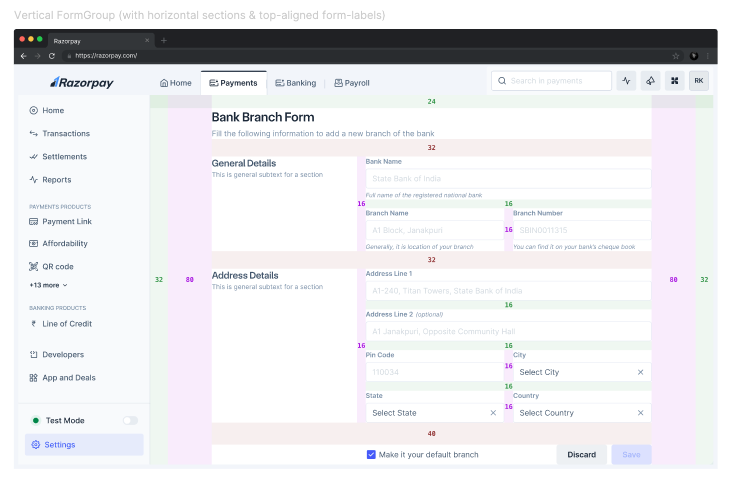
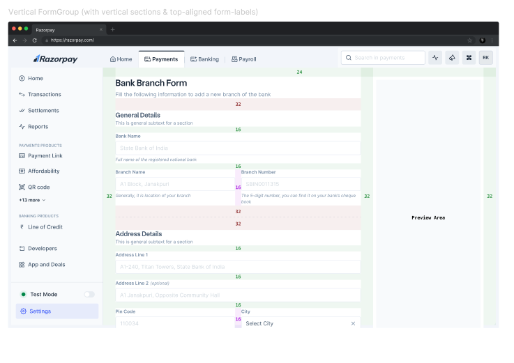
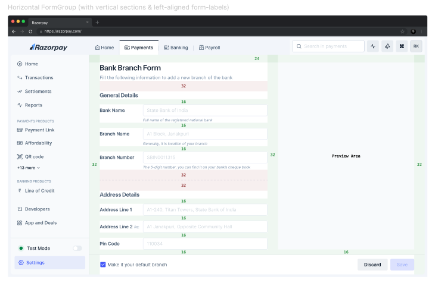
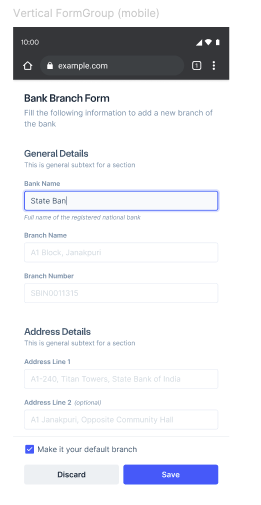
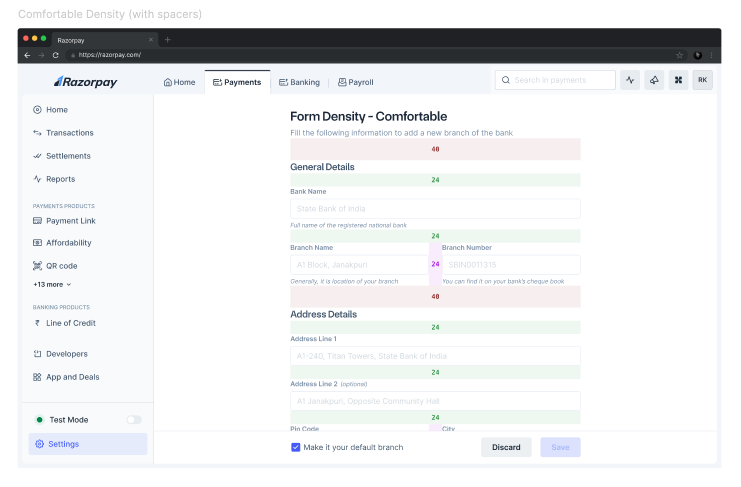
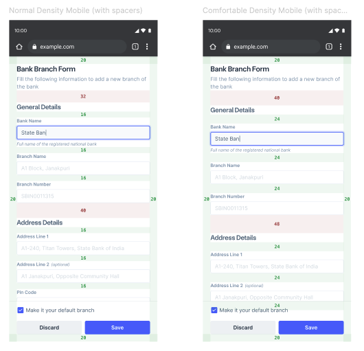

# FormGroup Pattern API Decision

> [!NOTE]
> FormGroup is a high-level pattern component that provides a consistent way to build forms. It handles form layout, validation, state management, and responsive behavior while maintaining design system principles.
> FormGroup (FormGroup can be built as parent component to control layout if we want to control layout otherwise be skipped)


## Index
- [Design](#design)
- [Features](#features)
- [API](#api)
- [Anatomy](#anatomy)
- [Layout Decisions](#layout-decisions)
- [Functional Requirements](#functional-requirements)
- [Component Architecture](#component-architecture)
- [State Management](#state-management)
- [Validation Strategy](#validation-strategy)
- [Accessibility](#accessibility)
- [Examples](#examples)
- [Open Questions](#open-questions)
- [References](#references)

## Design

### Layout Variants

1. **Vertical FormGroup (with horizontal sections & top-aligned form-labels)**
   

2. **Vertical FormGroup (with vertical sections & top-aligned form-labels)**
   

3. **Horizontal FormGroup (with vertical sections & left-aligned form-labels)**
   

4. **Mobile FormGroup**<br/>
   

### Density Variants

1. **Normal Density**<br/>
   

2. **Comfortable Density**<br/>
   

3. **Mobile Density**<br/>
   

### Component Anatomy


## Features

### Core Features
- Form layouts (vertical/horizontal)
- Responsive behavior
- Section management
- Error handling
- Form footer (fixed/inline)
- Form density control
- Form validation

## API

### Layout Component vs No Layout Component

#### With Layout Component(Compound Component)

```jsx
<FormGroup>
  <FormGroupHeader
    title="Payment Settings"
    subtitle="Configure your payment processing settings"
    icon={PaymentIcon}
  />
  
  <FormGroupBody>
    <FormSection title="General Details">
      <TextInput
        label="Account Name"
        value={accountName}
        onChange={handleAccountNameChange}
      />
      
      <Box display="flex" gap="spacing.3">
        <TextInput
          label="Business Type"
          value={businessType}
          onChange={handleBusinessTypeChange}
        />
        <TextInput
          label="Tax ID"
          helpText="Your registered tax identification number"
          value={taxId}
          onChange={handleTaxIdChange}
        />
      </Box>
    </FormSection>

    <FormSection title="Processing Settings">
      <SelectInput
        label="Processing Currency"
        value={currency}
        onChange={handleCurrencyChange}
      />
      <TextInput
        label="Settlement Period"
        value={settlementPeriod}
        onChange={handleSettlementChange}
      />
    </FormSection>
  </FormGroupBody>

  <FormGroupFooter fixed>
    <Box display="flex" gap="spacing.3">
      <Button variant="secondary">Cancel</Button>
      <Button>Save Settings</Button>
    </Box>
  </FormGroupFooter>
</FormGroup>
```

#### Without Layout Component

```jsx
<Box padding="spacing.6">
  <Box gap="spacing.6">
    <Box>
      <Title>Payment Settings</Title>
      <Text>Configure your payment processing settings</Text>
    </Box>

    <Box gap="spacing.6">
      <Box>
        <Title size="small">General Details</Title>
        <TextInput
          label="Account Name"
          helpText="Name that appears on customer statements"
        />
        {/* Other fields */}
      </Box>

      <Box>
        <Title size="small">Processing Settings</Title>
        {/* Processing fields */}
      </Box>
    </Box>

    <Box 
      position="fixed" 
      bottom="spacing.4" 
      left="spacing.4" 
      right="spacing.4"
      padding="spacing.4"
    >
      <Box display="flex" justifyContent="flex-end" gap="spacing.3">
        <Button variant="secondary">Cancel</Button>
        <Button>Save Settings</Button>
      </Box>
    </Box>
  </Box>
</Box>
```

/**
 * FormGroup API Design
 * 
 * No FormHeader/FormFooter because:
 * 1. Chakra UI (https://chakra-ui.com/docs/components/form-control)
 *    - Uses general layout components for headers/actions
 *    - FormControl focuses only on field functionality
 * 
 * 2. Polaris (https://polaris.shopify.com/components/selection-and-input/form)
 *    - Uses Page/Layout for headers
 *    - Uses ButtonGroup for actions
 *    - Form component handles just form behavior
 * 
 * No FormSection because:
 * 1. Layout grouping can be handled by:
 *    - AI code generation tools for basic layouts
 *    - Users can customize using primitive components
 *    - Matches Blade storybook pattern
 * 
 * FormGroup's single responsibility:
 * - Form state management
 * - Validation handling (Zod schema)
 * - Form submission
 */
```
// Example usage with Blade's Box component for layout
<FormGroup 
  onSubmit={handleSubmit} 
  validationSchema={schema}
  initialValues={initialValues}
>
  {/* Header using Box */}
  <Box marginBottom="spacing.4">
    <Title>Bank Branch Form</Title>
    <Text>Add new branch details</Text>
  </Box>

  {/* Field groups using Box */}
  <Box marginBottom="spacing.4">
    <Text variant="subtitle">Personal Info</Text>
    <Box marginTop="spacing.3">
      <TextField name="name" label="Name" />
      <Box marginTop="spacing.3">
        <TextField name="email" label="Email" />
      </Box>
    </Box>
  </Box>

  <Box marginBottom="spacing.4">
    <Text variant="subtitle">Address</Text>
    <Box marginTop="spacing.3">
      <TextField name="street" label="Street" />
      <Box marginTop="spacing.3">
        <TextField name="city" label="City" />
      </Box>
    </Box>
  </Box>

  {/* Footer using Box */}
  <Box 
    display="flex" 
    justifyContent="flex-end" 
    gap="spacing.3"
  >
    <Button variant="secondary">Cancel</Button>
    <Button type="submit">Submit</Button>
  </Box>
</FormGroup>
```

### Layout Decision Analysis

#### With Layout Component

Pros:
- Consistent form structure across applications
- Built-in responsive behavior
- Automatic spacing and alignment
- Easier to maintain and update form layouts
- Better developer experience with clear component hierarchy
- Built-in density controls
- Automatic mobile adaptations
- Section-level validation grouping

Cons:
- Less flexibility for custom layouts
- One more abstraction to learn
- Initial learning curve for the component API

#### Without Layout Component

Pros:
- Maximum flexibility
- No new abstractions to learn
- Direct use of primitive components
- Easier to create custom layouts
- Full control over every aspect

Cons:
- Inconsistent implementations across teams
- More boilerplate code
- Manual responsive handling
- Manual density management
- Risk of breaking design patterns
- Duplicate error handling logic
- No built-in validation grouping

### Decision
We will go with Layout Component approach because:
1. Forms are highly standardized across applications
2. Consistency is more important than flexibility for forms
3. Built-in responsive and density features are valuable
4. Easier to maintain and update form patterns
5. Reduces development time and errors

## Functional Requirements

1. **Form Layout Management**
   - Support both vertical and horizontal layouts
   - Responsive adaptation for different screen sizes
   - Configurable density (Normal/comfortable)
   - Fixed or inline footer options

2. **Section Management**
   - Grouping related fields
   - Optional section descriptions

3. **Validation Requirements**
   - Field-level validation: <br />
      **Decision**: Consumers handle individual field validation<br />
      **Rationale**: FormGroup doesn't know field types or validation rules
  - Form-level validation:
    - Validation that depends on multiple fields within a section or cross-field validation.
    - Custom validation rules:Ability to define custom validation logic for specific use cases.
    - Validation timing control (onChange/onBlur/onSubmit)

4. **Error Handling**
   - Section-level error summary
   - Form-level error aggregation
   - Error message customization

5. **State Management**
   - Form values tracking
   - Dirty state tracking
   - Submission state
   - Error states

6. **Accessibility Requirements**
   - ARIA attributes
   - Keyboard navigation
   - Error announcements
   - Focus management

## Component Architecture

### Core Components

#### FormGroup
| Prop | Type | Required | Default | Description |
|------|------|----------|---------|-------------|
| children | `React.ReactNode` | Yes | - | Form content (Header, Body, Footer) |
| layout | `'vertical'` \| `'horizontal'` | No | `'vertical'` | Layout orientation of the form |
| alignment | `'top'` \| `'left'` | No | `'top'` | Form labels alignment |
| density | `'normal'` \| `'comfortable'` | No | `'normal'` | Controls spacing between form elements |
| onSubmit | `(values: FormValues) => Promise<void>` | Yes | - | Handler called when form is submitted |
| initialValues | `FormValues` | No | `{}` | Initial form values |
| validationSchema | `z.ZodSchema` | No | - | Zod schema for form validation |
| validate | `(values: FormValues) => FormErrors \| Promise<FormErrors>` | No | - | Custom validation function |
| validationMode | `'onChange'` \| `'onBlur'` \| `'onSubmit'` | No | `'onChange'` | When to trigger validation |
| onError | `(errors: FormErrors) => void` | No | - | Called when validation fails |
| disabled | `boolean` | No | `false` | Disables all form inputs |

#### FormGroupHeader
| Prop | Type | Required | Default | Description |
|------|------|----------|---------|-------------|
| title | `string` | Yes | - | Main title of the form |
| subtitle | `string` | No | - | Supporting text below title |
| icon | `IconComponent` | No | - | Icon displayed before title |
| overline | `string` | No | - | Text displayed above title |

#### FormGroupBody
| Prop | Type | Required | Default | Description |
|------|------|----------|---------|-------------|
| children | `React.ReactNode` | Yes | - | Form sections |

#### FormSection
| Prop | Type | Required | Default | Description |
|------|------|----------|---------|-------------|
| title | `string` | Yes | - | Section title |
| description | `string` | No | - | Section description |
| name | `string` | Yes | - | Unique identifier for the section |
| collapsible | `boolean` | No | `false` | Makes section collapsible |
| defaultExpanded | `boolean` | No | `true` | Initial expand state when collapsible |
| showErrorSummary | `boolean` | No | `true` | Whether to show error summary |

#### FormGroupFooter
| Prop | Type | Required | Default | Description |
|------|------|----------|---------|-------------|
| fixed | `boolean` | No | `false` | Fixes footer to bottom |
| divider | `boolean` | No | `true` | Shows divider above footer |
| alignment | `'start'` \| `'center'` \| `'end'` \| `'space-between'` | No | `'space-between'` | Footer content alignment |
| children | `React.ReactNode` | Yes | - | Footer content (usually buttons) |


## Types

### Layout Types
1. **Vertical FormGroup with horizontal sections & top-aligned form-labels**
   - Default layout for most forms
   - Labels appear above fields
   - Sections stack vertically
   ```jsx
   <FormGroup layout="horizontal" alignment="top">
    <FormGroupBody>
      <FormSection title="General Details">
        <TextInput label="Name" />
        <TextInput label="Email" />
      </FormSection>
    <FormGroupBody>
   </FormGroup>
   ```

2. **Vertical FormGroup with vertical sections & top-aligned form-labels**
   - Similar to type 1 but with full-width sections
   - Suitable for longer forms with more fields
   ```jsx
   <FormGroup layout="vertical" alignment="top">
    <FormGroupBody>
      <FormSection title="Address Details">
        <TextInput label="Street" />
        <TextInput label="City" />
      </FormSection>
    <FormGroupBody>
   </FormGroup>
   ```

3. **Horizontal FormGroup with vertical sections & left-aligned form-labels**
   - Labels appear to the left of fields
   - Better for forms with shorter inputs
   ```jsx
   <FormGroup layout="horizontal" alignment="left">
    <FormGroupBody>
      <FormSection title="Contact Details">
        <TextInput label="Phone" labelPosition="left" />
        <TextInput label="Extension" labelPosition="left" />
      </FormSection>
    <FormGroupBody>
   </FormGroup>
   ```

### Density Types
1. **Normal Density**
   - Default spacing (16px between fields)
   - Standard padding and margins
   ```jsx
   <FormGroup density="normal">
     {/* Form content */}
   </FormGroup>
   ```

2. **Comfortable Density**
   - Increased spacing (24px between fields)
   - More generous padding and margins
   ```jsx
   <FormGroup density="comfortable">
     {/* Form content */}
   </FormGroup>
   ```

### Error States
1. **Grouped Errors**
   - Shows & Handle section-level error summary
   - Only show Individual field errors
   - Form-level validation messages

2. **Individual Errors**
   - Field-specific error messages
   - Inline validation feedback
   - Real-time validation states

### Footer Variants
1. **Fixed Footer**
   - Stays at bottom of viewport
   - Useful for long forms
   ```jsx
   <FormGroupFooter fixed>
     <Button variant="secondary">Cancel</Button>
     <Button type="submit">Save</Button>
   </FormGroupFooter>
   ```

2. **Inline Footer**
   - This footer appears after all content, only visible when scrolled to the bottom.
   ```jsx
   <FormGroupFooter>
     <Button variant="secondary">Cancel</Button>
     <Button type="submit">Save</Button>
   </FormGroupFooter>
   ```

### Anatomy Breakdown
1. **FormGroup Header**
   - Icon/Asset (optional)
   - Overline (optional)
   - Title (required)
   - Subtitle (optional)

2. **FormGroup Body**
   - Multiple sections
   - Each section has:
     - Section Header (title + description)
     - Section Body (form fields)
     - Interactive components/Fields

3. **FormGroup Footer**
   - Slot content (left side)
   - Action buttons (right side)
   - Optional divider
   - Fixed or scrollable positioning

### Type Definitions

```typescript
interface FormValues {
  [key: string]: any;
}

interface FieldError {
  message: string;
  type: 'required' | 'format' | 'custom';
}

interface FormErrors {
  formLevel?: string[];
  fields?: Record<string, FieldError>;
}

interface FormGroupContextValue {
  // Form State
  values: FormValues;
  errors: FormErrors;
  isSubmitting: boolean;
  isValid: boolean;
  isDirty: boolean;
  touchedFields: Set<string>;

  // Form Methods
  setFieldValue: (name: string, value: any) => void;
  setFieldTouched: (name: string, touched?: boolean) => void;
  validateField: (name: string) => Promise<void>;
  validateForm: () => Promise<boolean>;
  submitForm: () => Promise<void>;
  resetForm: () => void;
  
  // Form Configuration
  layout: 'vertical' | 'horizontal';
  density: 'normal' | 'comfortable';
  disabled: boolean;
}

interface FormSectionContextValue {
  // Section Display
  name: string;
  isCollapsed: boolean;
  hasError: boolean;
  
  // Section Methods
  toggleCollapsed: () => void;
  getSectionErrors: () => FieldError[];
}
```

### Usage Example

```jsx
const formSchema = z.object({
  personalInfo: z.object({
    name: z.string().min(2),
    email: z.string().email()
  }),
  address: z.object({
    street: z.string(),
    city: z.string()
  })
});

function MyForm() {
  return (
    <FormGroup
      validationSchema={formSchema}
      onSubmit={async (values) => {
        await saveData(values);
      }}
      onError={(errors) => {
        console.log('Validation failed:', errors);
      }}
    >
      <FormGroupHeader 
        title="User Registration"
        subtitle="Enter your details below"
      />
      
      <FormGroupBody>
        <FormSection 
          name="personalInfo"
          title="Personal Information"
          showErrorSummary
        >
          <TextInput
            name="name"
            label="Full Name"
            required
          />
          <TextInput
            name="email"
            label="Email"
            type="email"
            required
          />
        </FormSection>

        <FormSection
          name="address"
          title="Address Details"
        >
          <TextInput
            name="street"
            label="Street Address"
          />
          <TextInput
            name="city"
            label="City"
          />
        </FormSection>
      </FormGroupBody>

      <FormGroupFooter fixed>
        <Button variant="secondary">Cancel</Button>
        <Button type="submit">Submit</Button>
      </FormGroupFooter>
    </FormGroup>
  );
}
```

## Validation Strategy

### Form-Level Validation
1. **Schema-Based Validation (Recommended)**
```jsx
const formSchema = z.object({
  personalDetails: z.object({
    email: z.string().email(),
    phone: z.string().min(10)
  }),
  addressDetails: z.object({
    street: z.string(),
    city: z.string()
  })
});

<FormGroup 
  validationSchema={formSchema}
  onSubmit={handleSubmit}
  onError={(errors) => console.log(errors)}
>
  <FormSection name="personalDetails">
    <TextInput name="email" />
    <TextInput name="phone" />
  </FormSection>
  <FormSection name="addressDetails">
    <TextInput name="street" />
    <TextInput name="city" />
  </FormSection>
</FormGroup>
```

2. **Function-Based Validation**
```jsx
<FormGroup
  validate={(values) => {
    const errors = {};
    // Form level cross-section validation
    if (values.billingAddress.country !== values.shippingAddress.country) {
      errors.shippingAddress = {
        country: 'Shipping country must match billing country'
      };
    }
    return errors;
  }}
>
  {/* Form sections */}
</FormGroup>
```

3. **Mixed Validation Strategy**
```jsx
<FormGroup
  validationSchema={formSchema}
  validate={customValidate}
  onSubmit={handleSubmit}
>
  <FormSection 
    name="personalDetails"
    validate={sectionValidate}
  >
    <TextInput 
      name="email"
      validationState="error"
      errorText="Invalid email"
    />
  </FormSection>
</FormGroup>
```

### Validation Flow
1. **On Submit**
```mermaid
graph TD
    A[Submit Button Clicked] --> B[Run Form Schema Validation]
    B --> C[Run Form Custom Validation]
    C --> D[Run Section Validations]
    D --> E[Collect Child Component Errors]
    E --> F{Any Errors?}
    F -->|Yes| G[Show Errors & Call onError]
    F -->|No| H[Call onSubmit]
```

2. **On Field Change**
```mermaid
graph TD
    A[Field Change] --> B[Run Field Validation]
    B --> C{Has Form validateOnChange?}
    C -->|Yes| D[Run Form Validation]
    D --> E{Has Section validateOnChange?}
    E -->|Yes| F[Run Section Validation]
    F --> G[Update UI]
```

### Validation Priority
1. Schema validation (if provided)
2. Form-level custom validation
3. Section-level validation
4. Field-level validation
5. Child component validation states

### Error Collection
```typescript
interface FormErrors {
  // Form level errors
  formErrors?: string[];
  
  // Section level errors
  sectionErrors?: {
    [sectionName: string]: {
      sectionError?: string;
      fields?: {
        [fieldName: string]: string;
      }
    }
  };
  
  // Field level errors
  fieldErrors?: {
    [fieldName: string]: string;
  };
}
```

### Error Display Strategy
1. **Form Level**
   - Show form-wide errors at top of form
   - Highlight affected sections
   - Scroll to first error

2. **Section Level**
   - Show section errors in section header
   - Highlight affected fields
   - Expand collapsed sections with errors

3. **Field Level**
   - Show inline errors below fields
   - Update field validation states

## Accessibility

### ARIA Attributes
- **aria-labelledby**: Used to associate labels with form elements
- **aria-describedby**: Used to provide additional information about form elements
- **aria-invalid**: Used to indicate that an element is invalid
- **aria-errormessage**: Used to specify the error message for an invalid element

### Keyboard Navigation
- **Tab**: Used to navigate between form elements
- **Enter**: Used to submit the form

### Focus Management
- **Focus Ring**: Form elements should have a focus ring when they are focused

## Examples

### Basic Usage
```jsx
<FormGroup onSubmit={handleSubmit}>
  <FormGroupHeader 
    title="Contact Information"
    subtitle="Enter your contact details"
  />
  
  <FormGroupBody>
    <FormSection title="Personal Details">
      <TextInput
        name="fullName"
        label="Full Name"
        required
      />
      <TextInput
        name="email"
        label="Email Address"
        type="email"
        required
      />
    </FormSection>
  </FormGroupBody>

  <FormGroupFooter>
    <Button type="submit">Save</Button>
  </FormGroupFooter>
</FormGroup>
```

## Open Questions

1. **Form State Persistence**
   - Should we support automatic form state persistence on unmount?
   - What storage mechanism should we use?

2. **Validation Strategy**
   - When should section-level validation run?
   - Should we use Zod or rely on custom validation?

## References

1. **Design Systems**
   - [Material UI Forms](https://material.io/components/text-fields)
   - [Ant Design Form](https://ant.design/components/form)

2. **Form Libraries**
   - [Formik](https://formik.org/)
   - [React Hook Form](https://react-hook-form.com/)


## Research & Scoping: Form Validation Strategy

### 1. Evaluation of Validation Libraries

#### Criteria for Selection:
- Bundle size (<5KB)
- TypeScript support
- Active maintenance
- Performance
- Learning curve

#### Top Candidates:

1. **Zod (~5.6KB)**
   - Pros:
     - First-class TypeScript support
     - Runtime type checking
     - Rich validation primitives
   - Cons:
     - Steeper learning curve

2. **Yup (~23KB)**
   - Pros:
     - Familiar API
     - Rich ecosystem
     - Good documentation
   - Cons:
     - Larger bundle size
     - TypeScript support added later

3. **Vest (~12KB)**
   - Pros:
     - Test-like syntax
     - Unit testing approach
     - Good for complex validations
   - Cons:
     - Less popular
     - Different mental model

4. **Custom Validator Functions**
   - Pros:
     - Zero additional bundle size
     - Maximum flexibility
     - Simple to understand
   - Cons:
     - No built-in type inference
     - More boilerplate
     - Inconsistent implementations

**Current Usage in Razorpay:**
  - Merchant Dashboard: Uses Yup
  - Admin Dashboard: Uses custom function validation
  - No standardization across products


```tsx
// Example: Different approaches currently used
// Merchant Dashboard (Yup)
const tncValidattionSchema = Yup.object().shape({
  support_email: Yup.string()
    .email('Please enter a valid email id.')
    .required('Support email is a required field')
    .nullable(),
  shipping_period: Yup.string().required('Shipping time is a required field').nullable(),
  refund_request_period: Yup.string()
    .required('Refund request time is a required field')
    .nullable(),
  refund_process_period: Yup.string()
    .required('Refund process time is a required field')
    .nullable(),
  warranty_period: Yup.string().required('Warranty time is a required field').nullable(),
});

// Admin Dashboard (Function)
const validate = (values) => {
  const errors = {};
  if (!values.name) errors.name = 'Required';
  if (!isValidEmail(values.email)) errors.email = 'Invalid email';
  return errors;
};

     export const FIELD_VALIDATION = {
       alphanumeric: '^[a-zA-Z0-9]+$',
       number: '^[0-9]+$',
       alphabet: '^[a-zA-Z]+$',
       amount: '^d+(.d{1,2})?$',
       date: '^d{4}-d{2}-d{2}$',
       string: '^[a-zA-Z0-9\\s\\W]+$'
     };
```

### 2. Integration Strategy

**Generic Validation Layer:**
```tsx
// Generic validation interface that can work with any library
interface ValidationStrategy<T = any> {
  validate: (values: T) => Promise<FormErrors>;
  validateField: (name: string, value: any) => Promise<string | undefined>;
}

// Adapter pattern for different libraries
function createValidationAdapter(config: {
  type: 'yup' | 'zod' | 'function';
  schema?: any;
  validate?: (values: any) => any;
}): ValidationStrategy {
  switch (config.type) {
    case 'yup':
      return new YupAdapter(config.schema); // YupAdapter: Converts Yup validation to match our interface
    case 'zod':
      return new ZodAdapter(config.schema);
    case 'function':
      return new FunctionAdapter(config.validate);
  }
}

// Usage in FormGroup
function FormGroup({ 
  validation,
  children,
  ...props 
}: FormGroupProps) {
  const validator = useMemo(() => 
    createValidationAdapter(validation), 
    [validation]
  );

  // FormGroup implementation
}
```

#### 3. User Implementation Examples

```tsx
// 1. With Schema Validation (Yup/Zod)
function UserForm() {
  return (
    <FormGroup
      validation={{
        type: 'yup',
        schema: yup.object({
          name: yup.string().required(),
          email: yup.string().email()
        })
      }}
    >
      <TextField name="name" label="Name" />
      <TextField name="email" label="Email" />
    </FormGroup>
  );
}


// 2. With Function Validation
function UserForm() {
  return (
    <FormGroup
      validation={{
        type: 'function',
        validate: (values) => {
          // Custom validation logic
          return errors;
        }
      }}
    >
      <TextField name="name" label="Name" />
      <TextField name="email" label="Email" />
    </FormGroup>
  );
}
```

//  Mixed Validation
```tsx
<FormGroup
  validationSchema={schema}
  validate={customValidate}
  validationAdapter="zod"
>
  {/* Form content */}
</FormGroup>
```


### Research Findings

1. **Current Ecosystem Analysis**
   - Diverse Ecosystem
   - Merchant Dashboard: Uses Yup + Formik
   - Admin Dashboard: Custom validation with regex patterns
   - Different teams have different validation needs and patterns
   - No standardization across products (and that's okay)

2. **Validation Libraries Evaluated**
   - Yup (~23KB): Used in Merchant Dashboard
   - Zod (~5.6KB): Modern TypeScript-first approach
   - Custom Functions: Used in Admin Dashboard
   - Each has its own benefits for different use cases

3. **Key Insights**
   - Teams have established working validation solutions
   - Validation needs vary significantly by product
   - Field names and rules are highly domain-specific
   - No one-size-fits-all validation solution

### Decision: No Form Infrastructure Needed

After thorough evaluation, we've decided not to create any form infrastructure (no FormGroup, no validation layer) because:

1. **Native Solutions are Sufficient**
   ```tsx
   // Simple, flexible, native approach
   <form onSubmit={handleSubmit}>
     <Box gap="spacing.4">
       <TextField 
         name="email"
         validation={teamValidation}
         error={teamError}
       />
       <Button type="submit">Submit</Button>
     </Box>
   </form>
   ```

2. **Benefits of This Approach**
   - Teams maintain full control over validation
   - No unnecessary abstractions
   - Reduced maintenance burden
   - No migration needed
   - Smaller bundle size
   - Simpler mental model

3. **Validation Ownership**
   - Teams choose their validation libraries
   - Teams handle their validation logic
   - Teams manage their error states
   - Teams control their schemas


This decision aligns with our "no layout" approach - focusing on primitive components while letting teams handle implementation details based on their specific needs.

While researching, I explored various codebases and reviewed different implementations of FormGroup and Form components in other design systems.
1. **Current Landscape at Razorpay**
   - Merchant Dashboard: Uses Yup + Formik
   - Admin Dashboard: Custom validation with regex patterns
   - No standardization across products
   - Teams have established validation patterns

2. **Why Not Provide Validation Implementation**

   #### Cons of Providing Validation:
   - **Schema Complexity**
     - Field names vary greatly across products (e.g., `support_email` vs `email`)
     - Validation rules are often domain-specific
     - Would result in a bloated, hard-to-maintain schema library
   
   - **Redundant Abstraction**
     - If teams need to define their schema anyway, our validation layer adds unnecessary complexity
     - Teams would still need to understand validation libraries to define schemas
   
   - **Mixed Usage Issues**
     - Partial usage (some fields using our validation, others custom) creates confusion
     - Inconsistent error handling between built-in and custom validation
   
   - **Maintenance Burden**
     - Need to keep up with all validation use cases
     - Regular updates for new field types
     - Version management for different validation rules

  - **Technical Limitations with Custom Components**
     - Validation libraries (Yup/Zod) only recognize native HTML form elements
     - Don't automatically work with Blade components like `<TextField>`
     - Would require complex connector code to bridge validation libraries with custom components
     - Extra maintenance burden to keep connectors in sync with component updates
```

# FormGroup Validation Strategy

## Simplified Validation Approach

### Function-Based Validation Pattern

Instead of creating complex adapters or enforcing specific validation libraries, we can provide a simple function-based validation pattern that gives users complete flexibility:

```typescript
interface ValidationResult {
  isValid: boolean;
  errors: Record<string, string>;
}

interface FormGroupProps {
  children: React.ReactNode;
  validate?: (values: Record<string, any>) => ValidationResult | Promise<ValidationResult>;
  onSubmit?: (values: Record<string, any>) => void;
  onError?: (errors: Record<string, string>) => void;
  showToast?: boolean;
  blockSubmit?: boolean;
}

// Usage Examples:

// 1. Simple Function Validation
<FormGroup 
  validate={(formData) => {
    const errors: Record<string, string> = {};
    
    if (!formData.name) {
      errors.name = 'Name is required';
    }
    if (!formData.email) {
      errors.email = 'Email is required';
    }
    
    return {
      isValid: Object.keys(errors).length === 0,
      errors
    };
  }}
>
  <TextInput label="Name" />
  <TextInput label="Email" />
</FormGroup>

// 2. Using Yup
<FormGroup 
  validate={async (formData) => {
    try {
      await yupSchema.validate(formData, { abortEarly: false });
      return { isValid: true, errors: {} };
    } catch (err) {
      const errors: Record<string, string> = {};
      err.inner.forEach((error) => {
        errors[error.path] = error.message;
      });
      return { isValid: false, errors };
    }
  }}
>
  <TextInput label="Name" />
  <TextInput label="Email" />
</FormGroup>

// 3. Using Zod
<FormGroup 
  validate={(formData) => {
    const result = zodSchema.safeParse(formData);
    if (result.success) {
      return { isValid: true, errors: {} };
    }
    
    const errors: Record<string, string> = {};
    result.error.issues.forEach((issue) => {
      errors[issue.path[0]] = issue.message;
    });
    return { isValid: false, errors };
  }}
>
  <TextInput label="Name" />
  <TextInput label="Email" />
</FormGroup>
```

### Benefits of Function-Based Approach

1. **Complete Flexibility**
   - Users can use any validation library they prefer
   - No need to create adapters for different libraries
   - Can mix and match validation approaches

2. **Simpler Implementation**
   - No need to maintain multiple validation adapters
   - No complex type definitions for different libraries
   - Easier to understand and maintain

3. **Better Integration**
   - Works seamlessly with existing validation code
   - Teams can gradually migrate to new validation approaches
   - No need to rewrite existing validation logic

4. **Reduced Bundle Size**
   - No additional dependencies required
   - Users can choose their preferred validation library
   - No need to include unused validation adapters

### Implementation Details

```typescript
const FormGroup = ({ 
  children, 
  validate, 
  onSubmit, 
  onError,
  showToast = false,
  blockSubmit = false 
}: FormGroupProps) => {
  const [errors, setErrors] = useState<Record<string, string>>({});
  const [isSubmitting, setIsSubmitting] = useState(false);

  const handleSubmit = async (values: Record<string, any>) => {
    if (!validate) {
      onSubmit?.(values);
      return;
    }

    setIsSubmitting(true);
    try {
      const result = await validate(values);
      setErrors(result.errors);

      if (result.isValid) {
        onSubmit?.(values);
      } else {
        onError?.(result.errors);
        if (showToast) {
          // Show toast with error message
        }
      }
    } finally {
      setIsSubmitting(false);
    }
  };

  return (
    <FormContext.Provider value={{ errors, isSubmitting }}>
      <form onSubmit={handleSubmit}>
        {children}
      </form>
    </FormContext.Provider>
  );
};
```

### Field-Level Integration

```typescript
const TextInput = ({ name, label, ...props }: TextInputProps) => {
  const { errors } = useFormContext();
  
  return (
    <div>
      <label>{label}</label>
      <input name={name} {...props} />
      {errors[name] && <span className="error">{errors[name]}</span>}
    </div>
  );
};
```

### Recommendations

1. **Documentation**
   - Provide clear examples for different validation approaches
   - Include common validation patterns
   - Show integration with popular libraries

2. **Type Safety**
   - Use TypeScript to ensure type safety
   - Provide generic types for form values
   - Include proper error types

3. **Error Handling**
   - Standardize error message format
   - Provide helper functions for common validations
   - Include proper error boundary handling

4. **Performance**
   - Implement proper memoization
   - Use controlled components efficiently
   - Handle async validation properly

This approach provides the flexibility teams need while maintaining a simple and maintainable API. It allows teams to use their preferred validation approach without forcing them into a specific pattern.

[Rest of the document remains the same...]

