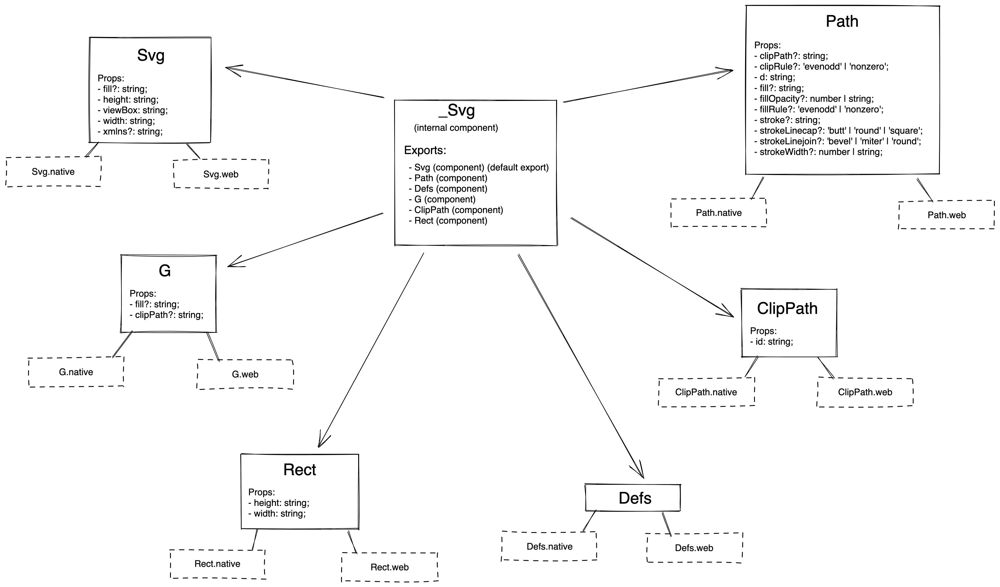

# Icon Decisions

- All the icons on blade will be rendered as SVG.
- Web will use the native `svg` elements to render the icons.
- Native will use `react-native-svg` to render the icons.
- In the past (blade-old), we used to create 2 files per icon - One for web and one for native (`WifiOn.web.js` & `WifiOn.native.js`).
- Going forward, we want to create one file per icon (`WifiOn.ts`) and internally use the correct platform specific components to render the icon.
- To achieve this, we'll create custom Svg components like `Svg`, `Path`, `G`, `Rect`, etc. within blade which will have their own platform specific implementations like `Svg.native.tsx` & `Svg.web.tsx` that would use the correct platform specific components to render the icon.
- These will be internal components only and won't be exported to our consumers
- We would use these components to build our Blade Icons and then export these blade icons to our consumers
- We will store all the icons within `components/Icons/*` directory and make them available to our consumers like this: `import { CreditCardIcon } from '@razorpay/blade/components'`
- We will store all our custom Svg components within `components/Icons/_Svg/*` directory and not export them to our consumers (`_` indicates it is an internal component)
- After auditing components from `blade-old`, we have decided to create the following Svg components (we can add more components & props later if we get a valid use-case):
  - Svg
  - Path
  - G
  - Rect
  - Defs
  - ClipPath
  
