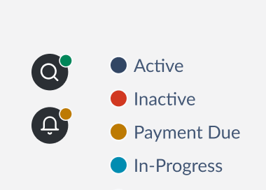
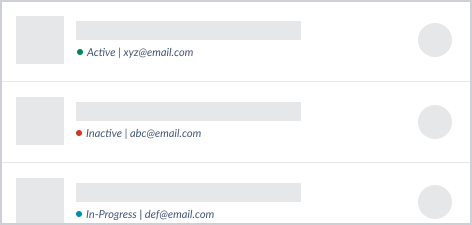
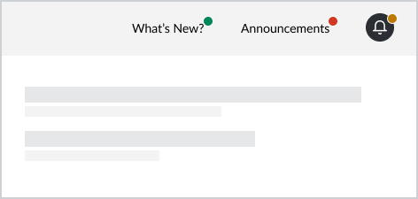

# Indicator

Indicators describe the condition of an entity. They can be used to convey semantic meaning, such as statuses and semantical-categories.

This document outlines the API of `Indicator` component.



## Design

- [Figma - Indicator](https://www.figma.com/file/jubmQL9Z8V7881ayUD95ps/Blade---Payment-Light?node-id=8224%3A1)

## API

Sample usecase:



Sample usage:

```jsx
<Indicator intent="positive" accessibilityLabel="Active for xyz@email.com">
  Active | xyz@email.com
</Indicator>
```

### Indicator

We'll expose an `Indicator` component with the following API:

| Prop               | Type                                                      | Default     | Description                                    | Required |
| ------------------ | --------------------------------------------------------- | ----------- | ---------------------------------------------- | -------- |
| accessibilityLabel | `string`                                                  | `undefined` | Sets the aria-label for screen readers         | ♿️      |
| children           | `string`                                                  | `undefined` | Shows a text label beside the circle indicator |          |
| intent             | `positive`,`negative`, `notice`, `information`, `neutral` | `neutral`   | Sets the color tone of circle indicator        |          |
| size               | `xsmall`,`small`, `medium`                                | `medium`    | Sets the size of circle indicator              |          |

> **Note**
>
> ♿ `accessibilityLabel` is **required** when a `label` isn't provided and helps in setting `aria-label` for people relying on screen readers. Some people with color blindness can't distinguish between colors easily so passing a `label` / `accessibilityLabel` is crucial.

#### Composition with other UI elements

`Indicator` can be clubbed with other UI elements to show a dot at the top-right corner, generally for capturing user attention. Example:



Sample usage:

```jsx
<div style={{ position: 'relative' }}>
  <NotificationWidget />
  <div style={{ position: 'absolute', top: 0, right: 0 }}>
    <Indicator intent="notice" accessibilityLabel="Pending notifications" />
  </div>
</div>
```

> **Note**
>
> At the moment we don't provide an out of box API for such composition. See the alternatives section for more info.

## a11y

Web:

- The component accepts an `accessibilityLabel` prop to let users pass an `aria-label` used by screen readers. This is helpful in building UIs where an `Indicator` is used without a visible `label`.
- If `label` is provided without any `accessibilityLabel` we use an `aria-labelledby` internally to let the screen readers use `label` for a11y purposes.
- If both `label` and `accessibilityLabel` are provided we set the `aria-label` to prefer the provided `accessibilityLabel` text for screen readers while visually the `label` will be visible on screen.
- We set a `status` role on the `Indicator` to politely announce state changes to the component, for example change in `label` or `accessibilityLabel` text

Native:

- The `accessibilityLabel` will be used to set the respective a11y property

## Alternatives

An API was considered to use a wrapper / container `Indicator` component in order to show a dot at top-right corner of other components

```jsx
<Indicator intent="notice" accessibilityLabel="Pending notifications">
  <NotificationWidget />
</Indicator>
```

Some other explorations like:

- Using a different component `IndicatorContainer` instead of reusing the same `Indicator` for showing an indicator at the top-right of other components
- Using a compound component pattern for `Indicator.Container` in order to compose with other components. Suffers from the same issues of discoverability and rendering issues discussed in [Alerts API design](../../Alert/_decisions/decisions.md).
- Providing props to different components (like icons, links, etc.) for showing an indicator. This inverts the control of rendering to these individual components, needs support of an extra prop in all these and makes it harder to support in custom components.

However, at the moment we don't have a solid pattern for this usecase to build an API that can support all possible usage _(within Blade or outside Blade with custom components)_:

- It would need a way to customize positioning (top-left, top-right, etc.). This positioning can be different for different components, eg. avatars may want a bottom-right positioning while buttons may want a top-right positioning.
- It would need a way to offset position of the indicator (based on which element was showing the indicator) which makes it harder to generalize especially for custom components, eg. links may need slightly more offset than an icon button which may need the indicator that overlaps with the button

This should be revisited later when we've identified more patterns and usecases, along with layout components.

## References

Prior art:

- [Mantine](https://mantine.dev/core/indicator/)
- [Reshaped](https://reshaped.so/content/docs/components/badge)
- [React Spectrum](https://react-spectrum.adobe.com/react-spectrum/StatusLight.html)
- [MUI](https://mui.com/material-ui/react-badge/)
- [ChakraUI](https://chakra-ui.com/docs/components/avatar/usage)
- [Primer](https://primer.style/react/AvatarPair)
- [Nativebase](https://docs.nativebase.io/avatar)
