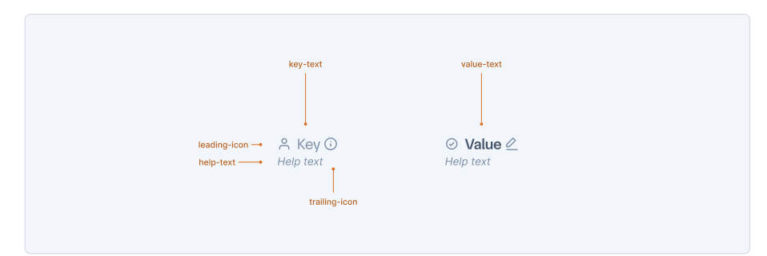
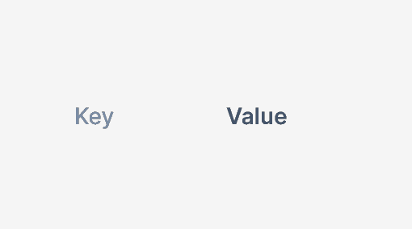
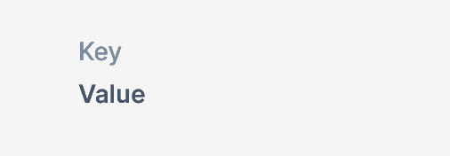

# InfoGroup

InfoGroup is a structured component for displaying key-value pairs in a consistent, organized format. It provides a standardized way to present information such as transaction details, user data, or any related data pairs with proper visual hierarchy and alignment. The component supports various orientations, sizes, and customization options to suit different use cases across dashboards, modals, drawers, and detail views.

<p align="center"></p>

## Design

- [Figma - InfoGroup](figma-url)

## API

The InfoGroup component uses a compound structure with an outer container and InfoItem sub-components for individual key-value pairs. This approach allows layout and styling props to be defined once at the container level.

```jsx
import {
  InfoGroup,
  InfoItem,
  InfoItemKey,
  InfoItemValue,
  InfoItemIcon,
} from '@razorpay/blade/components';

<InfoGroup itemOrientation="horizontal" size="medium">
  <InfoItem>
    <InfoItemKey leading={<InfoItemIcon icon={UserIcon} />} helpText="Customer information">
      Account Holder
    </InfoItemKey>
    <InfoItemValue trailing={<InfoItemIcon icon={CheckIcon} />}>Saurabh Daware</InfoItemValue>
  </InfoItem>
  <InfoItem>
    <InfoItemKey>Payment ID</InfoItemKey>
    <InfoItemValue trailing={<InfoItemIcon icon={CopyIcon} />}>
      <Code size="small">pay_MK7DGqwYXEwx9Q</Code>
    </InfoItemValue>
  </InfoItem>
</InfoGroup>;
```

<details>
  <summary>Alternate APIs</summary>

### Alternate API 1: Single Component with Props

```jsx
<InfoGroup itemOrientation="horizontal" size="medium">
  <InfoItem
    keyText="Account Holder"
    valueText="Saurabh Daware"
    keyIcon={UserIcon}
    valueIcon={CheckIcon}
  />
  <InfoItem keyText="Payment ID" valueText="pay_MK7DGqwYXEwx9Q" valueType="code" />
</InfoGroup>
```

**Pros:**

- Simpler API with fewer components to remember
- Faster to write for basic use cases
- Consistent prop naming pattern
- Less verbose for simple key-value pairs

**Cons:**

- Less flexible for complex value layouts
- Cannot compose with other Blade components easily
- Limited customization options for styling individual parts
- Props can become numerous for complex scenarios
- Harder to extend for future use cases

</details>

### Props

#### InfoGroup

```typescript
type InfoGroupProps = {
  /**
   * Defines how Key and Value are arranged — side by side or stacked
   * @default 'horizontal'
   */
  itemOrientation?: 'horizontal' | 'vertical';

  /**
   * Shows the size of the component
   * @default 'medium'
   */
  size?: 'xsmall' | 'small' | 'medium' | 'large' | 'xlarge';

  /**
   * Defines whether the value is aligned left or right
   * @default 'left'
   */
  textAlign?: 'left' | 'right';

  /**
   * Children should be InfoItem components
   */
  children: React.ReactNode;
};
```

#### InfoItem

```typescript
type InfoItemProps = {
  /**
   * Toggles divider below the item (for horizontal orientation) or on the left (for vertical)
   * @default false
   */
  showDivider?: boolean;

  /**
   * Content should be InfoItemKey and InfoItemValue components
   */
  children: React.ReactNode;
};
```

#### InfoItemKey

```typescript
type InfoItemKeyProps = {
  /**
   * Leading element - can be icon, avatar, or any React element
   */
  leading?: React.ReactElement;

  /**
   * Trailing element - can be icon, avatar, or any React element
   */
  trailing?: React.ReactElement;

  /**
   * Additional help text to provide context for the key
   */
  helpText?: string;

  /**
   * Content of the key.
   */
  children?: StringChildrenType;
};
```

#### InfoItemValue

```typescript
type InfoItemValueProps = {
  /**
   * Leading element - can be icon, avatar, or any React element
   */
  leading?: React.ReactElement;

  /**
   * Trailing element - can be icon, avatar, or any React element
   */
  trailing?: React.ReactElement;

  /**
   * Content of the value - text, components, or other ReactNode
   */
  children?: React.ReactNode;

  /**
   * Click handler for interactive values
   */
  onClick?: () => void;
};
```

#### InfoItemIcon

```typescript
type InfoItemIconProps = {
  /**
   * Icon component to be rendered
   */
  icon: IconComponent;
};
```

## Examples

### Basic Key-Value Display

Simple horizontal layout with text-based key-value pairs.

```jsx
<InfoGroup itemOrientation="horizontal" size="medium">
  <InfoItem>
    <InfoItemKey>Account Holder</InfoItemKey>
    <InfoItemValue>Saurabh Daware</InfoItemValue>
  </InfoItem>
  <InfoItem>
    <InfoItemKey>Payment Method</InfoItemKey>
    <InfoItemValue>Credit Card</InfoItemValue>
  </InfoItem>
</InfoGroup>
```

### Different orientations

<table>
<tr>
<th>Code</th>
<th>Preview</th>
</tr>
<tr>
<td>

```jsx
<InfoGroup itemOrientation="horizontal" size="medium">
  <InfoItem>
    <InfoItemKey>Account Holder</InfoItemKey>
    <InfoItemValue>Saurabh Daware</InfoItemValue>
  </InfoItem>
</InfoGroup>
```

</td>
<td>
  
</td>

</tr>

<tr>
<td>

```jsx
<InfoGroup itemOrientation="vertical" size="medium">
  <InfoItem>
    <InfoItemKey>Account Holder</InfoItemKey>
    <InfoItemValue>Saurabh Daware</InfoItemValue>
  </InfoItem>
</InfoGroup>
```

</td>
<td>



</td>

</tr>
</table>

### With Avatars and Custom Elements

Using avatars and other React elements with the flexible leading/trailing props.

```jsx
<InfoGroup itemOrientation="horizontal" size="large">
  <InfoItem>
    <InfoItemKey
      leading={<Avatar size="medium" name="Saurabh Daware" />}
      helpText="Account holder profile"
    >
      Account Holder
    </InfoItemKey>
    <InfoItemValue trailing={<InfoItemIcon icon={ExternalLinkIcon} />}>
      Saurabh Daware
    </InfoItemValue>
  </InfoItem>
  <InfoItem>
    <InfoItemKey leading={<InfoItemIcon icon={BankIcon} />}>Bank Account</InfoItemKey>
    <InfoItemValue
      leading={
        <Badge size="small" color="positive">
          Verified
        </Badge>
      }
    >
      HDFC Bank
    </InfoItemValue>
  </InfoItem>
</InfoGroup>
```

### Vertical Layout with Icons

Vertical orientation with leading icons and help text.

```jsx
<InfoGroup itemOrientation="vertical" size="large">
  <InfoItem>
    <InfoItemKey leading={<InfoItemIcon icon={UserIcon} />} helpText="Primary account holder name">
      Account Holder
    </InfoItemKey>
    <InfoItemValue leading={<InfoItemIcon icon={CheckIcon} />}>Saurabh Daware</InfoItemValue>
  </InfoItem>
  <InfoItem>
    <InfoItemKey leading={<InfoItemIcon icon={CreditCardIcon} />}>Payment Method</InfoItemKey>
    <InfoItemValue>Credit Card</InfoItemValue>
  </InfoItem>
</InfoGroup>
```

### Complex Value with Custom Components

Using Blade components and custom layouts for complex value rendering.

```jsx
<InfoGroup itemOrientation="horizontal" size="medium" textAlign="right">
  <InfoItem>
    <InfoItemKey leading={<InfoItemIcon icon={BankIcon} />} helpText="Bank account details">
      Bank Account
    </InfoItemKey>
    <InfoItemValue>
      <Box display="flex" alignItems="center" gap="spacing.2">
        <Amount size="small" currency="INR" value={7890} />
        <Badge size="small" color="positive">
          Verified
        </Badge>
        <IconButton icon={ExternalLinkIcon} size="small" accessibilityLabel="View details" />
      </Box>
    </InfoItemValue>
  </InfoItem>

  <InfoItem>
    <InfoItemKey>IFSC Code</InfoItemKey>
    <InfoItemValue trailing={<InfoItemIcon icon={CopyIcon} />}>
      <Code size="small">HDFC0001234</Code>
    </InfoItemValue>
  </InfoItem>
</InfoGroup>
```

## Accessibility

- InfoGroup maintains proper semantic structure with `dl`, `dt`, and `dd` elements for screen readers
- InfoItem components have appropriate ARIA labels and relationships between keys and values
- Interactive values (with onClick) include proper keyboard navigation support
- Icons include meaningful `accessibilityLabel` props
- Sufficient color contrast ratios for all text combinations
- Focus management follows logical tab order through interactive elements
- Screen reader announces the relationship between keys and values clearly

## Open Questions

- ### Should we have `showDivider` prop or let consumer use `<Divider />` directly?

  - **Pros of `showDivider` prop:**
    - With itemOrientation="vertical", we can internally move divider to left and make it orientation vertical as well
  - **Cons of `showDivider` prop:**
    - Non intuitive because the divider is not of the item but rather of the group technically
    - `<Divider />` on the other hand follows 'What you see is what you get' philosophy

- ### `orientation` prop vs `itemOrientation` prop

  - Earlier we had thought of `orientation` prop although it can be confusing because `orientation="vertical"` on InfoGroup will mean that the items themselves are horizontally placed but the key and values inside the item are vertically placed
