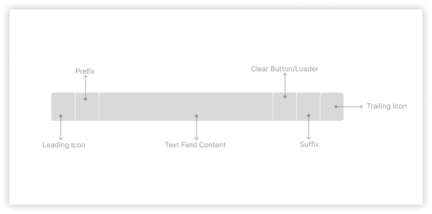

# Input Decisions <!-- omit in toc -->

This doc talks about the API decisions for `BaseInput` element.

## Index <!-- omit in toc -->

- [BaseInput API](#baseinput-api)
- [The blueprint layout of icons, prefix, suffix and loader](#the-blueprint-layout-of-icons-prefix-suffix-and-loader)
- [Keyboard return key types for web and Native](#keyboard-return-key-types-for-web-and-native)
- [Why we are not having `keyboardType='numeric'`?](#why-we-are-not-having-keyboardtypenumeric)
- [Notes](#notes)
- [Open questions](#open-questions)
- [Discussion Notes](#discussion-notes)
  - [Actionables for Design based on discussions on 21-07-2022](#actionables-for-design-based-on-discussions-on-21-07-2022)
- [References](#references)

## BaseInput API

The BaseInput is the underlying input field that will in turn be used to render all types of input. For now this will be an **internal component** and won't be exposed to consumers. We need this so we can have the rendering of text input and interactions at one central place but can restrict/add more control to consumer components based on their type.

| Prop                                                                                                       | Type                                                                                                                                                                                                                                                   | Required | Default                               | Description                                                                                                                                                                                                                                                                           |
| ---------------------------------------------------------------------------------------------------------- | ------------------------------------------------------------------------------------------------------------------------------------------------------------------------------------------------------------------------------------------------------ | -------- | ------------------------------------- | ------------------------------------------------------------------------------------------------------------------------------------------------------------------------------------------------------------------------------------------------------------------------------------- |
| id                                                                                                         | `string`                                                                                                                                                                                                                                               | Yes      |                                       | ID that will be used for accessibility purpose                                                                                                                                                                                                                                        |
| type                                                                                                       | `text`, `password`, `search`, `telephone`, `email`, `url`, `number`                                                                                                                                                                                    | No       | `text`                                | type of text to be rendered. this will also determine the keyboard type to be show on mobile devices                                                                                                                                                                                  |
| label                                                                                                      | `string`                                                                                                                                                                                                                                               | Yes      |                                       | Determines the label of an input field. Also used as `aria-label`                                                                                                                                                                                                                     |
| labelPosition                                                                                              | `top`, `left`                                                                                                                                                                                                                                          | No       | `top`                                 | Used to identify if the label of the input field will be placed on the top of the input field or left. `left` is only available for large screen devices. When position is `left` then the width of the label is fixed to `120px` and the content is aligned left.                    |
| placeholder                                                                                                | `string`                                                                                                                                                                                                                                               | No       |                                       | Placeholder text to be displayed inside the input field                                                                                                                                                                                                                               |
| value                                                                                                      | `string`                                                                                                                                                                                                                                               | No       |                                       | Makes input field [controlled](https://reactjs.org/docs/forms.html#controlled-components)                                                                                                                                                                                             |
| defaultValue                                                                                               | `string`                                                                                                                                                                                                                                               | No       |                                       | Used to set the default value of input field when it's [uncontrolled](https://reactjs.org/docs/uncontrolled-components.html#default-values) controlled                                                                                                                                |
| name                                                                                                       | `string`                                                                                                                                                                                                                                               | No       |                                       | The name of the checkbox group, [useful in form submissions](https://developer.mozilla.org/en-US/docs/Web/HTML/Element/input#name)                                                                                                                                                    |
| onFocus                                                                                                    | `({ name, value }) => {}`                                                                                                                                                                                                                              | No       |                                       | Function called when the value of the input field receives focus                                                                                                                                                                                                                      |
| onChange                                                                                                   | `({ name, value }) => {}`                                                                                                                                                                                                                              | No       |                                       | Function called when the value of the input field changes                                                                                                                                                                                                                             |
| onBlur                                                                                                     | `({ name, value }) => {}`                                                                                                                                                                                                                              | No       |                                       | Function called when the input field loses focus                                                                                                                                                                                                                                      |
| isDisabled                                                                                                 | `boolean`                                                                                                                                                                                                                                              | No       | `false`                               | Marks the input field as disabled. It'll also set `aria-disabled` to true and hence the input field will loose keyboard focus.                                                                                                                                                        |
| isRequired                                                                                                 | `boolean`                                                                                                                                                                                                                                              | No       | `false`                               | Marks the input field as required. if the errorText is provided then that will be shown if the field is required and not filled, else `${label} is required`                                                                                                                          |
| necessityIndicator                                                                                         | `optional`, `required`, `none`                                                                                                                                                                                                                         | No       |                                       | Indicator to be shown next to the label for emphasizing the necessity of the field. if `optional` is provided then it'll show `${label} (optional)` and if `required` is provided then it'll show `${label} *`                                                                        |
| leadingIcon                                                                                                | `Icon`                                                                                                                                                                                                                                                 | No       |                                       | Icon to be displayed at the start of the input field.                                                                                                                                                                                                                                 |
| trailingIcon                                                                                               | `Icon`                                                                                                                                                                                                                                                 | No       |                                       | Icon to be displayed at the end of the input field.                                                                                                                                                                                                                                   |
| prefix                                                                                                     | `string`                                                                                                                                                                                                                                               | No       |                                       | Used when we want to add prefix to the input field. Eg: `$` or `₹`. The prefix will be placed **after** `icon`                                                                                                                                                                        |
| suffix                                                                                                     | `string`                                                                                                                                                                                                                                               | No       |                                       | Used when we want to add suffix to the input field. Eg: `.00` or `@gmail.com`. If `showClearButton` is `true` then suffix will be placed **after** clear button.                                                                                                                      |
| interactionElement                                                                                         | `ReactNode`                                                                                                                                                                                                                                            | No       | `false`                               | Element to be rendered before suffix. This is decided by the component which is extending BaseInput                                                                                                                                                                                   |
| maxCharacters                                                                                              | `number`                                                                                                                                                                                                                                               | No       |                                       | Restrict the number of characters that can be entered in the input field                                                                                                                                                                                                              |
| validationState                                                                                            | `none`, `error` , `success`                                                                                                                                                                                                                            | No       |                                       | Applies the style to the input field based on validation status and shows either `errorText` or `successText` respectively                                                                                                                                                            |
| helpText                                                                                                   | `string`                                                                                                                                                                                                                                               | No       |                                       | Shown when we want to add some hint to the input field. Displayed under the input field. Only one of `helpText`, `errorText` or `successText` is shown at a time in the priority order as `errorText`, `successText`, `helpText`                                                      |
| errorText                                                                                                  | `string`                                                                                                                                                                                                                                               | No       |                                       | Shown when the `validationState` of the input field is set to Error. Only one of `helpText`, `errorText` or `successText` is shown at a time in the priority order as `errorText`, `successText`, `helpText`                                                                          |
| successText                                                                                                | `string`                                                                                                                                                                                                                                               | No       |                                       | Shown when the `validationState` of the input field is set to Success. Only one of `helpText`, `errorText` or `successText` is shown at a time in the priority order as `errorText`, `successText`, `helpText`                                                                        |
| autoFocus                                                                                                  | `boolean`                                                                                                                                                                                                                                              | No       | `false`                               | The autofocus global attribute is a Boolean attribute indicating that an element should be focused on page load. [Web Reference](https://developer.mozilla.org/en-US/docs/Web/HTML/Global_attributes/autofocus), [Native Reference](https://reactnative.dev/docs/textinput#autofocus) |
| autoCompleteSuggestionType                                                                                 | `none`, `creditCardCSC`, `creditCardExpiry`, `creditCardExpiryMonth`, `creditCardExpiryYear`, `creditCardNumber`, `email`, `name`, `username`, `password`, `passwordNew`, `postalAddressCountry`, `postalCode`, `streetAddress`, `smsOTP`, `telephone` | No       |                                       | Specifies autocomplete hints for the system, so it can provide autofill                                                                                                                                                                                                               |
| keyboardReturnKeyType [Check this table for full reference](#keyboard-return-key-types-for-web-and-native) | `default`, `go`, `done`, `next`, `previous`, `search`, `send`                                                                                                                                                                                          | No       | Closest based on the `type` attribute | Determines how the return key should look on the keyboard on mobile devices or virtual keyboard                                                                                                                                                                                       |
| keyboardType                                                                                               | `text`, `search`, `telephone`, `email`, `url`, `decimal`                                                                                                                                                                                               | No       | `text`                                | Keyboard to be shown for specific input types                                                                                                                                                                                                                                         |
| textAlign                                                                                                  | `left`, `center`, `right`                                                                                                                                                                                                                              | No       | `text`                                | Keyboard to be shown for specific input types                                                                                                                                                                                                                                         |
| trailingHeaderSlot                                                                                         | `(value: string) => ReactNode`                                                                                                                                                                                                                         | No       |                                       | Element to be rendered on the trailing slot of input field label                                                                                                                                                                                                                      |
| trailingFooterSlot                                                                                         | `(value?: string) => ReactNode`                                                                                                                                                                                                                        | No       |                                       | Element to be rendered on the trailing slot of input field footer                                                                                                                                                                                                                     |

## The blueprint layout of icons, prefix, suffix and loader

## Keyboard return key types for web and Native

| Key Type            | Web                       | Native                                   |
| ------------------- | ------------------------- | ---------------------------------------- |
| <kbd>↵</kbd>        | `enterkeyhint="enter"`    | `returnKeyType="default"`                |
| <kbd>go</kbd>       | `enterkeyhint="go"`       | `returnKeyType="go"`                     |
| <kbd>Done</kbd>     | `enterkeyhint="done"`     | `returnKeyType="done"`                   |
| <kbd>Next</kbd>     | `enterkeyhint="next"`     | `returnKeyType="next"`                   |
| <kbd>Previous</kbd> | `enterkeyhint="previous"` | `returnKeyType="previous"`(android only) |
| <kbd>Search</kbd>   | `enterkeyhint="search"`   | `returnKeyType="search"`                 |
| <kbd>Send</kbd>     | `enterkeyhint="send"`     | `returnKeyType="send"`                   |

## Why we are not having `keyboardType='numeric'`?

The numeric and decimal attribute values produce identical keyboards on Android. On iOS, however, numeric displays a keyboard that shows both numbers and punctuation, while decimal shows a focused grid of numbers that almost looks exactly like the tel input type, only without extraneous telephone-number focused options. That’s why it’s better preference to change it `decimal` for most types of number inputs. [Reference](https://css-tricks.com/better-form-inputs-for-better-mobile-user-experiences/)

## Notes

Reusable components candidate

- label
- helpText/errorText/successText
- character counter(only input field)
- clear icon button
- prefix/suffix

## Open questions

- [ ] Do we need to expose `autoCapitalize` for native?
  - confirm once with mobile devs. design side we shall not touch this
- [ ] Do we need to expose `onSubmitEditing` for native?
- [ ] Do we need to fix the height for reserving space for help/error/success text?
  - Pending on design, Saurav to visually test this
- [x] Do we have icon which is clickable so we can put it under textfield?
  - We don't have need to create one
- [x] motion for the textfield animation in active state
- [x] Do we have a usecase of using textfield without label or form level things?
  - Not right now. we'll mark label as required field for now
- [x] fullWidth input field do we have a use case?
  - TextField will always be 100% width of the container
- [x] textContentType for autocomplete on native ios only
  - https://reactnative.dev/docs/textinput#textcontenttype-ios
  - added a prop `autofillSuggestionType` which will work cross platform
- [x] what is the default position for loader in loading state? following are some options

  - based on icon prop
  - based on clearbutton
  - leave this decision upto consumer
  - fix it either on left/right
  - **Conclusion**: fix it on right always. basically all the actionables for input field will always be on the right side(clear, showPassword)

- [x] Do we need leading and trailing both icons? or we shall just accept an `icon` prop and then decide the position internally?
  - **Conclusion**: We shall just accept `icon` prop and we'll always fix the position on the left internally. This will visually bring in consistency when multiple input fields are placed in one form.
- [x] Do we have a use case to show clear button in case of password field?
  - yes. the clear button will be shown before the show password button.
- [x] returnKeyType native - native
  - enterkeyhint - web
- [x] Do we need link? what is the use case?
  - NA
- [x] How to handle the view layout changes on mobile when the keyboard appears so the input doesn't moves out of the view
  - accept and pass ref
- [x] `textAlign` on native need to be exposed?
  - yes might be required for OTP
- [x] multiline error messages?
  - deferred for now until we have a use case for it
- [x] Do we need to show errorText/successText along with helpText or only one of them can be shown at a time?

  - only one at a time in the priority errorText > successText > helpText

- [x] `readonly` need to be supported? or just disabled? or both?

  - Using the disabled prop will prevent the text field from receive keyboard focus or inputs
  - The readOnly prop allows focus on the text field but prevents input or editing
  - We'll right now just go with disabled prop

- [x] labelAlignment - do we need to give this option? if no, then what is the default alignment when the position is left? -

  - always left aligned

- [x] do we need a trailingIconClick? what if we provide clear button and the onClick for that and then only have leading and trailing props which can accept text as well as icon?

  - added `showClearButton` prop along with `onClearButtonClick` handler

## Discussion Notes

### Actionables for Design based on discussions on 21-07-2022

- Action items from discussion(21-07-22)
- Add isLoading prop for the plain input field
- Rename leadingIcon to just icon and fix the position to the left
- Remove trailingIcon and update the docs
- Add clear button component
- Add a prop call showClearButton which will display clear button
- Add necessity indicator prop to all the input fields. if `optional` is provided then it'll show `${label} (optional)` and if `required` is provided then it'll show `${label} *`
- create prefix and suffix props for plain text field
- update docs for keyboard interaction for different input types for mobile. refer https://github.com/razorpay/blade/blob/feat/input-field/packages/blade/src/components/Input/_decisions/decisions.md#web--react-native-attributes-for-showing-keyboard-types-and-autocomplete-suggestions-based-on-input
- add autofillSuggestionType to docs to show how to guide browsers to show the correct autofill suggestions both on desktop and mobile platforms
- add validationState: none | error | success
- visually test if we want to reserve space for help/error/success text to avoid the layout content shift

## References

- Keyboard
  - web
    - attributes: `type`, `inputmode`, `autocomplete`, `keyboardhint`
    - [Blog diff keyboard types and autosuggestion](https://css-tricks.com/better-form-inputs-for-better-mobile-user-experiences/)
    - [Demo of diff keyboard types and autosuggestion](https://better-mobile-inputs.netlify.app/)
    - [`autocomplete`](https://polaris.shopify.com/components/text-field)
    - [`enterkeyhint` demo-1](https://mixable.blog/ux-improvements-enterkeyhint-to-define-action-label-for-the-keyboard-of-mobile-devices/)
    - [`enterkeyhint` demo-2](https://dtapuska.github.io/enterkeyhint/)
    - [`enterkeyhint` ref](https://developer.mozilla.org/en-US/docs/Web/HTML/Global_attributes/enterkeyhint)
  - native
    - [`keyboardType`](https://reactnative.dev/docs/textinput#keyboardtype)
    - [`returnKeyType`](https://reactnative.dev/docs/textinput#returnkeytype)
- [List of autocomplete suggestions across platform](https://docs.google.com/spreadsheets/d/1y6Za5jUA2CnLwPZuMs6zogqPGG8GJhonkhPpgRBvZS0/edit?usp=sharing)
