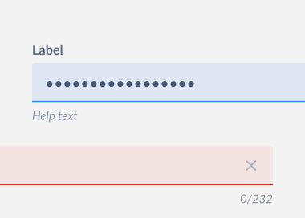

# PasswordField

PasswordField is an input field for entering passwords. The input is masked by default. On mobile devices the last typed letter is shown for a brief moment. The masking can be toggled using an optional reveal button.

This document outlines the API of `PasswordField` component.



## Design

- [Figma - PasswordField](https://www.figma.com/file/jubmQL9Z8V7881ayUD95ps/Blade---Payment-Light?node-id=10953%3A110176)

## API

`PasswordField` is a wrapper over `BaseInput` fine tuned for entering passwords. Majority of API decisions are covered in `BaseInput` and `TextInput` decisions doc.

Sample usage:

```jsx
import { PasswordField } from '@razorpay/blade';

<PasswordField label="Label" />;
```

### PasswordField

We'll expose an `PasswordField` component with the following API:

| Prop             | Type                        | Default     | Description                                                                                       | Required |
| ---------------- | --------------------------- | ----------- | ------------------------------------------------------------------------------------------------- | -------- |
| id               | `string`                    | `undefined` | Unique identifier for a11y                                                                        | ✅       |
| label            | `string`                    | `undefined` | Label for the input field                                                                         | ✅       |
| labelPosition    | `top`, `left`               | `top`       | Position for the input label, `left` works only for larger screen size (fixed at `120px` width)   |          |
| showRevealButton | `boolean`                   | `true`      | Shows a reveal button to toggle visibility                                                        |          |
| maxCharacters    | `number`                    | `undefined` | Restricts max characters and shows a character counter under the input                            |          |
| validationState  | `error` , `success`, `none` | `none`      | Styles the input and decides whether to show `errorText`, `successText` or `helpText` repectively |          |
| errorText        | `string`                    | `undefined` | Displays a hint below the input in `error` validation state                                       |          |
| successText      | `string`                    | `undefined` | Displays a hint below the input in `success` validation state                                     |          |
| helpText         | `string`                    | `undefined` | Displays a hint below the input in `none` validation state                                        |          |

> **Note**
>
> Only one of `errorText`, `successText` or `helpText` is rendered at a time in the priority order: `errorText` ➡️ `successText` ➡️ `helpText`.

## a11y

## Usage

Some example usage patterns of `Alert`.
